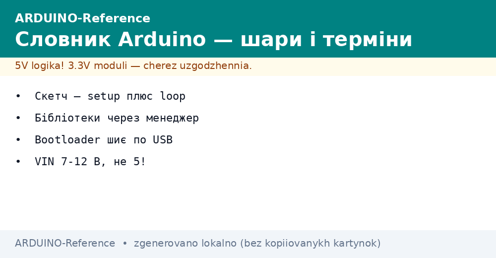
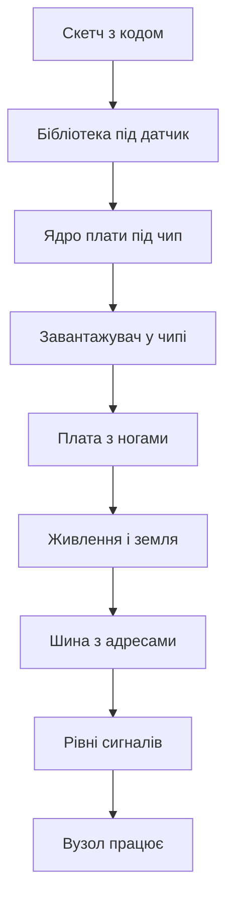

# Глосарій Arduino - скетч, шилд і рівні

EN version: `00-Start/02-Glossary.en.md`


*Рис. Словник у схемі: програма, плата, живлення, шини і рівні сигналів.*

> [!tip] Призначення ноти
> Зібрати в одному місці головні слова довідника, щоб далі читати нотатки без зупинок і плутанини.

## 1. Призначення

Глосарій знімає мовний барєр між новачком і платою. Кожен термін дано коротко: що це, де живе, з чим плутають. Поруч показано рівні напруги і різницю між старими і новими чипами. Після цієї ноти слова скетч, шилд і завантажувач більше не лякають.

Читати словник можна двома способами. Лінійно зверху вниз для першого знайомства. Або точково за таблицею коли слово трапилось у коді чи на схемі. Живим орієнтиром тримай правило: програма угорі, плата внизу, живлення перш за все.

Особливу увагу приділи рівням пять вольт проти три вольти, бо тут ціна помилки найвища. Старі плати терплять пять вольт на пінах, нові хочуть три вольти і діалог через узгодження. Розділ про чипи пояснює коли вистачить класики, а коли брати сучасне ядро.

## 2. Головна таблиця термінів

| Термін | Що це | Де шукати |
| --- | --- | --- |
| Скетч | Програма для плати з функціями налаштування і циклу | Середовище, приклади, прошивка |
| Налаштування | Функція одноразового старту | Початок кожного скетчу |
| Цикл | Функція безкінечного повтору | Основа блимання і опитування |
| Шилд | Плата розширення поверх основної | Датчики, мотори, мережа |
| Завантажувач | Мала програма запису без програматора | Порт USB, кнопка скидання |
| Ядро плати | Набір файлів під конкретний чип | Менеджер плат у середовищі |
| Бібліотека | Готовий код під датчик чи екран | Менеджер бібліотек, приклади |
| Програматор | Зовнішній записувач у чип | Аварійне відновлення |
| Монітор порту | Вікно тексту з плати | Налагодження і перевірка |
| Швидкість порту | Число знаків за секунду | Має збігатись у коді і вікні |

## 3. Живлення і піни словами

| Термін | Що це | Пастка |
| --- | --- | --- |
| Живлення USB | Пять вольт з розєму компютера | Тонкий кабель просаджує напругу |
| Зовнішній вхід | Гніздо під блок сім дванадцять вольт | Гріє стабілізатор на платі |
| Вивід пять вольт | Живлення датчиків від плати | Струм обмежений, мотори окремо |
| Вивід три вольти | Живлення чутливих модулів | Не плутати з пятьма вольтами |
| Земля | Спільний нуль для всіх | Без спільної землі сигнали брешуть |
| Аналоговий вхід | Вимірює напругу числом | Дільник для вищих напруг |
| Цифровий вхід | Бачить нуль або одиницю | Висяча пін ловить шум |
| Підтяжка | Резистор до живлення або землі | Без неї кнопка брязкає |
| Ширина імпульсів | Імітація аналогу швидкими імпульсами | Не всі піни вміють |
| Опорна напруга | Еталон для вимірювання | Плаватиме без стабільного живлення |

## 4. Шини і обмін

| Термін | Що це | Коли брати |
| --- | --- | --- |
| Послідовний порт | Дроти прийому і передачі | Звязок з компютером і модулями |
| Двопровідна шина | Два дроти на багато пристроїв | Датчики з адресами |
| Чотирипровідна шина | Швидкий обмін з вибором | Екрани і карти памяті |
| Адреса | Номер пристрою на спільних дротах | Конфлікт адрес гасить шину |
| Швидкість обміну | Темп бітів за секунду | Обидва боки однаково |
| Логічний рівень | Напруга одиниці | Пять вольт або три вольти |
| Узгодження рівнів | Перехідник між світами | Обов'язковий для нових плат |
| Контрольна сума | Перевірка цілості пакета | Радіо і довгі лінії |
| Пакет | Порція даних з початком і кінцем | Різати потік на кадри |
| Ехо | Повернення свого тексту | Ознака живого порту |

## 5. Інструменти запису

| Термін | Що це | Нотатка |
| --- | --- | --- |
| Завантажувач | Заводська ланка запису | Блимає світлодіодом при старті |
| Програма запису | Утиліта командного рядка | Бачить чип і ллє файл |
| Файл прошивки | Зібраний код для запису | Шістнадцятковий або двійковий |
| Запобіжники | Біти налаштування чипа | Не чіпати без потреби |
| Скидання | Короткий перезапуск плати | Подвійне натискання на нових платах |
| Драйвер порту | Міст між USB і системою | Клони просять окремий драйвер |
| Перетворювач | Мікросхема USB у послідовний порт | Оригінал і клон різні |
| Середовище | Програма для коду і запису | Класика і нова версія |
| Менеджер плат | Установник ядер | Додає підтримку нових плат |
| Приклад | Готовий скетч з меню | Старт кожної теми |

## 6. Пять вольт проти три вольти

| Питання | Світ пять вольт | Світ три вольти |
| --- | --- | --- |
| Типові плати | Класика на вісім біт | Нові на тридцять два біти |
| Одиниця на нозі | Близько пять вольт | Близько три вольти |
| Живлення датчиків | Багато модулів під пять | Сучасні сенсори під три |
| Пряме з'єднання | Можна між своїми | Через узгодження до чужих |
| Ціна помилки | Перегрів і глюки | Спалений вхід назавжди |
| Як перевірити | Мультиметр на виводі | Маркування і опис плати |

Правило просте: рівні обох боків мають збігатись або йти через перехідник. Живлення пять вольт не означає що сигнал теж пять, дивись опис конкретної піни. Нові плати часто терплять пять вольт на живленні, але не на сигнальних входах. Сумніваєшся, міряй і читай опис плати.

```text
Рівні і живлення: шпаргалка
================================
Класика 5V:  логіка 0..5V,  живлення 7..12V на вхід
Нова 3V3:   логіка 0..3.3V, живлення 5V USB ок
Звязок 5V <-> 3V3: тільки через узгодження
Земля GND: завжди спільна між платами
Мотори і реле: окремий блок, не від плати
================================
```

## 7. Вісім біт проти тридцять два біти

| Ознака | Вісім біт | Тридцять два біти |
| --- | --- | --- |
| Представник | Класичний контролер | Сучасна родина R4 |
| Тактова частота | Шістнадцять мегагерц | Десятки мегагерц |
| Пам'ять програми | Десятки кілобайтів | Сотні кілобайтів |
| Оперативна пам'ять | Два кілобайти | Десятки кілобайтів |
| Напруга логіки | Пять вольт | Три вольти або вибір |
| USB | Окрема мікросхема | Часто прямо в чипі |
| Бібліотеки | Тони прикладів | Росте швидко |
| Коли брати | Навчання і прості вузли | Швидкість, пам'ять, мережа |

Вісім біт беруть для простоти і моря прикладів: кнопки, реле, датчики, малі екрани. Тридцять два біти беруть коли тісно: мережа, швидкий обмін, великі тексти, обробка сигналів. Код на мові Ардуїно переноситься легко, різниця у пінах і рівнях. Починай з класики, переходь на нове коли упрешся у пам'ять.

## 8. Мінімальний скетч для словника

```cpp
void setup() {
  Serial.begin(9600);
  pinMode(2, INPUT_PULLUP);
  pinMode(LED_BUILTIN, OUTPUT);
}

void loop() {
  int button = digitalRead(2);
  if (button == LOW) {
    digitalWrite(LED_BUILTIN, HIGH);
    Serial.println("BTN:PRESSED");
  } else {
    digitalWrite(LED_BUILTIN, LOW);
  }
  delay(50);
}
```

Тут зібрані слова з таблиць в одному місці. Вхід з підтяжкою читає кнопку без зовнішнього резистора. Натиснута кнопка дає низький рівень бо тягне ногу до землі. Світлодіод дублює стан для очей, порт друкує стан для налагодження. Пауза пятдесят мілісекунд прибирає брязкіт контактів.

```cpp
int adcPin = A0;

void setup() {
  Serial.begin(9600);
  analogReference(DEFAULT);
}

void loop() {
  int raw = analogRead(adcPin);
  float volts = raw * 5.0 / 1023.0;
  Serial.println(volts);
  delay(300);
}
```

Другий скетч закріплює аналог і опорну напругу. Сире число множимо на пять вольт і ділимо на тисячу двадцять три. Вивід з плаваючою комою у порт показує вольти. Затримка триста мілісекунд робить текст читабельним.

## 9. Схема звязків термінів



Ланцюжок читається зверху вниз без розривів. Код спирається на бібліотеку, бібліотека на ядро, ядро на завантажувач. Плата дає піни, живлення дає стабільність, шина дає адреси, рівні дають сумісність. Пропущена ланка ламає весь ланцюжок.

## Типові помилки

| # | Помилка | Чому погано | Як правильно |
| --- | --- | --- | --- |
| 1 | Плутати скетч і бібліотеку | Шукаєш код не там | Скетч у прикладах, бібліотека у менеджері |
| 2 | Думати що шилд підійде всюди | Піни і живлення різні | Звіряти карту пінів конкретної плати |
| 3 | Ігнорувати швидкість порту | Кракозябри замість тексту | Однакова швидкість у коді і у вікні |
| 4 | Давати пять вольт на вхід три вольти | Вхід згорає тихо | Узгодження рівнів або дільник |
| 5 | Лишати вхід висячим без підтяжки | Шум і фантомні спрацювання | Внутрішня підтяжка або резистор |
| 6 | Плутати завантажувач і драйвер | Плата мовчить після запису | Драйвер у систему, завантажувач у чип |

## Офіційні джерела

- [Мова Ардуїно і словник](https://www.arduino.cc/reference/en/) - функції, структура скетчу, приклади.
- [Гід по платах і шилдах](https://docs.arduino.cc/hardware/) - описи плат, піни, живлення, сумісність.

## Див. також

- [Home](../../../ARDUINO-Reference/Home.md)
- [гід по довіднику](../../../ARDUINO-Reference/00-Start/01-Yak-koristuvatis-dovidnikom.md)
- [порівняння плат](../../../ARDUINO-Reference/00-Start/03-Porivnyannya-plat.md)
