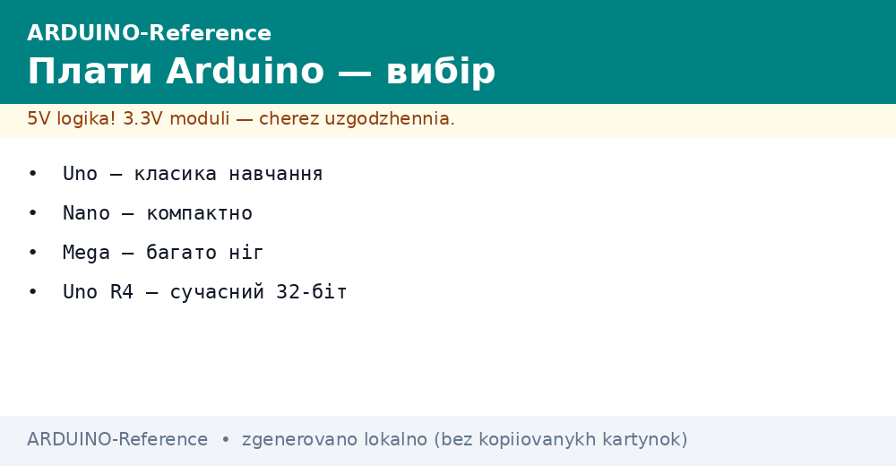
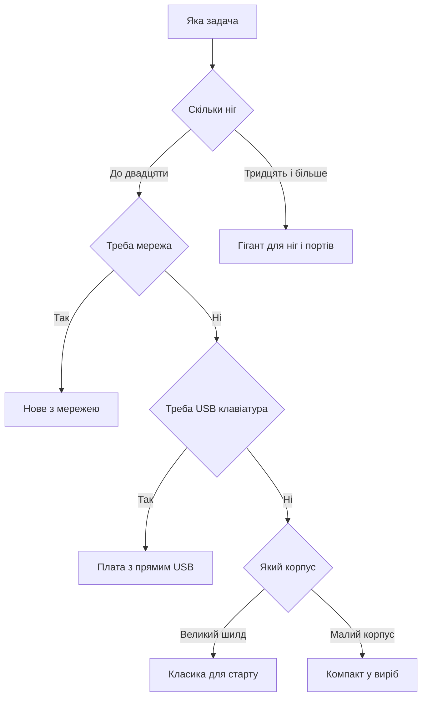

# Порівняння плат Arduino - Uno, Nano, Mega, R4

EN version: `00-Start/03-Board-Comparison.en.md`


*Рис. Родини плат: класика, компакт, гігант і нове покоління з мережею.*

> [!tip] Призначення ноти
> Допомогти вибрати плату під задачу: коли вистачить класики, коли треба гігант, коли брати нове покоління.

## 1. Призначення

Нота порівнює пять ходових плат в одній таблиці: класику, компакт, плату з USB, гіганта і нове покоління. Для кожної дано чип, пам'ять, піни, порт і орієнтир ціни. Поруч схема вибору за задачею і розбір клонів з іншим перетворювачем.

Логіка проста: починай з класики для навчання, стискайся у компакт для корпусу, бери гіганта коли мало пінів, переходь на нове коли треба швидкість і пам'ять. Клони беруть коли важлива ціна і руки вміють ставити драйвер. Оригінал беруть коли важливий час і спокій.

Ціни в таблиці орієнтовні і пливуть з курсом, дивись на порядок а не на копійки. Характеристики звірено з описами плат, деталі завжди уточнюй за офіційними сторінками. Живлення і рівні для кожної плати розкрито окремо щоб не спалити вхід.

## 2. Велика таблиця родин

| Плата | Чип | Пам'ять | Піни і шини | USB і живлення | Ціна орієнтир |
| --- | --- | --- | --- | --- | --- |
| Класика Uno | Вісім біт шістнадцять мегагерц | Тридцять два кілобайти, два кілобайти | Чотирнадцять цифрових, шість аналогових | Знімний порт, вхід сім дванадцять вольт | Середня, базова |
| Компакт Nano | Той же вісім біт | Ті ж обсяги | Ті ж сигнали у малому корпусі | Міні порт, живлення пять вольт | Найнижча |
| Плата з USB | Вісім біт з прямим USB | Ті ж обсяги плюс USB | Двадцять цифрових, дванадцять аналогових | Прямий USB, емуляція клавіатури | Середня плюс |
| Гігант Mega | Старший вісім біт | Двісті пятдесят шість кілобайтів, вісім кілобайтів | Пятдесят чотири цифрові, шістнадцять аналогових, чотири порти | Порт типу Б, вхід сім дванадцять вольт | Вища |
| Нове R4 мала | Тридцять два біти сорок вісім мегагерц | Двісті пятдесят шість кілобайтів, тридцять два кілобайти | Як класика плюс нові можливості | Порт типу С, пять вольт і три вольти | Середня плюс |
| Нове R4 мережа | Той же плюс радіо | Ті ж плюс мережа | Ті ж плюс антена | Порт типу С плюс бездрот | Вища |

## 3. Деталі по кожній платі

| Плата | Сильні сторони | Слабкі сторони |
| --- | --- | --- |
| Класика Uno | Море прикладів, шилди стають зверху, живуча | Великий корпус, мало памяті для мережі |
| Компакт Nano | Влазить у макет і корпус, дешева | Дрібні контакти, треба паяти гребінки |
| Плата з USB | Прикидається мишею і клавіатурою | Один порт ділять код і USB звязок |
| Гігант Mega | Купа пінів і портів для принтера і робота | Велика і голодна, не для кишені |
| Нове R4 мала | Швидкість і пам'ять, сучасний порт | Три вольти вимагають уваги до рівнів |
| Нове R4 мережа | Бездрот з коробки для хмари | Антена і живлення просять запасу струму |

Класика вчить і терпить помилки новачка: переплутав ногу, перегрів стабілізатор, все одно живе. Компакт повторює класику у малому тілі для готових виробів. Плата з прямим USB відкриває керування компютером без додаткових програм. Гігант тримає десятки датчиків і двигунів одночасно. Нове покоління дає запас на роки вперед.

## 4. Коли брати гіганта

| Задача | Чому гігант | Альтернатива |
| --- | --- | --- |
| Тривимірний принтер | Багато крокових двигунів і нагріву | Спеціалізована плата керування |
| Робот рука | Десять серв і датчики разом | Два компакти з обміном |
| Розумна теплиця | Десятки точок виміру | Шина датчиків з адресами |
| Стенд випробувань | Чотири порти для логів | Перехідник портів на класиці |
| Навчальний клас | Одна плата на парту з запасом | Класика плюс розширювач пінів |

Гігант виправданий коли пінів треба більше тридцяти або портів більше двох. Якщо пінів вистачає, але тісно у памяті, глянь нове покоління замість гіганта. Якщо тісно тільки в одному місці, дешевше взяти розширювач ніж міняти плату.

```text
Гігант чи ні: швидкий тест
================================
Ніг треба до 20 і порт один .... класика
Ніг треба до 20 але корпус малий . компакт
Треба USB клавіатура ............ плата з USB
Ніг треба 30+ або портів 3+ ..... гігант
Треба мережа і память ........... нове R4 мережа
Сумнів між двома ............... бери старшу
================================
```

## 5. Коли брати нове покоління

| Задача | Чому нове | Що перевірити |
| --- | --- | --- |
| Хмарний датчик | Мережа і шифрування з коробки | Живлення модуля і покриття |
| Швидкий логер | Пам'ять і швидкість запису | Карта памяті і живлення |
| Екран з графікою | Швидка шина і буфер кадру | Сумісність бібліотеки екрану |
| Голос і звук | Обробка сигналу | Підсилювач і окреме живлення |
| Навчання з запасом | Актуальна платформа на роки | Наявність прикладів під задачу |

Нове покоління говорить трьома вольтами, тому старі пять вольтові датчики підключай через узгодження. Бібліотеки під нову архітектуру вже численні, але рідкісні драйвери перевіряй до купівлі. Порт типу С зручний, кабель бери якісний з даними а не тільки для заряду.

## 6. Клони і перетворювач

| Ознака | Оригінал | Клон |
| --- | --- | --- |
| Перетворювач порту | Фірмова мікросхема | Часто дешевий аналог |
| Драйвер | Ставиться сам | Треба ставити вручну |
| Стабілізатор | З запасом | Може грітись раніше |
| Шилди | Сідають щільно | Іноді криві отвори |
| Ціна | Вища за спокій | Нижча за ризик |
| Коли брати | Навчання і подарунок | Серія і свої руки |

Клон з дешевим перетворювачем просить окремий драйвер у системі, після чого порт зявляється як звичайний. Зовні клон видно за іншою мікросхемою біля порту і за кольором плати. Роботою з кодом клон не відрізняється, різниця тільки у драйвері і якості живлення. Для першої плати бери оригінал, для пятого датчика у корпус бери клон.

```text
Клон не видно у системі:
  1. Постав драйвер перетворювача з офіційного сайта чипа.
  2. Зміни кабель на короткий з даними.
  3. Перевір інший порт USB без хаба.
  4. Глянь диспетчер пристроїв: невідомий пристрій це він.
  5. Перезавантаж середовище після драйвера.
```

## 7. Базовий скетч перевірки плати

```cpp
void setup() {
  Serial.begin(9600);
  while (!Serial) {
  }
  Serial.println("BOARD:HELLO");
  pinMode(LED_BUILTIN, OUTPUT);
}

void loop() {
  digitalWrite(LED_BUILTIN, HIGH);
  Serial.println("LED:ON");
  delay(400);
  digitalWrite(LED_BUILTIN, LOW);
  Serial.println("LED:OFF");
  delay(400);
}
```

Очікування порту потрібне платам з прямим USB, класика стартує одразу. Друк у порт доводить що чип живий і порт налаштовано. Блимання очима доводить що піни керуються. Якщо текст є а світла немає, шукай інший номер вбудованого світлодіода в описі плати.

```cpp
void setup() {
  Serial.begin(9600);
  Serial.println("PINS:SCAN");
  for (int p = 2; p <= 13; p++) {
    pinMode(p, INPUT_PULLUP);
    int v = digitalRead(p);
    Serial.print("P");
    Serial.print(p);
    Serial.print("=");
    Serial.println(v);
  }
}

void loop() {
  delay(1000);
}
```

Другий скетч сканує цифрові піни з підтяжкою і друкує стан. Вільна пін покаже одиницю через підтяжку, замкнута на землю покаже нуль. Так перевіряють гребінки компакту після пайки. Пауза у секунду щоб встигнути прочитати.

## 8. Схема вибору за задачею



Гілка пінів веде до гіганта без вагань коли сигналів багато. Гілка мережі веде до нового покоління з радіо. Гілка USB веде до плати з прямим звязком. Залишок ділять класика і компакт за розміром корпусу. Стрілки не перетинаються, рішення одне.

## Типові помилки

| # | Помилка | Чому погано | Як правильно |
| --- | --- | --- | --- |
| 1 | Брати гіганта для блимання | Гроші і місце в нікуди | Класика або компакт для простих задач |
| 2 | Живити мотори від плати | Просадка і перезапуск | Окремий блок, спільна земля |
| 3 | Давати пять вольт на нове | Спалений вхід без диму | Узгодження рівнів між світами |
| 4 | Економити на кабелі з даними | Порт не видно, запис рветься | Короткий кабель з даними |
| 5 | Забути драйвер клона | Плата мовчить у системі | Поставити драйвер перетворювача |
| 6 | Вірити ціні як якості | Дешевий стабілізатор гріється | Міряти тепло і струм під навантаженням |

## Офіційні джерела

- [Каталог плат Ардуїно](https://www.arduino.cc/en/hardware/) - порівняння, характеристики, живлення.
- [Описи плат і документація](https://docs.arduino.cc/hardware/) - піни, порти, приклади під кожну плату.

## Див. також

- [Home](../../../ARDUINO-Reference/Home.md)
- [гід по довіднику](../../../ARDUINO-Reference/00-Start/01-Yak-koristuvatis-dovidnikom.md)
- [словник термінів](../../../ARDUINO-Reference/00-Start/02-Glosariy.md)
