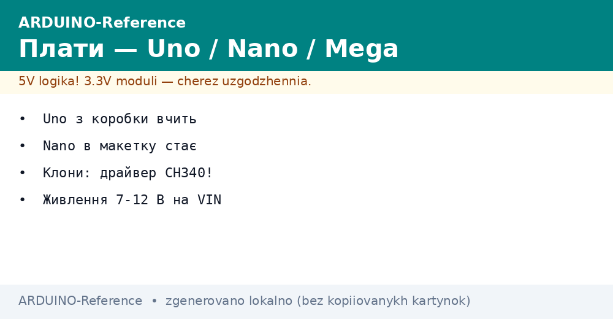
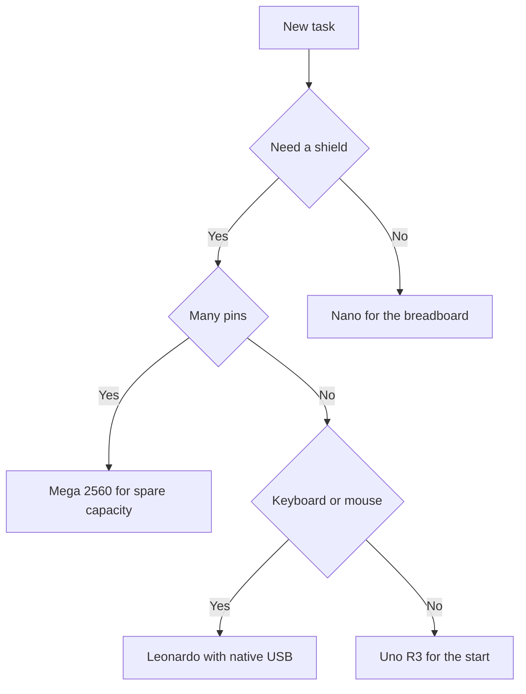

# Arduino boards - Uno, Nano and Mega on the desk


*Fig. Boards on the desk: power, pin headers, port, choice, first start.*

> [!tip] Purpose of this note
> Give a fast start with boards: which board to take for a task, how to feed power, how to spot a clone, and how to run the first sketch.

## 1. Purpose

This note covers the first hours with boards: how reference boards differ, where to look on the pin map, and how not to burn a board on day one. After reading, the reader picks a board for a breadboard, a case, or many sensors with confidence.

The main idea is simple: start with the reference board with pin headers, then move to the compact board for the breadboard, and take the big board only when pins or ports run out. Clones work fine but demand driver and regulator care.

## 2. Uno R3 - the reference board

Uno R3 is the base learning board. ATmega328P controller, breadboard-step pin headers, a separate port converter chip, and a regulator for external power. Almost all first examples target this board.

| Element | Where to find | Note |
| --- | --- | --- |
| Controller | ATmega328P | Program memory fits first projects |
| Pin headers | Two side rows | Fit breadboard wires and shields |
| Port | USB-B | Square socket on the original |
| ICSP | Separate header | Flashing via programmer without bootloader |
| VIN power | Terminal and round socket | Range for the board regulator |
| Button | RESET | Sketch restart without power off |
| LED | Board near marking | Built-in indicator for the first example |
| Shields | Headers on top | Expansion boards sit on top |

```text
Uno R3 вигляд зверху спрощено:
  [USB-B] [круглий рознім] [VIN] [GND]
  +----------------------------------+
  |  RESET   ICSP-колодка            |
  |  ATmega328P  кварц               |
  |  гребінка живлення               |
  |  гребінка сигналів               |
  +----------------------------------+
  Шилд ставиться зверху на гребінки.
  Живлення або від порту або від VIN.
```

## 3. Nano - the breadboard board

Nano is the same logic in a small breadboard body. The board plugs straight into the breadboard with room for wires beside it. The original has a mini-USB port, clones often keep the socket but swap the converter chip for CH340.

| Element | Where to find | Note |
| --- | --- | --- |
| Controller | ATmega328P | Example compatibility with the reference board |
| Format | Breadboard strips | Plugs into the breadboard centre |
| Port | mini-USB | Clones need the CH340 driver |
| Power | VIN and power output | From the port or an external brick |
| Crystal | On board | Stable serial port work |
| Button | RESET on the end | Handy to press with the board in place |
| LEDs | Power and exchange | Shows flashing in progress |
| Limit | Small regulator | Power motors and relays separately |

```text
Nano в макетній платі спрощено:
  макет | Nano | макет
  ------+------+------
  ряди для датчиків | VIN GND TX RX | ряди для проводів
  Кроки:
  1. Вставити плату по центру макета.
  2. Залишити по два ряди з боків.
  3. Живлення датчиків вести окремими рядами.
```

## 4. Mega 2560 - many pins and ports

Take Mega 2560 when many digital outputs, many analog inputs, or several hardware ports are needed. The ATmega2560 controller gives spare program memory and four serial ports, handy for talking to several modules at once.

| Element | Where to find | Note |
| --- | --- | --- |
| Controller | ATmega2560 | More program and data memory |
| Digital outputs | Side header rows | Spare count for indication |
| Analog inputs | Separate row | Fits many sensors |
| Ports | Four UART | Link to several modules with no software emulation |
| Shields | Reference-board format | Most shields fit with no rework |
| Power | VIN and port | Same approach as the reference board |
| When to take | Big projects | Button panels, displays, several sensors |
| When to skip | First steps | A big board suits a small breadboard poorly |

```text
Mega 2560 розподіл спрощено:
  [USB-B] [круглий рознім] [VIN]
  +--------------------------------------+
  | ATmega2560                           |
  | порт нуль для прошивки                |
  | порти один два три для модулів        |
  | ряди цифрових виводів                 |
  | ряд аналогових входів                 |
  +--------------------------------------+
  Модулі розносити по різних портах.
```

## 5. Leonardo - native port

Leonardo is built on the ATmega32U4 controller, where the port lives in the controller itself with no separate chip. So the board can pose as a keyboard or a mouse, handy for computer-control projects.

| Element | Where to find | Note |
| --- | --- | --- |
| Controller | ATmega32U4 | Native port with no converter |
| Port | micro-USB | Port re-plug during flashing is normal |
| Keyboard | Keyboard library | Sending presses to the computer |
| Mouse | Mouse library | Cursor control from a sketch |
| Headers | As on the reference | Shields match in size |
| Reset | RESET | Press the button if the port hangs |
| When to take | Computer control | Macros, remotes, interface tests |
| Limit | Single port | Either flashing or link at a time |

## 6. Board comparison

| Parameter | Uno R3 | Nano | Mega 2560 | Leonardo |
| --- | --- | --- | --- | --- |
| Controller | ATmega328P | ATmega328P | ATmega2560 | ATmega32U4 |
| Format | Reference with headers | Breadboard strips | Big reference | Reference with native port |
| Port | USB-B | mini-USB | USB-B | micro-USB |
| Digital outputs | Base set | Base set | Extended set | Base set |
| Analog inputs | Base set | Base set | Extended set | Base set |
| UART | One hardware | One hardware | Four hardware | One plus native port |
| Power | Port or VIN | Port or VIN | Port or VIN | Port or VIN |
| Shields | Yes | No | Yes | Yes |
| For whom | First steps | Breadboards | Big projects | Computer control |

```text
Швидкий вибір плати:
  Перші приклади і шилди ......... Uno R3
  Компактний макет ............... Nano
  Багато датчиків і портів ....... Mega 2560
  Клавіатура і миша .............. Leonardo
```

## 7. Pinout and power map

The pin map shows where power, ground, pulse-width outputs and data buses live. Verify against the map of your exact board before wiring a module, because Nano and Mega pin order differs from the reference.

| Topic | Rule | Explanation |
| --- | --- | --- |
| Logic power | Five-volt logic | Sensors with other logic through a shifter |
| VIN | External brick | Above-logic voltage feeds the regulator |
| Ground | Common for all | Without common ground signals float |
| Output current | Small values | One output cannot pull relays and motors |
| Relay power | Separate brick | Coils kick and sag |
| Pin map | Print beside | Wiring mistakes show at once |

```text
Живлення без помилок:
  1. Спільна земля плати і модуля.
  2. Логіка модуля відповідає логіці плати.
  3. Мотори реле стрічки через окремий блок.
  4. Довгі проводи для живлення товстіші.
```

## 8. First Blink sketch

The classic first example blinks the built-in LED. It verifies the whole chain: board choice, port choice, compile and flash. A blinking LED means drivers and cable are fine.

```cpp
// Перший скетч: миготіння вбудованим світлодіодом
// Вбудований світлодіод підключений до виводу 13

void setup() {
  // Налаштовуємо вивід 13 як вихід
  pinMode(13, OUTPUT);
}

void loop() {
  digitalWrite(13, HIGH);  // Вмикаємо світлодіод
  delay(1000);             // Чекаємо секунду
  digitalWrite(13, LOW);   // Вимикаємо світлодіод
  delay(1000);             // Чекаємо секунду
}
```

```text
Запуск першого скетча по кроках:
  1. Підключити плату кабелем з лініями даних.
  2. Обрати плату в меню плат.
  3. Обрати порт плати в меню портів.
  4. Натиснути прошивку і дочекатись звіту.
  5. Побачити миготіння раз на секунду.
```

## 9. Clones and drivers

Clones copy the circuit but fit a cheaper port converter. Mostly CH340, rarely CP2102. Without a driver the board never appears in the port list, though power reaches it and LEDs glow.

| Port chip | Where used | Driver | Sign |
| --- | --- | --- | --- |
| Original converter | Original boards | Built into the system | Port visible at once |
| CH340 | Most Nano and Uno clones | Separate driver package | Port missing until installed |
| CP2102 | Some clones | Separate driver package | Data cable needed |
| Charge-only cable | Power kits | No driver cure | Board powers but no port |

```text
Діагностика клона по кроках:
  1. Подивитись маркування чипа біля порту.
  2. Встановити драйвер саме під цей чип.
  3. Перепідключити плату іншим кабелем з даними.
  4. Перевірити список портів до і після підключення.
  5. Новий порт і є плата.
```

## 10. Mermaid: board choice



## Common issues

| # | Issue | Why it is bad | Correct way |
| --- | --- | --- | --- |
| 1 | Motor power from a board output | Regulator overheat and reboot | Separate power brick plus common ground |
| 2 | Charge-only cable | Flashing never starts, no port in the list | Take a cable with data lines |
| 3 | No CH340 driver on a clone | The board glows but no port appears | Install the driver for the chip near the port |
| 4 | Other-logic module wired directly | Hot inputs and false data | Level shifting between board and module |
| 5 | Wrong port in the menu | Flashing flies nowhere | Compare the port list before and after plugging |
| 6 | Wrong board in the menu | Wrong output addresses and speed | Pick your exact board before flashing |
| 7 | Relay with no separate power | Current kicks reset the controller | Power relay coils from a separate brick |

## Official sources

- [Arduino Uno R3 docs](https://docs.arduino.cc/hardware/uno-rev3/) - pin map, power, specs of the reference board.
- [Arduino Nano docs](https://docs.arduino.cc/hardware/nano/) - breadboard format, power, differences from the reference.
- [Arduino board catalogue](https://docs.arduino.cc/hardware/) - board catalogue, dev environment, libraries and examples.

## See also

- [Home](../../../ARDUINO-Reference/Home.md)
- [reference guide](../../../ARDUINO-Reference/00-Start/01-Yak-koristuvatis-dovidnikom.md)
- [glossary of terms](../../../ARDUINO-Reference/00-Start/02-Glosariy.md)
- [board comparison](../../../ARDUINO-Reference/00-Start/03-Porivnyannya-plat.md)
- [environment choice](../../../ARDUINO-Reference/00-Start/05-Vibir-seredovischa.md)
