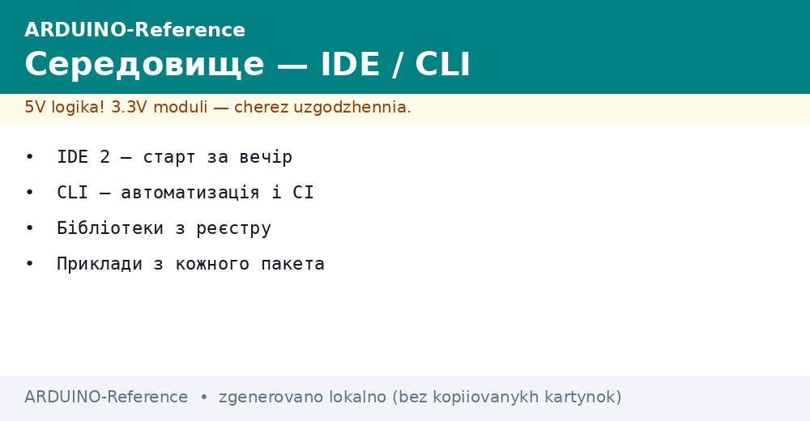
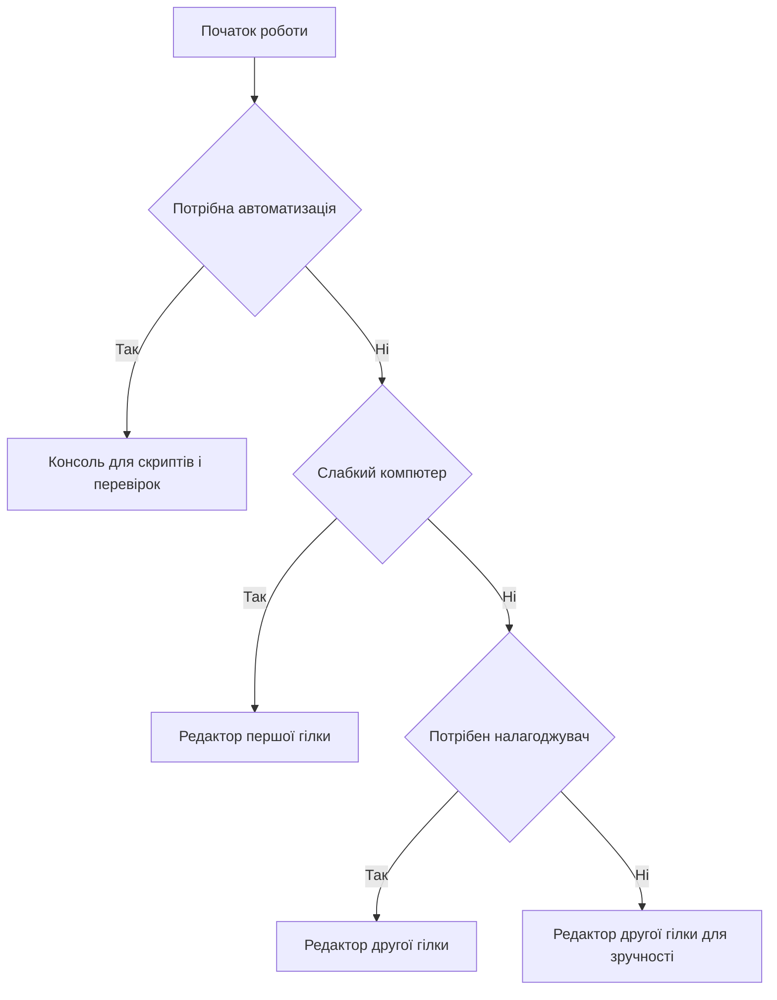

# Середовище Arduino - IDE, CLI і бібліотеки


*Рис. Вибір середовища: редактор консоль плати бібліотеки монітор порту.*

> [!tip] Призначення ноти
> Показати з чого складається середовище: редактор для коду консоль для автоматизації менеджери для плат і бібліотек та інструменти для налагодження через порт.

## 1. Призначення

Ця нота пояснює повний цикл роботи: написання скетча встановлення підтримки плати підключення бібліотек прошивка і перегляд даних з плати. Після прочитання читач обирає між графічним редактором і консоллю та розуміє де шукати плати бібліотеки і приклади.

Головна ідея така: графіка зручна для старту і налагодження а консоль зручна для повторюваних збірок і перевірок. Бібліотеки при цьому ставлять тільки з менеджера щоб версії збігались у всіх учасників проекту.

## 2. IDE 1.x проти 2.x

Класичний редактор першої гілки легкий і передбачуваний а редактор другої гілки додає автодоповнення навігацію по коду вбудований налагоджувач і темну тему. Для перших кроків підходить будь-який але довгі проекти зручніше вести в другій гілці.

| Параметр | IDE 1.x | IDE 2.x |
| --- | --- | --- |
| Інтерфейс | Просте вікно | Сучасний редактор з панелями |
| Автодоповнення | Базове | Розумне з підказками сигнатур |
| Налагоджувач | Зовнішні засоби | Вбудований для підтримуваних плат |
| Менеджер плат | Окреме вікно | Бічна панель з пошуком |
| Менеджер бібліотек | Окреме вікно | Бічна панель з описом і версіями |
| Монітор порту | Окреме вікно | Вкладка поруч з кодом |
| Плотер | Окреме вікно | Вкладка для графіків |
| Для кого | Старі компютери | Основна робота і навчання |

```text
Що вибрати новачку:
  Слабкий компютер ................ IDE 1.x
  Навчання і довгі проекти ........ IDE 2.x
  Обидві відкривають ті самі скетчі.
  Скетчі сумісні між гілками повністю.
```

## 3. Консоль для збірок

Консольний інструмент arduino-cli повторює все що вміє графіка: встановлення ядер компіляцію прошивку роботу з бібліотеками і вивід монітора. Його беруть для скриптів перевірок і серверів збирання де вікна не потрібні.

| Команда | Призначення | Коли викликати |
| --- | --- | --- |
| core update-index | Оновлення списку ядер | Перед встановленням нової плати |
| core install | Встановлення ядра плати | Один раз для кожного сімейства |
| board list | Список підключених плат | Коли не видно порт плати |
| lib install | Встановлення бібліотеки | Перед першою збіркою проекту |
| compile | Компіляція скетча | Перевірка коду без прошивки |
| upload | Прошивка плати | Після вдалої компіляції |
| monitor | Перегляд порту | Налагодження обміну даними |

```text
Типовий цикл через консоль:
  1. arduino-cli core update-index
  2. arduino-cli core install arduino:avr
  3. arduino-cli board list
  4. arduino-cli compile --fqbn arduino:avr:uno Blink
  5. arduino-cli upload -p /dev/ttyUSB0 --fqbn arduino:avr:uno Blink
  6. arduino-cli monitor -p /dev/ttyUSB0
```

## 4. Менеджер плат

Менеджер плат встановлює ядра тобто описи сімейств контролерів компілятори і налаштування прошивки. Без потрібного ядра плата не зявиться в списку навіть якщо порт видно. Ядра оновлюють обережно бо нові версії іноді змінюють поведінку старих прикладів.

| Крок | Дія | Пояснення |
| --- | --- | --- |
| Пошук | Ввести назву сімейства | Знайти ядро саме під свою плату |
| Встановлення | Натиснути встановити | Дочекатись кінця завантаження |
| Вибір плати | Меню плат | Обрати точну модель плати |
| Вибір порту | Меню портів | Обрати порт що зявився після підключення |
| Перевірка | Зібрати приклад | Компіляція має пройти без помилок |
| Оновлення | Нові версії | Читати список змін перед оновленням |

```text
Якщо плати нема в списку:
  1. Перевірити кабель з лініями даних.
  2. Перевірити драйвер перетворювача порту.
  3. Оновити індекс ядер.
  4. Встановити ядро сімейства плати.
  5. Перезапустити редактор і глянути порти.
```

## 5. Менеджер бібліотек

Бібліотека це готовий код для датчика дисплея або модуля звязку з прикладами. Менеджер ставить бібліотеки з перевіреного каталогу фіксує версію і показує залежності. Ручне копіювання тек з мережі лишають на крайній випадок бо версії тоді ніхто не контролює.

| Крок | Дія | Пояснення |
| --- | --- | --- |
| Пошук | Назва датчика або модуля | Читати опис і кількість завантажень |
| Версія | Остання стабільна | Фіксувати версію для всього проекту |
| Встановлення | Одна кнопка | Приклади зявляться в меню прикладів |
| Приклад | Відкрити приклад | Запустити без змін перед своїм кодом |
| Залежності | Додаткові бібліотеки | Ставити все що просить менеджер |
| Оновлення | Обережно | Перевіряти збірку після оновлення |

| Підхід | Плюси | Мінуси |
| --- | --- | --- |
| Менеджер бібліотек | Версії залежності приклади | Потрібен доступ до мережі |
| Ручне копіювання | Працює без мережі | Немає контролю версій і оновлень |
| Архів версії | Відтворювана збірка | Треба зберігати архів поруч |

```text
Порядок підключення датчика:
  1. Знайти бібліотеку в менеджері.
  2. Встановити і відкрити приклад.
  3. Запустити приклад без змін.
  4. Перенести потрібне у свій скетч.
```

## 6. Монітор порту і плотер

Монітор порту показує текст що надсилає плата і дозволяє відправляти команди назад. Плотер малює графіки чисел з плати що зручно для сенсорів і регуляторів. Обидва інструменти вимагають однакової швидкості обміну в скетчі і на компютері.

| Інструмент | Що показує | Коли брати |
| --- | --- | --- |
| Монітор порту | Рядки тексту | Журнал подій команди керування |
| Плотер | Графіки чисел | Сигнали сенсорів налаштування регуляторів |
| Швидкість | Боди в обох місцях | Значення мають збігатись |
| Переведення рядка | Кінець команди | Налаштувати під парсер скетча |
| Закриття порту | Звільнення лінії | Перед прошивкою закрити монітор |

```text
Налагодження через монітор:
  1. Відкрити приклад з виводом у порт.
  2. Виставити ту саму швидкість.
  3. Подивитись стартове повідомлення.
  4. Надіслати команду і глянути відповідь.
  5. Перенести команди у свій скетч.
```

## 7. Структура скетча setup і loop

Скетч складається з двох головних функцій. Функція setup виконується один раз після вмикання і готує виводи порт і бібліотеки. Функція loop крутиться без кінця і робить основну роботу: читає датчики керує виводами і надсилає дані.

```cpp
// Структура скетча з коментарями
// setup виконується один раз
// loop повторюється без кінця

void setup() {
  // Запускаємо порт для журналу
  Serial.begin(9600);
  // Готуємо вивід під світлодіод
  pinMode(13, OUTPUT);
  // Стартове повідомлення в монітор
  Serial.println("Start");
}

void loop() {
  // Основна робота повторюється тут
  digitalWrite(13, HIGH);
  Serial.println("ON");
  delay(500);
  digitalWrite(13, LOW);
  Serial.println("OFF");
  delay(500);
}
```

```text
Каркас скетча словами:
  setup:
    порт виводи датчики бібліотеки
  loop:
    читати рахувати керувати надсилати
    ніяких довгих пауз у відповідальних місцях
```

## 8. Приклад Blink з коментарями

Розширений приклад додає вивід у порт щоб було видно кожне перемикання навіть без погляду на плату. Такий прийом економить час: монітор підтверджує що цикл живий а плотер покаже ритм перемикань.

```cpp
// Blink з журналом у порт
// Кожне перемикання видно і на платі і в моніторі

const int LED_PIN = 13;  // Вивід вбудованого світлодіода

void setup() {
  pinMode(LED_PIN, OUTPUT);  // Вивід працює як вихід
  Serial.begin(9600);        // Швидкість для монітора
  Serial.println("Blink start");  // Мітка старту
}

void loop() {
  digitalWrite(LED_PIN, HIGH);  // Вмикаємо світлодіод
  Serial.println("LED ON");     // Пишемо в монітор
  delay(1000);                  // Пауза секунда
  digitalWrite(LED_PIN, LOW);   // Вимикаємо світлодіод
  Serial.println("LED OFF");    // Пишемо в монітор
  delay(1000);                  // Пауза секунда
}
```

```text
Перевірка прикладу:
  1. Прошити і відкрити монітор на тій самій швидкості.
  2. Побачити рядки Blink start потім ON OFF.
  3. Світлодіод блимає в такт з рядками.
  4. Нема рядків значить не та швидкість.
```

## 9. Mermaid: вибір середовища



## Типові помилки

| # | Помилка | Чому погано | Як правильно |
| --- | --- | --- | --- |
| 1 | Бібліотека скопійована вручну | Версії пливуть у різних людей | Ставити через менеджер з фіксованою версією |
| 2 | Не те ядро плати | Компіляція падає або не той список плат | Встановити ядро саме свого сімейства |
| 3 | Різна швидкість порту | Замість тексту сміття в моніторі | Однакова швидкість у скетчі і в моніторі |
| 4 | Монітор лишився відкритим | Порт зайнятий прошивка не стартує | Закривати монітор перед прошивкою |
| 5 | Приклад змінений до запуску | Незрозуміло що зламалось | Спочатку запустити приклад без змін |
| 6 | Код тільки в loop без setup | Виводи і порт не налаштовані | Виносити налаштування у функцію setup |
| 7 | Довгі паузи в циклі | Пропущені кнопки і дані сенсорів | Короткі паузи або лічильник часу |

## Офіційні джерела

- [Arduino IDE документація](https://docs.arduino.cc/software/ide/) - встановлення редактора плати бібліотеки монітор порту.
- [Arduino CLI документація](https://docs.arduino.cc/arduino-cli/) - команди консолі збирання прошивка автоматизація перевірок.
- [Завантаження IDE (Arduino)](https://www.arduino.cc/en/software) - завантаження середовища каталог бібліотек приклади і довідка.

## Див. також

- [Home](../../../ARDUINO-Reference/Home.md)
- [гід по довіднику](../../../ARDUINO-Reference/00-Start/01-Yak-koristuvatis-dovidnikom.md)
- [словник термінів](../../../ARDUINO-Reference/00-Start/02-Glosariy.md)
- [порівняння плат](../../../ARDUINO-Reference/00-Start/03-Porivnyannya-plat.md)
- [огляд плат](../../../ARDUINO-Reference/00-Start/04-Devkit-plati.md)
