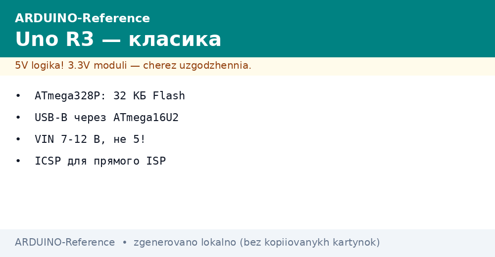
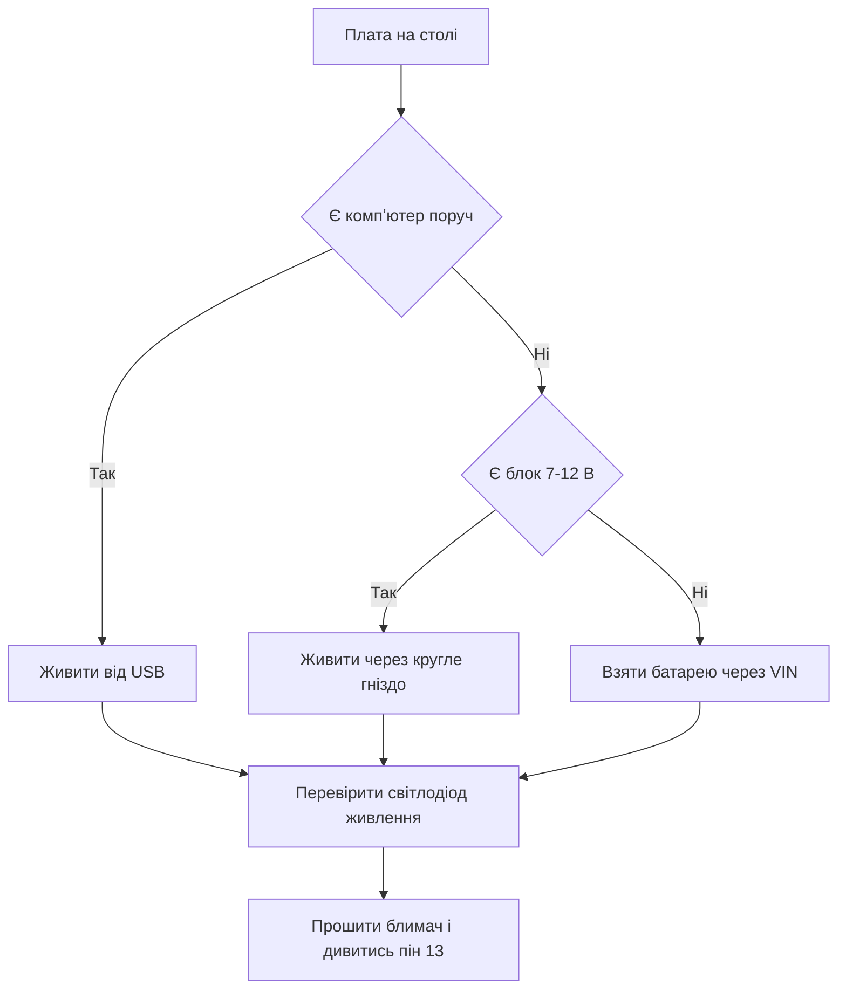

# AVR і Uno R3 - класика 8 біт


*Рис. Плата Uno R3: стабілізатор, перетворювач USB, гребінки пінів і кнопка скидання.*

> [!tip] Призначення ноти
> Дати цілісну картину класики: що вміє ATmega328P, як живити Uno R3, де шукати потрібний пін і як запустити перший скетч без диму.

## 1. Призначення

Uno R3 - еталонна плата екосистеми: кожен приклад, кожен шилд і кожен підручник починаються саме з неї.

Восьмибітне ядро AVR працює просто і передбачувано: один такт на більшість команд, прямі регістри портів, жодних складних дерев тактування.

Плата прощає помилки новачка: стабілізатор тримає перевантаження, полізапобіжник ріже струм USB, а завантажувач дозволяє шити чип звичайним кабелем.

Межа класики теж чесна: два кілобайти оперативної памяті закінчуються швидко, тому великі рядки, буфери екрана і мережеві стеки сюди не лізуть.

Ця нота закриває базу: памʼять і тактування, гребінки, живлення, карта пінів і перший скетч.

## 2. Характеристики ATmega328P

| Параметр | Значення | Практичний сенс |
| --- | --- | --- |
| Ядро | AVR 8 біт, 16 МГц | Проста модель часу, затримки точні |
| Flash | 32 КБ | Програма і рядки у програмній памяті |
| SRAM | 2 КБ | Змінні, стек, буфери бібліотек |
| EEPROM | 1 КБ | Налаштування, що живуть без живлення |
| Напруга живлення чипа | 5 В | Логічна одиниця дорівнює пять вольт |
| АЦП | 10 біт, 6 каналів | Датчики без зовнішніх мікросхем |
| Таймери | Два 8-біт і один 16-біт | ШІМ, затримки, вимірювання імпульсів |
| Інтерфейси | UART, SPI, I2C | Компʼютер, карта памяті, датчики |
| Корпус на платі | DIP або TQFP | DIP-версію можна вийняти і замінити |

## 3. Що стоїть на платі Uno R3

| Елемент | Де шукати | Навіщо потрібен |
| --- | --- | --- |
| ATmega328P | Центр плати, довга мікросхема | Виконує скетч користувача |
| ATmega16U2 | Біля гнізда USB-B | Міст між USB і послідовним портом |
| Гніздо USB-B | Квадратне гніздо з краю | Прошивка і живлення від компʼютера |
| Гніздо живлення | Кругле гніздо поруч | Зовнішні блоки 7-12 В |
| Стабілізатор 5 В | Біля гнізда живлення | Робить чисті 5 В для логіки |
| Кнопка скидання | Мала кнопка біля гребінок | Перезапуск скетчу вручну |
| Світлодіод живлення | Зелений, біля стабілізатора | Показує наявність живлення |
| Світлодіод на піні 13 | Жовтий, біля напису | Перший індикатор для дослідів |
| Розʼєм ICSP | Шість штирів 2 на 3 | Пряма прошивка через програматор |
| Гребінки пінів | Два довгі ряди з боків | Підключення шилдів і дротів |

```text
Компонування Uno R3 зверху (спрощено):

  [USB-B] [ATmega16U2] ........ [гніздо 7-12В] [стаб. 5В]
       |                                               |
  [ATmega328P] .... [кварц 16 МГц] .... [кнопка скидання]
       |                                               |
  [гребінка живлення] ................. [гребінка цифра]
  [гребінка аналог] ................... [розʼєм ICSP]
```

## 4. Живлення плати

| Джерело | Напруга | Струм | Коли брати |
| --- | --- | --- | --- |
| USB від компʼютера | 5 В | До 500 мА | Розробка, прошивка, налагодження |
| Кругле гніздо | 7-12 В | Залежить від блока | Автономна робота без компʼютера |
| Пін VIN | 7-12 В | Залежить від стабілізатора | Живлення через шилд або клеми |
| Пін 5V | Рівно 5 В | Тільки на вихід | Живити датчики, не плату |
| Пін 3V3 | 3,3 В | До 50 мА | Датчики з низькою напругою |

Вибір джерела робить автоматика на платі: якщо є напруга на гнізді, плата бере її, інакше бере USB.

Стабілізатор гріється тим сильніше, чим вища вхідна напруга і чим більше споживає навантаження.

Мотори, сервоприводи і довгі стрічки світлодіодів живлять окремим блоком зі спільною землею.

```text
Ланцюг живлення Uno R3:

  гніздо 7-12В ---> діод захисту ---> стабілізатор 5В ---> шина 5V
        |                                                        |
  USB 5В ---> полізапобіжник ---> ключ вибору ---> шина 5V ---> пін 3V3
```

## 5. Перший скетч Blink

Класичний блимач перевіряє весь ланцюг: середовище, кабель, завантажувач і сам чип.

```cpp
void setup() {
  pinMode(13, OUTPUT);   // вбудований світлодіод як вихід
}

void loop() {
  digitalWrite(13, HIGH); // увімкнути світлодіод
  delay(1000);            // чекати секунду
  digitalWrite(13, LOW);  // вимкнути світлодіод
  delay(1000);            // чекати секунду
}
```

Порядок запуску: вибрати плату Uno, вибрати порт, натиснути стрілку прошивки, дочекатись напису про успіх.

Якщо порт не зʼявився, перевіряють кабель: зарядні кабелі без жил даних плату не прошивають.

Якщо прошивка падає з помилкою доступу, закривають монітор порту і програми, що тримають порт.

## 6. Mermaid: вибір живлення



Схема читається згори вниз: спочатку джерело, потім перевірка індикатора, потім прошивка.

Для автономних вузлів гніздо надійніше за USB, бо кабель живлення не рветься від руху.

Для лабораторних дослідів USB зручніше, бо один кабель дає і живлення, і дані.

## 7. Карта пінів для щоденної роботи

| Група | Піни | Призначення |
| --- | --- | --- |
| Цифра базова | D2-D7 | Кнопки, реле, прості датчики |
| ШІМ виходи | D3, D5, D6, D9-D11 | Яскравість, швидкість мотора, звук |
| Послідовний порт | D0, D1 | Звʼязок з компʼютером, не чіпати без потреби |
| Зовнішні переривання | D2, D3 | Швидкі події: енкодери, імпульси лічильника |
| Аналогові входи | A0-A5 | Датчики напруги, подільники, фоторезистори |
| Шина I2C | A4, A5 | Екрани, датчики, годинник реального часу |
| Шина SPI | D10-D13 | Карти памяті, швидкі екрани |
| Опорна напруга | AREF | Рідко, для точної межі вимірювання |
| Живлення датчиків | 5V, 3V3, GND | Роздача живлення дрібним модулям |

Логіка плати пʼятивольтова: одиниця дорівнює пять вольт, нуль дорівнює нулю.

Датчики на 3,3 В підключають через подільник або перетворювач рівнів, а не безпосередньо.

## 8. Розʼєм ICSP і пряма прошивка

| Пін розʼєму | Сигнал | Куди йде |
| --- | --- | --- |
| Перший | MISO | Лінія даних від чипа |
| Другий | Живлення 5 В | Живлення логіки |
| Третій | SCK | Тактування програмування |
| Четвертий | MOSI | Лінія даних до чипа |
| Пʼятий | Скидання | Утримує чип у режимі прошивки |
| Шостий | Земля | Спільна земля програматора |

Через ICSP заливають завантажувач у чистий чип або відновлюють плату з пошкодженою прошивкою.

Звичайна робота програматора не потребує: USB-міст і завантажувач закривають щоденні задачі.

Перед підключенням програматора звіряють ключ розʼєму, щоб не подати живлення навпаки.

## 9. Памʼять: куди що класти

| Памʼять | Обсяг | Що тримає |
| --- | --- | --- |
| Flash | 32 КБ | Код скетчу і сталі рядки |
| SRAM | 2 КБ | Змінні, стек викликів, буфери |
| EEPROM | 1 КБ | Налаштування між перезапусками |

Рядки для виводу переносять у програмну пам'ять, щоб не зʼїдати два кілобайти оперативної.

Великі масиви для екрана рахують наперед: кадр 128 на 64 точки вже просить кілобайт.

Налаштування пишуть в EEPROM рідко і порціями, бо кількість циклів запису обмежена.

## Типові помилки

| # | Помилка | Чому погано | Як правильно |
| --- | --- | --- | --- |
| 1 | Живити плату через пін 5V від блока 9 В | Обхід стабілізатора палить чип | Подавати 7-12 В на гніздо або VIN |
| 2 | Кабель тільки для заряджання | Без жил даних порт не зʼявляється | Взяти кабель з передачею даних |
| 3 | Піни D0 і D1 зайняті датчиком під час прошивки | Бій за лінію зриває завантаження | Вимкати навантаження з D0 і D1 на час прошивки |
| 4 | Подавати 5 В на вхід датчика 3,3 В | Датчик перегрівається і бреше | Ставити подільник або перетворювач рівнів |
| 5 | Великі рядки в оперативній памяті | SRAM закінчується, плата висне | Тримати рядки у програмній памяті |
| 6 | Мотор безпосередньо від піна плати | Струм піна мізерний, чип гріється | Керувати через транзистор або драйвер з окремим живленням |

## Офіційні джерела

- [Плата Uno R3 на docs.arduino.cc](https://docs.arduino.cc/hardware/uno-rev3/) - характеристики, живлення, розпіновка і швидкий старт.
- [Мова і бібліотеки Arduino на arduino.cc](https://www.arduino.cc/reference/en/) - опис функцій, приклади скетчів і правила синтаксису.

## Див. також

- [Home](../../../ARDUINO-Reference/Home.md)
- [порівняння плат](../../../ARDUINO-Reference/00-Start/03-Porivnyannya-plat.md)
- [огляд плат](../../../ARDUINO-Reference/00-Start/04-Devkit-plati.md)
- [вибір середовища](../../../ARDUINO-Reference/00-Start/05-Vibir-seredovischa.md)
- [компакт і ноги](../../../ARDUINO-Reference/01-Hardware/02-Nano-Mega.md)
- [сучасний Uno](../../../ARDUINO-Reference/01-Hardware/04-Uno-R4.md)
- [завантажувач і avrdude](../../../ARDUINO-Reference/09-Proshivka/02-Bootloader-AVRDUDE.md)
