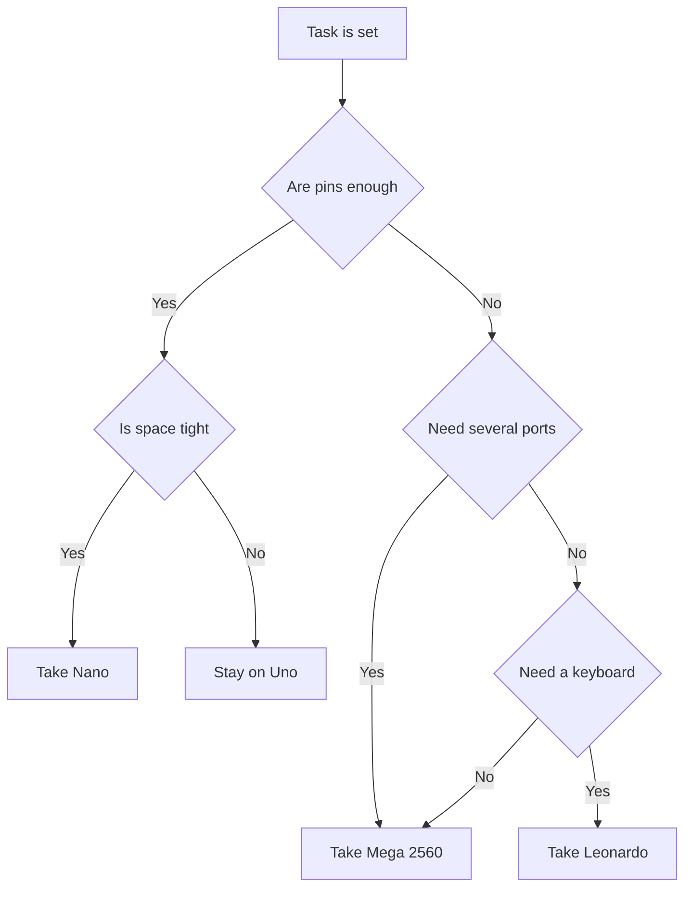

# Nano and Mega - compact and pins


*Fig. Small Nano for the breadboard and big Mega: shared core, different pin count.*

> [!tip] Purpose of the note
> To show two logical steps from Uno: Nano for tight cases and breadboards, Mega for projects where many pins and ports are needed.

## 1. Purpose

Nano repeats the Uno logic, but fits into a breadboard and costs less.

Mega grows the other way: dozens of digital pins, four hardware ports and large flash memory.

Leonardo stands apart with native USB: the board can pretend to be a keyboard or a mouse without extra chips.

The choice rule is simple: tight case - take Nano, few pins and ports - take Mega, need to control a computer - look at Leonardo.

The whole trio stays 5-volt, so sensors and shields from Uno work without converters.

## 2. Comparison of the three boards

| Parameter | Nano | Mega 2560 | Leonardo |
| --- | --- | --- | --- |
| Chip | ATmega328P | ATmega2560 | ATmega32U4 |
| Flash / SRAM | 32 KB / 2 KB | 256 KB / 8 KB | 32 KB / 2.5 KB |
| Digital pins | 14 | 54 | 20 |
| Analog inputs | 8 | 16 | 12 |
| Hardware UART | 1 | 4 | 1 plus native USB |
| USB | Mini or USB-C | USB-B | Micro with native support |
| Format | 30 pins into a breadboard | Large board with headers | Uno format |
| Typical task | Sensor in a case | Printer, panel, many relays | Keyboard, remote, mouse emulation |

## 3. Nano in detail

| Element | Description | Practice note |
| --- | --- | --- |
| Chip | The same ATmega328P | Uno sketches run unchanged |
| Pins | 30 leads with 2.54 pitch | Plugs straight into a breadboard |
| USB | Mini on the original, USB-C on new ones | Clones often have a different connector |
| Clone converter | CH340 instead of the original chip | The computer needs a driver |
| Power supply | USB or VIN pin 7-12 V | Regulator weaker than on Uno |
| Reset button | Small, at the board edge | Press with tweezers inside a case |
| LEDs | Power, pin 13, traffic | Traffic visible during flashing |

Nano clones with CH340 work the same, but the computer first asks for the converter driver.

Old clones need the old-bootloader option in the environment, otherwise flashing never starts.

It is better to power loads not from the Nano regulator but from a separate converter.

```text
Nano зверху (спрощено):

  [USB] [CH340 або FTDI] [ATmega328P] [кварц 16 МГц]
     |                                          |
  [15 штирів лівий ряд] .......... [15 штирів правий ряд]
     |                                          |
  [VIN] [GND] [D2-D13] .......... [A0-A7] [5V] [RST]
```

## 4. Mega 2560 in detail

| Element | Description | Practice note |
| --- | --- | --- |
| Chip | ATmega2560, 100 leads | Large flash memory for complex sketches |
| Digital | 54 pins, 15 with PWM | Relays, buttons, indication without expanders |
| Analog | 16 inputs | Many sensors without a multiplexer |
| Ports | Serial, Serial1, Serial2, Serial3 | GPS, modem, display work at the same time |
| USB bridge | ATmega16U2, as on Uno | Same drivers as for Uno |
| Power supply | 7-12 V jack or USB | Same selection automatics |
| Shields | Headers compatible with Uno | Old shields fit without rework |

Extra Mega pins repeat the familiar buses: SPI, I2C and interrupts sit in their places.

Uno shields cover only part of the headers, the remaining pins stay free for wires.

The large board asks for a roomy case: it does not fit into small boxes.

```text
Порівняння ширини (спрощено):

  Nano:   [USB][чип][кварц]   ширина двох рядів макетки
  Uno:    [USB-B][чип][гребінки]   долоня
  Mega:   [USB-B][чип 100 ніг][подвійні гребінки]   півтори долоні
```

## 5. Leonardo and native USB

| Feature | How it works | Where it helps |
| --- | --- | --- |
| ATmega32U4 chip | USB straight in the microcontroller | No bridge, fewer parts |
| Keyboard library | The board types like a keyboard | Password auto-entry, hot keys |
| Mouse library | The board moves the cursor | Presenter, test autopilot |
| Virtual port | The port appears after start | Board reset reconnects the port |
| Pin 13 | LED as on Uno | Blink runs unchanged |

Native USB is fussy during a hang: the port disappears until the board is reset by hand.

For input emulation the computer must trust the board, otherwise antivirus blocks keypresses.

## 6. Mega pin map for planning

| Group | Pins | Purpose |
| --- | --- | --- |
| PWM | D2-D13 | Brightness, sound, speed control |
| Serial port | D0, D1 | Link with the computer through USB |
| Serial1 port | D19, D18 | GPS or modem without software emulation |
| Serial2 port | D17, D16 | Second link module |
| Serial3 port | D15, D14 | Display or spare channel |
| External interrupts | D2, D3, D18-D21 | Encoders and fast pulses |
| SPI bus | D50-D53 | Memory cards and fast displays |
| I2C bus | D20, D21 | Sensors and clock |
| Analog | A0-A15 | Sixteen measurement channels |

Pins D0 and D1 are busy with the USB bridge: loads on them disturb flashing and the port monitor.

For link with modules on Mega always take Serial1-Serial3, and leave Serial to the computer.

## 7. Sketch with two ports on Mega

The bridge between the computer and the module shows the strength of Mega: one port talks to the monitor, the second to the device.

```cpp
void setup() {
  Serial.begin(9600);   // порт до компʼютера
  Serial1.begin(9600);  // порт до GPS або модему
}

void loop() {
  if (Serial.available()) {
    Serial1.write(Serial.read()); // з компʼютера в модуль
  }
  if (Serial1.available()) {
    Serial.write(Serial1.read()); // з модуля в компʼютер
  }
}
```

Such a bridge lets you configure the module with ordinary commands from the port monitor.

Port speeds must match on both sides, otherwise garbage characters appear instead of text.

This trick fails on Nano: it has one port, so the second channel is made in software and slow.

## 8. Mermaid: what to choose



The Nano branch saves space, the Mega branch saves time on expanders.

Leonardo is taken only for input emulation; for other tasks it duplicates Nano.

## 9. Power supply and currents

| Question | Nano | Mega 2560 |
| --- | --- | --- |
| USB | 5 V up to 500 mA | 5 V up to 500 mA |
| VIN | 7-12 V | 7-12 V or jack |
| 5V pin | Output to sensors only | Output to sensors only |
| Current of one pin | Up to 20 mA | Up to 20 mA |
| Total current | Up to 200 mA | Up to 800 mA from the jack |

Servos and relays get separate power: pins give only the signal, the supply gives the muscle.

Grounds of the board and the supply join together, otherwise the control signal has no reference.

## Common issues

| # | Issue | Why it is bad | How to do it right |
| --- | --- | --- | --- |
| 1 | Did not install the CH340 driver for a Nano clone | The port does not appear, flashing is impossible | Install the converter driver from the maker site |
| 2 | Wrong bootloader on a Nano clone | The environment waits long and fails | Select the old bootloader in the board settings |
| 3 | Sensor on D0 and D1 during flashing | The line is busy, the upload breaks | Remove loads from D0 and D1 for the flashing time |
| 4 | All modules on one port through a splitter | Bytes mix, the protocol breaks | On Mega spread modules across Serial1-Serial3 |
| 5 | Relay from a pin without a transistor | Coil current burns the output | Drive through a transistor with a separate power supply |
| 6 | Mega in a tight case | The board bends, headers short | Take Nano or a roomy case for Mega |

## Official sources

- [Nano board on docs.arduino.cc](https://docs.arduino.cc/hardware/nano/) - specifications, power supply and pinout of the compact board.
- [Mega 2560 board on arduino.cc](https://www.arduino.cc/en/Main/arduinoBoardMega2560) - description of the senior board, memory and extra ports.

## See also

- [Home](../../../ARDUINO-Reference/Home.md)
- [board comparison](../../../ARDUINO-Reference/00-Start/03-Porivnyannya-plat.md)
- [board overview](../../../ARDUINO-Reference/00-Start/04-Devkit-plati.md)
- [classic AVR](../../../ARDUINO-Reference/01-Hardware/01-AVR-Uno.md)
- [ARM boards](../../../ARDUINO-Reference/01-Hardware/03-Due-Zero-ARM.md)
- [environment and CLI](../../../ARDUINO-Reference/09-Proshivka/01-IDE-CLI.md)
- [bootloader and avrdude](../../../ARDUINO-Reference/09-Proshivka/02-Bootloader-AVRDUDE.md)
