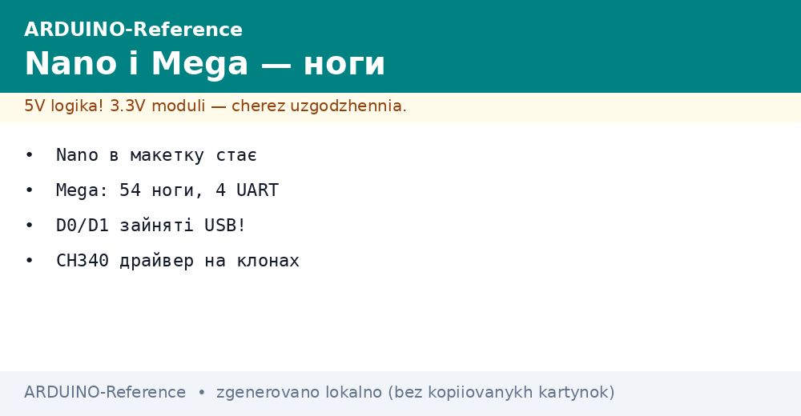
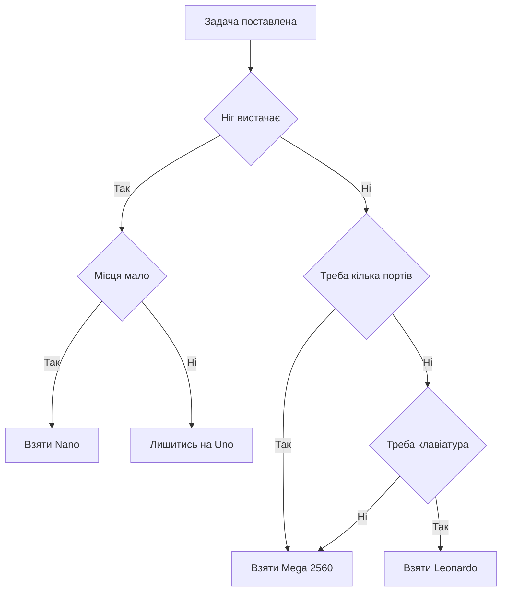

# Nano і Mega - компакт і піни

EN version: `ARDUINO-Reference/01-Hardware/02-Nano-Mega.en.md`


*Рис. Маленька Nano для макетки і велика Mega: спільне ядро, різна кількість пінів.*

> [!tip] Призначення ноти
> Показати два логічні кроки від Uno: Nano для тісних корпусів і макеток, Mega для проєктів, де пінів і портів треба багато.

## 1. Призначення

Nano повторює логіку Uno, але вміщується у макетну плату і коштує менше.

Mega навпаки розростається: десятки цифрових пінів, чотири апаратні порти і велика флеш-пам'ять.

Окремо стоїть Leonardo з рідним USB: плата вміє прикидатися клавіатурою або мишею без додаткових мікросхем.

Правило вибору просте: тісно в корпусі - беруть Nano, мало пінів і портів - беруть Mega, треба керувати компʼютером - дивляться на Leonardo.

Уся трійця лишається пʼятивольтовою, тому датчики і шилди від Uno працюють без перетворювачів.

## 2. Порівняння трьох плат

| Параметр | Nano | Mega 2560 | Leonardo |
| --- | --- | --- | --- |
| Чип | ATmega328P | ATmega2560 | ATmega32U4 |
| Flash / SRAM | 32 КБ / 2 КБ | 256 КБ / 8 КБ | 32 КБ / 2,5 КБ |
| Цифрові піни | 14 | 54 | 20 |
| Аналогові входи | 8 | 16 | 12 |
| Апаратні UART | 1 | 4 | 1 плюс рідний USB |
| USB | Mini або USB-C | USB-B | Micro з рідною підтримкою |
| Формат | 30 штирів у макетку | Велика плата з гребінками | Формат Uno |
| Типова задача | Датчик у корпусі | Принтер, панель, багато реле | Клавіатура, пульт, емуляція миші |

## 3. Nano детально

| Елемент | Опис | Нотатка для практики |
| --- | --- | --- |
| Чип | Той же ATmega328P | Скетчі з Uno йдуть без змін |
| Штирі | 30 виводів кроком 2,54 | Ставиться просто в макетку |
| USB | Mini на оригіналі, USB-C на нових | На клонах часто інший розʼєм |
| Перетворювач клонів | CH340 замість оригінальної мікросхеми | Потрібен драйвер на компʼютері |
| Живлення | USB або пін VIN 7-12 В | Стабілізатор слабший, ніж на Uno |
| Кнопка скидання | Мала, на торці плати | Тиснути пінцетом у корпусі |
| Світлодіоди | Живлення, пін 13, обмін | Обмін видно під час прошивки |

Клони Nano з CH340 працюють так само, але компʼютер спершу просить драйвер перетворювача.

Старі клони вимагають у середовищі опцію старого завантажувача, інакше прошивка не стартує.

Живити навантаження краще не від стабілізатора Nano, а від окремого перетворювача.

```text
Nano зверху (спрощено):

  [USB] [CH340 або FTDI] [ATmega328P] [кварц 16 МГц]
     |                                          |
  [15 штирів лівий ряд] .......... [15 штирів правий ряд]
     |                                          |
  [VIN] [GND] [D2-D13] .......... [A0-A7] [5V] [RST]
```

## 4. Mega 2560 детально

| Елемент | Опис | Нотатка для практики |
| --- | --- | --- |
| Чип | ATmega2560, 100 виводів | Велика флеш-пам'ять під складні скетчі |
| Цифра | 54 піни, з них 15 з ШІМ | Реле, кнопки, індикація без розширювачів |
| Аналог | 16 входів | Багато датчиків без мультиплексора |
| Порти | Serial, Serial1, Serial2, Serial3 | GPS, модем, дисплей працюють одночасно |
| USB-міст | ATmega16U2, як на Uno | Драйвери ті ж, що для Uno |
| Живлення | Гніздо 7-12 В або USB | Автоматика вибору така сама |
| Шилди | Гребінки сумісні з Uno | Старі шилди стають без переробок |

Додаткові піни Mega повторюють знайомі шини: SPI, I2C і переривання є на своїх місцях.

Шилди від Uno закривають лише частину гребінок, решта пінів лишається вільною для дротів.

Велика плата просить просторий корпус: у маленькі коробки вона не влізає.

```text
Порівняння ширини (спрощено):

  Nano:   [USB][чип][кварц]   ширина двох рядів макетки
  Uno:    [USB-B][чип][гребінки]   долоня
  Mega:   [USB-B][чип 100 ніг][подвійні гребінки]   півтори долоні
```

## 5. Leonardo і рідний USB

| Риса | Як працює | Де згодиться |
| --- | --- | --- |
| Чип ATmega32U4 | USB прямо в мікроконтролері | Немає моста, менше деталей |
| Бібліотека Keyboard | Плата друкує ніби клавіатура | Автоввід паролів, гарячі клавіші |
| Бібліотека Mouse | Плата рухає курсор | Презентер, автопілот тестів |
| Віртуальний порт | Порт зʼявляється після запуску | Скидання плати перепідключає порт |
| Пін 13 | Світлодіод як на Uno | Блимач йде без змін |

Рідний USB примхливий під час зависання: порт зникає, доки плату не скинуть вручну.

Для емуляції введення компʼютер має довіряти платі, інакше антивірус блокує натискання.

## 6. Карта пінів Mega для планування

| Група | Піни | Призначення |
| --- | --- | --- |
| ШІМ | D2-D13 | Яскравість, звук, керування швидкістю |
| Порт Serial | D0, D1 | Звʼязок з компʼютером через USB |
| Порт Serial1 | D19, D18 | GPS або модем без програмної емуляції |
| Порт Serial2 | D17, D16 | Другий модуль звʼязку |
| Порт Serial3 | D15, D14 | Дисплей або запасний канал |
| Зовнішні переривання | D2, D3, D18-D21 | Енкодери і швидкі імпульси |
| Шина SPI | D50-D53 | Карти памяті і швидкі екрани |
| Шина I2C | D20, D21 | Датчики і годинник |
| Аналог | A0-A15 | Шістнадцять каналів вимірювання |

Піни D0 і D1 зайняті USB-мостом: навантаження на них заважає прошивці і монітору порту.

Для звʼязку з модулями на Mega завжди беруть Serial1-Serial3, а Serial лишають компʼютеру.

## 7. Скетч з двома портами на Mega

Міст між компʼютером і модулем показує силу Mega: один порт говорить з монітором, другий з пристроєм.

```cpp
void setup() {
  Serial.begin(9600);   // порт до компʼютера
  Serial1.begin(9600);  // порт до GPS або модему
}

void loop() {
  if (Serial.available()) {
    Serial1.write(Serial.read()); // з компʼютера в модуль
  }
  if (Serial1.available()) {
    Serial.write(Serial1.read()); // з модуля в компʼютер
  }
}
```

Такий міст дозволяє налаштовувати модуль звичайними командами з монітора порту.

Швидкості портів виставляють однакові з обох боків, інакше замість тексту будуть сміттєві знаки.

Для Nano такий фокус не вийде: там один порт, тому другий канал роблять програмним і повільним.

## 8. Mermaid: що вибрати



Гілка Nano економить місце, гілка Mega економить час на розширювачах.

Leonardo беруть тільки під емуляцію введення, для решти задач він дублює Nano.

## 9. Живлення і струми

| Питання | Nano | Mega 2560 |
| --- | --- | --- |
| USB | 5 В до 500 мА | 5 В до 500 мА |
| VIN | 7-12 В | 7-12 В або гніздо |
| Пін 5V | Тільки на вихід датчикам | Тільки на вихід датчикам |
| Струм одного піна | До 20 мА | До 20 мА |
| Сумарний струм | До 200 мА | До 800 мА з гнізда |

Сервоприводи і реле живлять окремо: піни дають лише сигнал, а силу дає блок живлення.

Землі плати і блока зʼєднують, інакше сигнал керування не має відліку.

## Типові помилки

| # | Помилка | Чому погано | Як правильно |
| --- | --- | --- | --- |
| 1 | Не встановили драйвер CH340 для клона Nano | Порт не зʼявляється, прошивка неможлива | Встановити драйвер перетворювача з сайту виробника |
| 2 | Не той завантажувач у клона Nano | Середовище довго чекає і падає | Вибрати старий завантажувач у налаштуваннях плати |
| 3 | Датчик на D0 і D1 під час прошивки | Лінія зайнята, завантаження зривається | Знімати навантаження з D0 і D1 на час прошивки |
| 4 | Усі модулі на один порт через розгалужувач | Байти перемішуються, протокол ламається | На Mega рознести модулі по Serial1-Serial3 |
| 5 | Реле від піна без транзистора | Струм котушки палить вихід | Керувати через транзистор з окремим живленням |
| 6 | Mega у тісний корпус | Плата гнеться, гребінки коротять | Взяти Nano або просторий корпус під Mega |

## Офіційні джерела

- [Плата Nano на docs.arduino.cc](https://docs.arduino.cc/hardware/nano/) - характеристики, живлення і розпіновка компактної плати.
- [Плата Mega 2560 на arduino.cc](https://www.arduino.cc/en/Main/arduinoBoardMega2560) - опис старшої плати, пам'ять і додаткові порти.

## Див. також

- [Home](../../../ARDUINO-Reference/Home.md)
- [порівняння плат](../../../ARDUINO-Reference/00-Start/03-Porivnyannya-plat.md)
- [огляд плат](../../../ARDUINO-Reference/00-Start/04-Devkit-plati.md)
- [класичний AVR](../../../ARDUINO-Reference/01-Hardware/01-AVR-Uno.md)
- [плати на ARM](../../../ARDUINO-Reference/01-Hardware/03-Due-Zero-ARM.md)
- [середовище і CLI](../../../ARDUINO-Reference/09-Proshivka/01-IDE-CLI.md)
- [завантажувач і avrdude](../../../ARDUINO-Reference/09-Proshivka/02-Bootloader-AVRDUDE.md)
