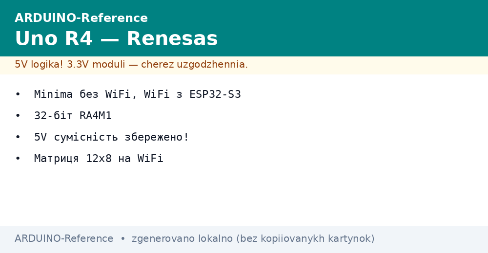
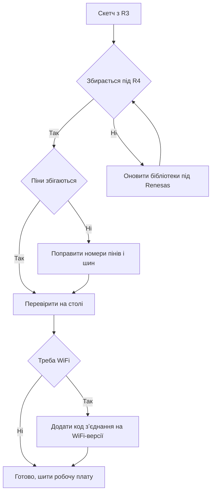

# Uno R4 - Renesas з WiFi

EN version: `ARDUINO-Reference/01-Hardware/04-Uno-R4.en.md`


*Рис. Сучасний Uno R4: знайомі гребінки, нове ядро і матриця світлодіодів.*

> [!tip] Призначення ноти
> Показати міст між класикою і сучасністю: що нового в чипі Renesas, чим версії відрізняються і як перевезти скетчі з R3 без болю.

## 1. Призначення

Uno R4 зберігає знайомий формат: гребінки, гніздо живлення і пʼятивольтова логіка лишаються.

Усередині стоїть тридцятидвохбітний Renesas на 48 МГц: памяті більше, периферії більше, швидкість вища.

Версія WiFi додає радіо і матрицю 12 на 8 світлодіодів: індикація і звязок без жодних шилдів.

Ця нота вчить вибирати версію, користуватись новими блоками і перевозити старі скетчі.

Хто знає R3, той освоїть R4 за вечір: мова та сама, можливостей більше.

## 2. Порівняння R3 і R4

| Параметр | Uno R3 | Uno R4 Minima | Uno R4 WiFi |
| --- | --- | --- | --- |
| Ядро | AVR 8 біт, 16 МГц | Renesas 32 біт, 48 МГц | Renesas 32 біт, 48 МГц |
| Flash / SRAM | 32 КБ / 2 КБ | 256 КБ / 32 КБ | 256 КБ / 32 КБ |
| Логіка пінів | 5 В | 5 В | 5 В |
| USB | USB-B через міст | USB-C рідний | USB-C рідний |
| Радіо | Немає | Немає | ESP32-S3 для WiFi і Bluetooth |
| Матриця | Немає | Немає | 12 на 8 світлодіодів |
| CAN | Немає | Є контролер | Немає контролера |
| ЦАП | Немає | Є один канал | Немає каналу |
| Типова задача | Навчання, прості вузли | Швидка логіка, CAN-вузли | Хмарні проєкти, індикація |

Пʼятивольтова сумісність збережена: старі шилди і датчики стають без перетворювачів.

Живлення стало сучаснішим: розʼєм USB-C міцніший і дає більший струм.

Памяті у вісім разів більше, тому великі бібліотеки звязку влізають легко.

## 3. Minima проти WiFi

| Питання | Minima | WiFi |
| --- | --- | --- |
| Ціна | Нижча | Вища через радіо і матрицю |
| Радіо | Немає | WiFi і Bluetooth через ESP32-S3 |
| Матриця 12 на 8 | Немає | Є, керується бібліотекою |
| CAN-шина | Є, виведена на гребінку | Немає |
| ЦАП | Є | Немає |
| Для автономного вузла | Так, дешевше | Так, якщо треба радіо |
| Для хмарного проєкту | Ні, немає звязку | Так, з коробки |

Minima беруть для швидкої логіки, CAN-мереж і точних аналогових виходів.

WiFi беруть для хмари, застосунків на телефоні і живої індикації без екрана.

Обидві версії шиються однаково через USB-C, різниця лише в бібліотеках.

```text
Вибір версії R4:

  треба радіо або матриця .... WiFi (ESP32-S3 на борту)
  треба CAN або ЦАП .......... Minima
  треба і те і те ............ WiFi плюс зовнішні модулі CAN і ЦАП
  грошей мало, задача проста . Minima
```

## 4. Матриця світлодіодів WiFi

| Риса | Опис | Практика |
| --- | --- | --- |
| Розмір | 12 стовпців на 8 рядків | 96 точок для значків і цифр |
| Керування | Готова бібліотека матриці | Малювати кадрами, не точками вручну |
| Яскравість | Програмована | На ніч зменшувати, щоб не сліпила |
| Анімація | Зміна кадрів за таймером | Серцебиття, стрілки, рівень сигналу |
| Шрифт | Вбудовані цифри і літери | Текст біжить без зовнішнього екрана |

Матриця живиться від плати, окремого блока не просить.

Яскраві анімації на максимумі гріють стабілізатор, тому тримають середній рівень.

Для великих табло матриця не годиться: це індикатор, а не екран.

```text
Матриця 12 на 8 (приклад смайлика):

  . . X X . . . . X X . .
  . X . . X . . X . . X .
  . X . . X . . X . . X .
  . . X X . . . . X X . .
  . . . . . . . . . . . .
  . X . . . . . . . . X .
  . . X . . . . . . X . .
  . . . X X X X X X . . .
```

## 5. WiFi і хмара з коробки

| Блок | Що дає | З чого почати |
| --- | --- | --- |
| ESP32-S3 | Радіо WiFi і Bluetooth | Приклади звязку з середовища |
| Антена | Друкована на платі | Плату не ховати в метал |
| Бібліотека звʼязку | Підключення і запити | Приклад сканування мереж першим |
| Хмарні змінні | Синхронізація з кабінетом | Панель і графіки без свого сервера |
| Захист | Шифрування з коробки | Паролі не писати у відкритий код |

Першим дослідом сканують мережі: плата показує список, значить радіо живе.

Пароль мережі тримають в окремому файлі налаштувань, а не розкидають по прикладах.

Металевий корпус глушить сигнал, тому плату виносять антеною назовні.

## 6. Приклад: WiFi і матриця разом

Скетч підключається до мережі і показує стан на матриці: хрестик доки шукає, галочка коли є звязок.

```cpp
#include "Arduino_LED_Matrix.h"

ArduinoLEDMatrix matrix;

const uint8_t cross[8][12] = {
  {0,0,0,0,0,0,0,0,0,0,0,0},
  {0,1,0,0,0,0,0,0,0,0,1,0},
  {0,0,1,0,0,0,0,0,0,1,0,0},
  {0,0,0,1,0,0,0,0,1,0,0,0},
  {0,0,0,0,1,0,0,1,0,0,0,0},
  {0,0,0,0,0,1,1,0,0,0,0,0},
  {0,0,0,0,0,0,0,0,0,0,0,0},
  {0,0,0,0,0,0,0,0,0,0,0,0}
};

void setup() {
  matrix.begin();      // запуск матриці
  matrix.renderBitmap(cross, 8, 12); // показати хрестик пошуку
}

void loop() {
  // тут підключення до мережі, після успіху малюють галочку
}
```

Кадр описують таблицею байтів: одиниця світить, нуль гасить.

Складні картинки генерують редактором кадрів, а не пишуть вручну.

Після налагодження індикації додають код зʼєднання з прикладу бібліотеки.

## 7. CAN на Minima

| Риса | Опис | Практика |
| --- | --- | --- |
| Контролер | Вбудований у Renesas | Зовнішній контролер не потрібен |
| Приймач | Зовнішній, докуповують | Без приймача шина мовчить |
| Швидкість | До 1 Мбіт | Робочу беруть з опису мережі |
| Термінатор | 120 Ом на кінцях | Без нього помилки кадрів |
| Бібліотека | Готова, з прикладами | Починають з відправки лічильника |

CAN зʼєднує вузли двома дротами на відстані десятків метрів.

Кожному вузлу дають свій номер, інакше кадри бʼються.

Для машини і промислових мереж CAN надійніший за послідовний порт.

## 8. Mermaid: перевезення скетчу з R3



Більшість простих скетчів збирається одразу: мова та сама, піни ті ж.

Бібліотеки з прямими регістрами AVR оновлюють першими, вони головна причина помилок.

Після збирання перевіряють поведінку на столі, лише потім ставлять у виріб.

## 9. Живлення і сумісність шилдів

| Питання | Відповідь |
| --- | --- |
| Логіка пінів | 5 В, як на R3 |
| USB | USB-C, міцніший розʼєм |
| Гніздо живлення | 6-24 В через перетворювач |
| Струм матриці | Враховувати при яскравих кадрах |
| Шилди R3 | Стають механічно і електрично |
| Швидкі шилди | Перевірити бібліотеки під нову частоту |

Діапазон гнізда ширший, ніж у R3, тому підходять блоки від 6 до 24 В.

Струм через USB-C більший, матриця і радіо не просаджують живлення датчиків.

Старі часові трюки з мікросекундами калібрують, бо частота ядра утричі вища.

## Типові помилки

| # | Помилка | Чому погано | Як правильно |
| --- | --- | --- | --- |
| 1 | Вибрали R3 у середовищі для плати R4 | Код збирається не під той чип | Вибрати свою версію R4 у списку плат |
| 2 | Стара бібліотека з регістрами AVR | Збирання падає з помилками | Оновити бібліотеку до версії з Renesas |
| 3 | Пароль WiFi у відкритому прикладі | Ключ потрапляє у чужі руки | Тримати пароль в окремому файлі налаштувань |
| 4 | Плата в металевому корпусі | Антена глушиться, звязок рветься | Винести антену назовні або взяти пластик |
| 5 | Яскравість матриці на максимумі завжди | Грів і зайвий струм | Тримати середній рівень, максимум для спалахів |
| 6 | CAN без приймача і термінатора | Шина мовчить, кадри губляться | Додати приймач і резистори 120 Ом на кінцях |

## Офіційні джерела

- [Плата Uno R4 WiFi на docs.arduino.cc](https://docs.arduino.cc/hardware/uno-r4-wifi/) - характеристики, матриця, радіо і швидкий старт.
- [Порівняння Uno R4 на arduino.cc](https://www.arduino.cc/en/Guide/UNO-R4) - версії Minima і WiFi, міграція з R3 і приклади.

## 7. Ревізії Uno R4 (Arduino SA, 2025-2026)

- **Uno R4 Minima**: ревізія R4.1 → виправлений стабілізатор (5 В більш стабільний під навантаженням); R4.2 → додано ESD захист на USB.
- **Uno R4 WiFi**: ревізія з ESP32-S3 модулем (не ESP32) — перевіряйте версію прошивки модуля через `WiFi.firmwareVersion()`.
- **Перенесення з R3**: код сумісний; але `analogWrite` на R4 = LEDC з іншою частотою (вище, ніж на AVR) — перевіряйте односторонньо.

## Див. також

- [Home](../../../ARDUINO-Reference/Home.md)
- [порівняння плат](../../../ARDUINO-Reference/00-Start/03-Porivnyannya-plat.md)
- [вибір середовища](../../../ARDUINO-Reference/00-Start/05-Vibir-seredovischa.md)
- [класичний AVR](../../../ARDUINO-Reference/01-Hardware/01-AVR-Uno.md)
- [плати на ARM](../../../ARDUINO-Reference/01-Hardware/03-Due-Zero-ARM.md)
- [середовище і CLI](../../../ARDUINO-Reference/09-Proshivka/01-IDE-CLI.md)
