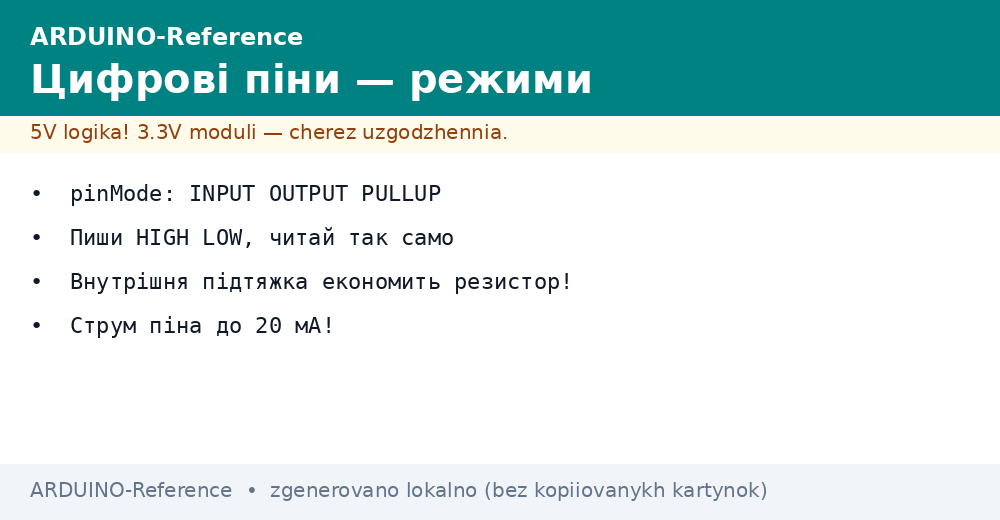
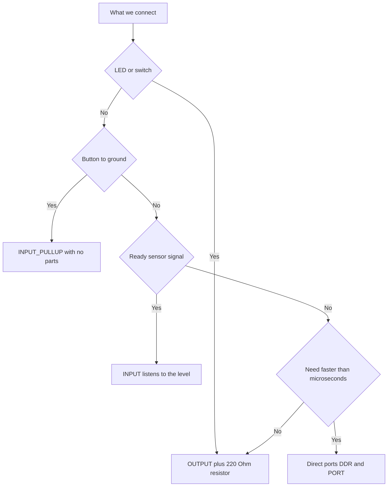

# Arduino Digital Pins - Modes and Currents


*Fig. Digital pins: modes, pull-ups, currents and output protection.*

> [!tip] Purpose of the note
> Quickly configure any digital pin: pick a mode, read a button, light an LED, and never burn an output with excess current.

## 1. Purpose

A digital pin understands only two levels: low near zero and high near the supply voltage.

On 5 V boards the high level equals five volts, and the ATmega328P datasheet thresholds are: VIL ≤ 0.3×Vcc, VIH ≥ 0.6×Vcc (this is not the middle of the scale, there is hysteresis).

Each pin can work as an input or an output, and the mode is set with one setup call at the start of the program.

Inputs read buttons, sensors with a discrete output, and signals from other chips.

Outputs drive LEDs, transistors, relays through a driver, and logic inputs of other devices.

This note covers the base: modes, reading and writing, pull-ups, current limits, an LED through a resistor, and speed.

## 2. Three pin modes

| Mode | What it does | When to take |
| --- | --- | --- |
| OUTPUT | Pin drives 0 V or 5 V with low impedance | LEDs, transistor control, signals out |
| INPUT | Pin listens to the level, draws almost no current | Sensors with their own output, signals from other logic |
| INPUT_PULLUP | Input with an internal resistor to the supply | Buttons between the pin and ground with no extra parts |

The mode is set with a pinMode call with the pin number and the mode name.

Configuration runs once in the setup block, because after reset all pins become inputs without pull-ups.

Pin 13 is handy for first experiments: an LED is already connected to it on the board through a limiting resistor.

Digital pin numbers are printed on the board next to the headers, and the D prefix is not written in code.

Analog inputs can also work as digital: numbers A0 and up are available for level reading and writing.

## 3. Writing and reading a level

| Function | Purpose | Example |
| --- | --- | --- |
| digitalWrite | Drive a high or low level on an output | digitalWrite(13, HIGH) lights the LED |
| digitalRead | Read the level on an input | digitalRead(2) returns HIGH or LOW |
| HIGH | High-level constant | Logic one, about 5 V |
| LOW | Low-level constant | Logic zero, about 0 V |

Writing works only on pins switched to OUTPUT mode, and reading makes sense on inputs.

Reading an output returns the last written value, so a separate state variable is often unneeded.

A button is usually read in a loop with a small delay, so contact bounce does not trigger several times.

The button state is handy to invert right while reading, if a press gives a low level.

Long wires to a button pick up interference, so a capacitor or a software filter is placed near the board.

```cpp
const int LED_PIN = 13;
const int BTN_PIN = 2;

void setup() {
  pinMode(LED_PIN, OUTPUT);
  pinMode(BTN_PIN, INPUT_PULLUP);  // кнопка між піном і землею
}

void loop() {
  bool pressed = digitalRead(BTN_PIN) == LOW;  // натиснута дає нуль
  digitalWrite(LED_PIN, pressed ? HIGH : LOW);
  delay(10);  // пауза гасить дребезг контактів
}
```

The sketch lights the on-board LED while the button on pin two is held.

No resistor is needed for the button: the internal pull-up already holds the level when the contacts are open.

A ten-millisecond delay keeps polling calm and removes false triggers.

Repeat this circuit for each button, changing only the pin number in two lines.

## 4. Floating input and pull-ups

| Input state | What happens | What it risks |
| --- | --- | --- |
| Pulled up | Resistor holds 5 V | Calm one without a button |
| Pulled down | External resistor holds 0 V | Calm zero without a button |
| Floating | Pin connected nowhere | Random triggers from stray fields |

An input without a pull-up has high impedance and catches pickup from hands, wires and mains lighting.

So a button is never left between the pin and the supply without a resistor: a released button gives exactly the floating state.

The internal pull-up is 20 to 50 kOhm and switches on with the INPUT_PULLUP mode and no parts at all.

The pull-up resistance is large, so the current through a pressed button is a fraction of a milliamp.

```text
Кнопка на вхід з внутрішньою підтяжкою:

   живлення 5 В (усередині чипа)
    |
   [R] опір 20-50 кОм (режим INPUT_PULLUP)
    |
пін D2 ------+------> до цифрового входу
             |
          [кнопка]
             |
            земля

  Кнопка відпущена: вхід бачить 5 В.
  Кнопка натиснута: вхід притягнуто до землі.
```

An external pull-up is used when exact resistance, lower leakage current, or a down level is needed.

For ribbons and long lines take an external resistor near 4.7 kOhm: it holds the level stiffer against interference.

## 5. How much current a pin survives

| Limit | Value | Practical meaning |
| --- | --- | --- |
| Pin working current | 20 mA | LED, transistor base, logic input |
| Pin absolute maximum | 40 mA | A short peak, not a working mode |
| Chip total current | 200 mA | Ceiling for all pins and supply together |
| 5V pin current on the board | Depends on the regulator | Feed sensors with headroom |
| 3V3 rail current on the board | Up to 50 mA (rail, not a pin!) | Delicate low-voltage sensors |

The 20 mA limit means long operation without die overheat and level sag.

The 40 mA value is written as a destruction limit: every output above it risks port degradation.

The 200 mA sum covers the whole chip: ten LEDs at 20 mA each already hit the ceiling.

Motors, relays and strips are powered through a transistor or a driver, and the pin only drives the switch with a small current.

```text
Розрахунок резистора для червоного світлодіода:

  живлення ............ 5 В
  падіння на діоді .... 2 В
  бажаний струм ....... 15 мА (менше межі 20 мА)

  R = (5 В - 2 В) / 0,015 А = 3 / 0,015 = 200 Ом

  Найближчий стандартний номінал догори — 220 Ом.
  Потужність: 0,015 А * 3 В = 0,045 Вт, корпус 0,25 Вт з запасом.
```

An LED is never hung straight on a pin without a resistor: only internal resistance would limit the current, and either the diode or the port would burn.

For bright indicators take lower current and a larger resistor: eyes barely notice the difference.

Blue and white diodes drop about 3 V, so their resistor comes out smaller.

## 6. Speed and direct ports

| Approach | Switching speed | When it is enough |
| --- | --- | --- |
| digitalWrite | Microseconds per call | Buttons, relays, indication, slow protocols |
| Direct port write | Tens of nanoseconds | Short pulse generation, fast buses |
| High-level library | Like digitalWrite or slower | Displays, sensors, ready code |

The digitalWrite function validates the pin number and lookup tables, so it spends time on service.

For blinking an LED and clicking a relay this speed is excessive with a large margin.

Direct ports write a whole byte of pins with one instruction through data and direction registers.

The price of speed is binding to a specific chip: code for the Uno will not run on a board with a different core.

```text
Огляд прямих портів на ATmega328P:

  DDRD  — напрям: одиниця робить пін виходом
  PORTD — запис: одиниця видає 5 В на виході
  PIND  — читання: біти показують рівні входів

  Приклад: DDRD |= (1 << 5);  // пін D5 стає виходом
```

Always start with digitalWrite, and move to registers only on a measured need.

A logic analyzer or an oscilloscope shows real pulse durations better than any guessing.

## Mermaid: pin mode choice



## Common issues

| # | Issue | Why it is bad | How to do it right |
| --- | --- | --- | --- |
| 1 | Forgotten pinMode before digitalWrite | Pin stayed an input, the load is not driven | Set OUTPUT in setup for every driven pin |
| 2 | Button without a pull-up in INPUT mode | Input floats and catches pickup | INPUT_PULLUP mode or an external resistor |
| 3 | LED straight on a pin without a resistor | Current exceeds 40 mA, the port or diode dies | 220 Ohm resistor in series with the LED |
| 4 | Relay and motor powered from a pin | Hundreds of milliamps burn the output | Transistor or driver, the pin only drives the switch |
| 5 | Button check without a delay | Bounce gives a burst of false presses | 10 ms pause or a time count between events |
| 6 | Total current over 200 mA on all pins | Chip heats up and the supply sags | Count the sum, heavy loads go on a separate PSU |

## Official sources

- [Digital Pins on docs.arduino.cc](https://docs.arduino.cc/learn/microcontrollers/digital-pins/) - modes, pull-ups and current limits of digital pins.
- [pinMode on arduino.cc](https://www.arduino.cc/reference/en/language/functions/digital-io/pinmode/) - INPUT, OUTPUT and INPUT_PULLUP modes.
- [digitalWrite on arduino.cc](https://www.arduino.cc/reference/en/language/functions/digital-io/digitalwrite/) - level writing and output speed.

## See also

- [Home](../../../ARDUINO-Reference/Home.md)
- [classic AVR](../../../ARDUINO-Reference/01-Hardware/01-AVR-Uno.md)
- [pulse-width modulation](../../../ARDUINO-Reference/03-GPIO/02-PWM-analogWrite.md)
- [board interrupts]
