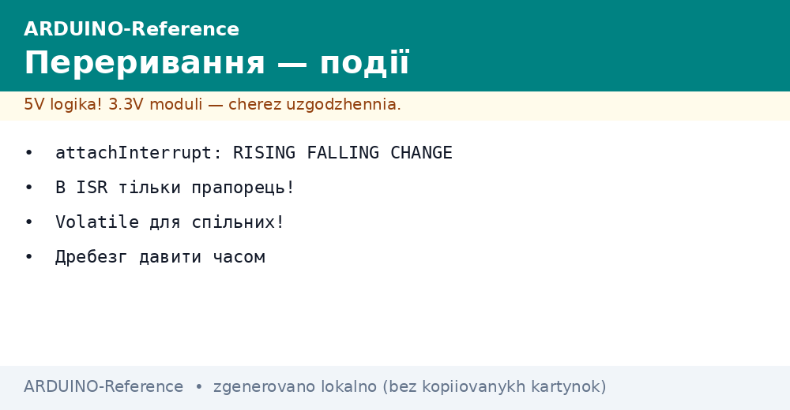
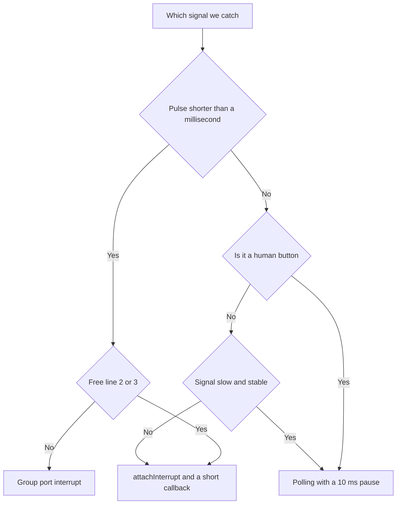

# Arduino Interrupts - Events Without Polling


*Fig. Interrupts: events, trigger modes and short callbacks.*

> [!tip] Purpose of the note
> Catch fast events without busy waiting: a button, a sensor pulse and an encoder step are handled instantly, and the main loop stays free.

## 1. Purpose

Polling an input in a loop misses short pulses: the program was just drawing the screen, and the event already passed.

An interrupt stops the main code at the event moment, runs a short callback, and returns back.

This approach saves processor time: instead of a thousand checks per second there is one call on the fact.

The callback is called a service routine: it must be lightning-fast and free of side effects.

This note covers the practice: trigger modes, allowed pins, flags, bounce, and button and encoder examples.

## 2. Trigger modes

| Mode | Call moment | When to take |
| --- | --- | --- |
| RISING | Rising edge from zero to one | Pulse counter, event start |
| FALLING | Falling edge from one to zero | Button to ground with a pull-up, event end |
| CHANGE | Any level change | Encoder, signal duration measurement |
| LOW | Holding a low level | Wake from sleep, repeated calls while held |

The mode is passed as the third argument of the attachInterrupt call together with the event number and the callback name.

A button between the pin and ground is caught on the falling edge: a press pulls the input to zero.

Flowmeter pulses are counted on the rising edge, so each quantum of liquid gives exactly one call.

LOW mode calls the callback again and again while the level is held, so the exit from it is planned in advance.

## 3. Allowed pins on different boards

| Board | External interrupt pins | Note |
| --- | --- | --- |
| Uno and Nano | 2, 3 | Classic pair on the ATmega328P chip |
| Mega | 2, 3, 18, 19, 20, 21 | Six lines for complex shields |
| Leonardo and Micro | 0, 1, 2, 3, 7 | Different layout because of the USB core |
| Uno R4 | All digital pins | New core wakes any input |
| Due and Zero | All digital pins | Powerful cores with no hard limits |

On the classics only two inputs are available, so they are saved for the fastest signals.

The interrupt number does not equal the pin number: the digitalPinToInterrupt macro does the conversion.

Bare numbers in code work only on one board and break portability between models.

```text
Переносне підключення колбека:

  пін 2 ---> кнопка ---> земля (Uno, Nano, Mega, Leonardo)
  код: attachInterrupt(digitalPinToInterrupt(2), onPress, FALLING);

  Макрос сам підставить номер події під конкретну плату.
```

An encoder needs two lines, so on the Uno it occupies both available inputs fully.

Sensors with slow signals stay on polling, and interrupts go to pulses shorter than a millisecond.

## 4. Short callback and flags

| Rule | Why | What breaks it |
| --- | --- | --- |
| Callback lasts microseconds | Main code is paused | Missed events and servo jitter |
| No delays inside | The time counter freezes | Program hangs on every event |
| No port printing | Output waits for interrupts | Mutual lockup and hangs |
| Shared variables through volatile | Compiler does not cache the value | Main loop sees a stale state |
| Long work goes to loop | Callback only raises a flag | Instant response, calm logic |

The volatile keyword forbids the optimizer from hiding a variable in a register between checks.

The event flag is read and cleared in the main loop with a short critical section.

Multi-byte counters are read with interrupts disabled, so a half-updated value is never caught.

```cpp
const int BTN_PIN = 2;

volatile bool flagPress = false;       // подія для головного циклу
volatile unsigned long lastHit = 0;    // мітка часу останнього спрацьовування

void onPress() {
  unsigned long now = millis();        // читати час можна, чекати не можна
  if (now - lastHit > 50) {            // відсікання дребезгу за часом
    flagPress = true;
    lastHit = now;
  }
}

void setup() {
  pinMode(BTN_PIN, INPUT_PULLUP);
  attachInterrupt(digitalPinToInterrupt(BTN_PIN), onPress, FALLING);
  Serial.begin(9600);
}

void loop() {
  if (flagPress) {                     // довга робота живе тут
    flagPress = false;
    Serial.println("press");
  }
}
```

The callback only records the press fact, and printing and logic live in the calm loop.

A 50 ms time guard cuts the burst of false triggers from spring contacts.

The same frame suits a reed switch, an optocoupler and any discrete sensor.

## 5. Button bounce in detail

| Method | How it works | When it is enough |
| --- | --- | --- |
| Pause after the event | Ignore 30-50 ms after the first edge | One button, simple menus |
| Time stamp | Millisecond compare in the callback | Several buttons without blocking the loop |
| Stability counter | Level steady for several polls | Polling without interrupts |
| 100 nF capacitor | Hardware edge smoothing | Aggressive interference and long wires |
| Schmitt trigger | Crisp edge from a slow signal | Mechanical contacts of old gear |

A mechanical contact bounces for a few milliseconds: the controller sees a queue of edges instead of one.

Without protection the press counter winds up extra, and menus jump over items.

A time filter in the callback is cheaper than parts and never blocks the main loop unlike a delay.

A hardware capacitor sits close to the button to kill interference before the input.

```text
Картина дребезгу на вході (час зліва направо):

  ідеал:    11111111|0000000000000000
  реальність: 11111|01010101|00000000
               ^^^ пачка хибних фронтів

  Фільтр 50 мс бере перший фронт,
  а решту пачки мовчки ігнорує.
```

For responsible nodes both approaches combine: a capacitor plus a time filter.

Reed switches and limit switches ring longer than buttons, so their threshold rises to 100 ms.

## 6. Level change and time measurement

| Task | Mode | How to count |
| --- | --- | --- |
| Pulse duration | CHANGE | Rising-edge stamp minus falling-edge stamp |
| Signal frequency | RISING | Stamp difference of neighbor rising edges |
| Signal duty cycle | CHANGE | Two intervals per period |
| Wake from sleep | LOW | Call wakes the core, then plain code |

Time stamps are taken with the micros function for single-microsecond precision.

Stamp variables are declared as volatile unsigned long, so senior digits are never lost.

Division and result printing run in the main loop, not in the callback.

An ultrasonic ranger and an infrared remote receiver read exactly this way: edges carry data.

## 7. Encoder on two lines

| Signal | Where to route | Role in code |
| --- | --- | --- |
| CLK | Pin 2, CHANGE event | Clocks rotation steps |
| DT | Pin 3, level read | Direction sets the level at the edge moment |
| GND | Board ground | Common point for both channels |

A mechanical encoder outputs a quadrature pair: the phase shift between channels encodes direction.

A callback on the first channel change reads the second: a high level means a step forward, low means back.

The position counter is declared volatile long, because the main loop reads it between knob turns.

```cpp
const int ENC_CLK = 2;
const int ENC_DT = 3;

volatile long position = 0;  // лічильник кроків ручки

void onStep() {
  if (digitalRead(ENC_DT) == HIGH) {
    position++;  // крок уперед
  } else {
    position--;  // крок назад
  }
}

void setup() {
  pinMode(ENC_CLK, INPUT_PULLUP);
  pinMode(ENC_DT, INPUT_PULLUP);
  attachInterrupt(digitalPinToInterrupt(ENC_CLK), onStep, CHANGE);
  Serial.begin(9600);
}

void loop() {
  static long shown = 0;
  if (shown != position) {  // друк лише на зміні
    shown = position;
    Serial.println(shown);
  }
}
```

Internal pull-ups close the inputs with no external resistors: the encoder middle tap goes to ground.

Cheap encoders bounce, so fast spinning is verified for skipped steps.

For precise tasks take an optical encoder: contacts never wear out and edges stay clean.

## 8. Level-change interrupts overview

| Feature | What it can do | When to recall |
| --- | --- | --- |
| PCINT on AVR | Reaction to any port pin change | When lines 2 and 3 already run out |
| Port mask | Enables separate observation bits | Several buttons on one vector |
| Shared vector | One callback per eight pins | The callback finds the culprit |
| Port flag | Trigger-cause bit | Cleared by writing one to the flag |

Group interrupts cover all pins but never tell rise from fall: code finds the direction.

In the callback read the port state and compare with the previous snapshot to find the changed bit.

This level already demands registers and a datasheet: libraries hide the complexity only partly.

```text
Схема групового переривання порту:

  піни D8-D13 ---> [маска PCMSK] ---> спільний вектор PCINT0
                                              |
                                     колбек читає PINB
                                     і шукає змінений біт
```

Always start with the stock two lines, and move to group ones only on a real shortage.

On new cores with an interrupt on every pin this technique is not needed at all.

## Mermaid: polling or event



## Common issues

| # | Issue | Why it is bad | How to do it right |
| --- | --- | --- | --- |
| 1 | Long work and printing in the callback | Main code stands still, events are lost | volatile flag, and work goes to loop |
| 2 | Shared variable without volatile | Optimizer caches the value, the loop misses events | Declare all shared variables volatile |
| 3 | Interrupt number instead of the macro | Code is tied to one board | Always digitalPinToInterrupt with the pin number |
| 4 | Button without bounce protection | One press gives a burst of events | 50 ms time filter or a capacitor |
| 5 | LOW mode without a planned exit | Callback fires nonstop, the loop starves | LOW only for wake-up, then change the mode |
| 6 | attachInterrupt on a pin without a line | Call silently fails on this board | Verify the pin against the board table before mounting |

## Official sources

- [attachInterrupt on arduino.cc](https://www.arduino.cc/reference/en/language/functions/external-interrupts/attachinterrupt/) - modes, allowed pins and short-callback rules.
- [Debounce example on docs.arduino.cc](https://docs.arduino.cc/built-in-examples/digital/Debounce/) - button bounce suppression with a time filter.
- [Nick Gammon interrupt guide](https://www.gammon.com.au/interrupts) - detailed vector, mask and AVR group-interrupt analysis.

## See also

- [Home](../../../ARDUINO-Reference/Home.md)
- [compact boards and pins](../../../ARDUINO-Reference/01-Hardware/02-Nano-Mega.md)
- [digital pins]
- [pulse-width modulation](../../../ARDUINO-Reference/03-GPIO/02-PWM-analogWrite.md)
