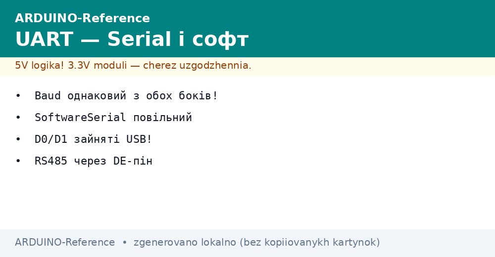
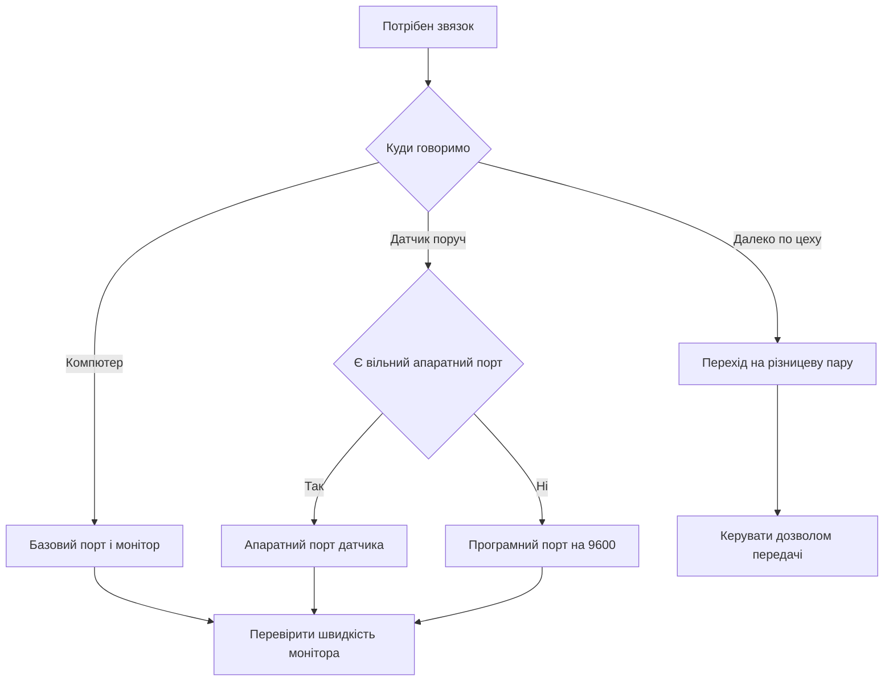

# UART Arduino - Serial і софт-порт


*Рис. Лінії прийому і передачі, спільна земля, міст USB і підключення датчика.*

> [!tip] Призначення ноти
> Пояснити послідовний звязок від нуля до моста USB-датчик: як відкрити порт, вибрати швидкість, не заважати лінії прошивки і коли брати програмний порт або перехід на довгу лінію.

## 1. Призначення

Послідовний порт є головним каналом розмови плати з компютером і з простими модулями.

Через нього йде прошивка, вивід повідомлень для налагодження, читання датчиків з послідовним виходом і керування виконавчими модулями.

Базовий порт на малих платах один і він спільний з перетворювачем USB, тому важливо розуміти його обмеження.

Програмний порт дає другий канал на звичайних цифрових пінах, але працює повільніше і з обмеженнями.

Старші плати мають кілька апаратних портів, а для довгих ліній застосовують перехід на різницеву пару через керуючий вихід.

Ця нота збирає все разом: функції бібліотеки, швидкості, конфлікт з прошивкою, програмний порт, додаткові порти великих плат і вихід у довгу лінію.

Звязок з [класичний AVR](../../../ARDUINO-Reference/01-Hardware/01-AVR-Uno.md) показує, де фізично стоять виводи нуль і один.

Огляд [компакт і ноги](../../../ARDUINO-Reference/01-Hardware/02-Nano-Mega.md) допомагає знайти ті ж лінії на малому і великому корпусі.

Основи рівнів і режимів пінів описані у ноті [цифрові піни](../../../ARDUINO-Reference/03-GPIO/01-Digital-pini.md).

## 2. Що вміє базовий порт Serial

Базовий порт відкривають один раз на старті, далі читають і пишуть байти у циклі.

| Функція | Що робить | Коли викликати |
| --- | --- | --- |
| Serial begin | Вмикає порт на заданій швидкості | У блоці налаштування один раз |
| Serial available | Повертає кількість байтів у буфері | Перед кожним читанням |
| Serial read | Забирає один байт з буфера | Коли буфер не порожній |
| Serial peek | Дивиться байт без забирання | Для перегляду заголовка пакета |
| Serial write | Пише сирі байти | Для двійкових протоколів |
| Serial print | Пише текст і числа | Для повідомлень людині |
| Serial println | Пише рядок з кінцем рядка | Для рядків у монітор порту |
| Serial flush | Чекає завершення передачі | Перед сном або зміною швидкості |

Буфер прийому має обмежений обсяг, тому читати треба регулярно і не тримати довгі паузи у головному циклі.

Надсилання тексту зручне для налагодження, а для датчика краще двійковий пакет з контрольною сумою.

Швидкість обох боків має збігатися, інакше замість букв буде сміття.

```text
Перехрещення ліній UART між двома пристроями:

  Плата А            Плата Б
  ------             ------
  TX  --------------> RX
  RX  <-------------- TX
  GND -------------- GND

  Правило перехрещення:
  передача одного йде на прийом іншого,
  земля завжди спільна,
  живлення не зєднувати без потреби.
```

До плати [класичний AVR](../../../ARDUINO-Reference/01-Hardware/01-AVR-Uno.md) порт підключений через міст USB, тому монітор порту бачить саме його.

## 3. Швидкості і бодрейти

Швидкість вимірюють у бодах, тобто у бітах за секунду з урахуванням стартових і стопових бітів.

| Швидкість | Призначення | Зауваження |
| --- | --- | --- |
| 4800 | Повільні датчики погоди | Стійкий до перешкод |
| 9600 | Класика для модулів звʼязку | Типовий вибір для початку |
| 19200 | Компроміс швидкості і дальності | Добре для довгого дроту |
| 38400 | Швидкі датчики відстані | Потребує короткого дроту |
| 57600 | Проміжний режим | Рідко дає виграш |
| 115200 | Монітор порту і налагодження | Стандарт для виводу тексту |

Починати варто з 9600, а піднімати лише коли видно, що потік даних не встигає.

Кварц на 16 МГц дає малу похибку на стандартних швидкостях, тому звязок стабільний.

Дуже висока швидкість на довгому дроті дає помилки, бо фронти згладжуються ємністю лінії.

Після зміни швидкості треба перезапустити монітор порту на тій самій швидкості.

Окремий вибір швидкості для програмного порту завжди нижчий, бо він менш точний.

## 4. Піни нуль і один зайняті мостом USB

На малих платах лінії прийому і передачі виведені на цифрові гнізда нуль і один.

Ті ж лінії йдуть до мікросхеми моста USB, тому компютер бачить їх як віртуальний порт.

| Ситуація | Що відбувається | Що робити |
| --- | --- | --- |
| Прошивка через USB | Міст керує лініями і скиданням | Звільнити гнізда нуль і один |
| Монітор порту відкритий | Текст з плати йде у компютер | Не підключати датчик до тих самих гнізд |
| Датчик на пінах нуль і один | Боротьба двох передавачів | Перенести датчик на програмний порт |
| Довгі перемички на лініях | Зрив завантаження | Зняти перемички на час прошивки |
| Живлення датчика від плати | Додатковий струм через гребінку | Перевірити запас струму |

Правило просте: під час заливання прошивки знімати все з пінів нуль і один.

Після прошивки можна повернути дроти назад і працювати з датчиком.

Для постійної роботи датчика краще одразу взяти інші піни і програмний порт.

```text
Конфлікт лінії прошивки і датчика:

  Варіант поганий:
  USB-міст ---+--- TX --- датчик (обидва говорять)
              |
  RX ---------+--- датчик (обидва слухають)

  Варіант добрий на час прошивки:
  USB-міст --- TX/RX вільні, датчик знятий
  прошивка йде чисто, помилок нема

  Варіант добрий для роботи:
  USB-міст --- TX/RX до компютера
  датчик --- програмний порт на інших ніжках
```

## 5. Програмний порт SoftwareSerial

Бібліотека програмного порту вміє приймати і передавати на майже довільних цифрових пінах.

Працює за рахунок точного відліку часу процесором, тому їсть час і гірше тримає високу швидкість.

| Параметр | Апаратний порт | Програмний порт |
| --- | --- | --- |
| Точність часу | Кварцова, висока | Залежить від завантаження |
| Швидкість | До 115200 і вище | Надійно 9600, межа 38400 |
| Прийом і передача разом | Так | З обмеженнями |
| Кількість портів | Залежить від чипа | Один активний приймач |
| Переривання | Не заважає | Вимикає інші бібліотеки на час байта |
| Піни | Фіксовані нуль і один | Довільні цифрові |

Обмеження пінів залежать від плати: на малих платах не всі піни вміють працювати на прийом зі зміною стану.

Передавати можна з довільної цифрової піни, а для прийому брати перевірені номери з документації бібліотеки.

Одночасно слухати можна лише один програмний порт, решта чекає своєї черги.

Для повільних модулів цього досить, а для швидкого потоку треба апаратний порт.

```cpp
#include <SoftwareSerial.h>

SoftwareSerial softPort(10, 11);

void setup() {
  Serial.begin(9600);
  softPort.begin(9600);
  Serial.println("Micт готовий");
}

void loop() {
  if (softPort.available()) {
    char c = (char)softPort.read();
    Serial.write(c);
  }
  if (Serial.available()) {
    char c = (char)Serial.read();
    softPort.write(c);
  }
}
```

Код вище будує простий міст: все з датчика йде у компютер, все з компютера йде у датчик.

Швидкість 9600 вибрана свідомо, бо програмний порт на ній найстабільніший.

Піни десять і одинадцять взяті як перевірена пара для прийому і передачі.

Рядок привітання допомагає зрозуміти, що плата перезапустилась.

## 6. Додаткові порти на великих платах

Велика плата має чотири апаратні порти, тому міст для датчика роблять без програмної бібліотеки.

| Порт | Піни на великій платі | Призначення |
| --- | --- | --- |
| Serial | Нуль і один через USB | Компютер і налагодження |
| Serial1 | Девʼятнадцять і вісімнадцять | Перший датчик |
| Serial2 | Сімнадцять і шістнадцять | Другий датчик |
| Serial3 | Пʼятнадцять і чотирнадцять | Третій датчик або модуль звʼязку |

Кожен порт має свій буфер, тому всі чотири працюють незалежно і на повній швидкості.

Відкриття кожного порту роблять окремим викликом begin з потрібною швидкістю.

Міст між компютером і датчиком тоді пишеться тими самими двома рядками, але без програмної бібліотеки.

Велика плата зручна для шлюзів: один порт слухає датчик, другий віддає дані далі.

Докладну карту пінів дивись у ноті [компакт і ноги](../../../ARDUINO-Reference/01-Hardware/02-Nano-Mega.md).

## 7. Вихід у довгу лінію RS485 через керуючий вихід

Звичайний порт працює на короткій відстані, а для цеху і теплиці беруть різницеву пару.

Модуль перетворювача має входи прийому і передачі плюс керуючий вхід дозволу передачі.

| Сигнал | Куди йде | Сенс |
| --- | --- | --- |
| RO | На вхід прийому плати | Дані з лінії |
| DI | На вихід передачі плати | Дані у лінію |
| DE | На вільну цифрову пін | Дозвіл передачі |
| RE | На землю або на той же дозвіл | Дозвіл прийому |
| A і B | Вита пара у лінію | Різницевий сигнал |

Перед передачею піднімають керуючу пін, після останнього байта чекають завершення і опускають її.

Прийом йде при опущеній керуючій піні, тоді модуль слухає лінію.

На кінцях довгої лінії ставлять узгоджувальні резистори, щоб прибрати відбиття.

Живлення модулів беруть з місцевого джерела, а землі зєднують або розв'язують за схемою модуля.

```cpp
const int DE_PIN = 4;

void setup() {
  Serial.begin(9600);
  pinMode(DE_PIN, OUTPUT);
  digitalWrite(DE_PIN, LOW);
}

void sendPacket(const char *msg) {
  digitalWrite(DE_PIN, HIGH);
  delay(2);
  Serial.print(msg);
  Serial.flush();
  delay(2);
  digitalWrite(DE_PIN, LOW);
}

void loop() {
  sendPacket("TEMP?");
  delay(1000);
}
```

Паузи по два мілісекундні інтервали дають модулю час перемкнути напрям.

Виклик flush чекає, поки останній біт покине регістр передавача.

Без такого очікування керуюча пін опуститься рано і хвіст пакета загубиться.

## 8. Mermaid: вибір шляху



Схема читається згори вниз: спочатку адресат, потім наявність вільного порту, потім перевірка швидкості.

Для датчика поруч вистачає звичайних рівнів, для цеху беруть різницеву пару.

Програмний порт завжди ставлять на малу швидкість, щоб не ловити помилки.

## Типові помилки

| # | Помилка | Чому погано | Як правильно |
| --- | --- | --- | --- |
| 1 | Датчик висить на пінах нуль і один під час прошивки | Міст і датчик сперечаються за лінію | Знімати дроти з нуля і одиниці на час заливання |
| 2 | Різні швидкості плати і монітора | Замість тексту сміття | Виставити однакову швидкість з обох боків |
| 3 | Програмний порт на 115200 | Процесор не встигає, байти бються | Тримати 9600, межа 38400 на короткому дроті |
| 4 | Два програмні порти слухають разом | Активний лише один приймач | Слухати по черзі або брати велику плату |
| 5 | Керуюча пін RS485 падає до кінця байта | Хвіст пакета ріжеться | Чекати flush і малу паузу перед скиданням |
| 6 | Немає спільної землі між платами | Плаваючий нуль дає помилки | Зєднати землі, живлення за схемою модуля |

## Офіційні джерела

- [Serial на docs.arduino.cc](https://docs.arduino.cc/language-reference/en/functions/communication/serial/) - функції порту, швидкості, приклади читання і запису.
- [SoftwareSerial на arduino.cc](https://www.arduino.cc/en/Reference/SoftwareSerial) - обмеження пінів, швидкості, приклад моста між портами.

## Див. також

- [Home](../../../ARDUINO-Reference/Home.md)
- [класичний AVR](../../../ARDUINO-Reference/01-Hardware/01-AVR-Uno.md)
- [компакт і ноги](../../../ARDUINO-Reference/01-Hardware/02-Nano-Mega.md)
- [цифрові піни](../../../ARDUINO-Reference/03-GPIO/01-Digital-pini.md)
- [швидка шина](../../../ARDUINO-Reference/04-Shini/02-SPI.md)
- [шина двох дротів](../../../ARDUINO-Reference/04-Shini/03-I2C-Wire.md)
