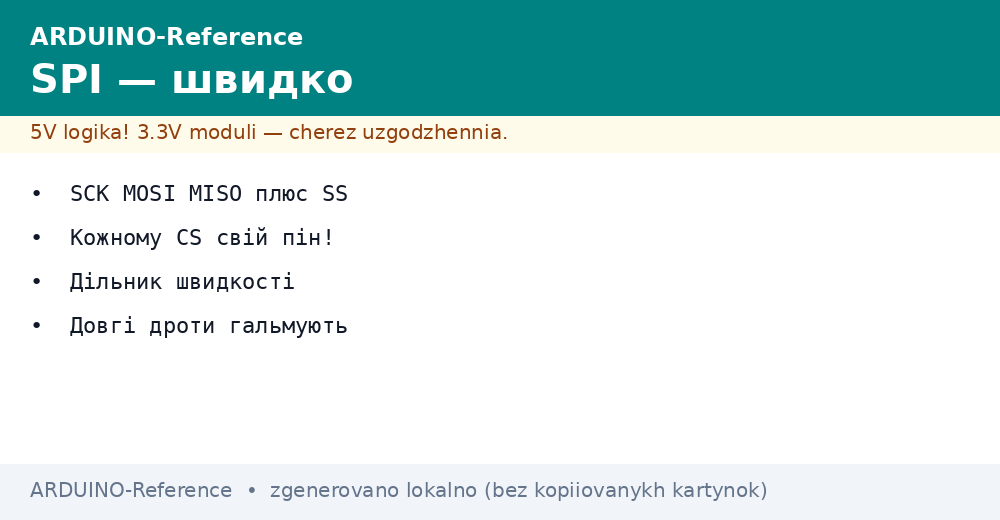
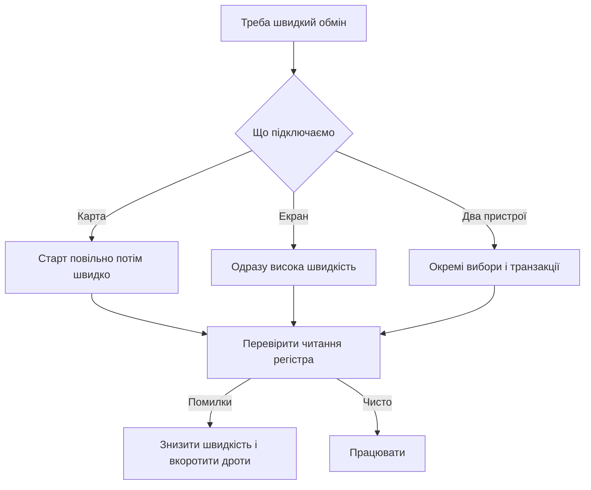

# SPI Arduino - швидко і просто


*Рис. Чотири лінії шини, окремі вибори підлеглих, карта памяті і екран.*

> [!tip] Призначення ноти
> Дати швидку шину без страху: які лінії за що відповідають, як вибрати швидкість, як розвести вибір підлеглих і як підключити карту памяті та екран.

## 1. Призначення

Шина швидкого обміну зєднує плату з картою памяті, екраном, перетворювачем і радіомодулем.

Головний задає такти, підлеглий відповідає у своєму вікні, вибір пристрою йде окремою лінією.

Швидкість тут на порядки вища за повільні шини, тому малюнки і файли йдуть без затримок.

Ліній небагато, але кожна має свою роль, і плутанина між ними дає тишу на шині.

Ця нота показує карту сигналів, запуск бібліотеки, вибір швидкості, розведення вибору і два живі приклади.

Базу про корпуси і гребінки дивись у ноті [класичний AVR](../../../ARDUINO-Reference/01-Hardware/01-AVR-Uno.md).

Порівняння малих і великих плат є у ноті [компакт і ноги](../../../ARDUINO-Reference/01-Hardware/02-Nano-Mega.md).

Режими пінів і струми описані у ноті [цифрові піни](../../../ARDUINO-Reference/03-GPIO/01-Digital-pini.md).

## 2. Чотири сигнали шини

| Сигнал | Напрям від головного | Сенс |
| --- | --- | --- |
| SCK | Вихід тактів | Ритм обміну, кожен біт під фронт |
| MOSI | Вихід даних | Потік від головного до підлеглого |
| MISO | Вхід даних | Потік від підлеглого до головного |
| SS | Вихід вибору | Низький рівень відкриває пристрій |

Головний завжди керує тактами, підлеглий ніколи не починає розмову сам.

Лінії даних перехрещуються правильно: вихід одного йде на вхід іншого.

Лінія вибору для кожного підлеглого окрема, решта ліній спільні для всіх.

У спокої вибір тримають високим, перед обміном опускають, після обміну піднімають.

Невикористані входи не лишають висіти, щоб не ловити шум.

```text
Зєднання одного підлеглого:

  Головний              Підлеглий
  --------              ---------
  SCK  ----------------> SCK
  MOSI ----------------> MOSI
  MISO <---------------- MISO
  SS   ----------------> CS
  GND  ---------------- GND

  Правило:
  три лінії спільні,
  вибір окремий на кожен пристрій.
```

## 3. Піни на малих і великих платах

Номери ліній залежать від плати, тому звірятися треба з картою конкретної моделі.

| Плата | MOSI | MISO | SCK | SS за змовчуванням |
| --- | --- | --- | --- | --- |
| Мала класична | Одинадцять | Дванадцять | Тринадцять | Десять |
| Мала компактна | Одинадцять | Дванадцять | Тринадцять | Десять |
| Велика | Пʼятдесят один | Пʼятдесят | Пʼятдесят два | Пʼятдесят три |
| Розʼєм ICSP | Четвертий контакт | Перший контакт | Третій контакт | Окрема пін |

На малих платах швидкі лінії сидять на цифровій гребінці десять тринадцять.

На великій платі ті ж сигнали виведені на окрему групу пятьдесят пʼятдесят три.

Розʼєм програмування дублює три лінії, що зручно для шилдів.

Пін вибору за змовчуванням має лишатися виходом, інакше апаратний блок переходить у режим підлеглого.

Додаткові вибори для другого і третього пристрою беруть з вільних цифрових пінів.

## 4. Запуск бібліотеки і обмін

| Виклик | Що робить | Коли потрібен |
| --- | --- | --- |
| SPI begin | Вмикає блок і ставить піни | Один раз на старті |
| SPI beginTransaction | Ставить швидкість і режим | Перед кожним обміном з пристроєм |
| SPI transfer | Міняє один байт | Для регістрів і команд |
| SPI transfer16 | Міняє два байти | Для швидких потоків |
| SPI endTransaction | Відпускає шину | Після підняття вибору |
| SPI end | Вимикає блок | Рідко, для сну |

Режим задає полярність тактів і фронт вибірки, його беруть з опису мікросхеми підлеглого.

Порядок бітів зазвичай старший уперед, молодший уперед ставлять лише за вимогою опису.

Швидкість ставлять не вище межі підлеглого, інакше відповідь буде битою.

```text
Послідовність обміну з одним пристроєм:

  1. Опустити вибір пристрою у низький рівень.
  2. Почати транзакцію з потрібною швидкістю.
  3. Обміняти байти командами transfer.
  4. Завершити транзакцію.
  5. Підняти вибір у високий рівень.
  6. Дати пристрою час на обробку.
```

Початок транзакції перед опусканням вибору або після нього залежить від бібліотеки пристрою, приклад дивляться у ній.

Для двох різних пристроїв роблять дві транзакції з різними швидкостями.

## 5. Швидкість і дільники

Швидкість шини ділять від тактів процесора, тому значення виходять круглими ступенями.

| Дільник | Швидкість при 16 МГц | Для чого |
| --- | --- | --- |
| Два | Вісім мегабіт за секунду | Короткі доріжки екрана |
| Чотири | Чотири мегабіти за секунду | Типовий швидкий режим |
| Шістнадцять | Один мегабіт за секунду | Карта памяті на старті |
| Шістдесят чотири | Двісті пятьдесят кілобіт за секунду | Довгі дроти на макеті |
| Сто двадцять вісім | Сто двадцять пять кілобіт за секунду | Перший запуск невідомого модуля |

Починати варто з одного мегабіта, далі піднімати поки обмін чистий.

Карту памяті завжди стартують повільно, а після узгодження піднімають темп.

Екран любить високу швидкість, бо кадр великий і кожен зайвий мегабіт видно оком.

Довгі дроти на макеті змушують знижувати темп, і це нормально.

Перевірка проста: читають відомий регістр пристрою і дивляться стабільність відповіді.

## 6. Кожному вибору свій пін

Спільні лінії розходяться до всіх пристроїв, а вибір йде окремою доріжкою до кожного.

| Пристрій | Лінія вибору | Рівень спокою |
| --- | --- | --- |
| Карта памяті | Пін чотири | Високий |
| Екран | Пін сім | Високий |
| Радіомодуль | Пін вісім | Високий |
| Перетворювач | Пін девять | Високий |

Перед зверненням до пристрою опускають лише його вибір, решта лишається високою.

Забутий високий рівень на сусіді дає боротьбу двох виходів на спільному вході.

Всі вибори на старті ставлять у високий рівень і роблять виходами.

У бібліотеках пристроїв номер вибору передають у конструктор або у виклик початку.

```text
Розведення вибору на три пристрої:

  SCK  ----+------+------+------+
            |      |      |      |
  MOSI ----+------+------+------+
            |      |      |      |
  MISO ----+------+------+------+
            |      |      |      |
  CS карта -+      |      |      4
  CS екран  -------+      |      7
  CS радіо  --------------+      8

  Спільні лінії йдуть шлейфом,
  вибір окремим дротом до кожного.
```

## 7. Приклад з картою памяті

Карта памяті через швидку шину дає журнали, налаштування і файли для екрана.

```cpp
#include <SPI.h>
#include <SD.h>

const int CHIP_SELECT = 4;

void setup() {
  Serial.begin(9600);
  pinMode(10, OUTPUT);
  digitalWrite(CHIP_SELECT, HIGH);
  Serial.println("Старт карти");
  if (!SD.begin(CHIP_SELECT)) {
    Serial.println("Карту не знайдено");
    return;
  }
  Serial.println("Карта готова");
}

void loop() {
  File f = SD.open("log.txt", FILE_WRITE);
  if (f) {
    f.println("Запис журналу");
    f.close();
    Serial.println("Записано рядок");
  }
  delay(2000);
}
```

Пін десять лишається виходом, щоб блок не пішов у режим підлеглого.

Карту форматують у звичайну файлову систему, імя файла роблять коротким.

Живлення карти беруть стабільне, бо провал у момент запису бє файлову систему.

Для перевірки спочатку читають список файлів, потім пишуть новий рядок.

## 8. Приклад з екраном

Графічний екран приймає команди і потік пікселів тією самою шиною.

```cpp
#include <SPI.h>

const int CS_DISP = 7;
const int DC_PIN = 6;
const int RST_PIN = 5;

void dispCmd(uint8_t c) {
  digitalWrite(DC_PIN, LOW);
  digitalWrite(CS_DISP, LOW);
  SPI.transfer(c);
  digitalWrite(CS_DISP, HIGH);
}

void dispData(uint8_t d) {
  digitalWrite(DC_PIN, HIGH);
  digitalWrite(CS_DISP, LOW);
  SPI.transfer(d);
  digitalWrite(CS_DISP, HIGH);
}

void setup() {
  pinMode(CS_DISP, OUTPUT);
  pinMode(DC_PIN, OUTPUT);
  pinMode(RST_PIN, OUTPUT);
  digitalWrite(CS_DISP, HIGH);
  SPI.begin();
  SPI.beginTransaction(SPISettings(8000000, MSBFIRST, SPI_MODE0));
  digitalWrite(RST_PIN, LOW);
  delay(10);
  digitalWrite(RST_PIN, HIGH);
  delay(120);
  dispCmd(0x11);
  delay(120);
}

void loop() {
  dispCmd(0x2C);
  for (int i = 0; i < 100; i++) {
    dispData((uint8_t)i);
  }
  delay(500);
}
```

Сигнал даних і команд перемикає сенс байта: команда керує, дані малюють.

Скидання тримають коротким імпульсом, далі чекають виходу екрана з сну.

Швидкість вісім мегабіт дає плавне оновлення, на макеті її знижують.

Якщо зображення сиплеться, першим кроком ріжуть швидкість удвічі.

## 9. Довгі дроти гальмують

Швидка шина любить короткі доріжки і спільну землю поруч з сигналами.

| Довжина | Що буде | Що робити |
| --- | --- | --- |
| До десяти сантиметрів | Повна швидкість | Шлейф без петель |
| До тридцяти сантиметрів | Поодинокі збої на максимумі | Знизити до чотирьох мегабіт |
| До метра | Часті помилки | Знизити до одного мегабіта, взяти кручену пару |
| Більше метра | Шина не працює | Перенести пристрій ближче або взяти іншу шину |

Дроти тактів і даних не кладуть петлями поруч з силовими кабелями.

Землю ведуть окремим товстим дротом, а не тонкою перемичкою через всю макетку.

На макеті з довгими перемичками швидкість завжди ставлять нижчу за паспортну.

Для віддалених вузлів краще повільна двопровідна шина або різницева пара.

## 10. Mermaid: налаштування шини



Схема читається згори вниз: вибір пристрою визначає стартову швидкість, перевірка визначає робочу.

Карта стартує повільно через вимоги контролера памяті.

Екран стартує швидко, бо кадр великий.

## Типові помилки

| # | Помилка | Чому погано | Як правильно |
| --- | --- | --- | --- |
| 1 | Спільний вибір на два пристрої | Обидва відповідають разом | Кожному пристрою своя пін вибору |
| 2 | Пін десять як вхід на головному | Блок падає у режим підлеглого | Тримати десяту пін виходом |
| 3 | Максимальна швидкість на довгих перемичках | Бите читання і зависання | Починати з одного мегабіта і піднімати поступово |
| 4 | Немає транзакцій для різних режимів | Пристрої збивають налаштування одне одного | Огортати кожен обмін своєю транзакцією |
| 5 | Живлення карти від слабкого виходу | Запис рве файлову систему | Окреме стабільне живлення, спільна земля |
| 6 | Довгий шлейф поруч з мотором | Наводки бють такти | Короткий шлейф, земля поруч, силові кабелі окремо |

## Офіційні джерела

- [SPI на docs.arduino.cc](https://docs.arduino.cc/language-reference/en/functions/communication/spi/) - запуск шини, транзакції, режими і приклади обміну.
- [Бібліотека SD на arduino.cc](https://www.arduino.cc/en/Reference/SD) - робота з картою памяті, файли, приклад журналу.

## Див. також

- [Home](../../../ARDUINO-Reference/Home.md)
- [класичний AVR](../../../ARDUINO-Reference/01-Hardware/01-AVR-Uno.md)
- [компакт і ноги](../../../ARDUINO-Reference/01-Hardware/02-Nano-Mega.md)
- [цифрові піни](../../../ARDUINO-Reference/03-GPIO/01-Digital-pini.md)
- [послідовний порт](../../../ARDUINO-Reference/04-Shini/01-UART.md)
- [шина двох дротів](../../../ARDUINO-Reference/04-Shini/03-I2C-Wire.md)
