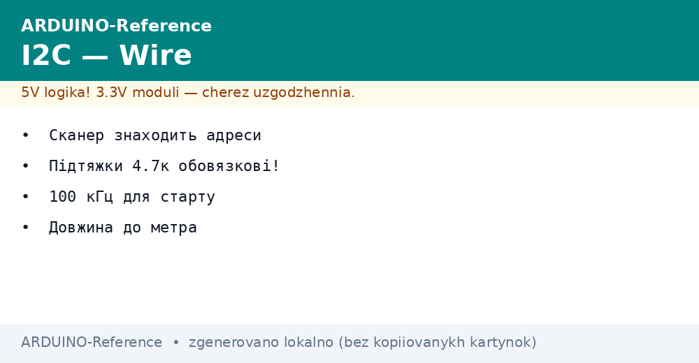
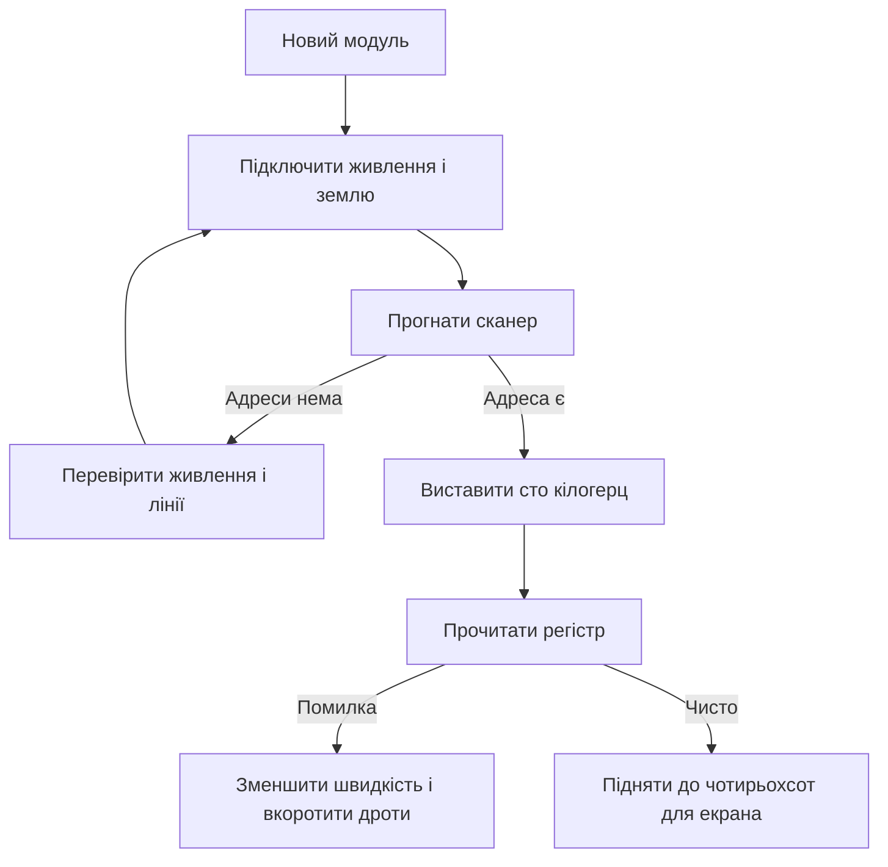

# I2C Arduino - бібліотека Wire


*Рис. Дві лінії шини, підтяжки до живлення, адреси підлеглих і сканер.*

> [!tip] Призначення ноти
> Навчити двопровідній шині без магії: як відкрити бібліотеку, знайти адресу сканером, підібрати підтяжки і швидкість та витягти шину із зависання.

## 1. Призначення

Двопровідна шина зєднує плату з датчиками, екранами, годинником і розширювачами виходів.

Потрібні лише дві лінії: дані і такти, а вибір пристрою йде адресою у кожному пакеті.

На одну пару можна посадити багато підлеглих, кожен відгукується лише на свою адресу.

Бібліотека Wire ховає складну часову діаграму за кількома простими викликами.

Ця нота дає карту пінів, базові виклики, сканер адрес, підтяжки, швидкості, лікування зависань і межі довжини.

Фізичні піни малих плат дивись у ноті [класичний AVR](../../../ARDUINO-Reference/01-Hardware/01-AVR-Uno.md).

Порівняння корпусів є у ноті [компакт і ноги](../../../ARDUINO-Reference/01-Hardware/02-Nano-Mega.md).

Режими входів і виходів описані у ноті [цифрові піни](../../../ARDUINO-Reference/03-GPIO/01-Digital-pini.md).

## 2. Базові виклики бібліотеки Wire

| Виклик | Що робить | Типовий приклад |
| --- | --- | --- |
| Wire begin | Вмикає шину як головну | Без адреси на старті |
| Wire begin адреса | Вмикає шину як підлеглу | Для звʼязки двох плат |
| Wire beginTransmission | Починає пакет до адреси | Адреса з семи бітів |
| Wire write | Кладе байт у буфер пакета | Номер регістра, дані |
| Wire endTransmission | Відправляє пакет у лінію | Повертає код результату |
| Wire requestFrom | Просить байти у підлеглого | Адреса і кількість |
| Wire available | Кількість прийнятих байтів | Перед читанням |
| Wire read | Забирає один прийнятий байт | У циклі читання |
| Wire setClock | Ставить частоту тактів | Після запуску шини |

Передача завжди йде парою: почати пакет, покласти байти, завершити відправлення.

Прийом йде запитом: попросити кількість байтів, дочекатися, забрати по одному.

Код завершення передачі показує, чи відгукнувся підлеглий, його завжди перевіряють.

Буфер бібліотеки має межу у тридцять два байти, довгі пакети ріжуть на частини.

```text
Обмін з регістром датчика:

  Запис у регістр:
  початок до адреси -> номер регістра -> дані -> кінець

  Читання з регістра:
  початок до адреси -> номер регістра -> кінець
  запит байтів -> читання відповіді по одному

  Правило:
  кожен початок має кінець,
  кожен запит має перевірку кількості.
```

## 3. Піни даних і тактів

Лінії шини мають фіксовані номери і привʼязані до апаратного блоку.

| Плата | SDA дані | SCL такти | Зауваження |
| --- | --- | --- | --- |
| Мала класична | А чотири | А пять | Аналогова гребінка |
| Мала компактна | А чотири | А пять | Ті ж номери |
| Велика | Двадцять | Двадцять один | Окрема цифрова група |
| Сучасна з окремими виводами | Позначка SDA | Позначка SCL | Дубльовані гнізда біля гребінки |

На малих платах шина сидить на аналогових входах чотири і пять, це часта несподіванка для новачків.

Ті ж піни можуть працювати як аналогові входи, коли шина не запущена.

На великій платі шина виведена на цифрові гнізда двадцять і двадцять один.

Окремі плати мають дублі на виділених гніздах, вони з'єднані з тими самими лініями.

Плутанина пінів дає повну тишу: сканер не бачить жодної адреси.

## 4. Адреси з семи бітів

Кожен підлеглий має адресу з семи бітів, вона йде першою після старту.

| Тема | Сенс | Практика |
| --- | --- | --- |
| Діапазон | Від нуля до ста двадцяти семи | Службові адреси не брати |
| Запис і читання | Восьмий біт безпосередньо | Бібліотека ставить сама |
| Перемички адреси | Зміна молодших бітів | Дозволяє кілька однакових модулів |
| Конфлікт адрес | Два модулі з однією адресою | Міняти перемички або брати інший модуль |
| Невідома адреса | Опис загублено | Гнати сканер і дивитися відповідь |

Адресу пишуть у семибитному вигляді, зсувати її вліво не треба, бібліотека зробить сама.

Поширена помилка: брати адресу з опису у восьмибитному вигляді і дивуватися мовчанці.

Якщо на шині два однакові модулі без перемичок, вони відповідають разом і псують обмін.

Екран і датчик часто мають різні адреси з коробки, тому живуть поруч без сварок.

Сканер адрес знімає всі питання за кілька секунд.

## 5. Сканер шини

Сканер проходить усі адреси і показує ті, що відгукнулися.

```cpp
#include <Wire.h>

void setup() {
  Serial.begin(9600);
  Wire.begin();
  Serial.println("Сканер стартував");
  for (int addr = 1; addr < 127; addr++) {
    Wire.beginTransmission(addr);
    int res = Wire.endTransmission();
    if (res == 0) {
      Serial.print("Знайдено: 0x");
      Serial.println(addr, HEX);
    }
    delay(5);
  }
  Serial.println("Готово");
}

void loop() {
  delay(2000);
}
```

Код повертає нуль лише коли підлеглий підтвердив адресу.

Вивід у шістнадцятковому вигляді зручно звіряти з описом модуля.

Затримка між адресами дає шині час заспокоїтися.

Якщо сканер мовчить, перевіряють живлення модуля, землю і самі лінії.

Якщо сканер бачить не ту адресу, дивляться перемички на модулі.

```text
Підключення для сканування:

  Плата                 Модуль
  -----                 ------
  SDA (А чотири) ------> SDA
  SCL (А пять) --------> SCL
  5V ------------------> VCC (якщо модуль пять вольт)
  GND -----------------> GND

  Умови:
  підтяжки вже на модулі або зовнішні,
  загальна довжина коротка,
  живлення стабільне.
```

## 6. Підтяжки чотири цілих сім кілоом

Лінії шини мають відкритий стік, тому високий рівень створюють резистори до живлення.

| Ситуація | Значення | Коли брати |
| --- | --- | --- |
| Один модуль поруч | Чотири цілих сім кілоом | Типовий старт |
| Два три модулі | Чотири цілих сім кілоом | Лишити штатні на модулях |
| Багато модулів | Десять кілоом на кожному дають малий сумарний | Порахувати паралельний опір |
| Довга лінія | Два цілих два кілоом | Крутіші фронти |
| Пять вольт і три вольти разом | Узгоджувач рівнів | Без прямого зʼєднання |

Багато модулів уже мають підтяжки на платі, тоді зовнішні не ставлять.

Паралельне зʼєднання кількох комплектів дає малий сумарний опір і великий струм.

Занадто малий опір гріє виходи, занадто великий дає пологі фронти і помилки.

Для змішаних рівнів ставлять перетворювач рівнів, а не прямі дроти.

Перевірка проста: осцилограф або логічний аналізатор показує прямокутність тактів.

## 7. Швидкість сто і чотириста кілогерц

| Режим | Частота | Для чого |
| --- | --- | --- |
| Стандартний | Сто кілогерц | Датчики, годинник, надійний старт |
| Швидкий | Чотириста кілогерц | Екрани, памʼять, великий потік |
| Повільний | Пʼятдесят кілогерц | Довгі лінії і макетки |
| Дуже швидкий | Один мегагерц | Лише короткі доріжки і підтримка з обох боків |

За змовчуванням бібліотека стартує на ста кілогерцах, цього досить для більшості датчиків.

Екран переводять на чотириста кілогерц, щоб малювання не смикалося.

Довгу лінію завжди сповільнюють, бо ємність згладжує фронти.

Не всі підлеглі вміють швидкий режим, межу дивляться в описі мікросхеми.

Частоту ставлять викликом setClock після запуску шини.

```cpp
#include <Wire.h>

const int SENSOR_ADDR = 0x48;

void setup() {
  Serial.begin(9600);
  Wire.begin();
  Wire.setClock(100000);
  Serial.println("Шина на ста кілогерцах");
}

int readTemp() {
  Wire.beginTransmission(SENSOR_ADDR);
  Wire.write(0x00);
  if (Wire.endTransmission(false) != 0) {
    return -1000;
  }
  Wire.requestFrom(SENSOR_ADDR, 2);
  if (Wire.available() < 2) {
    return -1000;
  }
  int hi = Wire.read();
  int lo = Wire.read();
  return (hi << 8) | lo;
}

void loop() {
  int v = readTemp();
  Serial.println(v);
  delay(1000);
}
```

Повторний старт з прапорцем брехні тримає шину і економить час.

Перевірка кількості прийнятих байтів відсікає рвані пакети.

Значення мінус тисяча тут означає помилку звязку, а не мороз.

## 8. Зависання шини і скидання

Шина може зависнути, коли підлеглий тримає лінію даних у низькому рівні.

| Симптом | Причина | Лікування |
| --- | --- | --- |
| Сканер мовчить на всіх адресах | Немає живлення модуля | Перевірити живлення і землю |
| Шина стала після помилки | Підлеглий чекає кінець пакета | Програмне скидання шини |
| Один модуль вішає всіх | Бракований модуль або довгий шлейф | Вимкити підозрілий, вкоротити лінії |
| Помилки після нагріву | Слабкі підтяжки | Зменшити опір, вкоротити дроти |
| Годинник тягне дані вниз | Залипання автомата станів | Девʼять імпульсів тактів вручну |

Програмне скидання: перевести лінії у ручний режим, дати девять імпульсів на тактах, сформувати стоп.

Апаратне скидання: зняти живлення з модулів на секунду, перезапустити плату.

Сторожовий таймер у головному циклі не дає зависнути назавжди.

Довгі шлейфи з петлями прибирають першими, бо вони головне джерело збоїв.

```text
Ручне звільнення шини:

  1. Вимкнути бібліотеку Wire.
  2. Перевести SCL у вихід, SDA у вхід.
  3. Дати девять імпульсів на SCL.
  4. Перевірити, що SDA стала високою.
  5. Сформувати стоп: SDA вниз при високих тактах,
     потім SDA вгору при високих тактах.
  6. Знову запустити Wire.begin.
```

## 9. Довжина ліній

Двопровідна шина задумана для звʼязку всередині одного корпусу, а не між будинками.

| Довжина | Режим | Порада |
| --- | --- | --- |
| До тридцяти сантиметрів | Будь-який | Штатні підтяжки |
| До метра | Сто кілогерц | Кручена пара, земля поруч |
| До двох метрів | Пʼятдесят кілогерц | Менші підтяжки, екран |
| Більше пяти метрів | Не працює стабільно | Взяти різницеву пару або іншу шину |

Ємність довгого кабелю зʼїдає фронти, тому аналізатор показує трикутники замість прямокутників.

Живлення далеких модулів дають з місцевого джерела, а не тонким дротом через весь стіл.

Силові кабелі ведуть окремо від сигнальної пари.

Для вулиці і цеху беруть перехід на різницеву пару, а шину лишають локальною.

## 10. Mermaid: запуск пристрою



Схема читається згори вниз: спочатку живлення, потім пошук адреси, потім швидкість.

Без адреси зі сканера далі йти немає сенсу.

Швидкість піднімають лише після чистого читання на повільному режимі.

## Типові помилки

| # | Помилка | Чому погано | Як правильно |
| --- | --- | --- | --- |
| 1 | Лінії переплутані місцями | Сканер мовчить, обміну немає | Дані до даних, такти до тактів |
| 2 | Немає підтяжок до живлення | Лінії не піднімаються у високий рівень | Поставити чотири цілих сім кілоом або лишити штатні |
| 3 | Адреса у восьмибитному вигляді | Бібліотека зсуває двічі | Брати семибитну адресу зі сканера |
| 4 | Два модулі з однаковою адресою | Відповідають разом, пакети бються | Розвести перемичками або замінити модуль |
| 5 | Довгий кабель на чотирьохстах кілогерцах | Фронти згладжені, помилки | Знизити до ста або пятьдесяти кілогерц |
| 6 | Ігнорують код завершення передачі | Помилка ховається до великого збою | Перевіряти результат кожного пакета |

## Офіційні джерела

- [Wire на docs.arduino.cc](https://docs.arduino.cc/language-reference/en/functions/communication/wire/) - запуск шини, передача, запит, приклади сканера.
- [Довідник мови на arduino.cc](https://www.arduino.cc/reference/en/) - опис функцій, швидкості, приклади скетчів для датчиків.

## Див. також

- [Home](../../../ARDUINO-Reference/Home.md)
- [класичний AVR](../../../ARDUINO-Reference/01-Hardware/01-AVR-Uno.md)
- [компакт і ноги](../../../ARDUINO-Reference/01-Hardware/02-Nano-Mega.md)
- [цифрові піни](../../../ARDUINO-Reference/03-GPIO/01-Digital-pini.md)
- [послідовний порт](../../../ARDUINO-Reference/04-Shini/01-UART.md)
- [швидка шина](../../../ARDUINO-Reference/04-Shini/02-SPI.md)
