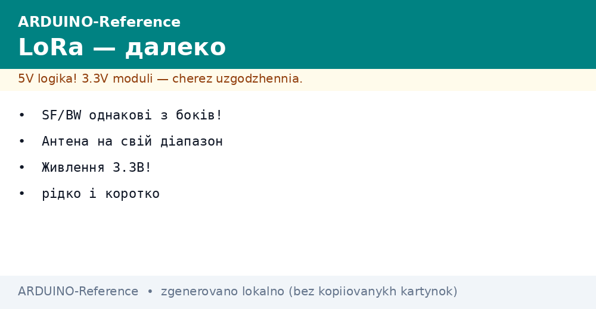
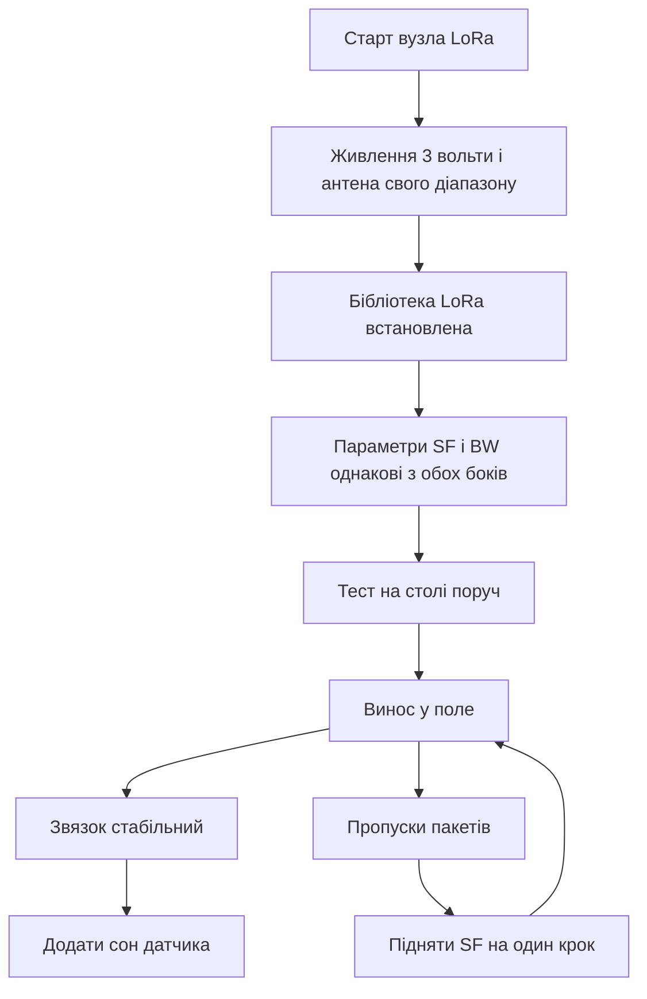

# LoRa-модулі на Arduino - кілометри


*Рис. Вузол LoRa на платі Ардуіно з антеною живленням три вольти і звязком по шині SPI.*

> [!tip] Призначення ноти
> Дати робочу схему далекого радіо на кілька кілометрів без стільникової мережі і без плати за трафік.

## 1. Призначення

Модулі LoRa потрібні там, де вайфай не дістає, а стільниковий звязок дорогий або відсутній. Поле, село, пасіка, метеостанція за містом, дачний кооператив, гаражний масив. Один вузол вимірює, другий приймає. Дальність на відкритій місцевості сягає кількох кілометрів навіть на маленькій потужності.

Основа далекобійності це розширений спектр з chirp модуляцією. Сигнал ховається нижче рівня шумів, але приймач його витягує за рахунок коефіцієнта розширення. Тому LoRa проходить там, де звичайне радіо вже мовчить. Плата за це це низька швидкість і довгий час в ефірі.

Для зв’язки з платою Ардуіно беруть готові модулі на чипах SX1278 або RFM95. Модуль це маленька плата з чипом, кварцом, узгодженням і виводом на антену. Керування йде по шині SPI, а відправка це запис пакета у буфер і команда передати.

Типова пара це датчик плюс база. Датчик спить, прокидається раз на хвилину, міряє температуру і вологість, відправляє короткий пакет, знову спить. База слухає ефір постійно і виводить прийняте у послідовний порт або на екран.

## 2. Які модулі брати

| Модуль | Чип | Діапазон | Потужність | Коли брати |
| --- | --- | --- | --- | --- |
| Модуль на SX1278 | SX1278 | 433 МГц | до 100 мВт | Село і поле, антени дешеві |
| Модуль RFM95 | SX1276 | 868 МГц | до 100 мВт | Місто, коротша антена |
| Плата з екраном | SX1276 | 868 МГц | до 100 мВт | Налагодження з екраном |
| Міні модуль | SX1278 | 433 МГц | до 100 мВт | Компактний датчик |

Головне правило це антена строго на свій діапазон. Антена на 433 МГц довша, на 868 МГц коротша. Чужа антена ріже дальність у рази і гріє вихідний каскад. Без антени передавач не вмикати взагалі.

Перед купівлею перевір дозволений діапазон у своїй країні. У Європі для коротких пакетів зазвичай використовують 868 МГц, у інших регіонах 433 МГц або 915 МГц. Модуль і антена мають збігатися.

## 3. Живлення три вольти

| Ланцюг | Напруга | Струм | Коментар |
| --- | --- | --- | --- |
| Живлення модуля | 3.3 В | до 120 мА в передачі | Від стабілізатора плати або окремого |
| Логіка SPI | 3.3 В | малий | Пять вольт не подавати |
| Сон модуля | 3.3 В | одиниці мікроампер | Датчик живе від батареї довго |
| Антена | пасивна | без живлення | Кріпити вертикально вгору |

Модулі LoRa живляться від трьох вольт. Плата Уно має вивід 3.3 В, але його струм обмежений. Якщо передача рветься або модуль перезапускається, додай окремий стабілізатор на 3.3 В і конденсатор 47 мкФ біля модуля.

Логічні входи модуля також розраховані на три вольти. Дільник або перетворювач рівнів на лініях до модуля бажаний. На практиці багато плат працюють прямо від виводів Ардуіно через резистори, але надійніше ставити узгодження.

```text
Живлення вузла LoRa:
  Плата Уно --5В--> окремий стабілізатор --3.3В--> VCC модуля
  GND спільна для плати і модуля товстим проводом
  Конденсатор 47 мкФ між VCC і GND біля самого модуля
  Антена вертикально, подалі від металу і проводів
  Довжина антени строго під діапазон модуля
```

## 4. Параметри ефіру мають збігатися

| Параметр | Що означає | Практика |
| --- | --- | --- |
| Частота | Несуча в МГц | Однакова з обох боків до кілогерца |
| Коефіцієнт розширення SF | Від 7 до 12 | Більше число далі бє і довше висить в ефірі |
| Смуга BW | 125 або 250 кГц | Однакова з обох боків |
| Кодова швидкість CR | 4/5 або 4/8 | Однакова з обох боків |
| Синхрослово | Маркер мережі | Однакове у своїй парі, чуже у сусідів |

Початківцям підходить звязка SF7 і смуга 125 кГц. Це швидко, ефір вільний, батареї вистачає надовго. Якщо не добиває, піднімай SF до 9 або 10. Кожен крок угору додає дальність, але подовжує пакет у повітрі.

Потужність став мінімальну достатню. Максимум потрібен лише на межі дальності. Велика потужність садить батарею і заважає сусідам по ефіру. Для столу вистачає мінімуму.

## 5. Підключення по SPI

| Сигнал модуля | Куди на Уно | Призначення |
| --- | --- | --- |
| VCC | 3.3 В | Живлення |
| GND | GND | Спільна земля |
| SCK | D13 | Такти шини |
| MISO | D12 | Дані від модуля |
| MOSI | D11 | Дані до модуля |
| NSS | D10 | Вибір модуля |
| DIO0 | D2 | Переривання прийому і передачі |
| RESET | D9 | Скидання модуля |

Шина SPI спільна для кількох пристроїв, але лінія NSS у кожного своя. Якщо на шині ще висить картка памяті або екран, розведи вибір окремими виводами. Землю веди коротко і товсто.

```text
ASCII схема пари:
  ДАТЧИК                          БАЗА
  Уно + SX1278 + антена  ~~~~~~  Уно + SX1278 + антена
    |                                       |
  сенсор DHT22                        компютер по USB
  живлення батарея                 живлення від USB

  Пакет: [адреса][температура][вологість][батарея][контрольна сума]
  Довжина пакета до 32 байт для надійності
```

## 6. Бібліотеки

Для старту вистачає бібліотеки LoRa від Семеонга. Вона проста, має приклади відправника і приймача. Для складних мереж беруть RadioHead з драйвером RF95. Там є адресація, підтвердження і повтори.

Встановлення через менеджер бібліотек у середовищі Ардуіно. Шукай за словом LoRa, став стабільну версію, відкрий приклад відправника. У прикладі зміни частоту під свій модуль і номер виводу NSS.

Перед першою передачею перевір пайку антени. Холодна пайка гнізда дає ту саму картину, що і чужа частота. Модуль наче працює, а дальність метри.

## 7. Скетч передавача

```cpp
#include <SPI.h>
#include <LoRa.h>

const int PIN_NSS = 10;
const int PIN_RST = 9;
const int PIN_DIO = 2;
unsigned long counter = 0;

void setup() {
  Serial.begin(9600);
  LoRa.setPins(PIN_NSS, PIN_RST, PIN_DIO);
  if (!LoRa.begin(433E6)) {
    Serial.println("LoRa no start");
    while (1) {}
  }
  LoRa.setSpreadingFactor(9);
  LoRa.setSignalBandwidth(125E3);
  LoRa.setCodingRate4(5);
  LoRa.setTxPower(14);
  Serial.println("TX ready");
}

void loop() {
  int temp = 23;
  int hum = 55;
  LoRa.beginPacket();
  LoRa.print("N1 T:");
  LoRa.print(temp);
  LoRa.print(" H:");
  LoRa.print(hum);
  LoRa.print(" C:");
  LoRa.print(counter);
  LoRa.endPacket();
  counter++;
  delay(5000);
}
```

Код ставить частоту 433 МГц, SF9, смугу 125 кГц. Потужність 14 дБм достатня для тестів у полі. Лічильник у пакеті показує пропуски на приймачі. Затримка пʼять секунд тримає ефір вільним.

## 8. Скетч приймача

```cpp
#include <SPI.h>
#include <LoRa.h>

const int PIN_NSS = 10;
const int PIN_RST = 9;
const int PIN_DIO = 2;

void setup() {
  Serial.begin(9600);
  LoRa.setPins(PIN_NSS, PIN_RST, PIN_DIO);
  if (!LoRa.begin(433E6)) {
    Serial.println("LoRa no start");
    while (1) {}
  }
  LoRa.setSpreadingFactor(9);
  LoRa.setSignalBandwidth(125E3);
  LoRa.setCodingRate4(5);
  Serial.println("RX ready");
}

void loop() {
  int size = LoRa.parsePacket();
  if (size) {
    Serial.print("Got: ");
    while (LoRa.available()) {
      Serial.print((char)LoRa.read());
    }
    Serial.print(" RSSI ");
    Serial.println(LoRa.packetRssi());
  }
}
```

Приймач друкує текст пакета і рівень сигналу RSSI. За рівнем видно запас. Якщо число гірше за мінус сто десять, піднімай антену вище або збільшуй SF. Пакети без адреси свого вузла відкидай програмно.

## 9. Антени і дальність

Квартальна штирьова антена з комплекту дає кілометр у полі і сотні метрів у місті. Винесення антени на щоглу подвоює результат без зміни електроніки. Металевий дах під антеною працює як екран і додає дальності.

Кабель між модулем і антеною має бути коротким. Довгий тонкий кабель зїдає весь виграш. Краще підняти весь вузол у гермобоксі, ніж тягнути метри кабелю.

Перевірка дальності робиться парою з лічильником. Один стоїть на місці, другий відходить і дивиться пропуски. Точка, де кожен другий пакет губиться, це межа. Робочу точку став з запасом у двічі.

## Mermaid: вибір параметрів



Схема читається зверху вниз. Спочатку живлення і антена, потім однакові параметри, потім тест поруч, потім поле. Пропуски лікуються підйомом SF, а не потужністю одразу.

## Типові помилки

| # | Помилка | Чому погано | Як правильно |
| --- | --- | --- | --- |
| 1 | Передача без антени | Гріється вихід і деградує чип | Спочатку антена, потім живлення |
| 2 | Антена на чужий діапазон | Дальність падає у рази | Маркування антени дорівнює частоті модуля |
| 3 | Різні SF або BW з боків | Приймач не бачить пакети взагалі | Один набір параметрів в обох скетчах |
| 4 | Живлення модуля від слабких 3.3 В плати | Просадки і перезапуски в передачі | Окремий стабілізатор і конденсатор 47 мкФ |
| 5 | Пять вольт на входи модуля | Деградація входів з часом | Резистивні подільники або перетворювач рівнів |
| 6 | Довгі пакети на SF12 | Ефір забитий, батареї вистачає ненадовго | Короткі пакети до 32 байт, SF мінімальний достатній |

## Офіційні джерела

- [LoRa library for Arduino (Sandeep Mistry)](https://github.com/sandeepmistry/arduino-LoRa) - приклади відправника і приймача, налаштування SF і BW.
- [RadioHead RF95 driver docs](https://www.airspayce.com/mikem/arduino/RadioHead/) - драйвер RF95, адресація і підтвердження пакетів.
- [SX1276 transceiver (Semtech)](https://www.semtech.com/products/wireless-rf/lora-connect/sx1276) - чип RFM95/RFM96, параметри і чутливість.

## Див. також

- [Home](../../../ARDUINO-Reference/Home.md)
- [радіомодуль](../../../ARDUINO-Reference/12-Moduli-zvyazku/01-NRF24.md)
- [стільниковий звязок](../../../ARDUINO-Reference/05-Radio/02-GSM-SIM800.md)
- [автономне живлення](../../../ARDUINO-Reference/02-Zhivlennya/02-Batareyki.md)
- [послідовний порт](../../../ARDUINO-Reference/04-Shini/01-UART.md)
- [класичний AVR](../../../ARDUINO-Reference/01-Hardware/01-AVR-Uno.md)
