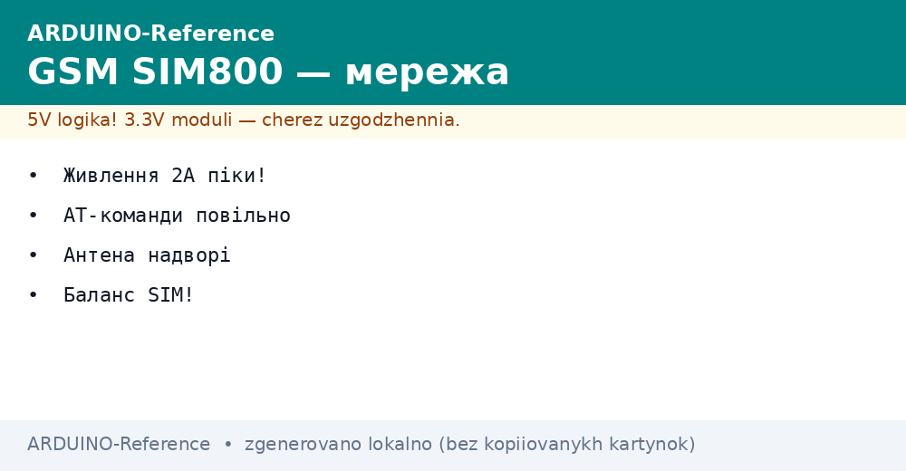
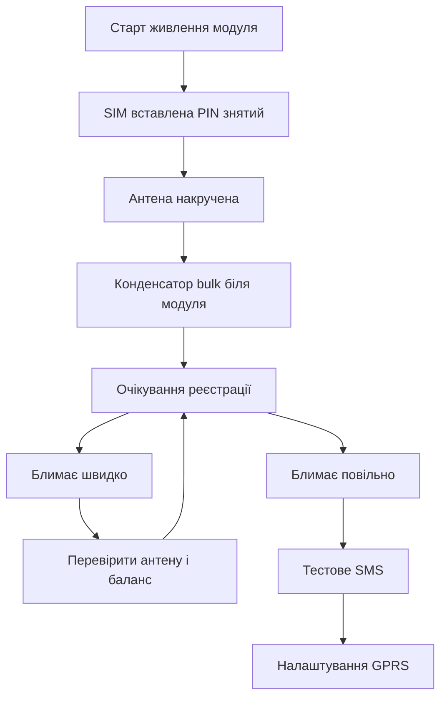

# SIM800 - SMS і інтернет з Arduino


*Рис. Модуль SIM800 з антеною і потужним живленням керується платою Ардуіно командами АТ.*

> [!warning] 2G-захід: оператори гасять 2G-мережі - SIM800 для підтримки старих вузлів; нові вироби проєктуйте на LTE-M/NB-IoT.
> [!tip] Призначення ноти
> Навчити підключати SIM800 без перезапусків, відправляти SMS тривоги і піднімати простий GPRS канал.

## 1. Призначення

Модуль SIM800 додає платі Ардуіно стільниковий звязок. Там, де LoRa не дістає до бази, а вайфай відсутній, виручає мобільна мережа. Датчик на дачі відправляє SMS про протікання, сигналізація дзвонить господарю, теплиця раз на годину шле дані на сервер через GPRS.

SIM800 це повноцінний телефон без екрана. У нього вставляється SIM картка, накручується антена, подається живлення. Плата Ардуіно спілкується з ним текстовими АТ командами по послідовному порту. Команда подзвонити, команда відправити SMS, команда відкрити інтернет сесію.

Головна складність модуля це живлення. У момент реєстрації в мережі і в передачі модуль бере піки до двох ампер. Слабкий блок живлення просаджується, модуль перезапускається, Ардуіно його знову ініціалізує, і коло повторюється без кінця. Тому живленню присвячено окремий розділ нижче.

## 2. Що потрібно для старту

| Позиція | Вимога | Коментар |
| --- | --- | --- |
| Модуль SIM800L або SIM800C | Плата з виводами живлення і UART | Беруть версію з тримачем SIM |
| SIM картка | Знятий PIN код, є баланс | PIN знімають у телефоні заздалегідь |
| Антена GSM | З комплекту на дроті | Без антени реєстрації немає |
| Блок живлення | 5 В з запасом 2 А | Зарядка телефону підходить |
| Конденсатор bulk | 470 або 1000 мкФ | Ставиться біля модуля |

Картку беруть того оператора, чия вежа ближча. Модуль працює у другому поколінні мереж, тому покриття перевіряють саме для голосового звязку, а не лише для швидкого інтернету. Тариф беруть з дешевими SMS і невеликим пакетом даних.

## 3. Живлення з піками два ампери

| Ланцюг | Напруга | Струм | Коментар |
| --- | --- | --- | --- |
| SIM800L | 3.7 або 4.2 В | піки до 2 А | Ідеально від літієвого акумулятора |
| SIM800C | 5 В через свій стабілізатор | піки до 2 А | Простіше для початківців |
| Ардуіно Уно | 5 В окремо | до 500 мА | Не живити модуль від виводу 5В плати |
| Bulk конденсатор | біля модуля | вирівнює піки | 470 мкФ мінімум, 1000 мкФ краще |

Правило просте. Модуль живиться окремим товстим дротом від блока, а не через плату Ардуіно. Землі зєднуються в одній точці біля блока. Конденсатор bulk паяється прямо на виводи живлення модуля. Світлодіод статусу підказує стан. Блимає раз на три секунди це реєстрація пройшла, блимає часто це пошук мережі.

```text
Живлення SIM800 без перезапусків:
  Блок 5В 2А --товстий плюс--> VCC модуля SIM800C
  Блок GND --товста земля--> GND модуля
  Конденсатор 1000 мкФ між VCC і GND біля модуля
  Ардуіно живиться окремо, GND спільна з модулем
  SIM800L живити від 4.2В або акумулятора 18650 через діод
```

Довгі тонкі дроти від макетної плати дають той же ефект, що і слабкий блок. Опір дротів садить напругу в піку. Тому дроти живлення короткі і товсті, а сигнальні можуть бути довгими.

## 4. Підключення до Ардуіно

| Сигнал SIM800 | Куди на Уно | Коментар |
| --- | --- | --- |
| VCC | Окремий блок | Не від плати |
| GND | GND плати і блока | Спільна земля обов'язкова |
| TX модуля | D10 через подільник | Прийом на програмному порту |
| RX модуля | D11 | Передача з плати |
| RST | D9 або не підключати | Скидання за потреби |
| Антена | Гніздо на модулі | Накрутити до вмикання |

Апаратний порт Уно зайнятий зв’язком з компютером, тому для модуля беруть програмний порт на бібліотеці SoftwareSerial. Швидкість ставлять 9600. Більше модуль теж вміє, але на довгих дротах саме 9600 найстабільніша.

Рівні модуля три вольти, тому лінію від Ардуіно до модуля бажано ослабити подільником з двох резисторів. Лінія від модуля до Ардуіно читається прямо. У багатьох збірках працює і безпосередньо в обидва боки, але подільник продовжує життя входу.

```text
ASCII схема звязків:
  Уно D11 TX ----> RX SIM800
  Уно D10 RX <---- TX SIM800 через подільник 10к і 20к
  GND Уно --------- GND SIM800 і GND блока живлення
  Антена GSM накручена, SIM вставлена до подачі живлення
  Світлодіод NET блимає повільно після реєстрації
```

## 5. АТ команди вручну

Перед автоматикою команди перевіряють вручну через монітор порту. Плата Ардуіно працює прозорим мостом між компютером і модулем. Набираєш команду, модуль відповідає.

| Команда | Дія | Очікувана відповідь |
| --- | --- | --- |
| AT | Перевірка звязку | OK |
| AT+CSQ | Рівень сигналу | Число від 10 до 31 добре |
| AT+CREG? | Реєстрація в мережі | 0,1 або 0,5 це успіх |
| ATD+380971234567; | Дзвінок | OK, у слухавці гудки |
| ATH | Покласти слухавку | OK |
| AT+CMGF=1 | Текстовий режим SMS | OK |
| AT+CMGS="+380971234567" | Початок SMS | Запит тексту після знаку більше |

Текст SMS закінчується комбінацією контрол Z. У моніторі порту її відправляють окремою кнопкою або кодом 26. Баланс перевіряють командою оператора, бо модуль сам гроші не рахує.

## 6. Скетч SMS сигналізації

```cpp
#include <SoftwareSerial.h>

SoftwareSerial gsm(10, 11);
const int PIN_SENSOR = 4;
const String PHONE = "+380971234567";
bool alarmSent = false;

void setup() {
  Serial.begin(9600);
  gsm.begin(9600);
  pinMode(PIN_SENSOR, INPUT_PULLUP);
  delay(3000);
  gsm.println("AT");
  delay(500);
  gsm.println("AT+CMGF=1");
  delay(500);
  Serial.println("GSM ready");
}

void sendSMS(String text) {
  gsm.print("AT+CMGS=\"");
  gsm.print(PHONE);
  gsm.println("\"");
  delay(1000);
  gsm.print(text);
  delay(500);
  gsm.write(26);
  delay(4000);
}

void loop() {
  int s = digitalRead(PIN_SENSOR);
  if (s == LOW && !alarmSent) {
    sendSMS("Alarm! Datchik spratsyuvav. Perevir primischennya.");
    alarmSent = true;
    delay(1000);
  }
  if (s == HIGH) {
    alarmSent = false;
  }
  delay(200);
}
```

Датчик це кнопка або геркон на дверях, підтягнутий до живлення внутрішнім резистором. Спрацювання один раз відправляє одне повідомлення. Повтор буде лише після повернення датчика у спокій. Текст латиницею, бо кирилиця потребує кодування UCS2 і довшого коду.

## 7. GPRS і відправка на сервер

| Команда | Призначення |
| --- | --- |
| AT+SAPBR=3,1,"APN","internet" | Точка доступу оператора |
| AT+SAPBR=1,1 | Відкрити носія |
| AT+HTTPINIT | Старт HTTP служби |
| AT+HTTPPARA="URL","<http://site/log?x=1>" | Адреса запиту |
| AT+HTTPACTION=0 | Виконати GET запит |
| AT+HTTPTERM | Закрити службу |

Послідовність виконують раз на годину або раз на пʼятнадцять хвилин. Частіше смисл є лише для охорони. Перед відправкою перевіряють сигнал командою CSQ. Якщо сигнал слабкий, спробу переносять на пʼять хвилин.

Точку доступу APN підказує оператор. У багатьох картках слово internet працює одразу. Логін і пароль зазвичай порожні. Відповідь сервера читають для контролю, хоча б код двісті.

## 8. Баланс і економія

Модуль не знає тарифу і шле, поки є гроші. Тому в код закладають лічильник повідомлень за добу. Більше пяти тривог підряд це або аварія, або дребезг датчика. Після ліміту модуль мовчить до ранку і пише події у журнал через послідовний порт.

Для економії вимкають зайве. Світлодіоди плати заклеюють або випаюють у батарейному вузлі. Опитування датчика роблять раз на секунду, а не постійно. GPRS сесію закривають одразу після відправки.

## Mermaid: запуск SIM800



Схема читається зверху вниз. Без антени і bulk конденсатора далі не йдуть. Швидке блимання це пошук мережі, повільне це успіх. Після реєстрації тестують SMS, лише потім інтернет.

## Типові помилки

| # | Помилка | Чому погано | Як правильно |
| --- | --- | --- | --- |
| 1 | Живлення модуля від плати Ардуіно | Піки два ампери садять шину і модуль ребутиться | Окремий блок 2 А і товсті дроти |
| 2 | Старт без антени | Реєстрації немає, передавач працює на обрив | Антену накрутити до подачі живлення |
| 3 | PIN код не знятий | Модуль не реєструється мовчки | Вставити картку у телефон і вимкнути запит PIN |
| 4 | Швидкість порту 115200 на довгих дротах | Сміття замість відповідей | Почати з 9600 і коротких дротів |
| 5 | Кирилиця у тексті SMS | Приходить набір знаків питання | Латиниця або кодування UCS2 окремим кодом |
| 6 | Немає контролю балансу | Вузол мовчить з нульовим рахунком | Ліміт повідомлень і періодична перевірка рахунку |

## Офіційні джерела

- [SIM800 Series AT Command Manual (SimCom)](https://simcom.ee/documents/SIM800/SIM800%20Series_AT%20Command%20Manual_V1.12.pdf) - повний список АТ команд і параметрів.
- [SoftwareSerial Arduino reference](https://docs.arduino.cc/learn/built-in-libraries/software-serial/) - програмний порт, обмеження і приклади.

## Див. також

- [Home](../../../ARDUINO-Reference/Home.md)
- [далеке радіо](../../../ARDUINO-Reference/05-Radio/01-LoRa-moduli.md)
- [послідовний порт](../../../ARDUINO-Reference/04-Shini/01-UART.md)
- [автономне живлення](../../../ARDUINO-Reference/02-Zhivlennya/02-Batareyki.md)
- [живлення від VIN](../../../ARDUINO-Reference/02-Zhivlennya/01-Zhivlennya-VIN.md)
- [класичний AVR](../../../ARDUINO-Reference/01-Hardware/01-AVR-Uno.md)
