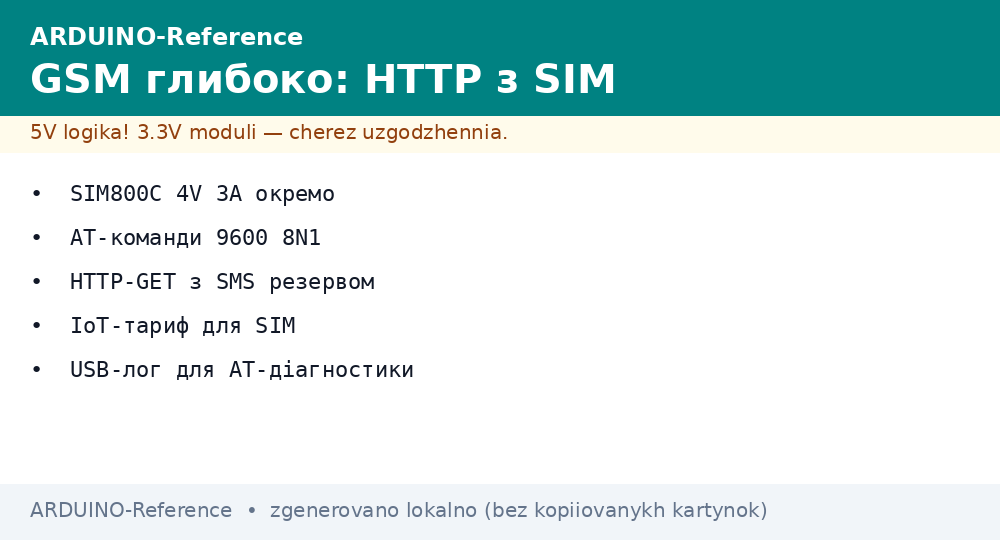
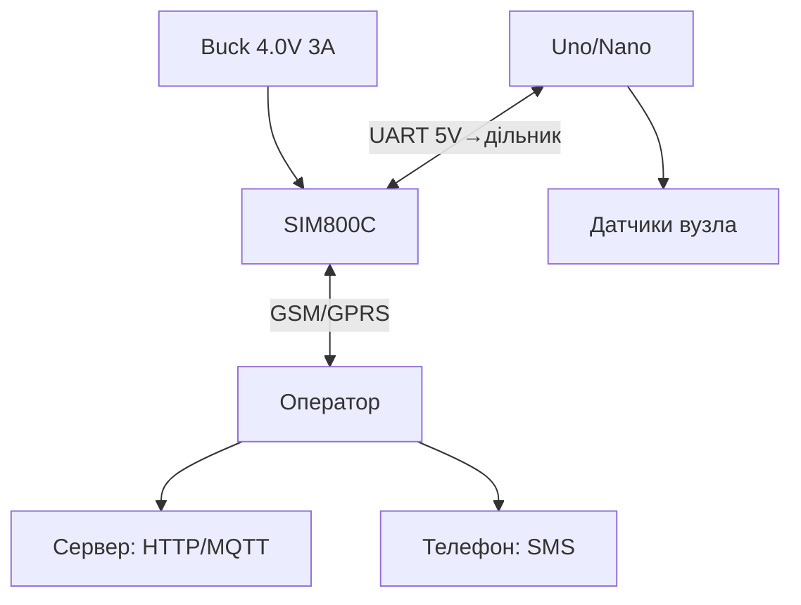

# Arduino GSM глибоко - SIM800C: GPRS, HTTP і SMS


*Рис. SIM800C на окремому живленні 4V: UART-команди, GPRS-сесія в інтернет, SMS як резервний канал.*

> [!tip] Що це за нота
> Глибина поверх оглядової GSM-ноти: тут живлення 2A-піків, HTTP-стек AT-командами і SMS-керування. Модуль: [GSM-модуль оглядово](../../../ARDUINO-Reference/05-Radio/02-GSM-SIM800.md), шина: [шина UART](../../../ARDUINO-Reference/04-Shini/01-UART.md).

## 1. Мета

Дати Arduino інтернет там, де немає WiFi:

- живлення SIM800C: 3.4-4.4V, пік 2A - окремий buck;
- GPRS-сесія: APN, PDP-контекст, HTTP GET/POST;
- SMS: прийом команд і відправка алертів;
- енергозбереження: сон модуля між сесіями.

| Параметр | SIM800C | Примітка |
| --- | --- | --- |
| Мережа | Quad-band GSM/GPRS | 2G (перевірити покриття!) |
| Живлення | 3.4-4.4V, пік 2A | НЕ 5V безпосередньо! |
| Логіка | 2.8V UART | дільник TX Arduino |
| Швидкість | UART 115200 | автошина ок |
| SIM | micro-SIM | IoT-тариф без голосу |

## 2. Архітектура



2G закривають у багатьох країнах - перевірити наявність мережі ДО проєкту. Альтернатива - LTE-модеми (SIM7600).

## 3. Розпіновка модуля

| Пін Uno | Пін SIM800C | Примітка |
| --- | --- | --- |
| D7 (RX) | TXD | безпосередньо: 2.8V читається як HIGH |
| D8 (TX) | RXD | дільник 10к/20к (5V→3.3V)! |
| GND | GND | спільна, товста |
| D9 | PWRKEY | імпульс 1 с для вмикання |
| D10 | STATUS | HIGH = модуль увімкнено |
| Buck 4.0V | VCC | 1000 мкФ біля модуля! |

Без конденсатора і товстих дротів модуль ребутиться при реєстрації в мережі (пік 2A).

## 4. HTTP через AT

```text
AT+SAPBR=3,1,"APN","internet"   → OK (точка доступу)
AT+SAPBR=1,1                     → OK (відкрити носій)
AT+HTTPINIT                      → OK
AT+HTTPPARA="URL","http://srv/api?temp=23.5" → OK
AT+HTTPACTION=0                  → +HTTPACTION: 0,200,24
AT+HTTPREAD                      → тіло відповіді
AT+HTTPTERM                      → закрити
```

POST - через `AT+HTTPDATA` з довжиною, потім тіло. JSON формуємо вручну, Content-Type задаємо параметром.

## 5. Робочий код (C, Arduino)

```cpp
#include <SoftwareSerial.h>
SoftwareSerial gsm(7, 8);

void gsm_cmd(const char *cmd, unsigned long wait = 2000) {
  gsm.println(cmd);
  unsigned long t0 = millis();
  while (millis() - t0 < wait) {
    if (gsm.available()) Serial.write(gsm.read());
  }
}

void gsm_pwrkey() {
  pinMode(9, OUTPUT);
  digitalWrite(9, LOW);
  delay(1200);
  digitalWrite(9, HIGH);
}

bool http_get(const char *url, char *out, int n) {
  char cmd[96];
  gsm_cmd("AT+SAPBR=3,1,\"APN\",\"internet\"");
  gsm_cmd("AT+SAPBR=1,1", 5000);
  gsm_cmd("AT+HTTPINIT");
  snprintf(cmd, sizeof(cmd), "AT+HTTPPARA=\"URL\",\"%s\"", url);
  gsm_cmd(cmd);
  gsm.println("AT+HTTPACTION=0");
  delay(8000);
  gsm.println("AT+HTTPREAD");
  int i = 0;
  unsigned long t0 = millis();
  while (millis() - t0 < 5000 && i < n - 1) {
    if (gsm.available()) out[i++] = gsm.read();
  }
  out[i] = 0;
  gsm_cmd("AT+HTTPTERM");
  return strstr(out, "200") != 0;
}

void sms_send(const char *num, const char *text) {
  gsm.println("AT+CMGF=1");
  delay(500);
  gsm.print("AT+CMGS=\"");
  gsm.print(num);
  gsm.println("\"");
  delay(500);
  gsm.print(text);
  gsm.write(26);
}

void setup() {
  Serial.begin(115200);
  gsm.begin(9600);
  gsm_pwrkey();
  delay(5000);
}

void loop() {
  char resp[128];
  if (http_get("http://srv/api?node=1", resp, sizeof(resp))) {
    if (strstr(resp, "RELAY1")) digitalWrite(5, HIGH);
  }
  delay(60000);
}
```

SoftwareSerial на 9600 - стабільно; 115200 софтверно рве. Апаратний Serial лишаємо для USB-логу.

## 6. Робочий код (MicroPython)

```python
# MicroPython: GSM-міст (ESP32/Arduino-совместимі плати з UART)
import time
from machine import UART, Pin

gsm = UART(1, baudrate=9600, tx=17, rx=16)
pwr = Pin(9, Pin.OUT, value=1)
status = Pin(10, Pin.IN)

def at(cmd, wait=2):
    gsm.write(cmd + '\r\n')
    time.sleep(wait)
    return gsm.read() or b''

def pwrkey():
    pwr.value(0)
    time.sleep(1.2)
    pwr.value(1)
    time.sleep(5)

def http_get(url):
    at('AT+SAPBR=3,1,"APN","internet"')
    at('AT+SAPBR=1,1', 5)
    at('AT+HTTPINIT')
    at('AT+HTTPPARA="URL","%s"' % url)
    at('AT+HTTPACTION=0', 8)
    at('AT+HTTPREAD', 3)
    data = gsm.read() or b''
    at('AT+HTTPTERM')
    return data

pwrkey()
while True:
    print(http_get('http://srv/api?node=1')[:80])
    time.sleep(60)
```

Той же AT-діалог, інший хост: код переноситься між Arduino і MicroPython-платами майже без змін.

## 7. SMS-керування

- текстовий режим `AT+CMGF=1`, читання `AT+CMGR=n`;
- формат команд: `RELAY1`, `STATUS?` - парсимо підрядок;
- пароль у першому слові SMS (`SECRET RELAY1`) - відсікає чужі;
- алерти: температура/рух → SMS на 2 номери;
- USSD-баланс: `AT+CUSD=1,"*100#"` - контроль тарифу.

## 8. Типові помилки

| Симптом | Причина | Лікування |
| --- | --- | --- |
| Ребутиться при дзвінку/реєстрації | слабке живлення (пік 2A) | buck 4V 3A + 1000 мкФ |
| `ERROR` на SAPBR | не той APN | APN оператора IoT-тарифу |
| SMS не приходять | пам'ять SIM забита | `AT+CMGD=1,4` чистка |
| Працює вдень, мовчить уночі | сон модуля | вимкнути sleep або будити DTR |
| 5V на RXD модуля | прямий TX Arduino | дільник 10к/20к обов'язково |
| Мережі немає взагалі | 2G вимкнено в країні | перевірити покриття, далі LTE |

## 9. Швидка шпаргалка GSM

- живлення 4V 3A + конденсатор;
- TX Arduino через дільник;
- APN IoT-тарифу в конфігу;
- HTTP: INIT→PARA→ACTION→READ→TERM;
- SMS з паролем першим словом.

## 10. Суміжні ноти

- [GSM-модуль оглядово](../../../ARDUINO-Reference/05-Radio/02-GSM-SIM800.md) - стартова нота.
- [шина UART](../../../ARDUINO-Reference/04-Shini/01-UART.md) - софтверний порт.
- [HTTP-клієнт](../../../ARDUINO-Reference/15-Protokoli/03-HTTP-Web.md) - веб-сторона.
- [живлення VIN](../../../ARDUINO-Reference/02-Zhivlennya/01-Zhivlennya-VIN.md) - buck для модуля.
- [головна карта](../../../ARDUINO-Reference/Home.md) - повна навігація.

## Офіційні джерела

- [SIM800C (SIMCom)](https://www.simcom.com/product/SIM800C.html) - живлення, AT-команди, піки.
- [Ethernet Shield Rev2 (Arduino docs)](https://docs.arduino.cc/hardware/ethernet-shield-rev2/) - альтернативний транспорт.
- [Language Reference (Arduino docs)](https://docs.arduino.cc/language-reference/) - SoftwareSerial, рядки.
