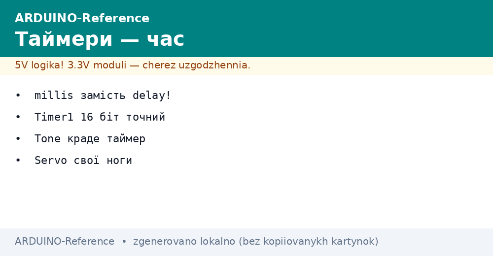
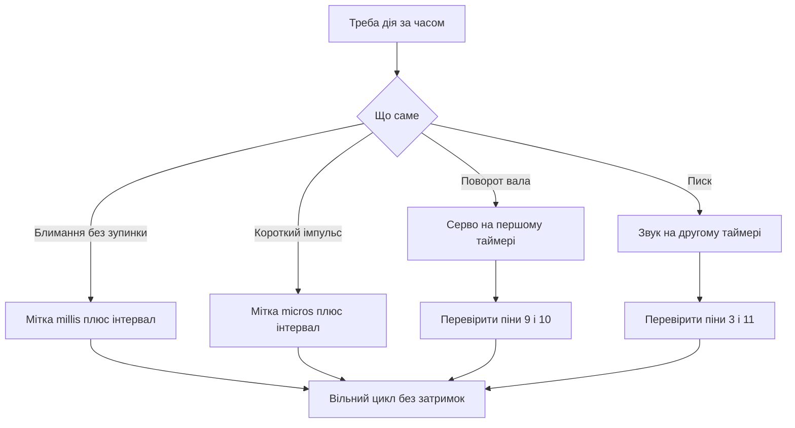

# Таймери Arduino - millis без delay


*Рис. Таймери: лічильники, час, серво і звук без блокування.*

> [!tip] Призначення ноти
> Навчити жити без зупинки циклу: читати годинник плати, блимати і пищати паралельно, розуміти хто з таймерів зайнятий і пережити переповнення.

## 1. Призначення

Таймер рахує тіки кварцу незалежно від програми.

Програма лише питає скільки набігло і планує наступну подію.

Функція затримки зупиняє все, таймер дозволяє робити кілька справ одразу.

Блимання світлодіодом, опитування кнопки і писк динаміка йдуть паралельно.

Ця нота закриває карту таймерів, годинник мілісекунд, патерн без зупинки, переповнення, серво і звук.

Після неї скетчі перестають підвисати на кожній паузі.

Класичний контролер має три таймери з різними ролями.

Нульовий веде системний час і пару імпульсних виходів.

Перший шістнадцятибітний найточніший, його любить серво.

Другий восьмибітний віддано під звук і дрібні імпульси.

Карту плати дивись у ноті [класичний AVR](../../../ARDUINO-Reference/01-Hardware/01-AVR-Uno.md).

## 2. Хто є хто: три лічильники

| Таймер | Розрядність | Веде | Конфліктує з |
| --- | --- | --- | --- |
| Timer0 | 8 біт | millis, micros, delay, виходи 5 і 6 | Зміна дільника ламає годинник |
| Timer1 | 16 біт | Бібліотека серво, виходи 9 і 10 | Серво гасить імпульси на цих пінах |
| Timer2 | 8 біт | Функція tone, виходи 3 і 11 | Звук гасить імпульси на цих пінах |

Розрядність визначає максимальний інтервал без переповнення.

Восьмибітний рахує до 255 і крутиться швидко.

Шістнадцятибітний рахує до 65535 і тримає довгі імпульси серво.

Дільник сповільнює рахунок ціною точності.

Системний час живе на нульовому таймері за замовчуванням.

Тому чіпати його регістри без потреби заборонено.

Імпульсні виходи привʼязані до таймерів жорстко на рівні кристала.

Переназначити вихід на інший таймер неможливо.

Бібліотеки серво і звуку забирають цілий таймер під себе.

Одночасний звук і серво на межі можливі, але з обмеженнями.

```text
Карта зайнятості таймерів:

  Timer0 (8 біт): millis плюс micros плюс delay плюс піни D5 D6
  Timer1 (16 біт): серво плюс піни D9 D10
  Timer2 (8 біт): звук tone плюс піни D3 D11

  Зайняв серво — попрощався з імпульсами на D9 D10.
  Зайняв звук — попрощався з імпульсами на D3 D11.
```

Схема нагадує про ціну кожної бібліотеки.

Перед додаванням серво перевіряють вільність девʼятого і десятого пінів.

Перед додаванням звуку перевіряють вільність третього і одинадцятого.

Імпульсна модуляція детально у ноті [широтно-імпульсна модуляція](../../../ARDUINO-Reference/03-GPIO/02-PWM-analogWrite.md).

Переривання плати описані у ноті [переривання плати](../../../ARDUINO-Reference/03-GPIO/03-Pererivannya.md).

## 3. Годинник millis і micros

| Функція | Одиниця | Діапазон | Точність |
| --- | --- | --- | --- |
| millis | мілісекунда | до 49 діб | плюс мінус одна одиниця |
| micros | мікросекунда | до 71 хвилини | крок чотири мікросекунди |
| delay | мілісекунда | будь-яка пауза | блокує весь цикл |
| delayMicroseconds | мікросекунда | до 16383 | блокує, але точно |

Функція мілісекунд повертає час від старту плати.

Лічильник крутиться апаратно, виклик лише читає значення.

Різниця двох міток дає інтервал без зупинки програми.

Такий підхід називають неблокувальним патерном.

Функція мікросекунд дає дрібніший масштаб для коротких імпульсів.

Крок чотири мікросекунди зумовлений дільником таймера.

Обидва лічильники переповнюються і починаються з нуля.

Правильна арифметика на беззнакових числах переживає переповнення сама.

```cpp
const int LED_PIN = 13;
unsigned long previous = 0;
const unsigned long INTERVAL = 1000;
bool state = false;

void setup() {
  pinMode(LED_PIN, OUTPUT);
}

void loop() {
  unsigned long now = millis();
  if (now - previous >= INTERVAL) {
    previous = now;
    state = !state;
    digitalWrite(LED_PIN, state ? HIGH : LOW);
  }
}
```

Скетч блимає раз на секунду без жодної затримки.

Змінна previous тримає мітку останнього перемикання.

Різниця тепер мінус мітка дає час, що минув.

Порівняння з інтервалом вирішує чи настав момент дії.

Оновлення мітки значенням тепер тримає рівний період.

Логічна змінна стану перекидається кожну секунду.

Цикл лишається вільним для кнопок, датчиків і звуку.

## 4. Два завдання паралельно

| Задача | Період | Як планувати |
| --- | --- | --- |
| Блимання | 1000 мілісекунд | Окрема мітка і інтервал |
| Опитування кнопки | 20 мілісекунд | Часте читання з фільтром дребезгу |
| Друк у порт | 500 мілісекунд | Третя мітка не заважає першим |
| Звук | за подією | Короткий писк не блокує цикл |

Кожне завдання отримує власні змінні мітки і періоду.

Цикл пробігає зверху вниз і питає кожне завдання чи настав його час.

Жодне завдання не чекає всередині себе.

Довгі паузи розбивають на стани з мітками часу.

```cpp
unsigned long ledMark = 0;
unsigned long btnMark = 0;
bool ledState = false;

void setup() {
  pinMode(13, OUTPUT);
  pinMode(2, INPUT_PULLUP);
  Serial.begin(9600);
}

void loop() {
  unsigned long now = millis();
  if (now - ledMark >= 1000) {
    ledMark = now;
    ledState = !ledState;
    digitalWrite(13, ledState ? HIGH : LOW);
  }
  if (now - btnMark >= 20) {
    btnMark = now;
    if (digitalRead(2) == LOW) {
      Serial.println("press");
    }
  }
}
```

Світлодіод блимає у своєму ритмі, кнопка читається у своєму.

Опитування кожні двадцять мілісекунд гасить дребезг контактів.

Друк відбувається лише під час утримання кнопки.

Додавання третього завдання зводиться до копіювання блоку з новою міткою.

Памʼять на мітки витрачається мізерна, чотири байти на завдання.

Головне правило: не викликати довгу блокуючу затримку в швидкому циклі опитування (короткий delay у навчальному прикладі нижче - виняток, у бойовому коді - через millis).

## 5. Переповнення через 50 діб

| Лічильник | Переповнення | Як вижити |
| --- | --- | --- |
| millis | близько 49 діб | Віднімання на беззнакових числах |
| micros | близько 71 хвилини | Та сама різниця, масштаб менший |
| Неправильно | now більше previous плюс interval | Ламається у момент переповнення |
| Правильно | now мінус previous більше interval | Працює завжди, навіть через нуль |

Беззнакова арифметика крутиться по колу разом з лічильником.

Різниця тепер мінус старе дає правильний інтервал навіть після нуля.

Умова з додаванням ламається, бо сума теж переповнюється.

Тому єдиний правильний шаблон використовує віднімання.

```text
Чому віднімання безсмертне:

  previous = 4294967290 (за 6 мс до нуля)
  now = 10 (після переповнення)
  now - previous = 16 (правильні 16 мс по колу)

  Неправильний шаблон з додаванням
  мовчить зайві 49 діб після переповнення.
```

Приклад показує перехід через максимальне значення.

Беззнаковий тип сам відкидає перенос і лишає коректну різницю.

Тип міток завжди unsigned long, знаковий тип ламає фокус.

Константи інтервалів теж тримають беззнаковими.

Тести з підробленими мітками біля максимуму ловлять помилку за хвилину.

Довгоживучі вузли реально доживають до переповнення.

Режим сну з наглядом описаний у ноті [сон і нагляд](../../../ARDUINO-Reference/07-Timeri-Son/02-Son-WDT.md).

## 6. Серво на першому таймері

| Параметр | Значення | Пояснення |
| --- | --- | --- |
| Період сигналу | 20 мілісекунд | Стандарт хобі серво |
| Імпульс мінімум | 1000 мікросекунд | Кут нуль градусів |
| Імпульс середина | 1500 мікросекунд | Кут девʼяносто градусів |
| Імпульс максимум | 2000 мікросекунд | Кут сто вісімдесят градусів |
| Живлення | окремий блок 5-6 вольт | Струм ривка до ампера |

Бібліотека серво програмує шістнадцятибітний таймер під імпульси.

Користувач задає лише кут, ширину імпульсу рахує бібліотека.

Живлення серво ведуть окремим блоком зі спільною землею.

Сигнальний дріт підключають до девʼятого або десятого піна.

```cpp
#include <Servo.h>

Servo drive;

void setup() {
  drive.attach(9);
}

void loop() {
  drive.write(0);
  delay(1000);
  drive.write(90);
  delay(1000);
  drive.write(180);
  delay(1000);
}
```

Скетч гойдає вал від упору до упору через середину.

Приєднання до піна запускає таймер і періодичні імпульси.

Команда запису кута перераховується у ширину імпульсу.

Паузи між командами дають механіці час дійти до позиції.

Харчування від USB дає просідання і тремтіння вала.

Окремий блок з конденсатором біля серво прибирає смикання.

Після приєднання серво імпульси на девʼятому і десятому пінах зникають.

## 7. Звук tone на другому таймері

| Виклик | Дія | Нотатка |
| --- | --- | --- |
| tone з частотою | Писк заданої висоти | Працює у фоні без затримок |
| tone з тривалістю | Писк і автостоп | Зручно для сигналів |
| noTone | Тиша | Зупиняє генерацію |
| Два динаміки | Лише один голос | Другий виклик перебиває перший |

Функція звуку займає другий таймер і генерує меандр.

Висота задається у герцах, тривалість у мілісекундах.

Без тривалості писк триває до команди тиші.

Динамік підключають через резистор сто ом для обмеження струму.

Пʼєзовипромінювач можна вішати прямо, струм у нього мізерний.

```cpp
const int BUZZER_PIN = 8;

void setup() {
  pinMode(BUZZER_PIN, OUTPUT);
}

void loop() {
  tone(BUZZER_PIN, 440);
  delay(300);
  noTone(BUZZER_PIN);
  delay(700);
  tone(BUZZER_PIN, 880, 200);
  delay(500);
}
```

Скетч дає два сигнали різної висоти у циклі.

Перший писк стартує без тривалості і глушиться командою тиші.

Другий писк має вбудовану тривалість двісті мілісекунд.

Паузи між сигналами роблять мелодію розбірливою.

Паралельно з писком цикл може блимати і читати кнопки.

Конфлікт з імпульсами на третьому і одинадцятому пінах лишається.

Тому звук виводять на вільний пін, наприклад восьмий.

Гучність регулюють резистором або шпаруватістю через підсилювач.

## Mermaid: що на чому живе



Схема читається згори: спочатку задача, потім інструмент.

Блимання і опитування живуть на системному годиннику.

Серво і звук забирають свої таймери цілком.

Перевірка пінів рятує від зниклих імпульсів.

Вільний цикл дозволяє комбінувати всі задачі.

## Типові помилки

| # | Помилка | Чому погано | Як правильно |
| --- | --- | --- | --- |
| 1 | Затримка всередині циклу на секунду | Все стоїть, кнопки і звук мовчать | Мітка millis з інтервалом без блокування |
| 2 | Порівняння через додавання мітки | Ламається у момент переповнення | Шаблон now мінус previous більше interval |
| 3 | Знаковий тип для міток часу | Відʼємні значення кривлять різницю | Тип unsigned long для всіх міток |
| 4 | Серво і імпульси на тих самих пінах | Бібліотека гасить виходи 9 і 10 | Рознести серво і навантаження по різних пінах |
| 5 | Звук і імпульси на тих самих пінах | Функція звуку гасить виходи 3 і 11 | Пищалку на вільний пін, наприклад 8 |
| 6 | Зміна дільника нульового таймера | Годинник millis починає брехати | Не чіпати регістри нульового таймера без крайньої потреби |

## Офіційні джерела

- [Функція millis на docs.arduino.cc](https://docs.arduino.cc/language-reference/en/functions/time/millis/) - годинник, переповнення і приклад без затримок.
- [Функція tone на arduino.cc](https://www.arduino.cc/reference/en/language/functions/advanced-io/tone/) - генерація звуку, обмеження і конфлікти таймерів.
- [Бібліотека Servo на docs.arduino.cc](https://docs.arduino.cc/libraries/servo/) - підключення, кути і використання першого таймера.

## Див. також

- [Home](../../../ARDUINO-Reference/Home.md)
- [класичний AVR](../../../ARDUINO-Reference/01-Hardware/01-AVR-Uno.md)
- [переривання плати](../../../ARDUINO-Reference/03-GPIO/03-Pererivannya.md)
- [сон і нагляд](../../../ARDUINO-Reference/07-Timeri-Son/02-Son-WDT.md)
