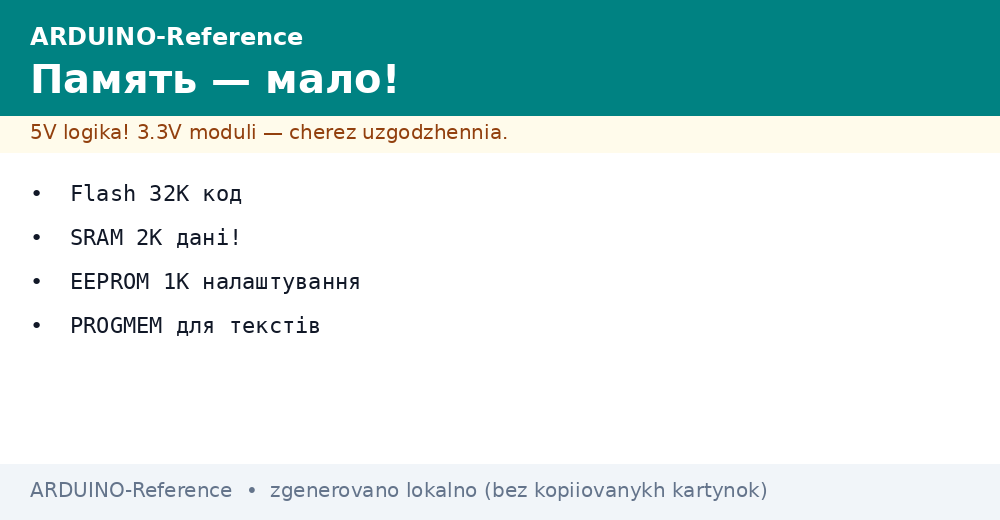
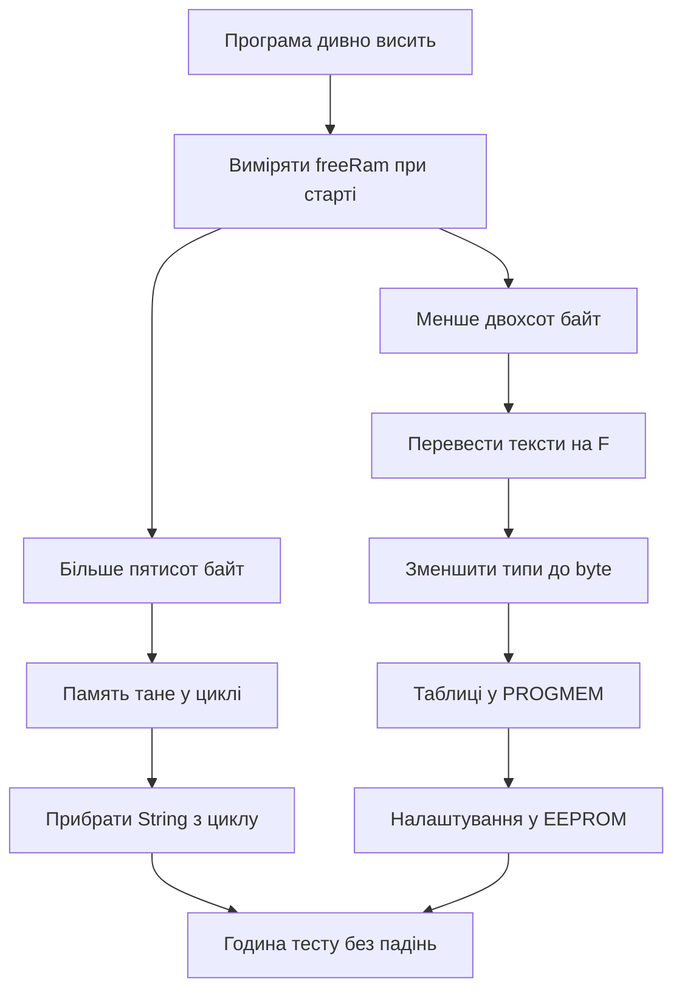

# Пам'ять Arduino - Flash, SRAM і EEPROM


*Рис. Три види памяті плати Ардуіно для коду оперативних змінних і довгих налаштувань.*

> [!tip] Призначення ноти
> Пояснити, куди зникають два кілобайти ОЗП, як зберігати налаштування без батарейки і як приборкати текстові рядки.

## 1. Призначення

У класичної плати Уно памяті мало за сучасними мірками. Програма лежить у флеш памяті на 32 кілобайти, змінні живуть у статичній памяті на 2 кілобайти, налаштування тримає енергонезалежна пам'ять на 1 кілобайт. Кожен вид має свою ціну і свої обмеження.

Флеш пам'ять зберігає код і константи. Вона не стирається при вимиканні. Запис у неї можливий лише при прошивці або спеціальними прийомами, тому в звичайному циклі туди не пишуть. Обсяг 32 кілобайти швидко зїдають бібліотеки дисплеїв і мереж.

Оперативна пам'ять SRAM це робочий стіл. Там живуть змінні, стек викликів, буфери бібліотек. Її лише 2 кілобайти, і вона очищується при перезапуску. Закінчилась оперативна пам'ять програма починає дивно поводитись. Саме тут ховається більшість загадкових зависань.

Енергонезалежна пам'ять EEPROM тримає байти без живлення роками. Туди пишуть номер вузла, калібрування датчика, лічильник спрацювань. Обсяг 1 кілобайт, зате переживає вимикання. Кількість перезаписів обмежена, тому в циклі без паузи туди не пишуть.

## 2. Карта памяті Уно

| Вид | Обсяг на Уно | Що лежить | Чи переживає вимикання |
| --- | --- | --- | --- |
| Flash | 32 КБ | Код і константи | Так |
| SRAM | 2 КБ | Змінні стек буфери | Ні |
| EEPROM | 1 КБ | Налаштування лічильники | Так |

Для порівняння плата Мега має 256 КБ флешу, 8 КБ оперативної і 4 КБ енергонезалежної. Тому великий проект з екраном і мережею часто переїжджає саме туди. Але прийоми економії однакові для обох плат.

```text
Розподіл памяті в голові:
  Flash 32К  [код ######........][тексти ####....][вільно ....]
  SRAM 2К    [глобальні ##][буфер Serial ##][стек ##][купа #][вільно .]
  EEPROM 1К  [адреса вузла][калібрування][лічильник][вільне місце]

  Правило: тексти у флеш, змінні мінімальні, EEPROM лише для налаштувань
```

## 3. Хто їсть оперативну пам'ять

| Споживач | Скільки бере | Як помітити |
| --- | --- | --- |
| Рядки Serial.print з лапками | Кожен символ один байт у SRAM | Багато текстів і раптові ребути |
| Буфер Serial | 64 байти на прийом і 64 на передачу | Закладено у ядро |
| Бібліотека дисплея | Сотні байт під кадр | Екран плюс мережа вже ризик |
| Масиви int | Два байти на елемент | Сто елементів це вже десятина памяті |
| Рекурсія і глибокі виклики | Стек росте вниз | Зависання у випадкових місцях |
| Обєкти String | Фрагментація купи | Працює годину потім падає |

Головний ворог це текстові рядки. Кожен напис у лапках компілятор за замовчуванням копіює з флешу в оперативну при старті. Десять екранів підказок зїдають чверть памяті ще до першого виміру. Лікується макросом F і таблицею PROGMEM.

Другий ворог це тип int там, де вистачить байта. Номер виводу, стан кнопки, адреса вузла спокійно живуть у byte або uint8_t. Масив з сотні int важить двісті байт, а масив з сотні byte лише сто.

## 4. PROGMEM і макрос F для текстів

| Прийом | Код | Ефект |
| --- | --- | --- |
| Друк з флешу | Serial.print(F("Привіт")) | Рядок не копіюється в SRAM |
| Таблиця рядків | const char text[] PROGMEM | Великі тексти живуть у флеші |
| Числові таблиці | const uint16_t table[] PROGMEM | Калібрування без витрат SRAM |
| Читання байта | pgm_read_byte_near | Дістати символ з флешу |
| Читання слова | pgm_read_word_near | Дістати число з таблиці |

Макрос F огортає лише рядок у місці друку. Пишуть Serial.println(F("Готово")) замість Serial.println("Готово"). Зовні різниці немає, всередині економія десятки байт на кожен напис. Для меню з двадцяти пунктів це вже сотні байт.

Великі таблиці оголошують з ключовим словом PROGMEM. Тоді масив лежить у флеші, а читають його функціями pgm_read. Трохи довший код, зате оперативна пам'ять дихає вільно.

## 5. EEPROM і бібліотека EEPROM

| Функція | Дія | Коли брати |
| --- | --- | --- |
| EEPROM.read | Прочитати байт | Завантаження налаштувань при старті |
| EEPROM.write | Записати байт завжди | Рідкі записи |
| EEPROM.update | Записати лише якщо змінилось | Налаштування з меню, береже ресурс |
| EEPROM.put | Записати структуру | Калібрування одним махом |
| EEPROM.get | Прочитати структуру | Старт програми |

Енергонезалежна пам'ять має межу близько ста тисяч записів на комірку. Тому в циклі пишуть лише за зміною і з паузою. Функція update сама перевіряє старе значення і не шліфує комірку даремно.

Структуру налаштувань тримають з контрольною міткою. Перший байт магічне число, далі поля. При старті читають структуру, перевіряють мітку. Мітка не збіглась значить пам'ять порожня, підставляють заводські значення.

```text
ASCII карта EEPROM вузла:
  Адреса 0   : магічне число 0xA5
  Адреса 1   : номер вузла від 1 до 250
  Адреса 2-3 : калібрування температури int16
  Адреса 4-5 : лічильник спрацювань uint16
  Адреса 6+  : вільне місце під журнал

  Запис лише при зміні через update або put
```

## 6. Вимір вільної RAM

```cpp
int freeRam() {
  extern int __heap_start;
  extern int *__brkval;
  int v;
  int heap = (int)__brkval;
  if (heap == 0) {
    heap = (int)&__heap_start;
  }
  int stack = (int)&v;
  return stack - heap;
}

void setup() {
  Serial.begin(9600);
  Serial.print(F("Free RAM: "));
  Serial.println(freeRam());
}

void loop() {
  Serial.print(F("Loop free: "));
  Serial.println(freeRam());
  delay(2000);
}
```

Функція міряє щілину між купою і стеком. Викликають її при старті і у підозрілих місцях. Якщо число падає з кожною ітерацією десь тече пам'ять. Найчастіше винні рядки без F або обєкти String у циклі.

Норма для маленького вузла це кілька сотень вільних байт. Менше двохсот це червона зона. У червоній зоні прибирають тексти, зменшують буфери, переводять масиви на байти.

## 7. Скетч налаштувань з EEPROM

```cpp
#include <EEPROM.h>

struct NodeCfg {
  byte magic;
  byte nodeId;
  int16_t tempCorr;
  uint16_t counter;
};

NodeCfg cfg;

void loadCfg() {
  EEPROM.get(0, cfg);
  if (cfg.magic != 0xA5) {
    cfg.magic = 0xA5;
    cfg.nodeId = 7;
    cfg.tempCorr = 0;
    cfg.counter = 0;
    EEPROM.put(0, cfg);
  }
}

void setup() {
  Serial.begin(9600);
  loadCfg();
  cfg.counter++;
  EEPROM.put(0, cfg);
  Serial.print(F("Node "));
  Serial.println(cfg.nodeId);
  Serial.print(F("Boot "));
  Serial.println(cfg.counter);
}

void loop() {
}
```

При першому старті структура ініціалізується заводськими значеннями. При кожному наступному лічильник вмикань росте. Номер вузла і поправку температури міняють окремою командою з порту і зберігають через put.

## 8. Оптимізація крок за кроком

Спочатку всі рядки друку переводять на макрос F. Це пять хвилин роботи і сотні зекономлених байт. Потім дивляться типи змінних. Лічильники до 255 переводять на byte, прапорці на bool.

Далі прибирають String з циклу. Конкатенація у кожній ітерації кришить купу. Замість неї масив char фіксованого розміру і функція snprintf. Працює довше без перезапусків.

Буфери бібліотек зменшують лише після читання документації. Сліпе урізання ламає прийом пакетів. Краще прибрати одну зайву бібліотеку, ніж різати буфер робочої.

## Mermaid: діагностика памяті



Схема читається зверху вниз. Спочатку вимір, потім швидкі перемоги через F і типи, потім важка артилерія з PROGMEM. Течі шукають окремою гілкою через повторні виміри.

## Типові помилки

| # | Помилка | Чому погано | Як правильно |
| --- | --- | --- | --- |
| 1 | Рядки без макросу F | Кожен напис їсть SRAM до ребуту | Serial.print з F для всіх сталих текстів |
| 2 | Обєкти String у циклі | Фрагментація купи і падіння за годину | Масив char і snprintf фіксованого розміру |
| 3 | Масиви int для малих чисел | Двічі більші витрати памяті | Типи byte і uint8_t де вистачає |
| 4 | Запис у EEPROM кожну ітерацію | Комірки зношуються за дні | Функція update і запис лише за зміною |
| 5 | Глибока рекурсія | Стек зустрічається з купою | Цикли замість рекурсії, плоскі виклики |
| 6 | Дві важкі бібліотеки разом | Памяті не вистачає ще при старті | Одна функція один модуль або плата Мега |

## Офіційні джерела

- [Arduino EEPROM library reference](https://docs.arduino.cc/learn/built-in-libraries/eeprom/) - функції read write update put get і приклади.
- [Arduino PROGMEM guide](https://docs.arduino.cc/learn/programming/memory-guide/) - флеш пам'ять, SRAM, макрос F і таблиці.

## Див. також

- [Home](../../../ARDUINO-Reference/Home.md)
- [далеке радіо](../../../ARDUINO-Reference/05-Radio/01-LoRa-moduli.md)
- [рівні і заряд](../../../ARDUINO-Reference/13-Moduli-zhivlennya-rivniv/02-Level-Shift-TP4056.md)
- [класичний AVR](../../../ARDUINO-Reference/01-Hardware/01-AVR-Uno.md)
- [послідовний порт](../../../ARDUINO-Reference/04-Shini/01-UART.md)
- [імпульсне живлення](../../../ARDUINO-Reference/13-Moduli-zhivlennya-rivniv/01-Buck-peretvoryuvach.md)
