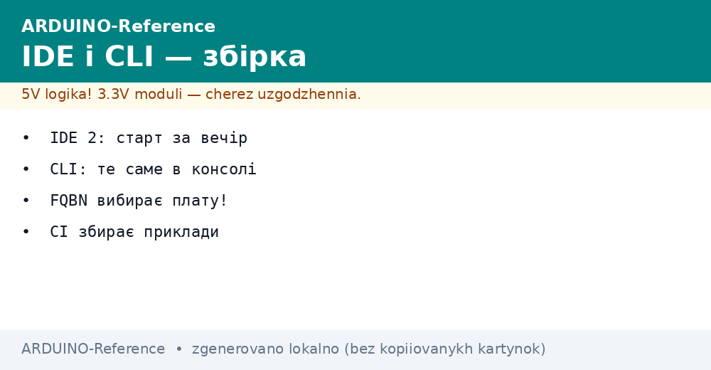
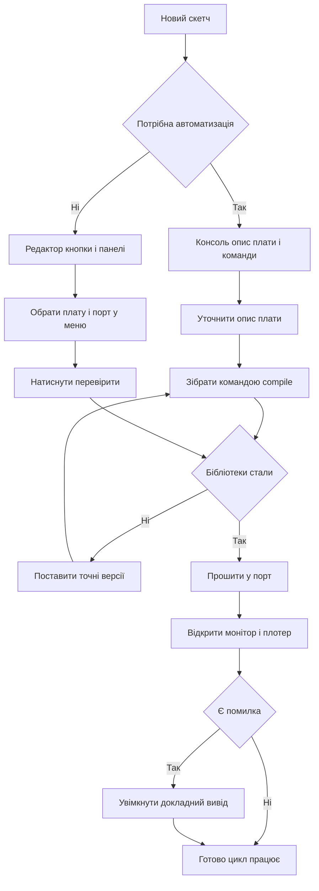

# IDE і CLI - збірка скетчів


*Рис. Схема збірки скетчу середовище консоль плата порт монітор.*

> [!tip] Призначення ноти
> Пояснити повний цикл збірки скетчу від вибору плати і порту до прошивки монітора порту і автоматичної перевірки через консоль.

## 1. Призначення

Ця нота пояснює як зібрати і прошити скетч двома шляхами графічним редактором і консольною утилітою. Після прочитання читач впевнено обирає плату і порт розуміє що таке опис плати збирає приклад командами і читає докладний вивід коли збірка падає.

Графічний редактор зручний для щоденної роботи правок і перегляду даних з плати. Консольна утиліта повторює ті ж дії командами тому її беруть для скриптів перевірки прикладів і серверів збирання. Обидва шляхи використовують однакові ядра плат бібліотеки і налаштування порту.

Звʼязок з іншими темами такий вибір редактора доповнює огляд у ноті про [вибір середовища](../../../ARDUINO-Reference/00-Start/05-Vibir-seredovischa.md) а прошивка через завантажувач розкрита у ноті про [завантажувач і avrdude](../../../ARDUINO-Reference/09-Proshivka/02-Bootloader-AVRDUDE.md). Для практики знадобиться [класичний AVR](../../../ARDUINO-Reference/01-Hardware/01-AVR-Uno.md) або плата з нот про [компакт і ноги](../../../ARDUINO-Reference/01-Hardware/02-Nano-Mega.md).

## 2. Редактор першої і другої гілки

Перша гілка редактора легка швидка і передбачувана вона добре працює на слабких компʼютерах. Друга гілка має сучасний редактор коду вкладки панелей автодоповнення перехід до визначення вбудований плотер і налагоджувач для підтримуваних плат. Скетчі повністю сумісні між гілками можна відкривати той же каталог по черзі.

| Параметр | IDE 1.x | IDE 2.x |
| --- | --- | --- |
| Вікно | Просте одне вікно | Панелі вкладки навігатор |
| Автодоповнення | Прості підказки | Розумні підказки сигнатур |
| Вкладки | Вкладки скетчу | Вкладки скетчу плюс панелі |
| Монітор порту | Окреме вікно | Вкладка поруч з кодом |
| Плотер | Окреме вікно | Вкладка з графіками |
| Менеджер плат | Окреме вікно | Бічна панель з пошуком |
| Менеджер бібліотек | Окреме вікно | Бічна панель з версіями |
| Налагоджувач | Зовнішні засоби | Вбудований для частини плат |
| Для кого | Слабкі компʼютери | Щоденна робота і навчання |

```text
Що обрати новачку:
  Слабкий компʼютер .............. перша гілка
  Щоденна робота .................. друга гілка
  Довгий проект з бібліотеками .... друга гілка
  Перевірка чужого прикладу ....... будь-яка гілка
  Скетчі відкриваються в обох гілках без змін.
```

Корисні дрібниці другої гілки автодоповнення за початком імені швидкий пошук по файлах підсвічування помилок ще до збірки і список останніх плат і портів у верхній панелі. Вкладки дозволяють тримати поруч код монітор і плотер і перемикатися одним натиском.

## 3. Вибір плати і порту

Перед першою збіркою треба обрати точну модель плати і порт до якого вона підключена. Плата визначає ядро компілятор розмір памʼяті і скрипт прошивки а порт визначає куди надсилати готовий файл. Якщо плату обрано неправильно скетч може зібратися але не запуститися або прошивка одразу впаде з помилкою доступу.

| Крок | Дія | Пояснення |
| --- | --- | --- |
| Підключення | Зʼєднати плату кабелем з даними | Дочекатися появи нового порту |
| Плата | Меню плат обрати модель | Для старту взяти класичну плату |
| Порт | Меню портів обрати новий порт | Порт зʼявляється після підключення |
| Перевірка | Натиснути перевірити | Компіляція без прошивки плати |
| Прошивка | Натиснути стрілку | Збірка і запис у плату |
| Монітор | Відкрити монітор | Перевірити стартові рядки |

```text
Якщо порту нема в списку:
  1. Спробувати інший кабель з лініями даних.
  2. Перевірити драйвер перетворювача порту.
  3. Подивитися список портів до і після підключення.
  4. На платах з двома портами дочекатися другого порту.
  5. Перезапустити редактор і оновити список портів.
```

Порада для стійкої роботи підписувати кабелі які точно передають дані бо частина дешевих кабелів має тільки живлення. Порт бажано запамʼятати за іменем пристрою а не за номером бо після перепідключення номер може змінитися.

## 4. Опис плати і консольна збірка

Консольна утиліта виконує ті ж дії що й кнопки редактора встановлення ядер компіляцію прошивку роботу з бібліотеками і монітор. Ключова річ опис плати це рядок з трьох частин виробник архітектура плата через двокрапку плюс налаштування через кому. Без точного опису збірка або піде не під ту плату або взагалі відмовиться стартувати.

| Команда | Призначення | Коли викликати |
| --- | --- | --- |
| core update-index | Оновлення каталогу ядер | Перед встановленням нового ядра |
| core install | Встановлення ядра сімейства | Один раз для кожного сімейства |
| core list | Список встановлених ядер | Перевірка версій ядер |
| board list | Список підключених плат | Коли не видно порт плати |
| board details | Деталі опису плати | Коли треба точний опис і опції |
| lib install | Встановлення бібліотеки | Перед першою збіркою проекту |
| lib list | Список бібліотек | Перевірка версій залежностей |
| compile | Компіляція скетчу | Перевірка коду без прошивки |
| upload | Прошивка плати | Після вдалої компіляції |
| monitor | Перегляд порту | Налагодження обміну даними |

```text
Формат опису плати словами:
  виробник : архітектура : плата : опції
  Приклад для класики:
    arduino : avr : uno
  Приклад з опціями процесора:
    arduino : avr : nano : cpu = atmega328old
  Опції дізнаватися через board details.
```

```bash
  # Оновлення каталогу і встановлення ядра класики
arduino-cli core update-index
arduino-cli core install arduino:avr

  # Перевірка що плату видно
arduino-cli board list

  # Деталі опису плати і доступних опцій
arduino-cli board details --fqbn arduino:avr:uno

  # Компіляція без прошивки
arduino-cli compile --fqbn arduino:avr:uno Blink

  # Прошивка у вказаний порт
arduino-cli upload -p /dev/ttyUSB0 --fqbn arduino:avr:uno Blink
```

Опис плати варто зберігати у файлі проекту або у скрипті збирання щоб усі учасники збирали однаково. Для плати з варіантами процесора старий і новий завантажувач опис відрізняється опцією тому приклад з мережі без опції може не зібратися.

## 5. Бібліотеки через консоль

Бібліотека це готовий код для датчика дисплея або модуля звʼязку з прикладами. Графічний менеджер і консоль ставлять бібліотеки з того ж каталогу тому версії збігаються. Для повторюваної збірки версію фіксують явно щоб оновлення на іншому компʼютері не зламало проект.

| Команда | Призначення | Приклад застосування |
| --- | --- | --- |
| lib search | Пошук за назвою | Знайти драйвер датчика |
| lib install | Встановлення з версією | Поставити точну версію для проекту |
| lib list | Встановлені бібліотеки | Перевірити що стоїть зараз |
| lib upgrade | Оновлення | Оновити після перевірки збірки |
| lib uninstall | Видалення | Прибрати зайве перед релізом |

```bash
  # Пошук бібліотеки за назвою датчика
arduino-cli lib search DHT sensor

  # Встановлення точної версії для відтворюваності
arduino-cli lib install "DHT sensor library@1.4.4"

  # Список встановленого
arduino-cli lib list

  # Компіляція скетчу з бібліотекою
arduino-cli compile --fqbn arduino:avr:uno SensorDemo
```

```text
Порядок підключення датчика:
  1. Знайти бібліотеку за назвою в каталозі.
  2. Поставити точну версію і записати її в нотатку.
  3. Відкрити приклад з бібліотеки і зібрати без змін.
  4. Прошити приклад і перевірити дані в моніторі.
  5. Перенести потрібне у свій скетч.
```

Ручне копіювання тек бібліотек з мережі лишають на крайній випадок коли немає доступу до каталогу. Тоді теку кладуть поруч з проектом і документують версію бо інакше ніхто не відтворить збірку.

## 6. Монітор порту і плотер

Монітор порту показує текст від плати і дозволяє надсилати команди у відповідь. Плотер малює графіки чисел з плати що зручно для сенсорів регуляторів і перевірки ритму циклів. Обидва вимагають однакової швидкості у скетчі і на компʼютері інакше замість тексту буде сміття.

| Інструмент | Що показує | Коли брати |
| --- | --- | --- |
| Монітор | Рядки тексту | Журнал подій команди керування |
| Плотер | Графіки чисел | Сигнали сенсорів ритм циклів |
| Швидкість | Боди в обох місцях | Значення мають збігатися |
| Кінець рядка | Символи завершення | Налаштувати під парсер скетчу |
| Порт | Зайнятий ресурс | Перед прошивкою монітор закрити |

```cpp
// Демо для монітора і плотера
// В моніторі видно текст в плотері видно числа

const int LED_PIN = 13;  // Вивід вбудованого світлодіода
int count = 0;           // Лічильник циклів

void setup() {
  pinMode(LED_PIN, OUTPUT);  // Вивід працює як вихід
  Serial.begin(9600);        // Швидкість має збігатися з монітором
  Serial.println("Monitor demo start");  // Мітка старту
}

void loop() {
  digitalWrite(LED_PIN, HIGH);  // Вмикаємо світлодіод
  Serial.print("LED ON count ");  // Текст для монітора
  Serial.println(count);          // Число для плотера теж видно
  delay(500);                     // Пауза пів секунди
  digitalWrite(LED_PIN, LOW);     // Вимикаємо світлодіод
  Serial.print("LED OFF count ");  // Текст для монітора
  Serial.println(count);           // Число для плотера
  delay(500);                      // Пауза пів секунди
  count = count + 1;               // Крок лічильника
}
```

```bash
  # Монітор через консоль з явною швидкістю
arduino-cli monitor -p /dev/ttyUSB0 --config baudrate=9600

  # Вихід з монітора клавішами Ctrl+C
  # Перед прошивкою монітор обовʼязково закрити
```

```text
Перевірка звʼязку словами:
  1. Прошити демо і відкрити монітор на 9600.
  2. Побачити рядок Monitor demo start.
  3. Побачити чергування ON OFF з лічильником.
  4. Відкрити плотер і глянути пилу чисел.
  5. Нема тексту значить не та швидкість.
```

Для плотера зручно виводити тільки числа через кому без слів тоді кожна крива малюється окремо. Для монітора навпаки додають слова мітки часу і стан щоб журнал читався людиною.

## 7. Докладний вивід для налагодження

Коли збірка або прошивка падає перше що роблять вмикають докладний вивід. У докладному режимі видно повні команди компілятора шляхи до ядер і бібліотек розмір памʼяті і повний журнал прошивки. Цей журнал копіюють у звіт про помилку бо без нього причина зазвичай невідома.

| Ситуація | Що вмикати | Де дивитися |
| --- | --- | --- |
| Помилка компіляції | Докладний вивід компіляції | Перша червона помилка зверху |
| Помилка прошивки | Докладний вивід прошивки | Рядки запису і відповіді плати |
| Не той розмір | Звіт про памʼять | Рядки flash і RAM після збірки |
| Конфлікт бібліотек | Шляхи бібліотек | Яка тека реально підключена |
| Не той опис плати | Рядок опису | Чи збігається плата з підключеною |

```bash
  # Компіляція з докладним виводом
arduino-cli compile --fqbn arduino:avr:uno --verbose Blink

  # Прошивка з докладним виводом
arduino-cli upload -p /dev/ttyUSB0 --fqbn arduino:avr:uno --verbose Blink

  # Тільки звіт про памʼять без зайвого шуму
arduino-cli compile --fqbn arduino:avr:uno Blink
```

```text
Як читати докладний журнал:
  1. Гортати зверху до першої помилки.
  2. Дивитися шлях файла і номер рядка.
  3. Дивитися яка бібліотека реально взята.
  4. Дивитися розмір flash і RAM внизу.
  5. Копіювати повний текст у звіт.
```

У графічному редакторі докладний вивід вмикається в налаштуваннях двома прапорцями окремо для компіляції і прошивки. Після вмикання внизу зʼявляється чорне вікно з повним журналом його можна копіювати кнопкою.

## 8. Автоматична перевірка прикладів

Сервер збирання це компʼютер без вікон який збирає всі приклади після кожної зміни. Він ставить консольну утиліту ставить ядра ставить бібліотеки і проходить по всіх скетчах командою компіляції. Якщо хоча б один приклад не зібрався зміна не приймається. Такий підхід ловить зламані шляхи забуту бібліотеку і приклад під не ту плату.

```bash
  # Мінімальний сценарій перевірки на сервері
arduino-cli core update-index
arduino-cli core install arduino:avr
arduino-cli lib install "DHT sensor library@1.4.4"

  # Збірка кожного прикладу окремо
arduino-cli compile --fqbn arduino:avr:uno examples/Blink
arduino-cli compile --fqbn arduino:avr:uno examples/SensorDemo
arduino-cli compile --fqbn arduino:avr:nano:cpu=atmega328old examples/SensorDemo
```

```cpp
// Blink для перевірки збирання
// Мінімум залежностей максимум користі

const int LED_PIN = 13;  // Вивід світлодіода

void setup() {
  pinMode(LED_PIN, OUTPUT);  // Налаштування виходу
  Serial.begin(9600);        // Журнал для монітора
  Serial.println("Blink build ok");  // Мітка вдалої прошивки
}

void loop() {
  digitalWrite(LED_PIN, HIGH);  // Вмикаємо
  delay(500);                   // Пауза
  digitalWrite(LED_PIN, LOW);   // Вимикаємо
  delay(500);                   // Пауза
}
```

```text
Каркас сценарію перевірки:
  1. Поставити утиліту і ядра за списком.
  2. Поставити бібліотеки точних версій.
  3. Зібрати кожен приклад з явним описом плати.
  4. Зберегти журнали збірок як доказ.
  5. Не прошивати плату на сервері тільки компілювати.
```

Прошивка на сервері зазвичай не потрібна бо плати там немає досить компіляції. Прошивку лишають для робочого місця де плата підключена до порту. Розділення просте сервер компілює робоче місце прошиває.

## 9. Mermaid: маршрут збірки



## Типові помилки

| # | Помилка | Чому погано | Як правильно |
| --- | --- | --- | --- |
| 1 | Обрано не ту плату | Прошивка не стає або плата мовчить | Обрати точну модель і перевірити опис плати |
| 2 | Опис плати без опції процесора | Приклад збирається під інший кристал | Дописати опцію після двокрапки як у board details |
| 3 | Монітор лишився відкритим | Порт зайнятий прошивка не стартує | Закрити монітор перед кожною прошивкою |
| 4 | Різна швидкість порту | Замість тексту сміття в моніторі | Виставити однакову швидкість у скетчі і в моніторі |
| 5 | Бібліотека без версії | На іншому компʼютері інший код | Ставити з явною версією і записувати її |
| 6 | Збірка без докладного виводу | Причина помилки невідома | Вмикати докладний вивід і читати першу помилку |
| 7 | Кабель тільки для живлення | Порт не зʼявляється плата не прошивається | Взяти кабель з лініями даних і перевірити список портів |

## Офіційні джерела

- [Arduino IDE документація](https://docs.arduino.cc/software/ide/) - встановлення редактора вибір плати порту монітор плотер.
- [Arduino CLI документація](https://docs.arduino.cc/arduino-cli/) - команди компіляції прошивки бібліотек монітора опис плати.
- [Старт з Arduino CLI](https://docs.arduino.cc/arduino-cli/getting-started/) - завантаження середовища каталог бібліотек новини і довідка.

## Див. також

- [Home](../../../ARDUINO-Reference/Home.md)
- [вибір середовища](../../../ARDUINO-Reference/00-Start/05-Vibir-seredovischa.md)
- [класичний AVR](../../../ARDUINO-Reference/01-Hardware/01-AVR-Uno.md)
- [компакт і ноги](../../../ARDUINO-Reference/01-Hardware/02-Nano-Mega.md)
- [завантажувач і avrdude](../../../ARDUINO-Reference/09-Proshivka/02-Bootloader-AVRDUDE.md)
