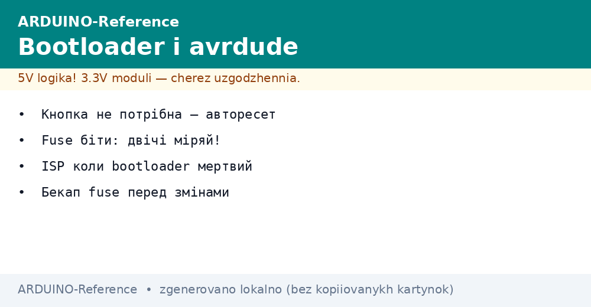
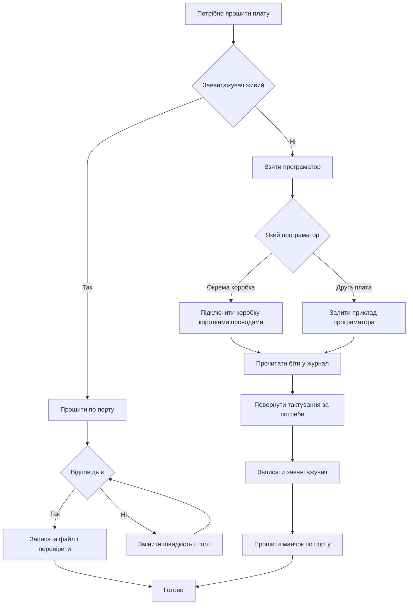

# Bootloader і avrdude - прошивка AVR


*Рис. Схема прошивки завантажувач скидання утиліта програматор біти конфігурації.*

> [!tip] Призначення ноти
> Пояснити як плата прошивається без зовнішнього програматора що робить автоматичне скидання як читати і писати памʼять консольною утилітою і як не перетворити плату на цеглу бітами конфігурації.

## 1. Призначення

Ця нота пояснює два шляхи запису програми в кристал звичайний через завантажувач по порту і службовий через окремі лінії програматором. Після прочитання читач розуміє чому плата сама перезапускається перед прошивкою вміє прочитати і записати памʼять і біти конфігурації консольною утилітою робить резервну копію перед змінами і відновлює плату коли завантажувач затерто.

Звичайна прошивка з попередньої ноти про [середовище і CLI](../../../ARDUINO-Reference/09-Proshivka/01-IDE-CLI.md) всередині використовує саме цей механізм скидання і завантажувача. Для практики знадобиться [класичний AVR](../../../ARDUINO-Reference/01-Hardware/01-AVR-Uno.md) або плата з нот про [компакт і ноги](../../../ARDUINO-Reference/01-Hardware/02-Nano-Mega.md) а вибір шляху прошивки доповнює [вибір середовища](../../../ARDUINO-Reference/00-Start/05-Vibir-seredovischa.md).

## 2. Як працює автоматичне скидання і завантажувач

Завантажувач це маленька програма наприкінці памʼяті яка першою отримує керування після скидання. Вона короткий час слухає порт і якщо з компʼютера йде прошивка приймає її і записує в основну памʼять. Якщо прошивки немає вона передає керування основній програмі. Тому плата перед кожною прошивкою робить коротке скидання сигналом з перетворювача порту.

| Етап | Що відбувається | Скільки триває |
| --- | --- | --- |
| Відкриття порту | Перетворювач смикає лінію скидання | Частка секунди |
| Пауза | Кристал перезапускається | Десятки мілісекунд |
| Вікно завантажувача | Слухає порт чекає команди | Приблизно секунда |
| Запис | Приймає блоки і пише у памʼять | Секунди залежно від розміру |
| Старт | Перехід до основної програми | Одразу після запису |
| Робота | Основна програма крутиться | До наступної прошивки |

```text
Часова схема прошивки словами:
  компʼютер відкриває порт
    -> лінія скидання смикається
      -> кристал перезапускається
        -> завантажувач слухає порт
          -> йдуть блоки прошивки
            -> запис у памʼять
              -> старт основної програми
  Якщо порт відкрив монітор без прошивки:
    плата просто перезапуститься і стартує стару програму.
```

Ознаки живого завантажувача світлодіод на виводі тринадцять кілька разів блимає після скидання порт зʼявляється одразу а прошивка стартує без помилок синхронізації. Якщо після скидання тиша і прошивка падає з помилкою відповіді ймовірно завантажувач затерто або обрано не той порт і швидкість.

## 3. Консольна утиліта запису памʼяті

Графічна кнопка прошивки всередині викликає консольну утиліту з готовими параметрами. Прямий виклик дає більше керування читання памʼяті у файл запис окремих областей перевірка бітів конфігурації і робота з програматором. Базовий набір це вказати конфігурацію програматор порт швидкість кристал і операції з памʼяттю.

| Операція | Призначення | Коли потрібна |
| --- | --- | --- |
| flash читання | Злити прошивку у файл | Резервна копія перед дослідами |
| flash запис | Залити файл у кристал | Прошивка без редактора |
| flash перевірка | Порівняти файл і кристал | Після збою живлення під час запису |
| eeprom читання | Злити налаштування | Перенесення налаштувань на іншу плату |
| eeprom запис | Залити налаштування | Відновлення після стирання |
| читання бітів | Подивитися конфігурацію | Перед будь-якою зміною бітів |
| запис бітів | Змінити тактування захист | Тільки з резервною копією |

```bash
  # Перевірка доступності утиліти
avrdude -v

  # Читання прошивки у файл для резерву
avrdude -c arduino -p atmega328p -P /dev/ttyUSB0 -b 115200 -U flash:r:backup.hex:i

  # Запис прошивки з перевіркою
avrdude -c arduino -p atmega328p -P /dev/ttyUSB0 -b 115200 -U flash:w:firmware.hex:i

  # Читання енергонезалежної памʼяті у файл
avrdude -c arduino -p atmega328p -P /dev/ttyUSB0 -b 115200 -U eeprom:r:eeprom_backup.hex:i

  # Запис енергонезалежної памʼяті
avrdude -c arduino -p atmega328p -P /dev/ttyUSB0 -b 115200 -U eeprom:w:settings.hex:i
```

```text
Розбір параметрів словами:
  -c arduino ........ тип програматора завантажувач на платі
  -p atmega328p ..... модель кристала класичної плати
  -P порт ........... порт до якого підключена плата
  -b швидкість ...... швидкість обміну із завантажувачем
  -U область ........ дія читання запис перевірка
  Формат i наприкінці означає текстовий файл у шістнадцятковому вигляді.
```

Для класичної плати беруть програматор arduino порт свій зі списку портів швидкість сто пʼятнадцять тисяч двісті для нового завантажувача і пʼятдесят сім тисяч шістсот для старого варіанта нано. Якщо відповіді немає першим ділом міняють швидкість а не плату.

## 4. Біти конфігурації що означають і резервна копія

Біти конфігурації це три байти які задають тактування джерело синхронізації затримку старту розмір області завантажувача і захист від стирання. Вони пишуться окремо від прошивки і діють одразу тому одна неправильна цифра може зупинити кристал. Золоте правило спочатку прочитати і записати всі три байти в нотатку потім міняти по одному біту і одразу перевіряти старт.

| Байт | За що відповідає | Типові значення для класики |
| --- | --- | --- |
| Молодший | Дільник частоти джерело синхронізації час старту | Кварц затримка старт без дільника |
| Старший | Розмір області завантажувача дозвіл скидання захист памʼяті | Завантажувач дві тисячі байтів скидання дозволене |
| Розширений | Поріг наглядача живлення | Поріг під живлення плати |
| Захист | Дивись наступний розділ | Заводське відкрите для розробки |

```bash
  # Читання всіх бітів перед будь-якими змінами
avrdude -c arduino -p atmega328p -P /dev/ttyUSB0 -b 115200 -U lfuse:r:-:h -U hfuse:r:-:h -U efuse:r:-:h

  # Те саме через програматор коли завантажувача нема
avrdude -c usbasp -p atmega328p -U lfuse:r:-:h -U hfuse:r:-:h -U efuse:r:-:h
```

```text
Журнал резервної копії словами:
  Дата плата порт:
    молодший байт ........ записати прочитане
    старший байт .......... записати прочитане
    розширений байт ....... записати прочитане
    файл прошивки ......... backup.hex поруч
    файл налаштувань ...... eeprom_backup.hex поруч
  Тільки після цього міняти біти.
```

Небезпечні дії вимкнення лінії скидання вибір зовнішнього тактування якого немає на платі і заборона послідовного програмування. Кожна з них робить кристал німим для звичайних засобів і далі потрібен програматор з зовнішнім синхросигналом або паралельне програмування.

## 5. Біти захисту від читання і запису

Біти захисту закривають памʼять від читання і запису ззовні. На етапі розробки їх лишають відкритими щоб можна було злити резервну копію і перепрошити плату. Закривають тільки у серійному виробі коли код не має потрапити до чужих рук. Важливо розуміти закрита плата не читається але і не налагоджується тому закриття це останній крок перед відвантаженням.

| Стан | Читання ззовні | Запис ззовні | Коли брати |
| --- | --- | --- | --- |
| Відкрито | Дозволено | Дозволено | Розробка досліди навчання |
| Частково | Обмежено | Частково | Тестові партії |
| Закрито | Заборонено | Заборонено | Серія після фінальної перевірки |

```bash
  # Перевірка стану захисту читанням
avrdude -c usbasp -p atmega328p -U lock:r:-:h

  # Відкриття для розробки повне стирання знімає захист
avrdude -c usbasp -p atmega328p -e

  # Закриття тільки для серії після фінальної перевірки
avrdude -c usbasp -p atmega328p -U lock:w:0x0C:m
```

```text
Порядок для серії словами:
  1. Прошити фінальний файл і перевірити роботу.
  2. Злити контрольний файл для архіву.
  3. Закрити захист останньою командою.
  4. Перевірити що читання заборонене.
  5. Покласти ключі захисту в сейф проекту.
```

Помилка новачків закрити плату на етапі навчання а потім дивуватися що резервна копія не читається. Лікується повним стиранням але разом із захистом зітреться і прошивка і налаштування тому спершу архів.

## 6. Програматор через окремі лінії

Окремий програматор спілкується з кристалом безпосередньо по лініях скидання даних і синхронізації і не потребує завантажувача. Його беруть щоб залити завантажувач у голий кристал прочитати біти змінити тактування і оживити цеглу. Два доступні варіанти недорогий USBasp і друга плата в ролі програматора.

| Варіант | Плюси | Мінуси |
| --- | --- | --- |
| USBasp | Дешевий швидкий окрема коробка | Потрібен драйвер на частині систем |
| Друга плата | Немає що купувати працює з коробки | Займає цілу плату повільніший |
| Завантажувач | Нічого зайвого тільки кабель | Не працює коли завантажувач затерто |

```text
Зʼєднання програматора словами:
  Програматор ......... Кристал на платі
    живлення 5V ....... живлення плати
    земля ............. земля плати
    скидання .......... лінія скидання
    дані вхід ......... лінія даних вхід
    дані вихід ........ лінія даних вихід
    синхронізація ..... лінія синхронізації
  Довжина проводів коротка живлення спільне.
```

```bash
  # Перевірка звʼязку через USBasp
avrdude -c usbasp -p atmega328p -v

  # Заливка завантажувача через USBasp
avrdude -c usbasp -p atmega328p -U flash:w:optiboot_atmega328.hex:i -U lfuse:w:0xFF:m -U hfuse:w:0xDE:m -U efuse:w:0xFD:m -U lock:w:0x0F:m

  # Та сама дія через другу плату в ролі програматора
avrdude -c stk500v1 -p atmega328p -P /dev/ttyUSB0 -b 19200 -U flash:w:optiboot_atmega328.hex:i
```

```cpp
// Перевірка що кристал живий після програматора
// Простий маячок без бібліотек і порту

const int LED_PIN = 13;  // Вивід вбудованого світлодіода

void setup() {
  pinMode(LED_PIN, OUTPUT);  // Вивід як вихід
}

void loop() {
  digitalWrite(LED_PIN, HIGH);  // Спалах
  delay(300);                   // Коротка пауза
  digitalWrite(LED_PIN, LOW);   // Пауза між спалахами
  delay(700);                   // Довга пауза ритм видно оком
}
```

Порядок роботи з другою платою в ролі програматора такий залити в неї приклад програматора з меню прикладів зʼєднати лінії за схемою вище обрати в меню програматор як програматор і натиснути записати завантажувач. Після цього зняти перемички і прошивати плату звичайним кабелем.

## 7. Відновлення цегли без завантажувача

Цеглою називають плату яка не відповідає по порту не блимає після скидання і не прошивається звичайним шляхом. Найчастіші причини затертий завантажувач неправильні біти тактування і вимкнена лінія скидання. План відновлення завжди один перейти на програматор прочитати що читається повернути тактування залити завантажувач і перевірити маячком.

| Симптом | Ймовірна причина | Перша дія |
| --- | --- | --- |
| Немає порту взагалі | Кабель живлення драйвер | Інший кабель драйвер список портів |
| Порт є відповіді немає | Затертий завантажувач | Програматор і запис завантажувача |
| Помилка синхронізації | Не та швидкість не той кристал | Дві швидкості по черзі перевірка моделі |
| Після зміни бітів тиша | Неправильне тактування | Зовнішній синхросигнал програматором |
| Скидання не працює | Вимкнена лінія скидання | Паралельне програмування або заміна кристала |

```bash
  # Крок перший читання через програматор
avrdude -c usbasp -p atmega328p -v

  # Крок другий повернення заводських бітів класики
avrdude -c usbasp -p atmega328p -U lfuse:w:0xFF:m -U hfuse:w:0xDE:m -U efuse:w:0xFD:m

  # Крок третій запис завантажувача і зняття захисту розробки
avrdude -c usbasp -p atmega328p -U flash:w:optiboot_atmega328.hex:i -U lock:w:0x0F:m
```

```text
План відновлення словами:
  1. Перевірити кабель живлення світлодіод живлення.
  2. Підключити програматор короткими проводами.
  3. Прочитати сигнатуру кристала командою перевірки.
  4. Прочитати і записати біти в журнал.
  5. Повернути тактування і записати завантажувач.
  6. Відʼєднати програматор прошити маячок по порту.
```

Якщо кристал не читається навіть програматором перевіряють живлення землю частоту програматора і цілісність дротів. Зниження частоти програматора часто допомагає коли кристал налаштований на повільне внутрішнє тактування. Крайній випадок подати зовнішній синхросигнал на вхід тактування і повторити читання.

## 8. Mermaid: вибір шляху прошивки



## Типові помилки

| # | Помилка | Чому погано | Як правильно |
| --- | --- | --- | --- |
| 1 | Запис бітів без резервної копії | Немає куди повернутися плата мовчить | Спочатку прочитати три байти і файли памʼяті в журнал |
| 2 | Вибір зовнішнього тактування без кварцу | Кристал зупиняється одразу | Лишати кварцове тактування поки кварц на платі |
| 3 | Вимкнення лінії скидання | Програматор більше не підключиться | Не чіпати цей біт без паралельного програматора |
| 4 | Не та швидкість завантажувача | Помилка синхронізації хоча плата жива | Спробувати обидві швидкості старого і нового завантажувача |
| 5 | Довгі дроти до програматора | Обриви обміну помилки читання | Короткі дроти спільна земля знижена частота |
| 6 | Закриття захисту на етапі навчання | Резервна копія не читається | Лишати відкрито до фінальної серії |
| 7 | Монітор відкритий під час прошивки | Порт зайнятий запис не стартує | Закривати монітор перед кожним записом |

## Офіційні джерела

- [Arduino Bootloader документація](https://docs.arduino.cc/hacking/software/Bootloader/) - робота завантажувача скидання запис у плату.
- [Arduino як програматор](https://docs.arduino.cc/built-in-examples/arduino-isp/ArduinoISP/) - друга плата в ролі програматора запис завантажувача.
- [Arduino as ISP (Arduino)](https://docs.arduino.cc/built-in-examples/arduino-isp/ArduinoISP) - завантаження файлів завантажувача приклади і довідка.

## Див. також

- [Home](../../../ARDUINO-Reference/Home.md)
- [вибір середовища](../../../ARDUINO-Reference/00-Start/05-Vibir-seredovischa.md)
- [класичний AVR](../../../ARDUINO-Reference/01-Hardware/01-AVR-Uno.md)
- [компакт і ноги](../../../ARDUINO-Reference/01-Hardware/02-Nano-Mega.md)
- [середовище і CLI](../../../ARDUINO-Reference/09-Proshivka/01-IDE-CLI.md)
