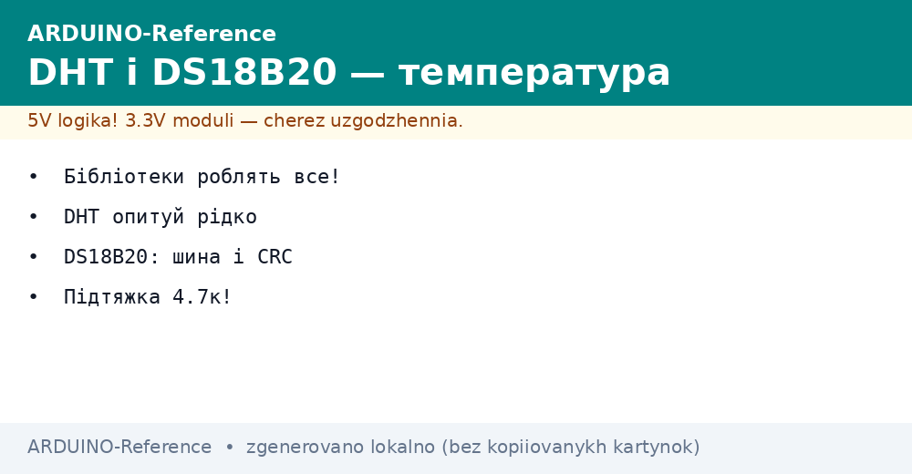
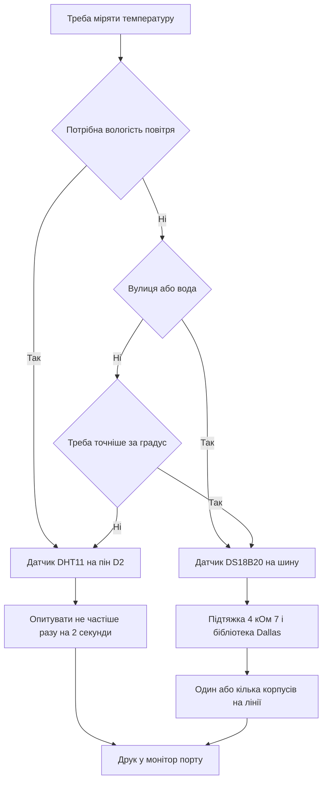

# DHT11 і DS18B20 на Arduino - температура просто


*Рис. Схема підключення DHT11 і DS18B20 до Arduino з підтяжкою і живленням.*

> [!tip] Призначення ноти
> Закрити базові питання виміру температури: коли вистачає дешевого DHT11 (±2 °C - лише індикатор), коли потрібен точний DS18B20, як підключити шину і не опитувати занадто часто.

## 1. Призначення

Датчик температури перетворює тепло повітря або корпусу на цифрове число.

Таке число плата читає одним викликом бібліотеки без ручного декодування імпульсів.

Дешевий DHT11 міряє температуру і вологість повітря у кімнаті.

Герметичний DS18B20 міряє температуру води, батареї опалення або вулиці.

Обидва датчики працюють від пяти вольт і віддають готові градуси.

Ця нота закриває повний цикл: вибір датчика, бібліотеки, підключення, паузи між опитуваннями і кілька датчиків на одній лінії.

Розуміння цих тем знімає більшість питань про нулі і прочерки у моніторі порту.

Плата Uno читає обидва датчики звичайними цифровими пінами без додаткових модулів.

Деталі про цифрові режими дивись у ноті [цифрові піни](../../../ARDUINO-Reference/03-GPIO/01-Digital-pini.md).

Основи виміру часу між опитуваннями описані у ноті [таймери і час](../../../ARDUINO-Reference/07-Timeri-Son/01-Timeri-millis.md).

## 2. Порівняння датчиків

| Параметр | DHT11 | DS18B20 |
| --- | --- | --- |
| Що міряє | Температура і вологість повітря | Тільки температура |
| Діапазон температури | Від 0 до 50 градусів | Від мінус 55 до плюс 125 градусів |
| Точність температури | Плюс мінус 2 градуси | Плюс мінус 0 градусів 5 |
| Крок виміру | 1 градус | Від 0 градусів 0625 до 12 біт |
| Інтервал опитування | Не частіше разу на 2 секунди | До 750 мілісекунд на перетворення |
| Шина | Власний однодротовий протокол | Шина OneWire з адресами |
| Кілька штук на піні | Ні, один датчик на пін | Так, десятки на одній лінії |
| Коли брати | Кімнатний термометр і вологість | Вулиця, вода, батарея, точна задача |

Таблиця показує головну різницю: DHT11 простий і дешевий, DS18B20 точний і гнучкий.

Для кімнатного індикатора вологості беруть DHT11 без вагань.

Для вуличного термометра або контролю нагріву беруть DS18B20 у герметичній гільзі.

Обидва датчики мають три піни: живлення, земля і дані.

Модулі DHT11 на платі часто мають вбудований резистор підтяжки.

Голi датчики DS18B20 вимагають зовнішнього резистора 4 кілооми 7.

Живлення підключають до пяти вольт плати, землю ведуть окремим дротом.

Сигнальну лінію підтягують до живлення через резистор.

## 3. DHT11: підключення і бібліотека

| Елемент | Значення | Практичний сенс |
| --- | --- | --- |
| Бібліотека | DHT sensor library від Adafruit | Готові функції читання без ручного таймінгу |
| Залежність | Adafruit Unified Sensor | Ставиться автоматично разом з основною |
| Пін даних | Будь-який цифровий, наприклад D2 | Один датчик займає один пін |
| Живлення | 5 вольт | Стабільна напруга дає стабільні показання |
| Частота читання | Раз на 2 секунди або рідше | Датчику потрібен час на нове перетворення |
| Формат даних | Градуси Цельсія і відсотки вологості | Одразу готові числа з крапкою |

Бібліотеку ставлять через менеджер бібліотек за назвою DHT sensor library.

Разом з нею ставиться допоміжний пакет уніфікованих сенсорів.

Обект датчика створюють з номером піна і типом DHT11.

У блоці налаштування викликають початок роботи датчика.

У циклі читають вологість і температуру окремими викликами.

Кожне читання перевіряють на ознаку помилки.

Помилка читання повертає спеціальне значення відсутності числа.

Таке значення перевіряють функцією перевірки на число.

Без перевірки у монітор потрапляють нулі і прочерки.

```text
Підключення модуля DHT11 до Uno:

   плата Uno                модуль DHT11
   ----------               -------------
   5V    -----------------  VCC
   GND   -----------------  GND
   D2    -----------------  DATA

   Модуль вже має підтяжку на платі.
   Голий датчик потребує резистор 10 кОм між VCC і DATA.
   Довжина дротів для DHT11 бажано до 5 метрів.
```

Схема показує три дроти без зайвих деталей для готового модуля.

Голий синій корпус вимагає додати резистор між живленням і даними.

Довгі дроти понад пять метрів дають помилки контрольної суми.

Для далеких точок краще взяти DS18B20 з шиною.

Живлення датчика беруть з плати, а не з окремого блока.

Спільна земля обов'язкова для будь-якого варіанту.

## 4. Скетч DHT11 з паузою 2 секунди

| Рядок коду | Що робить | Чому так |
| --- | --- | --- |
| Підключення DHT h | Заголовки бібліотек | Без них компілятор не знає тип датчика |
| DHT dht | Обект на піні D2 | Зберігає номер піна і тип |
| dht dot begin | Старт датчика | Готує пін до обміну |
| dht dot readHumidity | Читання вологості | Повертає відсотки |
| dht dot readTemperature | Читання температури | Повертає градуси |
| isnan | Перевірка на помилку | Відсікає биті пакети |
| delay 2000 | Пауза між читаннями | Датчик не встигає частіше |

Пауза дві секунди є вимогою виробника, а не порадою.

Частіші запити повертають старі дані або помилку.

Відлік часу краще робити без блокування циклу.

Для простих прикладів затримка допустима і наочна.

Для складних програм використовують відлік за годинником плати.

```cpp
#include <DHT.h>

#define DHT_PIN 2
#define DHT_TYPE DHT11

DHT dht(DHT_PIN, DHT_TYPE);

void setup() {
  Serial.begin(9600);
  dht.begin();
  Serial.println("DHT11 старт");
}

void loop() {
  delay(2000);
  float h = dht.readHumidity();
  float t = dht.readTemperature();
  if (isnan(h) || isnan(t)) {
    Serial.println("Помилка читання DHT11");
    return;
  }
  Serial.print("Вологість: ");
  Serial.print(h, 0);
  Serial.print(" %  Температура: ");
  Serial.print(t, 0);
  Serial.println(" C");
}
```

Скетч опитує датчик раз на дві секунди і друкує два числа.

Перевірка на число відсікає пошкоджені пакети.

Друк з нулем знаків показує реальну роздільну здатність DHT11.

Швидкість порту 9600 вистачає для двох чисел за секунду.

Затримка на початку циклу задає рівний темп опитування.

Повернення з циклу після помилки пропускає друк сміття.

Такий скетч є стартовою точкою для кімнатного термометра.

Дані легко вивести на індикатор або відправити по радіо.

Калібрування DHT11 не передбачене: точність задана заводом.

## 5. DS18B20 і шина OneWire

| Елемент | Значення | Практичний сенс |
| --- | --- | --- |
| Бібліотеки | OneWire плюс DallasTemperature | Перша керує шиною, друга розкладає градуси |
| Пін шини | Будь-який цифровий, наприклад D3 | Вся шина висить на одному піні |
| Підтяжка | 4 кілооми 7 між даними і живленням | Тримає лінію вгорі між імпульсами |
| Живлення | 5 вольт звичайне | Паразитне живлення краще не брати новачкам |
| Роздільна здатність | Від 9 до 12 біт | Більше біт дає довше перетворення |
| Адреса | 64 біт у кожному корпусі | Дозволяє розрізняти датчики на шині |

Шина OneWire працює за принципом ведучий і підлеглі.

Плата виступає ведучою і роздає команди всім датчикам.

Кожен датчик має заводську адресу з восьми байтів.

Адреса записана у корпус і не повторюється.

Бібліотека вміє шукати адреси автоматично.

Підтяжка 4 кілооми 7 обов'язкова для будь-якої довжини лінії.

Без підтяжки лінія плаває і обмін зривається.

Резистор ставлять фізично близько до плати.

```text
Підключення DS18B20 до Uno:

   5V ----+-------------------- VCC датчика
         |
        [R] 4 кОм 7
         |
   D3 ---+-------------------- DQ датчика
   GND ----------------------- GND датчика

   Резистор тримає лінію даних вгорі.
   Довжина шини може сягати десятків метрів.
   Кожен наступний датчик чіпляють паралельно.
```

Схема показує класичну підтяжку до живлення.

Всі датчики шини зєднують однойменними пінами паралельно.

Вита пара зменшує завади на довгих лініях.

Землю ведуть окремою жилою без розривів.

Живлення беруть з плати або з окремого стабільного блока.

Паразитний режим без дроту живлення вимагає сильного ключа.

Новачкам краще завжди тягнути три дроти.

## 6. Кілька датчиків і скетч DS18B20

| Задача | Виклик | Пояснення |
| --- | --- | --- |
| Старт шини | sensors dot begin | Знаходить всі датчики на лінії |
| Кількість | sensors dot getDeviceCount | Показує скільки корпусів відповіло |
| Запуск виміру | sensors dot requestTemperatures | Дає команду всім міряти |
| Читання за індексом | sensors dot getTempCByIndex | Нуль дає перший датчик |
| Читання за адресою | sensors dot getTempC | Точне звернення до потрібного корпусу |
| Роздільна здатність | sensors dot setResolution | 9 біт швидко, 12 біт точно |

Індекс датчика залежить від порядку пошуку на шині.

Порядок може мінятись після перепідключення дротів.

Надійні проекти читають датчики за адресами.

Адресу дізнаються окремим скетчем сканером.

Сканер друкує вісім байтів кожного корпусу.

Адреси записують у коментар програми і використовують як константи.

Температуру вулиці і батареї так не переплутати.

```cpp
#include <OneWire.h>
#include <DallasTemperature.h>

#define ONE_WIRE_PIN 3

OneWire oneWire(ONE_WIRE_PIN);
DallasTemperature sensors(&oneWire);

void setup() {
  Serial.begin(9600);
  sensors.begin();
  Serial.print("Знайдено датчиків: ");
  Serial.println(sensors.getDeviceCount());
  sensors.setResolution(12);
}

void loop() {
  sensors.requestTemperatures();
  float t0 = sensors.getTempCByIndex(0);
  Serial.print("Датчик 0: ");
  Serial.print(t0, 2);
  Serial.println(" C");
  if (t0 < -100.0) {
    Serial.println("Датчик не відповідає, перевір дроти");
  }
  delay(1000);
}
```

Скетч шукає датчики на старті і друкує кількість.

Роздільна здатність 12 біт дає крок 0 градусів 0625.

Команда запиту запускає перетворення у всіх корпусах.

Читання за індексом годиться для одного датчика.

Значення мінус 127 означає відсутність звязку.

Перевірка на дуже низьке значення ловить обрив лінії.

Затримка секунда робить монітор читабельним.

Для двох датчиків додають читання індексу один.

Для надійності переходять на читання за адресою.

Точний вимір напруги живлення дивись у ноті [вимір напруги](../../../ARDUINO-Reference/06-Analog/01-ADC.md).

## Mermaid: вибір датчика температури



Схема читається згори вниз: спочатку питання про вологість.

Вологість закриває тільки DHT11 простим скетчем.

Вулиця і вода вимагають герметичного DS18B20.

Точність краще за градус теж веде до DS18B20.

Пауза для DHT11 обов'язкова, підтяжка для DS18B20 обов'язкова.

Фінал однаковий: стабільні градуси у моніторі.

## Типові помилки

| # | Помилка | Чому погано | Як правильно |
| --- | --- | --- | --- |
| 1 | Опитування DHT11 кожні 300 мілісекунд | Датчик не встигає, повертає помилку | Пауза мінімум 2000 мілісекунд між читаннями |
| 2 | Відсутній резистор 4 кілооми 7 на шині DS18B20 | Лінія плаває, датчик не знаходиться | Резистор між даними і живленням біля плати |
| 3 | Ігнорування перевірки на число після читання | Биті пакети друкуються як нулі | Перевіряти значення функцією перевірки і пропускати биті |
| 4 | Паразитне живлення DS18B20 на довгій лінії | Просадка живлення зриває перетворення | Тягнули три дроти: живлення, земля, дані |
| 5 | Читання кількох DS18B20 за індексом у готовому виробі | Порядок пошуку міняється, датчики плутаються | Зчитати адреси сканером і читати за адресою |
| 6 | Довгі дроти DHT11 понад 10 метрів | Протокол без адрес чутливий до завад | Для далеких точок взяти DS18B20 на витій парі |

## Офіційні джерела

- [Датчик DHT11 на docs.arduino.cc](https://docs.arduino.cc/learn/electronics/environment/) - підключення, бібліотека і приклад читання температури.
- [Бібліотека DallasTemperature на arduino.cc](https://www.arduino.cc/reference/en/libraries/dallastemperature/) - функції шини, адреси і роздільна здатність.
- [Даташит DS18B20 від Analog Devices](https://www.analog.com/en/products/ds18b20.html) - діапазон, точність, час перетворення і команди шини.

## Див. також

- [Home](../../../ARDUINO-Reference/Home.md)
- [клімат по шині](../../../ARDUINO-Reference/10-Sensori/02-BME280.md)
- [дистанція і рух](../../../ARDUINO-Reference/10-Sensori/03-HC-SR04-PIR.md)
- [аналогові датчики](../../../ARDUINO-Reference/10-Sensori/04-LM35-NTC.md)
- [цифрові піни](../../../ARDUINO-Reference/03-GPIO/01-Digital-pini.md)
- [таймери і час](../../../ARDUINO-Reference/07-Timeri-Son/01-Timeri-millis.md)
