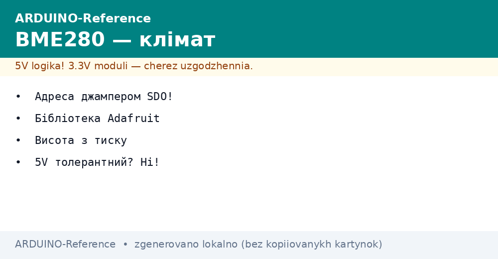
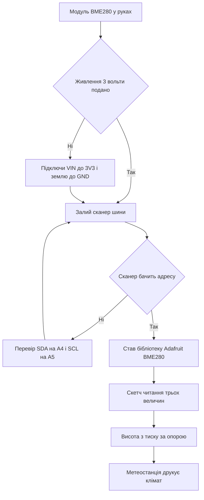

# BME280 на Arduino - тиск і вологість


*Рис. Схема підключення BME280 до Arduino по шині з живленням 3 вольти.*

> [!tip] Призначення ноти
> Навчити кліматичному модулю без диму: правильно подати 3 вольти, вибрати адресу джампером, прочитати тиск і вологість та перерахувати висоту.

## 1. Призначення

Модуль BME280 міряє три величини одразу: температуру, вологість і тиск.

Таке поєднання закриває домашню метеостанцію одним корпусом.

Датчик спілкується по шині з двома дротами.

Плата виступає ведучою, модуль відповідає як підлеглий.

Живлення модуля становить 3 вольти, а не пять.

Пять вольт на шину модуля подавати заборонено.

Ця нота закриває повний цикл: живлення, адреси, бібліотека, читання і висота з тиску.

Розуміння цих тем знімає більшість питань про відсутність модуля на шині.

Основи двопровідної шини описані у ноті [шина двох дротів](../../../ARDUINO-Reference/04-Shini/03-I2C-Wire.md).

Відлік часу між вимірами описаний у ноті [таймери і час](../../../ARDUINO-Reference/07-Timeri-Son/01-Timeri-millis.md).

## 2. Що вміє модуль

| Параметр | Діапазон | Практичний сенс |
| --- | --- | --- |
| Температура | Від мінус 40 до плюс 85 градусів | Кімната і вулиця без проблем |
| Вологість | Від 0 до 100 відсотків | Контроль спальні і теплиці |
| Тиск | Від 300 до 1100 гектопаскалів | Прогноз погоди і висота |
| Точність тиску | Близько 1 гектопаскаля | Видно зміну погоди за день |
| Точність вологості | Близько 3 відсотків | Достатньо для побуту |
| Інтерфейс | Шина з двома дротами | Два дроти замість купи аналогових входів |
| Другий інтерфейс | Послідовна шина з чотирма дротами | Запасний варіант для зайнятої шини |

Таблиця показує універсальність одного кристала.

Температура потрібна для компенсації інших вимірів.

Вологість потрібна для комфорту і рослин.

Тиск потрібен для прогнозу і висоти.

Всі три величини читають одним пакетом.

Модуль має малий розмір і низьке споживання.

Для батарейних вузлів беруть режим сну між вимірами.

Точність заводу вистачає без ручного калібрування.

Висоту рахують формулою з тиску на рівні моря.

Тиск на рівні моря беруть з метеослужби.

## 3. Живлення 3 вольти без компромісів

| Контакт модуля | Куди вести | Пояснення |
| --- | --- | --- |
| VIN або VCC | Вихід 3 вольти плати | Живлення логіки і сенсора |
| GND | Земля плати | Спільна точка для шини |
| SCL | Аналоговий вхід А5 на Uno | Лінія тактів шини |
| SDA | Аналоговий вхід А4 на Uno | Лінія даних шини |
| SDO | Земля або живлення через джампер | Вибір адреси модуля |
| CSB | До живлення 3 вольти | Перевід модуля у режим шини |

Живлення 3 вольти беруть з окремого виходу плати.

Плата Uno має вихід 3 вольти поруч з пятьма вольтами.

Логічні рівні шини теж становлять 3 вольти.

Входи модуля не розраховані на пять вольт.

Пряме підключення шини до пяти вольт пошкоджує кристал.

Модулі з перетворювачем рівнів на платі терплясть пять вольт живлення.

Дешеві голі плати без перетворювача вимагають тільки 3 вольти.

Перед покупкою читають написи біля отворів живлення.

Якщо написано 5V tolerant, живлення пять вольт допустиме.

Якщо такого напису немає, подають тільки 3 вольти.

```text
Підключення BME280 до Uno по шині:

   плата Uno             модуль BME280
   ---------             -------------
   3V3   --------------- VIN
   GND   --------------- GND
   A5    --------------- SCL
   A4    --------------- SDA
   SDO   --- до GND дає адресу 0x76
   SDO   --- до 3V3 дає адресу 0x77

   Підтяжки шини вже стоять на модулі.
   Довжина ліній бажано до 1 метра.
   Землю ведуть окремим проводом.
```

Схема показує чотири основні дроти плюс вибір адреси.

Лінії шини на Uno суміщені з аналоговими входами.

Окремих контактів шини на класичній платі немає.

Підтяжки до живлення вже розпаяні на модулі.

Додаткові резистори ставити не потрібно.

Довгі шлейфи збирають завади і зривають обмін.

Для далеких датчиків беруть екрановану пару.

## 4. Адреса джампером SDO

| Стан SDO | Адреса | Коли так |
| --- | --- | --- |
| На землі | 0x76 | Заводський варіант більшості модулів |
| На живленні 3 вольти | 0x77 | Другий модуль або інша партія |
| Плаваючий | Невизначена | Обмін зривається, модуль то видно то ні |
| Два модулі разом | Один на 0x76, другий на 0x77 | Два кліматичні вузли на одній шині |

Адреса модуля залежить від рівня на піні SDO.

Пін SDO задає молодший біт адреси.

Земля дає адресу 0x76, живлення дає 0x77.

Більшість модулів з магазину мають адресу 0x76.

Деякі партії мають перемичку на 0x77.

Перед запуском шину сканують скетчем сканером.

Сканер друкує всі адреси, що відповіли.

Якщо сканер мовчить, перевіряють живлення і дроти.

Якщо сканер бачить іншу адресу, її підставляють у програму.

Два модулі на одній шині розводять на різні адреси.

Для цього на другому модулі перепаюють джампер.

Без паяльника два однакові модулі не розвести.

```text
Як дізнатись адресу модуля:

   1. Залий скетч сканер шини.
   2. Відкрий монітор порту на 9600.
   3. Подивись рядок зі знайденим пристроєм.
   4. Запиши адресу у константу програми.

   Приклад виводу сканера:

   Знайдено пристрій на 0x76
   Знайдено пристрій на 0x77
   Готово, знайдено 1 пристрій
```

Послідовність показує шлях від заліза до коду.

Сканер входить до прикладів бібліотеки шини.

Швидкість сканування стандартна 100 кілогерц.

Після знахідки адресу фіксують у програмі.

Адресу коментують поруч з місцем встановлення датчика.

Такий коментар рятує через пів року.

## 5. Бібліотека Adafruit і перший вимір

| Елемент | Назва | Практичний сенс |
| --- | --- | --- |
| Бібліотека сенсора | Adafruit BME280 Library | Готові функції читання трьох величин |
| Залежність | Adafruit Unified Sensor | Спільний формат даних сенсорів |
| Залежність шини | Вбудована бібліотека Wire | Керує двома дротами шини |
| Обект | Adafruit_BME280 bme | Зберігає адресу і налаштування |
| Старт | bme dot begin з адресою | Перевіряє звязок і калібрування |
| Читання | readTemperature readHumidity readPressure | Три готові числа |

Бібліотеку ставлять через менеджер за назвою BME280.

Разом з нею ставиться пакет уніфікованих сенсорів.

Шина стартує викликом початку роботи.

Обект створюють без параметрів, адресу дають на старті.

Старт повертає ознаку успіху.

Невдалий старт означає неправильну адресу або обрив.

Після вдалого старту читають три величини.

Тиск бібліотека віддає у паскалях.

Гектопаскалі отримують діленням на сто.

Вологість віддають у відсотках, температуру у градусах.

```cpp
#include <Wire.h>
#include <Adafruit_Sensor.h>
#include <Adafruit_BME280.h>

#define BME_ADDR 0x76

Adafruit_BME280 bme;

void setup() {
  Serial.begin(9600);
  Wire.begin();
  if (!bme.begin(BME_ADDR)) {
    Serial.println("BME280 не знайдено, перевір адресу");
    while (1) {
      delay(100);
    }
  }
  Serial.println("BME280 готовий");
}

void loop() {
  float t = bme.readTemperature();
  float h = bme.readHumidity();
  float p = bme.readPressure() / 100.0;
  Serial.print("T=");
  Serial.print(t, 1);
  Serial.print(" H=");
  Serial.print(h, 0);
  Serial.print(" P=");
  Serial.print(p, 0);
  Serial.println(" гПа");
  delay(2000);
}
```

Скетч стартує шину і перевіряє наявність модуля.

Зациклення після помилки зупиняє програму з повідомленням.

Читання трьох величин займає частки секунди.

Друк показує градуси, відсотки і гектопаскалі.

Пауза дві секунди робить монітор спокійним.

Частіші виміри не дають нової інформації про клімат.

Для запису у пам'ять додають картку і мітку часу.

Для екрана додають вивід на індикатор.

Стабільне живлення дає стабільний тиск.

## 6. Висота з тиску

| Величина | Формула | Пояснення |
| --- | --- | --- |
| Тиск на місці | P у гектопаскалях | Число з датчика |
| Тиск на рівні моря | P0 з метеослужби | Опора для перерахунку |
| Висота | 44330 помножити на різницю | Стандартна барометрична формула |
| Крок висоти | Близько 12 метрів на гектопаскаль | Біля рівня моря |
| Точність | Плюс мінус 1 метр відносно | Абсолютна гірша через погоду |
| Дрейф погоди | До десятків метрів за день | Тиск пливе з фронтами |

Висоту рахують відносним методом.

Абсолютна висота пливе разом з погодою.

Відносна зміна висоти точна і стабільна.

Для альтиметра фіксують тиск старту.

Для метеостанції показують тиск, а не висоту.

Тиск на рівні моря беруть з найближчого аеропорту.

Без опори висота бреше на десятки метрів.

Бібліотека має готову функцію перерахунку.

Функція приймає тиск і опорний тиск.

Результат віддають у метрах.

```cpp
#include <Wire.h>
#include <Adafruit_Sensor.h>
#include <Adafruit_BME280.h>

Adafruit_BME280 bme;

const float SEA_LEVEL = 1013.25;

void setup() {
  Serial.begin(9600);
  Wire.begin();
  bme.begin(0x76);
}

void loop() {
  float p = bme.readPressure() / 100.0;
  float alt = bme.readAltitude(SEA_LEVEL);
  Serial.print("Тиск: ");
  Serial.print(p, 1);
  Serial.print(" гПа  Висота: ");
  Serial.print(alt, 1);
  Serial.println(" м");
  delay(2000);
}
```

Скетч показує пару тиск плюс висота.

Константу рівня моря правлять під свій регіон.

Актуальний тиск дивляться на сайті метеослужби.

Для походу фіксують точку старту як нуль.

Далі дивляться набір висоти відносно старту.

Такий метод не залежить від погоди.

Крок висоти близько метра видно впевнено.

Шум тиску згладжують усередненням десяти вимірів.

Точний вимір аналогових сигналів дивись у ноті [вимір напруги](../../../ARDUINO-Reference/06-Analog/01-ADC.md).

## Mermaid: запуск BME280 з нуля



Схема читається згори вниз: спочатку живлення.

Живлення 3 вольти є умовою виживання модуля.

Сканер підтверджує адресу до основного коду.

Перевірка дротів закриває більшість невдач.

Бібліотека прибирає ручну математику компенсації.

Фінал дає три числа і висоту.

## Типові помилки

| # | Помилка | Чому погано | Як правильно |
| --- | --- | --- | --- |
| 1 | Живлення модуля від 5 вольт без перетворювача | Кристал гріється і гине, шина клинить | Подавати 3 вольти на VIN, перевірити напис на платі |
| 2 | Неправильна адреса у виклику початку | Модуль мовчить, старт повертає помилку | Спочатку сканер, потім адресу у програму |
| 3 | Плаваюча пін SDO без джампера | Адреса стрибає, обмін нестабільний | Припаяти SDO до землі або до живлення |
| 4 | Шина понад 2 метри без екрану | Завади зривають пакети, дані биті | Короткі дроти, вита пара, швидкість 100 кілогерц |
| 5 | Опитування десять разів за секунду | Саморозігрів спотворює температуру | Пауза 2 секунди, для батареї сон між вимірами |
| 6 | Абсолютна висота без опори рівня моря | Погода зсуває показання на десятки метрів | Брати опорний тиск з метеослужби або міряти відносно старту |

## Офіційні джерела

- [Модуль BME280 на docs.arduino.cc](https://docs.arduino.cc/learn/electronics/environment/) - живлення, шина і приклад метеостанції.
- [Бібліотека Adafruit BME280 на arduino.cc](https://www.arduino.cc/reference/en/libraries/adafruit-bme280-library/) - функції читання, адреси і висота.
- [Даташит BME280 від Bosch](https://www.bosch-sensortec.com/products/environmental-sensors/humidity-sensors-bme280/) - діапазони, точність і режими виміру.

## Див. також

- [Home](../../../ARDUINO-Reference/Home.md)
- [температура по дроту](../../../ARDUINO-Reference/10-Sensori/01-DHT-DS18B20.md)
- [дистанція і рух](../../../ARDUINO-Reference/10-Sensori/03-HC-SR04-PIR.md)
- [аналогові датчики](../../../ARDUINO-Reference/10-Sensori/04-LM35-NTC.md)
- [шина двох дротів](../../../ARDUINO-Reference/04-Shini/03-I2C-Wire.md)
- [вимір напруги](../../../ARDUINO-Reference/06-Analog/01-ADC.md)
