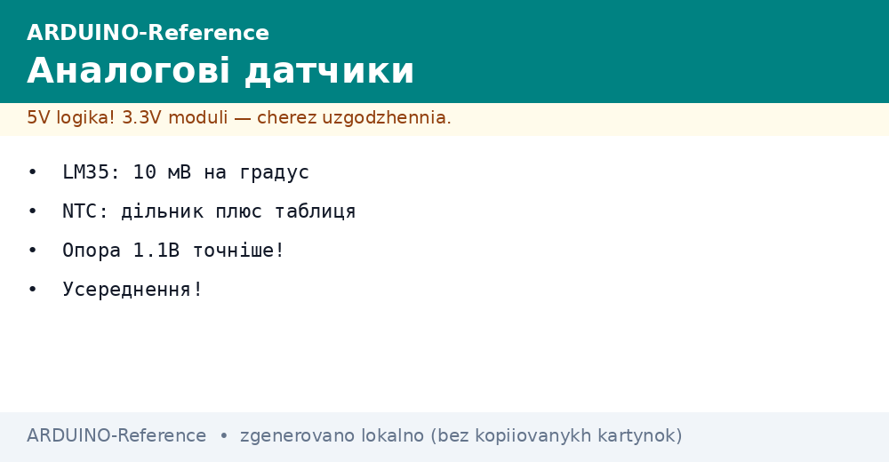
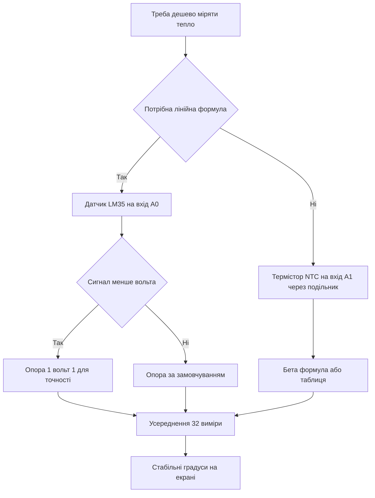

# LM35 і NTC - аналогова температура


*Рис. Схема підключення LM35 і NTC до аналогових входів Arduino з подільником.*

> [!tip] Призначення ноти
> Навчити дешевому виміру тепла без цифри: читати лінійний LM35, рахувати термістор NTC через подільник, підсилити точність опорою і згладити шум усередненням.

## 1. Призначення

Аналоговий датчик видає напругу, що залежить від температури.

Плата міряє цю напругу вбудованим перетворювачем.

Лінійний LM35 видає десять мілівольт на кожен градус.

Термістор NTC змінює опір нелінійно з нагрівом.

Перший датчик простий у формулі.

Другий датчик дешевий і герметичний.

Обидва читають звичайним аналоговим входом.

Ця нота закриває повний цикл: формули, подільник, опора, усереднення і два скетчі.

Розуміння цих тем знімає більшість питань про стрибки показань.

Основи перетворювача описані у ноті [вимір напруги](../../../ARDUINO-Reference/06-Analog/01-ADC.md).

Цифрові альтернативи описані у ноті [температура по дроту](../../../ARDUINO-Reference/10-Sensori/01-DHT-DS18B20.md).

## 2. Порівняння датчиків

| Параметр | LM35 | NTC 10 кОм |
| --- | --- | --- |
| Вихід | Напруга 10 мілівольт на градус | Опір падає з нагрівом |
| Формула | Лінійна, множення на сто | Нелінійна, бета формула або таблиця |
| Діапазон | Від 0 до 100 градусів | Від мінус 40 до плюс 125 градусів |
| Точність без калібрування | Близько 1 градуса | Близько 1 градуса з правильною бетою |
| Підключення | Три піни прямо до плати | Подільник з постійним резистором |
| Ціна | Середня | Найнижча |
| Герметичність | Корпус пластмасовий | Є намистини і гільзи для води |
| Коли брати | Кімната, корпус, радіатор | Вулиця, вода, батарея, дешева серія |

Таблиця показує вибір між простотою і ціною.

Лінійний датчик беруть для швидких дослідів.

Термістор беруть для серії і вологих місць.

Обидва вимагають стабільного живлення.

Коливання живлення прямо впливають на показання.

Тому опору і усереднення налаштовують уважно.

Довгі дроти додають завади.

Аналогову землю ведуть окремо.

Цифрові сплески відокремлюють паузою.

## 3. LM35: десять мілівольт на градус

| Контакт LM35 | Куди вести | Пояснення |
| --- | --- | --- |
| VCC | 5 вольт плати | Живлення кристала |
| GND | Земля плати | Спільна точка виміру |
| OUT | Аналоговий вхід, наприклад А0 | Сигнал 10 мілівольт на градус |

Формула проста: напруга у вольтах помножити на сто.

Кімнатні 25 градусів дають чверть вольта.

Нуль градусів дає нуль вольт.

Сто градусів дає один вольт.

Шкала перетворювача 5 вольт використовується лише на пту частину.

Крок виміру становить близько половини градуса.

Для точнішого читання вмикають внутрішню опору.

Опора 1 вольт 1 дає крок близько десятини градуса.

Датчик гріється власним струмом мізерно.

Саморозігрів не перевищує десятих градуса.

Корпус ставлять у потік повітря.

Теплопровідна паста покращує контакт з радіатором.

```text
Підключення LM35 до Uno:

   плата Uno             датчик LM35
   ---------             -----------
   5V    --------------- VCC
   GND   --------------- GND
   A0    --------------- OUT

   Конденсатор 100 нФ між VCC і GND біля датчика.
   Дроти бажано короткі, до 1 метра.
   Аналогову землю ведуть окремо від силових.
```

Схема показує три дроти і фільтр живлення.

Конденсатор ріже голки живлення.

Без конденсатора показання тремтять.

Довгі дроти ловлять мережеві наведення.

Вита пара з землею зменшує шум.

Металевий корпус датчика ізолюють від радіатора.

Прямий контакт з високою напругою заборонений.

Живлення беруть з плати, а не з імпульсного блока.

## 4. Скетч LM35 з опорою

| Рядок | Що робить | Чому так |
| --- | --- | --- |
| analogReference INTERNAL | Опора 1 вольт 1 | Дрібний крок для малих напруг |
| analogRead на А0 | Код від 0 до 1023 | Сире читання входу |
| Код у напругу | Код поділити на 1023 і помножити на 1 вольт 1 | Відновлення вольтів |
| Напруга у градуси | Вольти помножити на 100 | Десять мілівольт на градус |
| Усереднення 64 рази | Цикл сумування | Ділить шум у вісім разів |
| Пауза 200 мілісекунд | Спокійний монітор | Читабельний вивід |

Внутрішня опора дає стабільний верх шкали.

Живлення USB гуляє, опора тримається.

Тому точність з опорою вища.

Перші виміри після зміни опори пропускають.

Вузол опори усталюється кілька мілісекунд.

Усереднення прибирає випадковий шум.

Шістдесят чотири виміри тривають шість мілісекунд.

Для термометра затримка непомітна.

Калібрування зводиться до одного множника.

Множник підганяють за кімнатним термометром.

```cpp
const int LM35_PIN = A0;

void setup() {
  Serial.begin(9600);
  analogReference(INTERNAL);
  delay(10);
}

float readLM35() {
  long sum = 0;
  for (int i = 0; i < 64; i++) {
    sum += analogRead(LM35_PIN);
  }
  float raw = sum / 64.0;
  float voltage = raw * 1.1 / 1023.0;
  return voltage * 100.0;
}

void loop() {
  float t = readLM35();
  Serial.print("LM35: ");
  Serial.print(t, 1);
  Serial.println(" C");
  delay(500);
}
```

Скетч вмикає опору 1 вольт 1 на старті.

Пауза дає вузлу опори усталитись.

Функція збирає пачку з 64 кодів.

Сума має тип long для запасу.

Ділення з крапкою зберігає дробову частину.

Множення на сто дає градуси.

Друк з одним знаком показує реальну точність.

Півсекундна пауза робить монітор спокійним.

Без усереднення останній знак тремтить.

З усередненням лінія рівна.

Такий підхід годиться для кімнати і радіатора.

## 5. NTC: подільник і бета формула

| Елемент | Значення | Практичний сенс |
| --- | --- | --- |
| Номінал | 10 кОм при 25 градусах | Наймасовіша серія |
| Бета | Близько 3950 кельвінів | Крутизна характеристики |
| Парний резистор | 10 кОм один відсоток | Друге плече подільника |
| Схема | Термістор до живлення, резистор до землі | Середина на аналоговий вхід |
| Діапазон | Середина ходить від нуля до живлення | Корисний сигнал на весь хід |
| Таблиця | Альтернатива формулі | Точніше для відповідальної задачі |

Термістор змінює опір експоненційно.

Пряма формула для напруги не годиться.

Спочатку з напруги відновлюють опір.

Потім з опору рахують температуру.

Бета формула повязує опір і температуру через логарифм.

Температуру рахують у кельвінах.

Градуси отримують відніманням 273 градусів 15.

Бету беруть з даташиту конкретної серії.

Найчастіше трапляється 3950.

Невірна бета зсуває краї діапазону.

Точні задачі калібрують за двома точками.

Таблиця дає кращу точність без математики.

```text
Подільник NTC на 10 кОм:

   5V ---- [NTC 10k] ----+---- [R 10k] ---- GND
                         |
                        вхід А1

   При 25 градусах середина дає 2 вольти 5.
   Нагрів знижує опір NTC, напруга падає.
   Охолодження підвищує опір, напруга росте.
   Резистор беруть точний, один відсоток.
   Паралельно резистору ставлять 100 нФ.
```

Схема показує класичний подільник навпіл.

Середина йде на аналоговий вхід.

Конденсатор згладжує завади.

Номінали 10 кОм дають малий струм.

Струм близько чверті міліампера не гріє намистину.

Саморозігрів термістора мізерний.

Довгі лінії крутять витою парою.

Землю подільника ведуть до плати.

## 6. Скетч NTC з бетою і таблицею

| Крок | Формула | Пояснення |
| --- | --- | --- |
| Код у напругу | raw поділити на 1023 і помножити на 5 | Відновлення вольтів середини |
| Напруга в опір | R помножити на вольти і поділити на різницю | Перерахунок подільника |
| Опір у температуру | Логарифм відношення плюс дрейф | Бета формула у кельвінах |
| Кельвіни у градуси | Мінус 273 градусів 15 | Звична шкала |
| Усереднення | Пачка 32 виміри | Чиста лінія без тремтіння |
| Таблиця | Інтерполяція між сусідами | Запасний точний метод |

Бета формула вимагає натурального логарифма.

Логарифм рахують вбудованою функцією.

Температуру в кельвінах переводять у градуси.

Перевірка на обрив ловить нульовий код.

Перевірка на замикання ловить повну шкалу.

Обидва краї означають аварію датчика.

Табличний метод читає калібрувальні точки.

Точки міряють у льоду і у кипінні.

Між точками роблять лінійну інтерполяцію.

Таблиця точніша за універсальну бету.

```cpp
#include <math.h>

const int NTC_PIN = A1;
const float R_FIXED = 10000.0;
const float R_NOM = 10000.0;
const float T_NOM = 25.0 + 273.15;
const float BETA = 3950.0;

float readNTC() {
  long sum = 0;
  for (int i = 0; i < 32; i++) {
    sum += analogRead(NTC_PIN);
  }
  float raw = sum / 32.0;
  if (raw < 1.0 || raw > 1022.0) {
    return -1000.0;
  }
  float v = raw * 5.0 / 1023.0;
  float r = R_FIXED * v / (5.0 - v);
  float k = 1.0 / (1.0 / T_NOM + log(r / R_NOM) / BETA);
  return k - 273.15;
}

void setup() {
  Serial.begin(9600);
}

void loop() {
  float t = readNTC();
  if (t < -900.0) {
    Serial.println("Обрив або замикання NTC");
  } else {
    Serial.print("NTC: ");
    Serial.print(t, 1);
    Serial.println(" C");
  }
  delay(500);
}
```

Скетч усереднює 32 виміри для чистоти.

Перевірка країв ловить аварію дротів.

Формула подільника відновлює опір.

Бета формула дає кельвіни.

Віднімання константи дає градуси.

Друк показує число або аварію.

Пауза пів секунди розвантажує монітор.

Константи винесені на початок для калібрування.

Бету правлять під свій даташит.

Номінал парного резистора міряють мультиметром.

## 7. Опора і усереднення для точності

| Прийом | Що дає | Коли брати |
| --- | --- | --- |
| Опора 1 вольт 1 | Крок 1 мілівольт замість 5 | Малі сигнали LM35 |
| Зовнішня опора 3 вольти 3 | Стабільна шкала | Точні подільники NTC |
| Усереднення 32 виміри | Менше шуму у 5 разів | Будь-який повільний термометр |
| Медіана з 5 читань | Ріже викиди | Завади від реле і моторів |
| Конденсатор 100 нФ | Ріже голки | Біля кожного аналогового входу |
| Окрема земля | Чистий нуль | Довгі аналогові лінії |

Опора за замовчуванням дорівнює живленню плати.

Живлення від USB гуляє з навантаженням.

Гуляння живлення прямо зсуває градуси.

Внутрішня опора не залежить від USB.

Тому LM35 переводять на внутрішню опору.

Для NTC важлива стабільність живлення подільника.

Подільник живлять від тієї самої шини, що й опора.

Тоді коливання скорочуються.

Усереднення ділить випадковий шум.

Медіана додатково ріже поодинокі голки.

Комбінація дає рівну лінію.

Клімат по шині дивись у ноті [клімат по шині](../../../ARDUINO-Reference/10-Sensori/02-BME280.md).

Дистанцію і рух дивись у ноті [дистанція і рух](../../../ARDUINO-Reference/10-Sensori/03-HC-SR04-PIR.md).

## Mermaid: вибір аналогового датчика



Схема читається згори вниз: спочатку простота.

Лінійність веде до LM35 з множенням на сто.

Дешевизна веде до NTC з подільником.

Малий сигнал вимагає малої опори.

Бета формула закриває нелінійність.

Усереднення закриває шум.

## Типові помилки

| # | Помилка | Чому погано | Як правильно |
| --- | --- | --- | --- |
| 1 | LM35 на опорі 5 вольт без усереднення | Крок пів градуса і тремтіння знака | Опора 1 вольт 1 плюс пачка 64 виміри |
| 2 | NTC без парного точного резистора | Невідоме плече подільника спотворює градуси | Резистор 10 кОм один відсоток, номінал у коді |
| 3 | Невірна бета 3950 для чужої серії | Краї діапазону брешуть на градуси | Брати бету з даташиту своєї намистини |
| 4 | Довгі аналогові дроти без конденсатора | Мережеві наведення гойдають показання | 100 нФ біля входу, вита пара, окрема земля |
| 5 | Живлення подільника від просадженої шини | Формула рахує від 5 вольт, реально менше | Міряти реальне живлення або живити від стабільної опори |
| 6 | Ігнорування обриву датчика | Обрив читають як температуру | Перевіряти краї шкали і друкувати аварію |

## Офіційні джерела

- [Аналоговий вхід на docs.arduino.cc](https://docs.arduino.cc/learn/microcontrollers/analog-input/) - шкала, опора і усереднення вимірів.
- [Датчик LM35 на arduino.cc](https://www.arduino.cc/reference/en/libraries/lm35/) - формула десять мілівольт на градус і приклад.
- [Даташит LM35 від Texas Instruments](https://www.ti.com/product/LM35) - діапазон, точність і схема вмикання.

## Див. також

- [Home](../../../ARDUINO-Reference/Home.md)
- [температура по дроту](../../../ARDUINO-Reference/10-Sensori/01-DHT-DS18B20.md)
- [клімат по шині](../../../ARDUINO-Reference/10-Sensori/02-BME280.md)
- [дистанція і рух](../../../ARDUINO-Reference/10-Sensori/03-HC-SR04-PIR.md)
- [вимір напруги](../../../ARDUINO-Reference/06-Analog/01-ADC.md)
- [цифрові піни](../../../ARDUINO-Reference/03-GPIO/01-Digital-pini.md)
