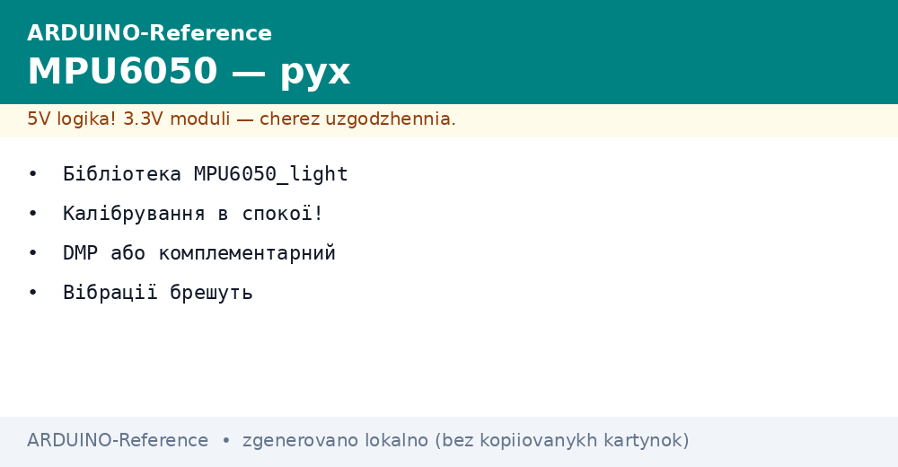
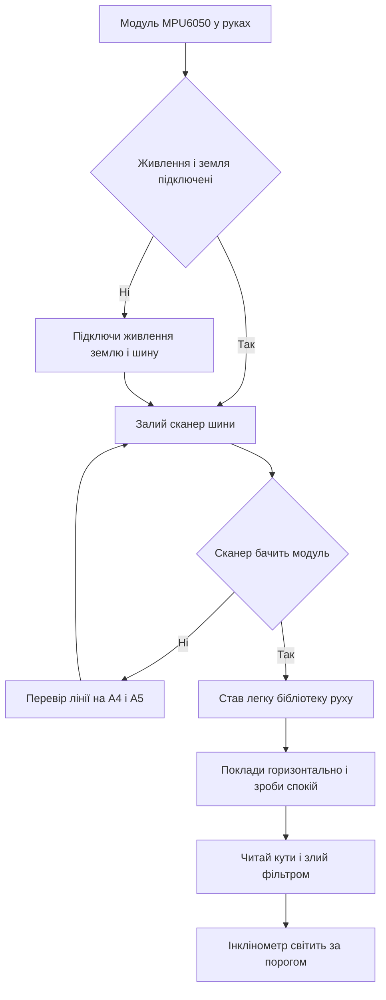

# MPU6050 на Arduino - рух і нахил


*Рис. Схема підключення MPU6050 до Arduino по шині з живленням і лініями даних.*

> [!tip] Призначення ноти
> Навчити бачити рух і нахил плати: підключити модуль по двох дротах, прибрати зміщення спокоєм, злити дані двох сенсорів у стабільний кут і зібрати простий інклінометр.

## 1. Призначення

Модуль MPU6050 поєднує два сенсори в одному кристалі.

Акселерометр міряє прискорення по трьох осях разом із напрямом тяжіння.

Гіроскоп міряє кутову швидкість повороту по тих самих трьох осях.

Разом пара дає повну картину руху плати у просторі.

Такий вузол ставлять у балансири і квадрокоптери початкового рівня.

Його ставлять у пульти жестів і саморобні стабілізатори камери.

Його ставлять у нахиломіри для сонячних панелей і щогл антен.

Плата читає модуль по шині з двома дротами.

Основи такої шини описані у ноті [шина двох дротів](../../../ARDUINO-Reference/04-Shini/03-I2C-Wire.md).

Готовність нових даних можна ловити перериванням плати.

Деталі такого прийому описані у ноті [переривання плати](../../../ARDUINO-Reference/03-GPIO/03-Pererivannya.md).

Ця нота закриває цикл: живлення, адреса, бібліотека, спокій, кути і готовий інклінометр.

## 2. Що всередині модуля

| Блок | Що робить | Практичний сенс |
| --- | --- | --- |
| Акселерометр | Міряє прискорення по осях Ікс Ігрек Зет | У спокої показує вектор тяжіння |
| Гіроскоп | Міряє швидкість повороту по тих самих осях | Швидка реакція на поворот без затримки |
| Сенсор температури | Міряє нагрів кристала | Контроль дрейфу нуля при прогріві |
| Перетворювач | Переводить аналог у цифру на 16 біт | Дрібний крок чутливості до нахилу |
| Шина обміну | Два дроти для команд і даних | Спільна шина з іншими модулями |
| Пін переривання | Сигнал готовності нового виміру | Точний період опитування без пропусків |
| Пін адреси | Вибір між двома адресами | Два модулі на одній шині |

Модуль живиться від низької напруги логіки.

Більшість плат модулів мають стабілізатор на борту.

Такий стабілізатор дозволяє живити модуль від п'яти вольт.

Логічні рівні шини лишаються низькими за рівнем.

Плата Uno спокійно читає низькі рівні як логічну одиницю.

Кристал чутливий до вібрації і ударів.

Модуль кріплять на стійки без перекосу плати.

Гвинти затягують рівномірно без згину основи.

Тріщини паяння дають плаваючі нулі і стрибки кутів.

Для кліматичних задач краще глянути ноту [клімат по шині](../../../ARDUINO-Reference/10-Sensori/02-BME280.md).

Для газової сигналізації глянути ноту [гази і дим](../../../ARDUINO-Reference/10-Sensori/06-MQ-Gas.md).

## 3. Живлення і підключення по шині

| Контакт модуля | Куди вести | Пояснення |
| --- | --- | --- |
| VCC | П'ять вольт плати | Через бортовий стабілізатор на низьку напругу |
| GND | Земля плати | Спільна точка для живлення і шини |
| SCL | Аналоговий вхід А5 на Uno | Лінія тактів шини |
| SDA | Аналоговий вхід А4 на Uno | Лінія даних шини |
| AD0 | Земля або живлення | Молодший біт адреси модуля |
| INT | Цифровий пін D2 за бажанням | Сигнал готовності нового виміру |
| XDA і XCL | Лишити вільними | Для зовнішнього магнітометра у складних схемах |

Живлення подають на VCC і землю.

Землю ведуть окремим коротким дротом.

Лінії шини ведуть поруч із землею без довгих петель.

Довжина ліній бажано не більше одного метра.

Підтяжки шини вже стоять на платі модуля.

Додаткові резистори ставити не потрібно.

Адреса залежить від рівня на піні AD0.

Земля дає адресу 0x68, живлення дає адресу 0x69.

Більшість модулів з магазину мають адресу 0x68.

Перед кодом шину сканують скетчем сканером.

Сканер друкує всі адреси, що відповіли на запит.

```text
Підключення MPU6050 до Uno по шині:

   плата Uno              модуль MPU6050
   ---------              -------------
   5V    ---------------- VCC
   GND   ---------------- GND
   A5    ---------------- SCL
   A4    ---------------- SDA
   AD0   --- до GND дає адресу 0x68
   AD0   --- до живлення дає адресу 0x69
   D2    --- до INT для точних періодів

   Підтяжки шини вже стоять на модулі.
   Довжина ліній бажано до 1 метра.
   Модуль покласти горизонтально для нуля кутів.
```

Схема показує чотири обов'язкові дроти.

П'ятий дріт адреси задає молодший біт.

Шостий дріт переривання потрібен для рівних періодів.

Без переривання опитування ведуть за таймером у коді.

Точний вимір напруги живлення дивись у ноті [вимір напруги](../../../ARDUINO-Reference/06-Analog/01-ADC.md).

Модуль кладуть горизонтально написом догори.

Таке положення дає нульові кути після калібрування.

Перевернутий монтаж дає зсув на сто вісімдесят градусів.

Напрям осей звіряють з друком на платі модуля.

Вісь Зет у спокої показує одиницю тяжіння.

Осі Ікс і Ігрек у спокої показують нулі.

## 4. Бібліотека MPU6050_light і перше читання

| Елемент | Назва | Практичний сенс |
| --- | --- | --- |
| Бібліотека | MPU6050_light | Легка робота без складних залежностей |
| Залежність шини | Вбудована бібліотека Wire | Керує двома дротами обміну |
| Об'єкт | MPU6050 mpu з адресою | Зберігає адресу і зміщення нуля |
| Старт | mpu dot begin | Перевіряє зв'язок і будить кристал |
| Калібрування | mpu dot calcOffsets | Рахує зміщення у нерухомому стані |
| Оновлення | mpu dot update | Читає свіжі дані з кристала |
| Кути | mpu dot getAngleX getAngleY | Готові кути з внутрішнім злиттям |
| Прискорення | mpu dot getAccX getAccY getAccZ | Сирі прискорення для своїх формул |

Бібліотеку ставлять через менеджер за назвою MPU6050_light.

Разом з нею ставити нічого зайвого не потрібно.

Шину стартують викликом початку роботи.

Об'єкт створюють з адресою зі сканера.

Старт повертає ознаку успіху обміну.

Невдалий старт означає обрив дротів або чужу адресу.

Після старту модуль лишають нерухомо для спокою.

Функція спокою рахує середні зміщення нуля.

Без спокою кути пливуть убік за хвилини.

```cpp
#include <Wire.h>
#include <MPU6050_light.h>

MPU6050 mpu(Wire);

void setup() {
  Serial.begin(9600);
  Wire.begin();
  byte status = mpu.begin();
  Serial.print("Статус старту: ");
  Serial.println(status);
  Serial.println("Тримай плату нерухомо зараз");
  delay(1000);
  mpu.calcOffsets(true, true);
  Serial.println("Готово, можна рухати");
}

void loop() {
  mpu.update();
  Serial.print("Кут Ікс: ");
  Serial.print(mpu.getAngleX());
  Serial.print("  Кут Ігрек: ");
  Serial.print(mpu.getAngleY());
  Serial.print("  Кут Зет: ");
  Serial.println(mpu.getAngleZ());
  delay(100);
}
```

Скетч стартує шину і перевіряє наявність модуля.

Пауза перед спокоєм дає рукам прибрати вібрацію.

Функція спокою друкує прогрес у монітор порту.

Після спокою читають три кути у циклі.

Пауза сто мілісекунд робить монітор спокійним.

Різкі рухи видно як стрибки кутів.

Плавні нахили видно як плавну зміну чисел.

Стабільне живлення дає стабільні нулі.

## 5. Калібрування в спокої

| Крок | Дія | Пояснення |
| --- | --- | --- |
| Положення | Покласти модуль горизонтально | Нуль кутів відповідає рівній поверхні |
| Нерухомість | Не торкатись столу під час спокою | Кроки і стуки псують середнє |
| Тривалість | Дати бібліотеці завершити серію | Сотні вимірів гасять шум |
| Повтор | Робити спокій при кожному вмиканні | Нуль пливе від температури і живлення |
| Температура | Гріти плату кілька хвилин перед точним нулем | Кристал дрейфує під час прогріву |
| Збереження | Для простих задач рахувати щоразу | Для точних задач записати і підставляти |
| Перевірка | Після спокою кути стоять біля нуля | Дрейф у спокої ознака вібрації основи |

Калібрування прибирає заводський розкид нуля.

Кожен кристал має свій зсув акселерометра.

Кожен гіроскоп має свій зсув швидкості.

Без віднімання зсуву кути повзуть навіть на столі.

Гіроскоп повзе швидше, акселерометр шумить сильніше.

Спокій рахує середнє у нерухомому стані.

Середнє віднімають від кожного нового виміру.

Процедура вимагає повної нерухомості.

Модуль кладуть на масивну основу.

Дроти фіксують, щоб не тягнули плату.

Руки прибирають від столу на час серії.

```text
Порядок спокою для стабільного нуля:

   1. Поклади модуль горизонтально на стіл.
   2. Зафіксуй дроти, щоб не тягнули плату.
   3. Увімкни живлення і зачекай хвилину прогріву.
   4. Виклич функцію спокою і не торкайся столу.
   5. Дочекайся повідомлення про готовність.
   6. Перевір нулі: кути стоять біля нуля.
   7. Похитай плату і глянь відгук кутів.

   Спокій повторюй при кожному вмиканні.
   Точний нуль роби після прогріву плати.
```

Послідовність показує шлях від столу до нуля.

Прогрів перед спокоєм зменшує повторний дрейф.

Масивний стіл гасить мікровібрацію.

Підвісні дроти дають повільні гойдання нуля.

Після спокою кути тримаються біля нуля у спокої.

Повільний відхід нуля у спокої ознака протягу або нагріву.

Такий відхід лікують повторним спокоєм.

## 6. Кути через комплементарний фільтр

| Джерело | Плюси | Мінуси |
| --- | --- | --- |
| Акселерометр | Абсолютний напрям тяжіння без дрейфу | Шумить при трясці і не бачить поворот навколо вертикалі |
| Гіроскоп | Швидкий і гладкий відгук на поворот | Накопичує помилку інтегрування і повзе |
| Комплементарний фільтр | Поєднує стабільність і швидкість | Потрібна стала часу під задачу |
| Стала альфа 0 дробів 96 | Довіра гіроскопу на коротких рухах | Повільне підтягування до горизонту |
| Стала альфа 0 дробів 98 | Ще гладший кут для тряски | Повільніша реакція на справжній нахил |
| Період 10 мілісекунд | Рівні кроки інтегрування | Нерівний період дає похибку масштабу |
| Переривання готовності | Рівний період без тремтіння | Потрібен вільний пін переривання |

Кут з акселерометра рахують через арктангенс.

Відношення осей дає нахил відносно вертикалі.

Такий кут не пливе, але тремтить при вібрації.

Кут з гіроскопа рахують інтегруванням швидкості.

Швидкість множать на час між вимірами.

Такий кут гладкий, але повзе через зсув нуля.

Фільтр бере швидкий гіроскоп за основу.

Повільний акселерометр підтягує основу до горизонту.

Формула має вигляд зваженої суми двох оцінок.

Коефіцієнт задає довіру до гіроскопа.

Період вимірюють за різницею міток часу.

Нерівний період ламає масштаб інтегрування.

Тому період тримають сталим перериванням або таймером.

```cpp
// Комплементарний фільтр для осі Ікс
// читання дають прискорення ax az і швидкість gx

float alpha = 0.96;
float dt = 0.01;
float angleX = 0.0;

void loopFilter(float ax, float ay, float az, float gx) {
  float accAngle = atan2(ay, az) * 57.2958;
  float gyroAngle = angleX + gx * dt;
  angleX = alpha * gyroAngle + (1.0 - alpha) * accAngle;
}
```

Фрагмент показує серце злиття двох оцінок.

Кут акселерометра дає опору без дрейфу.

Кут гіроскопа дає швидкість без шуму.

Зважена сума дає стабільний і швидкий результат.

Сталу підбирають під рівень тряски.

Сильна тряска вимагає меншої довіри до акселерометра.

Спокійний нахиломір дозволяє більшу довіру до акселерометра.

Період у формулі має збігатись з реальним періодом.

Реальний період міряють мітками часу у мікросекундах.

## 7. Інклінометр повністю

| Елемент інклінометра | Значення | Практичний сенс |
| --- | --- | --- |
| Період опитування | 10 мілісекунд | Сто вимірів за секунду для гладкого кута |
| Діапазон акселерометра | Плюс мінус 2 же | Найдрібніший крок для нахилу |
| Діапазон гіроскопа | 250 градусів за секунду | Найдрібніший крок швидкості |
| Поріг нерухомості | Малі швидкості вважати нулем | Захист від повзучості у спокої |
| Усереднення | Ковзне середнє на 5 вимірів | Гасить шум без втрати швидкості |
| Вивід | Монітор порту і поріг світлодіода | Нахил більше порога світить |
| Живлення | Окремий стабільний вузол | Пульсації живлення дають шум кутів |

Діапазони виставляють мінімальні для точності.

Великі діапазони потрібні для ударів і дзиґ.

Інклінометр працює з малими кутами і швидкостями.

Мінімальні діапазони дають найдрібніший крок.

Поріг нерухомості відсікає шум нуля.

Без порога кут повзе від шуму у спокої.

З великим порогом губляться повільні нахили.

Усереднення згладжує тремтіння акселерометра.

Довге усереднення дає запізнення кута.

Коротке усереднення лишає шум.

```cpp
#include <Wire.h>
#include <MPU6050_light.h>

MPU6050 mpu(Wire);
const int LED_PIN = 13;
const float LIMIT = 15.0;

void setup() {
  Serial.begin(9600);
  pinMode(LED_PIN, OUTPUT);
  Wire.begin();
  mpu.begin();
  Serial.println("Не рухай плату зараз");
  delay(1000);
  mpu.calcOffsets(true, true);
  Serial.println("Інклінометр готовий");
}

void loop() {
  mpu.update();
  float ax = mpu.getAngleX();
  float ay = mpu.getAngleY();
  Serial.print("Нахил Ікс=");
  Serial.print(ax, 1);
  Serial.print("  Ігрек=");
  Serial.println(ay, 1);
  if (abs(ax) > LIMIT || abs(ay) > LIMIT) {
    digitalWrite(LED_PIN, HIGH);
  } else {
    digitalWrite(LED_PIN, LOW);
  }
  delay(100);
}
```

Скетч збирає повний інклінометр з індикацією.

Після спокою кути читають у циклі.

Перевищення порога вмикає світлодіод плати.

Гістерезис можна додати другим порогом відпускання.

Поріг ставлять під задачу кріплення панелі.

Для сигналізації рівня беруть малий поріг у градуси.

Для грубої сигналізації беруть великий поріг.

Світлодіод дублюють звуком через активний зумер.

Зумер живлять окремо через транзисторний ключ.

## 8. DMP оглядово

| Питання | Відповідь |
| --- | --- |
| Що таке DMP | Вбудований процесор руху у кристалі |
| Що рахує | Кватерніони і кути без участі плати |
| Чим добрий | Розвантажує плату і дає стабільні кути |
| Чим складний | Закрита прошивка і складні бібліотеки |
| Коли брати | Балансир і коптер з швидким циклом |
| Коли не брати | Простий нахиломір і навчання з нуля |
| Альтернатива | Легка бібліотека плюс свій фільтр |

Вбудований процесор бере на себе математику злиття.

Плата забирає готові кути з буфера.

Такий шлях дає менше навантаження на контролер.

Закритість прошивки ускладнює налагодження.

Бібліотеки для DMP важчі і примхливі до версій.

Початківцям радять почати з легкої бібліотеки.

Легка бібліотека вчить природі обох сенсорів.

Після розуміння фільтра перехід на DMP стає свідомим.

Для навчального інклінометра DMP не потрібен.

Для швидкого балансира DMP дає запас часу циклу.

Вибір залежить від швидкості циклу керування.

## Mermaid: запуск MPU6050 з нуля



Схема читається згори вниз: спочатку живлення.

Живлення і земля є умовою живого модуля.

Сканер підтверджує адресу до основного коду.

Перевірка ліній закриває більшість невдач.

Легка бібліотека прибирає ручну математику шин.

Спокій прибирає зміщення нуля.

Фільтр дає стабільний кут без дрейфу.

Фінал дає інклінометр з індикацією.

## Типові помилки

| # | Помилка | Чому погано | Як правильно |
| --- | --- | --- | --- |
| 1 | Живлення модуля без спільної землі з платою | Шина бачить сміття, модуль то видно то ні | Вести окремий короткий провід землі між платами |
| 2 | Пропуск спокою після вмикання | Нулі пливуть, кути повзуть убік за хвилини | Тримати нерухомо і викликати спокій при кожному старті |
| 3 | Читання без сталого періоду | Інтегрування гіроскопа бреше, масштаб кута пливе | Період 10 мілісекунд за таймером або перериванням готовності |
| 4 | Максимальні діапазони для малих нахилів | Грубий крок зїдає точність інклінометра | Виставити малі діапазони для точних кутів |
| 5 | Монтаж на гнучкій основі з натягнутими дротами | Вібрація і тяга дають повзучий нуль | Жорсткі стійки, фіксація шлейфа, рівна затяжка гвинтів |
| 6 | Довіра сирому куту акселерометра при трясці | Шум тряски хитає показання на десятки градусів | Злити дані комплементарним фільтром з підібраною сталою |

## Офіційні джерела

- [MPU6050 на docs.arduino.cc](https://docs.arduino.cc/learn/electronics/im/) - підключення модуля руху і читання нахилу.
- [Бібліотека MPU6050_light на arduino.cc](https://www.arduino.cc/reference/en/libraries/mpu6050_light/) - спокій, оновлення і читання кутів.
- [Даташит MPU6050 від InvenSense](https://invensense.tdk.com/products/motion-tracking/6-axis/mpu-6050/) - діапазони, адреси і точність сенсорів.

## Див. також

- [Home](../../../ARDUINO-Reference/Home.md)
- [шина двох дротів](../../../ARDUINO-Reference/04-Shini/03-I2C-Wire.md)
- [переривання плати](../../../ARDUINO-Reference/03-GPIO/03-Pererivannya.md)
- [вимір напруги](../../../ARDUINO-Reference/06-Analog/01-ADC.md)
- [клімат по шині](../../../ARDUINO-Reference/10-Sensori/02-BME280.md)
- [гази і дим](../../../ARDUINO-Reference/10-Sensori/06-MQ-Gas.md)
