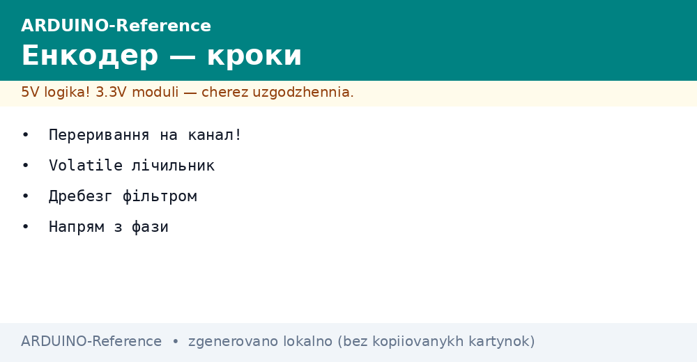
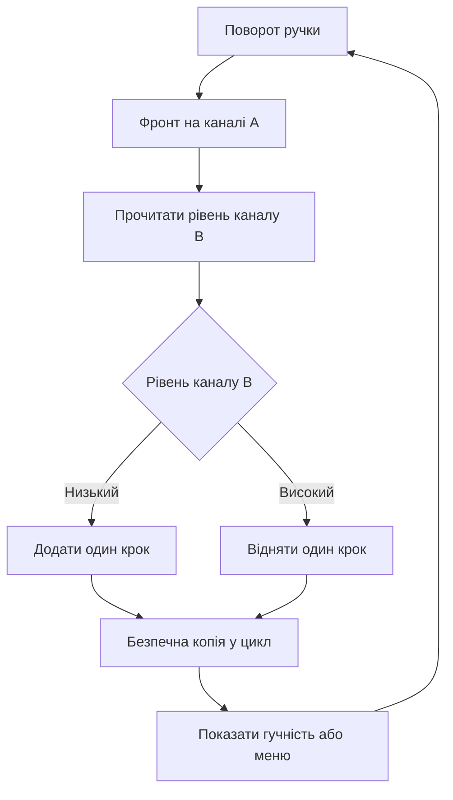

# Енкодер на Arduino - кроки і напрям


*Рис. Схема підключення енкодера до Arduino з підтяжкою і перериваннями.*

> [!tip] Призначення ноти
> Закрити питання ручки керування: як рахувати кроки без пропусків, як визначати напрям і як зробити гучність або меню без дребезгу.

## 1. Призначення

Інкрементальний енкодер перетворює обертання ручки на імпульси.

Плата рахує імпульси і розуміє куди крутять ручку.

Ручка гучності додає або віднімає рівень при кожному кроці.

Меню на екрані гортає пункти вгору або вниз.

Кроковий привід повідомляє на скільки кроків зсунувся вал.

Робот рахує шлях коліс за кількістю імпульсів.

Енкодер не памятає абсолютний кут після вимкнення живлення.

Після вмикання відлік завжди починається з нуля.

Для абсолютного кута беруть інші датчики або кінцеві вимикачі.

Ця нота веде від каналів до готової ручки меню.

Спочатку розбираємо канали А і В.

Потім підключаємо ручку з підтяжкою.

Далі вішаємо переривання на фронт.

Після цього робимо лічильник стійким до переривань.

Потім визначаємо напрям з фази каналів.

У фіналі прибираємо дребезг і пишемо скетч.

Основи цифрових входів описані у ноті [цифрові піни](../../../ARDUINO-Reference/03-GPIO/01-Digital-pini.md).

Механіка переривань плати описана у ноті [переривання плати](../../../ARDUINO-Reference/03-GPIO/03-Pererivannya.md).

Приклад руху і нахилу дивись у ноті [рух і нахил](../../../ARDUINO-Reference/10-Sensori/05-MPU6050.md).

## 2. Канали А і В

| Сигнал | Що видає | Практичний сенс |
| --- | --- | --- |
| Канал А | Прямокутні імпульси | Основний відлік кроків |
| Канал В | Ті ж імпульси зі зсувом | Визначення безпосередньо |
| Кнопка | Окремий контакт натискання | Вхід у меню |
| Земля | Спільний мінус | Опора для всіх сигналів |
| Живлення | 5 В для підтяжки | Живить контакти |

Енкодер має два контакти що замикаються зі зсувом у чверть періоду.

Такий зсув називають квадратурою і він дає напрям.

Обертання за годинником дає випередження каналу А.

Обертання проти годинника дає випередження каналу В.

Один клац ручки дає кілька фронтів на обох каналах.

Кількість імпульсів на оберт записана у характеристиках ручки.

Типові ручки дають двадцять клаців на повний оберт.

Дешеві ручки дають люфт у один імпульс на фіксатор.

Дорогі оптичні диски дають сотні імпульсів на оберт.

Кнопка ручки працює як звичайна тактова кнопка.

Натискання замикає контакт на землю.

## 3. Підключення до Uno

| Вивід енкодера | Пін плати | Режим піна |
| --- | --- | --- |
| CLK або А | D2 | Вхід з підтяжкою |
| DT або В | D3 | Вхід з підтяжкою |
| SW або кнопка | D4 | Вхід з підтяжкою |
| VCC або плюс | 5 В | Живлення підтяжки |
| GND | GND | Спільна земля |

Піни D2 і D3 плати вміють викликати переривання.

Саме тому канали вішають на ці два піни.

Кнопку вішають на будь-який вільний цифровий пін.

Внутрішня підтяжка тримає лінію вгорі без резисторів.

Зовнішні резистори 10 кілоом дають чистіший фронт.

Конденсатори 100 нанофарад зрізають короткі голки.

```text
Підключення ручки енкодера до Uno:

    плата Uno                енкодер KY-040
    ---------                --------------
    5V    -----------------  VCC
    GND   -----------------  GND
    D2    -----------------  CLK (канал А)
    D3    -----------------  DT  (канал В)
    D4    -----------------  SW  (кнопка)

    Внутрішня підтяжка INPUT_PULLUP увімкнена.
    Зовнішні 10 кОм між VCC і кожним каналом за бажанням.
    Конденсатор 100 нФ між каналом і землею зрізає голки.
    Довжина дротів бажано до 20 сантиметрів.
```

Схема показує три сигнальні дроти плюс живлення.

Канали йдуть на піни переривань.

Кнопка йде на звичайний цифровий пін.

Спільна земля зєднує ручку і плату.

Довгі дроти ловлять завади від моторів.

Вита пара зменшує наведення на канали.

## 4. Переривання на фронт

| Поняття | Значення | Пояснення |
| --- | --- | --- |
| Фронт | Перехід з нуля в одиницю | Момент кроку |
| Спад | Перехід з одиниці в нуль | Теж момент кроку |
| Зміна | Будь-який перехід | Подвоєна точність |
| Обробник | Коротка функція | Тільки лічильник |
| Прапорець | Зміна стану | Цикл малює результат |

Опитування каналів у циклі пропускає швидкі кроки.

Ручку крутять швидше ніж встигає цикл з екраном.

Переривання зупиняє цикл рівно у момент фронту.

Обробник додає або віднімає одиницю і виходить.

Цикл лише показує нове значення на екрані.

Фронт на каналі А дає один виклик на клац.

Режим зміни дає два виклики і подвоєну роздільну здатність.

Режим обох каналів дає учетверо більше відліків.

Новачкам вистачає одного переривання на каналі А.

Деталі викликів описані у ноті [переривання плати](../../../ARDUINO-Reference/03-GPIO/03-Pererivannya.md).

Налаштування пінів описані у ноті [цифрові піни](../../../ARDUINO-Reference/03-GPIO/01-Digital-pini.md).

Обробник має бути коротким без друку у порт.

Друк у порт всередині обробника гальмує систему.

Затримки всередині обробника зривають наступні кроки.

## 5. Volatile лічильник

| Правило | Чому так | Що буде інакше |
| --- | --- | --- |
| Змінна volatile | Заборона кешу у регістрі | Цикл бачить свіже значення |
| Тип long | Запас на тисячі кроків | Ціле не переповнюється швидко |
| Копія з забороною | Атомарне читання | Не буде рваного числа |
| Без друку в обробнику | Швидкий вихід | Не буде пропусків |
| Без затримок | Миттєвий підрахунок | Не буде зависань |

Компілятор любить тримати змінну у регістрі для швидкості.

Переривання міняє пам'ять поза увагою компілятора.

Слово volatile змушує читати значення з памяті щоразу.

Лічильник кроків оголошують як змінне довге ціле.

Діапазон довгого цілого вистачає на роки крутіння.

Читання чотирьох байтів на восьмибітній платі не атомарне.

Переривання посеред читання дає половину старого числа.

Коротка заборона переривань навколо копії рятує.

Копію показують на екрані а оригінал чіпає тільки обробник.

Прапорець нового значення прибирає миготіння екрана.

## 6. Напрям з фази каналів

| Ситуація | Рівень В у момент фронту А | Висновок |
| --- | --- | --- |
| Крутимо вперед | Канал В низький | Додати одиницю |
| Крутимо назад | Канал В високий | Відняти одиницю |
| Ручка стоїть | Немає фронтів | Нічого не міняти |
| Брязкіт | Короткі голки | Фільтр за часом |
| Люфт | Тремтіння на фіксаторі | Гістерезис у меню |

Напрям визначає взаємне положення каналів.

У момент фронту каналу А дивляться на рівень каналу В.

Низький рівень означає обертання в один бік.

Високий рівень означає обертання в інший бік.

Таблиця вище справедлива для типового модуля.

Окремі партії мають зворотну фазу.

Перевірка проста: крутнути вперед і глянути знак.

Якщо знак навпаки то поміняти плюс на мінус.

Меню з гістерезисом не смикається на межі пунктів.

Гучність міняють на один крок за один клац.

Швидке крутіння додає прискорення по кілька одиниць.

## 7. Дребезг контактів

| Метод | Як працює | Коли брати |
| --- | --- | --- |
| Конденсатор | Згладжує фронт | Дешева ручка з голками |
| Пауза 2 мілісекунди | Ігнор повторів | Простий скетч меню |
| Таблиця станів | Відлік тільки повних кроків | Точна ручка налаштувань |
| Опитування кнопок | Програмний таймер | Кнопка ручки |
| Екранізація | Короткі дроти | Завади від моторів |

Механічні контакти брязкають при замиканні.

Один клац дає пачку коротких імпульсів.

Лічильник без фільтра нараховує зайві кроки.

Конденсатор між каналом і землею зїдає голки.

Пауза у дві мілісекунди відсікає повтори.

Таблиця станів рахує тільки повний перехід.

Кнопку ручки чистять окремим таймером.

Опитування кнопки раз на 20 мілісекунд прибирає брязкіт.

Дроти подалі від силових ланцюгів зменшують наведення.

## 8. Скетч ручки гучності і меню

| Рядок | Призначення | Нотатка |
| --- | --- | --- |
| Лічильник | Зберігає позицію | Мінлива для переривання |
| Обробник | Додає або віднімає | Викликається фронтом |
| Копія | Безпечне читання | Заборона на час копії |
| Гучність | Від нуля до ста | Обмеження країв |
| Меню | Індекс пункту | Гортання по колу |

Діапазон гучності обмежують нулем і сотнею.

Вихід за межі обрізають умовами.

Меню гортають по колу через остачу від ділення.

Натискання кнопки вибирає пункт.

Довге натискання повертає назад.

```cpp
volatile long encoderPos = 0;
volatile unsigned long lastTick = 0;

const int PIN_A = 2;
const int PIN_B = 3;
const int PIN_BTN = 4;

int volume = 50;
int lastShown = -1;

void onStep() {
  unsigned long now = micros();
  if (now - lastTick < 2000) {
    return;
  }
  lastTick = now;
  int b = digitalRead(PIN_B);
  if (b == LOW) {
    encoderPos++;
  } else {
    encoderPos--;
  }
}

void setup() {
  Serial.begin(9600);
  pinMode(PIN_A, INPUT_PULLUP);
  pinMode(PIN_B, INPUT_PULLUP);
  pinMode(PIN_BTN, INPUT_PULLUP);
  attachInterrupt(digitalPinToInterrupt(PIN_A), onStep, RISING);
  Serial.println("Ручка готова: крути для гучності");
}

void loop() {
  long copy;
  noInterrupts();
  copy = encoderPos;
  interrupts();
  int v = 50 + (int)copy;
  if (v < 0) {
    v = 0;
  }
  if (v > 100) {
    v = 100;
  }
  if (v != lastShown) {
    lastShown = v;
    volume = v;
    Serial.print("Гучність: ");
    Serial.println(volume);
  }
  int btn = digitalRead(PIN_BTN);
  if (btn == LOW) {
    Serial.println("Кнопка натиснута");
    delay(200);
  }
  delay(10);
}
```

Обробник читає рівень каналу В у момент фронту.

Фільтр дві тисячі мікросекунд відсікає брязкіт.

Лічильник росте вперед і падає назад.

Цикл робить безпечну копію із забороною.

Значення копії зсувають від стартової гучності.

Краї обрізають нулем і сотнею.

Нове значення друкують тільки при зміні.

Кнопку читають простим рівнем з паузою.

Пауза двісті мілісекунд прибирає дребезг кнопки.

## Mermaid: шлях від кроку до меню



Схема читається згори вниз по колу.

Поворот дає фронт на каналі А.

Обробник читає рівень каналу В.

Низький рівень додає крок.

Високий рівень віднімає крок.

Копія переносить значення у цикл.

Цикл малює гучність або пункт меню.

## Типові помилки

| # | Помилка | Чому погано | Як правильно |
| --- | --- | --- | --- |
| 1 | Опитування каналів без переривань | Швидкі кроки губляться | Переривання на фронт каналу А |
| 2 | Лічильник без volatile | Цикл бачить старе значення | Оголосити змінну як volatile |
| 3 | Друк у порт всередині обробника | Гальмує і губить кроки | Тільки плюс або мінус у обробнику |
| 4 | Читання довгого числа без заборони | Рване значення посеред запису | Копія з короткою забороною |
| 5 | Ігнор дребезгу дешевої ручки | Один клац дає три кроки | Пауза 2 мілісекунди або конденсатор |
| 6 | Кнопка без підтяжки | Вхід плаває і фантомно спрацьовує | Режим з підтяжкою і фільтр 20 мілісекунд |

## Офіційні джерела

- [Переривання на docs.arduino.cc](https://docs.arduino.cc/learn/programming/interrupts/) - піни переривань, фронти і правила обробника.
- [Робота з енкодером на docs.arduino.cc](https://docs.arduino.cc/learn/electronics/rotary-encoder/) - канали А і В, напрям і приклад ручки.
- [Опис attachInterrupt на arduino.cc](https://www.arduino.cc/reference/en/language/functions/external-interrupts/attachinterrupt/) - режими фронту, обмеження і безпечні прийоми.

## Див. також

- [Home](../../../ARDUINO-Reference/Home.md)
- [переривання плати](../../../ARDUINO-Reference/03-GPIO/03-Pererivannya.md)
- [цифрові піни](../../../ARDUINO-Reference/03-GPIO/01-Digital-pini.md)
- [рух і нахил](../../../ARDUINO-Reference/10-Sensori/05-MPU6050.md)
- [безконтактні картки](../../../ARDUINO-Reference/10-Sensori/07-RFID-RC522.md)
