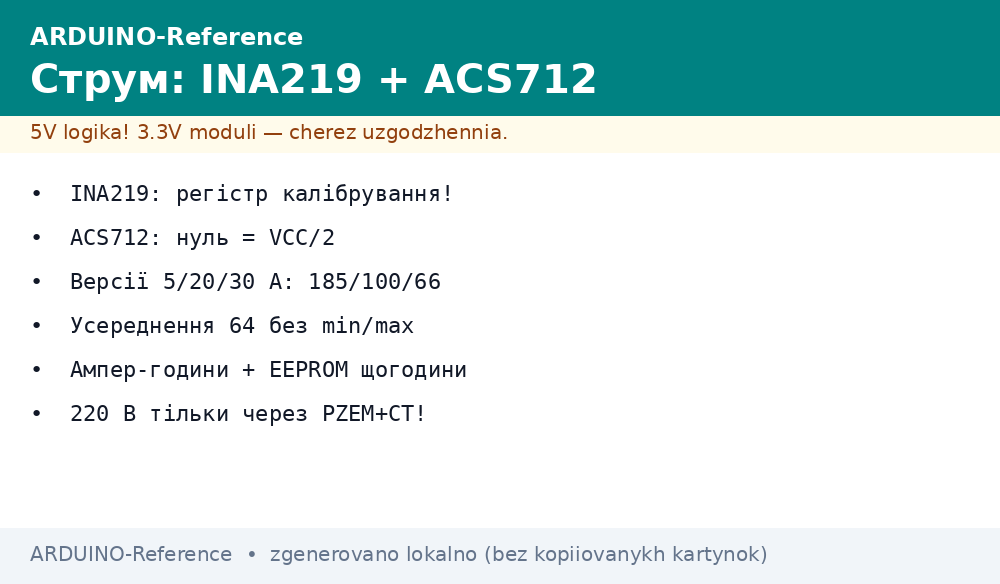
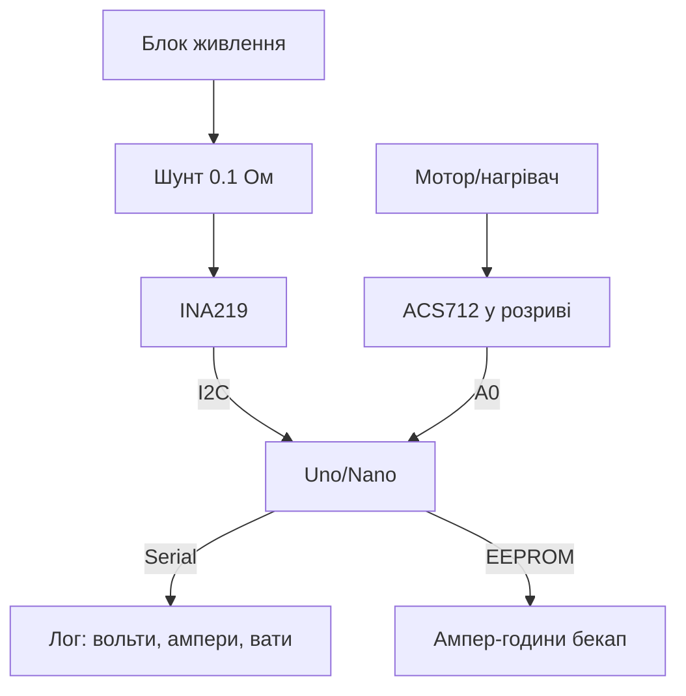

# Arduino міряє струм - INA219 по I2C та ACS712 в розриві


*Рис. INA219 на шунті міряє міліампери по I2C, ACS712 у розриві - ампери з розв'язкою.*

> [!tip] Що це за нота
> Два способи дізнатись «скільки їсть»: INA219 - точний облік сонячних вузлів і батарей, ACS712 - грубий контроль моторів і нагрівачів. База: [аналогові датчики](../../../ARDUINO-Reference/10-Sensori/04-LM35-NTC.md), [аналогові входи](../../../ARDUINO-Reference/06-Analog/01-ADC.md), [шина I2C Wire](../../../ARDUINO-Reference/04-Shini/03-I2C-Wire.md).

## 1. Мета

Вимірювати струм і потужність скетчем без лабораторії:

- INA219: напруга, струм і потужність одним чипом, 12 біт;
- ACS712: 5/20/30 А з гальванічною розв'язкою Холла;
- калібрування нуля і масштабу підручними засобами;
- лічильник ампер-годин з EEPROM-бекапом.

| Датчик | Діапазон | Точність | Інтерфейс |
| --- | --- | --- | --- |
| INA219 | 0-26V, шунт 0.1 Ом | 1 %, 12 біт | I2C 0x40-0x4F |
| ACS712-05 | ±5 А | ~1.5 % | аналог, 185 мВ/А |
| ACS712-20 | ±20 А | ~1.5 % | аналог, 100 мВ/А |
| ACS712-30 | ±30 А | ~1.5 % | аналог, 66 мВ/А |

## 2. Архітектура



INA219 міряє high-side: шунт у плюсі живлення, земля спільна. ACS712 - послідовно з навантаженням, напрям не важливий (знак покаже).

## 3. INA219 детально

- регістри: Shunt 0x01, Bus 0x02, Power 0x03, Current 0x04, Calibration 0x05;
- калібрування: `Cal = 0.04096 / (Current_LSB × Rшунт)`, для 0.1 Ом і 3.2 А - 4096;
- PGA /8, /4, /2, /1 - під падіння на шунті (320/160/80/40 мВ);
- усереднення х128 всередині чипа - шум зникає без коду;
- адреса перемичками A0/A1: 0x40 за замовчуванням, до 16 штук на шині.

## 4. ACS712 детально

- нуль - VCC/2 (2.5V при 5V), чутливість за версією;
- смуга 80 кГц, нам треба DC - усереднення 64 з відкиданням крайніх;
- модуль на 5V, вихід 0-5V: дільник 2:1 на A0 для 5V Uno (опорна 5V - ок);
- для 3.3V плат (Due, Nano 33) - живити модуль 5V, вихід через дільник;
- калібрування нуля при вимкненому навантаженні.

## 5. Робочий код

```cpp
#include <Wire.h>
#include <EEPROM.h>

#define INA_ADDR 0x40
float acs_zero = 2500.0;
float ah_acc = 0;
unsigned long ah_last = 0;

void ina_calibrate() {
  Wire.beginTransmission(INA_ADDR);
  Wire.write(0x05);
  Wire.write(0x10); Wire.write(0x00);
  Wire.endTransmission();
}

float ina_amps() {
  Wire.beginTransmission(INA_ADDR);
  Wire.write(0x04);
  Wire.endTransmission(false);
  Wire.requestFrom(INA_ADDR, 2);
  int16_t raw = Wire.read() << 8 | Wire.read();
  return raw * 0.001;
}

float acs_amps() {
  long sum = 0;
  int mn = 1024, mx = 0;
  for (int i = 0; i < 64; i++) {
    int v = analogRead(A0);
    sum += v;
    if (v < mn) mn = v;
    if (v > mx) mx = v;
  }
  float mv = (sum - mn - mx) / 62.0 * 5000.0 / 1023.0;
  return (mv - acs_zero) / 66.0;
}

void setup() {
  Serial.begin(115200);
  Wire.begin();
  EEPROM.get(0, ah_acc);
  ina_calibrate();
  long z = 0;
  for (int i = 0; i < 64; i++) z += analogRead(A0);
  acs_zero = z / 64.0 * 5000.0 / 1023.0;
  ah_last = millis();
}

void loop() {
  float a1 = ina_amps();
  float a2 = acs_amps();
  float dt_h = (millis() - ah_last) / 3600000.0;
  ah_last = millis();
  ah_acc += a1 * dt_h;
  static unsigned long last_save = 0;
  if (millis() - last_save > 3600000) {
    EEPROM.put(0, ah_acc);
    last_save = millis();
  }
  Serial.print(a1, 3);
  Serial.print(" A INA, ");
  Serial.print(a2, 2);
  Serial.println(" A ACS");
  delay(1000);
}
```

Коефіцієнт 66.0 - версія 30 А; 5 А - 185.0, 20 А - 100.0. `ina_amps` повертає ампери при Current_LSB 1 мА.

## 6. Калібрування підручними засобами

| Крок | Дія | Критерій |
| --- | --- | --- |
| 1 | Нуль ACS без навантаження | записати `acs_zero` |
| 2 | Лампа 60W як еталон ~0.27 А | масштаб збігається ±5 % |
| 3 | INA219 vs мультиметр на шунті | ±1 % |
| 4 | Перевірка знака | розряд батареї - мінус |

## 7. Безпека

- ACS712 - до 30 А, доріжки модуля розраховані, не перевищувати;
- мережа 220V - тільки через готовий PZEM з кліщами, ніяких шунтів у фазі;
- запобіжник у плюс батареї перед шунтом;
- [живлення VIN](../../../ARDUINO-Reference/02-Zhivlennya/01-Zhivlennya-VIN.md) - струм датчиків не з піна 5V понад 400 мА.

## 8. Типові помилки

| Симптом | Причина | Лікування |
| --- | --- | --- |
| INA219 дає нулі | немає калібрувального регістра | записати 0x05 у setup |
| ACS показує 0.5 А без навантаження | не знятий нуль | калібрування при вимкненому колі |
| Стрибки ±0.2 А | шум + опорна 5V плаває від USB | усереднення, живлення від БЖ |
| Не та адреса INA | перемички A0/A1 | сканер I2C, адреса 0x40-0x4F |
| Від'ємний струм при заряді | норма, знак безпосередньо | інвертувати знак у виводі |
| EEPROM зноситься | запис щосекунди | писати раз на годину |

## 9. Суміжні ноти

- [аналогові датчики](../../../ARDUINO-Reference/10-Sensori/04-LM35-NTC.md) - робота з АЦП.
- [аналогові входи](../../../ARDUINO-Reference/06-Analog/01-ADC.md) - опорна напруга, розрядність.
- [шина I2C Wire](../../../ARDUINO-Reference/04-Shini/03-I2C-Wire.md) - адреси, сканер.
- [пам'ять EEPROM](../../../ARDUINO-Reference/08-Pamyat/01-Pamyat-EEPROM.md) - бекап лічильника.
- [логер на SD](../../../ARDUINO-Reference/16-Proekti/04-Loger-SD.md) - куди писати вати.

## Офіційні джерела

- [INA219 (Texas Instruments)](https://www.ti.com/product/INA219) - регістри, калібрування, PGA.
- [ACS712 Current Sensor Carrier (Pololu)](https://www.pololu.com/product/2198) - версії, чутливість.
- [Language Reference (Arduino docs)](https://docs.arduino.cc/language-reference/) - analogRead, EEPROM, Wire.
