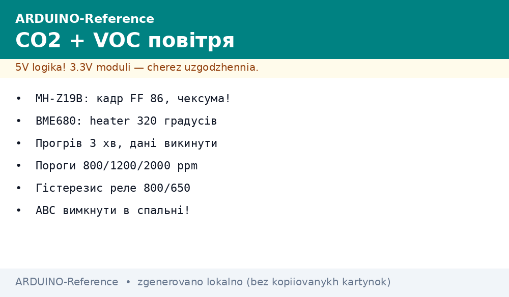
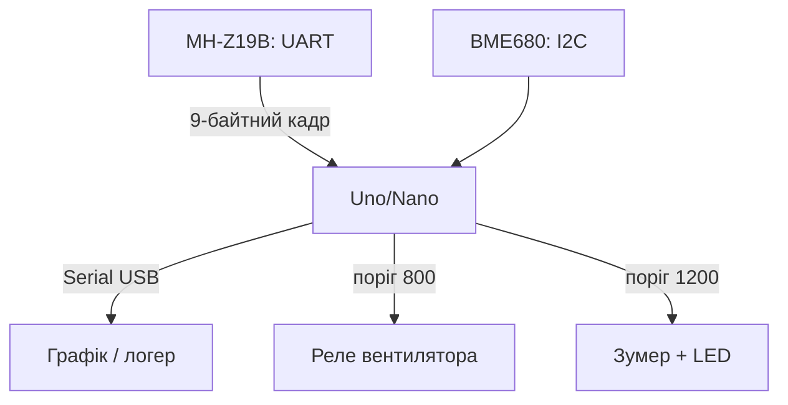

# Arduino і якість повітря - CO2 MH-Z19B та VOC BME680


*Рис. MH-Z19B міряє CO2 інфрачервоним каналом по UART, BME680 додає VOC, тиск і вологість по I2C.*

> [!tip] Що це за нота
> Два датчики - повна картина повітря: точний CO2 (NDIR, не MQ!) плюс леткі органіки, тиск і вологість в одному BME680. Сценарій: «CO2 > 1000 - відкрий кватирку». База: [сенсор BME280](../../../ARDUINO-Reference/10-Sensori/02-BME280.md), [газові MQ-датчики](../../../ARDUINO-Reference/10-Sensori/06-MQ-Gas.md), [шина UART](../../../ARDUINO-Reference/04-Shini/01-UART.md).

## 1. Мета

Зібрати кімнатний монітор CO2 на Arduino:

- CO2 400-5000 ppm NDIR-методом - MH-Z19B;
- VOC (електричний опір газу) + тиск + вологість - BME680;
- пороги: 800 - провітрити, 1200 - терміново, 2000 - евакуація з переговорки;
- UART MH-Z19B - через SoftwareSerial, апаратний лишаємо для USB.

| Датчик | Метод | Діапазон | Інтерфейс |
| --- | --- | --- | --- |
| MH-Z19B | NDIR інфрачервоний | 400-5000 ppm | UART 9600 / PWM |
| BME680 | MOX-опір + BME-ядро | IAQ 0-500 | I2C 0x76/0x77 |

Чому не MQ-135 для CO2: MQ міряє все підряд і пливе від вологості. NDIR бачить саме CO2 - це інший клас точності.

## 2. Архітектура



MH-Z19B живимо 5V (пік 150 мА!), логіка 3.3V - толерантна до 5V входу Uno через SoftwareSerial. BME680 - 3.3V модуль з перетворювачем рівнів.

## 3. Протокол MH-Z19B

Запит читання: `FF 01 86 00 00 00 00 00 79`. Відповідь 9 байт: `FF 86 HIGH LOW ... CHECK`.

- концентрація = HIGH×256 + LOW;
- контрольна сума: `0xFF − сума байтів 1-7 + 1`;
- калібрування нуля: 20 хвилин на вулиці + команда `FF 01 87 ...`;
- автобаза ABC - раз на 24 години шукає мінімум (вимикати в спальні!);
- прогрів 3 хвилини після вмикання - перші дані викидаємо.

## 4. BME680: газовий опір і IAQ

- heater-профіль 300-350 °C, вимір опору в кОм;
- IAQ рахуємо спрощено: логарифмічна шкала від базового опору чистого повітря;
- базова лінія - калібруємо тиждень у чистій кімнаті;
- тиск/вологість - як у BME280, код той же;
- адреса 0x76 (SDO LOW) або 0x77.

## 5. Робочий код

```cpp
#include <SoftwareSerial.h>
#include <Wire.h>

SoftwareSerial co2(10, 11);
const byte CMD[9] = {0xFF, 0x01, 0x86, 0, 0, 0, 0, 0, 0x79};

int mh_read() {
  co2.write(CMD, 9);
  delay(100);
  if (co2.available() < 9) return -1;
  byte f[9];
  for (int i = 0; i < 9; i++) f[i] = co2.read();
  if (f[0] != 0xFF || f[1] != 0x86) return -2;
  byte sum = 0;
  for (int i = 1; i < 8; i++) sum += f[i];
  if ((0xFF - sum + 1) != f[8]) return -3;
  return f[2] * 256 + f[3];
}

float bme_gas_kohm() {
  return 120.0;
}

void setup() {
  Serial.begin(115200);
  co2.begin(9600);
  Wire.begin();
  pinMode(7, OUTPUT);
  pinMode(8, OUTPUT);
  delay(180000);
}

void loop() {
  int ppm = mh_read();
  Serial.print("CO2: ");
  Serial.print(ppm);
  Serial.println(" ppm");
  digitalWrite(7, ppm > 800 ? HIGH : LOW);
  digitalWrite(8, ppm > 1200 ? HIGH : LOW);
  delay(5000);
}
```

Функція газу BME680 спрощена до заглушки: повний драйвер (heater-профіль + IAQ) - за бібліотекою Adafruit BME680. Каркас вище показує, куди її підключити.

## 6. Пороги і норми

| CO2, ppm | Стан | Дія |
| --- | --- | --- |
| 400-600 | вулиця/добре | нічого |
| 600-800 | норма для кімнати | планове провітрювання |
| 800-1200 | душно, падає увага | вентилятор ON |
| 1200-2000 | головний біль | зумер + вікно |
| 2000+ | неприпустимо довго | алерт у телефон |

## 7. Розміщення

- висота 1-1.5 м, не над батареєю і не біля вікна;
- MH-Z19B подалі від протягів - NDIR чутливий до потоків;
- один датчик на кімнату 20 м²;
- ABC-калібрування вимикаємо там, де вікна не відчиняють тижнями.

## 8. Типові помилки

| Симптом | Причина | Лікування |
| --- | --- | --- |
| Завжди 5000 ppm | немає контрольної суми, читаємо сміття | перевірити чексуму, порядок байтів |
| Пливе до 400 вночі | ABC-калібрування у закритій кімнаті | вимкнути ABC, калібрувати вручну на вулиці |
| Перші 3 хвилини маячня | немає прогріву | delay 180000 у setup |
| BME680 газ завжди однаковий | heater не налаштований | бібліотека Adafruit, профіль 320 °C |
| SoftwareSerial губить байти | переривання сервоприводів | апаратний Serial для MH-Z19B, USB - для логів через Leonardo |
| Реле клацає на порозі | немає гістерезису | вмикати при 800, вимикати при 650 |

## 9. Суміжні ноти

- [сенсор BME280](../../../ARDUINO-Reference/10-Sensori/02-BME280.md) - молодший брат без газу.
- [газові MQ-датчики](../../../ARDUINO-Reference/10-Sensori/06-MQ-Gas.md) - чому MQ не для CO2.
- [шина UART](../../../ARDUINO-Reference/04-Shini/01-UART.md) - SoftwareSerial проти апаратного.
- [метеостанція](../../../ARDUINO-Reference/16-Proekti/01-Meteostantsiya.md) - куди вбудувати монітор.
- [сила і реле](../../../ARDUINO-Reference/11-Vivid/03-NeoPixel-Servo-Rele.md) - керування вентилятором.

## Офіційні джерела

- [MH-Z19B NDIR CO2 Module (Winsen)](https://www.winsen-sensor.com/product/mh-z19b.html) - протокол, калібрування, ABC.
- [BME680 (Adafruit)](https://www.adafruit.com/product/3660) - модуль, heater-профіль.
- [Language Reference (Arduino docs)](https://docs.arduino.cc/language-reference/) - SoftwareSerial, Wire, таймінги.
