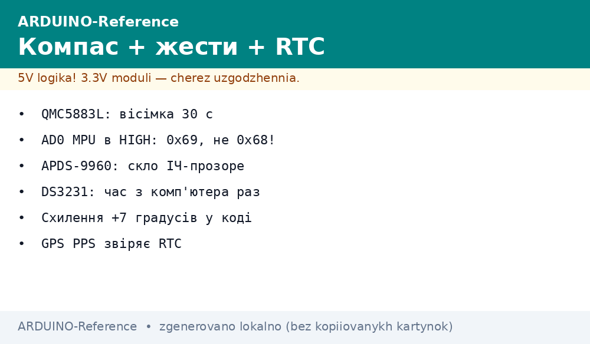
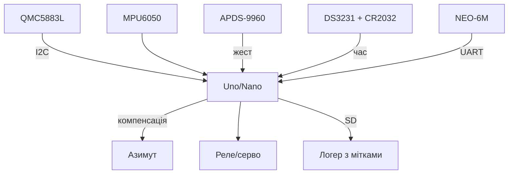

# Arduino і рідкісні сенсори - компас QMC5883L, жести APDS-9960, час DS3231


*Рис. Рідкісна трійця на одній шині: QMC5883L - сторони світу, APDS-9960 - жести, DS3231 - час з батарейкою.*

> [!tip] Що це за нота
> Сенсори, які шукають окремо: компас для робота, жести для безконтактної кнопки, точний час для логера. Плюс зв'язка з MPU6050 і GPS у повний навігаційний комплект. База: [гіроскоп і акселерометр](../../../ARDUINO-Reference/10-Sensori/05-MPU6050.md), [GPS-модуль](../../../ARDUINO-Reference/12-Moduli-zvyazku/04-GPS-NEO.md), [енкодери](../../../ARDUINO-Reference/10-Sensori/08-Encoder.md).

## 1. Мета

Дати Arduino три рідкісні виміри готовими бібліотеками:

- азимут 0-360° - QMC5883L (+ нахилова компенсація від MPU6050);
- жести і колір - APDS-9960 (SparkFun/Adafruit бібліотеки);
- час ±2 ppm - DS3231 з CR2032 (роки без підзаводу);
- разом - робот з курсом, панель без кнопок, логер з мітками часу.

| Сенсор | Адреса | Бібліотека |
| --- | --- | --- |
| QMC5883L | 0x0D | QMC5883LCompass (mprograms) |
| APDS-9960 | 0x39 | SparkFun_APDS9960 / Adafruit_APDS9960 |
| DS3231 | 0x68 | RTClib (Adafruit) |
| MPU6050 (є) | 0x68/0x69 | MPU6050 (ElectronicCats) |

Конфлікт 0x68: MPU6050 і DS3231 на одній шині - розводимо AD0 мікросхеми MPU (LOW=0x68, HIGH=0x69). Перевіряємо сканером до пайки.

## 2. Архітектура



Без компенсації нахилу компас бреше до 30°: беремо крен з акселерометра і повертаємо вектор. Жести - чисті руки в майстерні.

## 3. QMC5883L: цифровий компас

- діапазон ±8 Гаусс, до 200 Гц;
- калібрування hard-iron: вісімка 30 с, зсуви (max+min)/2;
- азимут: `atan2(-Y, X)` + магнітне схилення (Київ ~+7°);
- тримати подалі від моторів - або щогла 10 см;
- бібліотека віддає вже міктротесли, сирі коди не потрібні.

## 4. APDS-9960: жести і колір

- 4 фотодіоди напрямків + RGB + proximity + ALS;
- жести: вгору/вниз/вліво/вправо/біля/далеко;
- чутливість під відстань 5-20 см, скло - лише ІЧ-прозоре;
- proximity будить дисплей підходом руки;
- RGB - сортування деталей за кольором на конвеєрі хобі.

## 5. Робочий код

```cpp
#include <Wire.h>
#include <QMC5883LCompass.h>
#include <SparkFun_APDS9960.h>
#include <RTClib.h>

QMC5883LCompass compass;
SparkFun_APDS9960 apds;
RTC_DS3231 rtc;
char days[7][4] = {"SUN", "MON", "TUE", "WED", "THU", "FRI", "SAT"};

void setup() {
  Serial.begin(115200);
  Wire.begin();
  compass.init();
  compass.setCalibration(-320, 280, -150, 350, -200, 300);
  apds.init();
  apds.enableGestureSensor(true);
  rtc.begin();
  if (rtc.lostPower()) {
    rtc.adjust(DateTime(F(__DATE__), F(__TIME__)));
  }
}

float heading_deg() {
  compass.read();
  int x = compass.getX();
  int y = compass.getY();
  float h = atan2(-y, x) * 57.2958 + 7.0;
  if (h < 0) h += 360.0;
  if (h >= 360.0) h -= 360.0;
  return h;
}

void loop() {
  Serial.print("HDG ");
  Serial.print(heading_deg(), 0);
  if (apds.isGestureAvailable()) {
    switch (apds.readGesture()) {
      case DIR_UP: Serial.print(" UP"); break;
      case DIR_DOWN: Serial.print(" DOWN"); break;
      case DIR_LEFT: Serial.print(" LEFT"); break;
      case DIR_RIGHT: Serial.print(" RIGHT"); break;
    }
  }
  DateTime t = rtc.now();
  Serial.print(" ");
  Serial.print(t.hour());
  Serial.print(":");
  Serial.print(t.minute());
  Serial.print(":");
  Serial.println(t.second());
  delay(500);
}
```

Калібрувальні шістки знімаємо своєю вісімкою (скетч-прикл калибрування в прикладах бібліотеки). Час виставляється з комп'ютера при першій прошивці, далі - батарейка.

## 6. Зв'язка з GPS і MPU

- MPU6050 - крен/тангаж для компенсації компаса;
- NEO-6M - координати + швидкість + PPS-секунда;
- курс GPS у русі звіряє магнітний курс;
- логер: час DS3231 + координати + курс - повний трек;
- [трекер](../../../ARDUINO-Reference/16-Proekti/03-Treker.md) - куди вбудувати комплект.

## 7. Калібрування компаса

| Крок | Дія | Критерій |
| --- | --- | --- |
| 1 | Вісімка 30 с, min/max по осях | розкид > 200 одиниць |
| 2 | Зсуви в `setCalibration` | центр у нулі |
| 3 | 4 сторони світу | помилка до 5° |
| 4 | Схилення +7° у коді | звірка з телефоном |
| 5 | Перевірка біля мотора | винести на щоглу при зсуві |

## 8. Типові помилки

| Симптом | Причина | Лікування |
| --- | --- | --- |
| QMC не знаходиться | клони на 0x1A замість 0x0D | сканер, форк бібліотеки під адресу |
| Азимут пливе при нахилі | немає компенсації | додати крен з MPU6050 |
| APDS фантомні жести | ІЧ-засвітлення | шторка, нижча чутливість |
| DS3231 скидається | немає CR2032 | вставити батарейку, перевірити 3V |
| Конфлікт 0x68 | MPU + DS3231 разом | AD0 мікросхеми MPU в HIGH (0x69) |
| Час відстає на хвилини | китайський клон без TCXO | замінити модуль, звірити з GPS PPS |

## 9. Суміжні ноти

- [гіроскоп і акселерометр](../../../ARDUINO-Reference/10-Sensori/05-MPU6050.md) - друга половина компаса.
- [GPS-модуль](../../../ARDUINO-Reference/12-Moduli-zvyazku/04-GPS-NEO.md) - координати і PPS.
- [енкодери](../../../ARDUINO-Reference/10-Sensori/08-Encoder.md) - курс коліс робота.
- [пам'ять EEPROM](../../../ARDUINO-Reference/08-Pamyat/01-Pamyat-EEPROM.md) - калібрування компаса.
- [трекер](../../../ARDUINO-Reference/16-Proekti/03-Treker.md) - готовий проєкт.

## Офіційні джерела

- [Triple-axis Magnetometer QMC5883L (SparkFun)](https://www.sparkfun.com/products/17470) - регістри, режими.
- [APDS-9960 Breakout (Adafruit)](https://www.adafruit.com/product/3595) - жести, RGB, proximity.
- [DS3231 Precision RTC (Adafruit)](https://www.adafruit.com/product/3013) - точність, батарейка.
- [NEO-6 series (u-blox)](https://www.u-blox.com/en/product/neo-6-series) - GPS для зв'язки, PPS.
