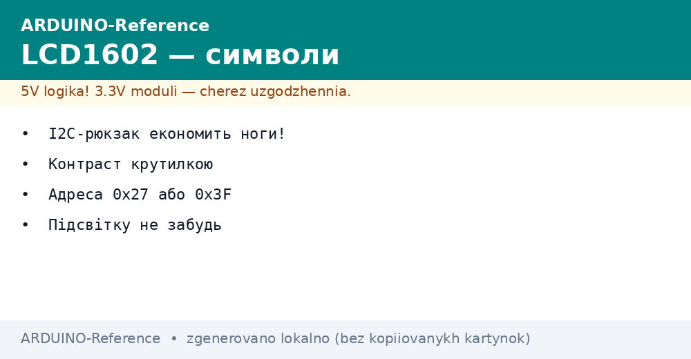
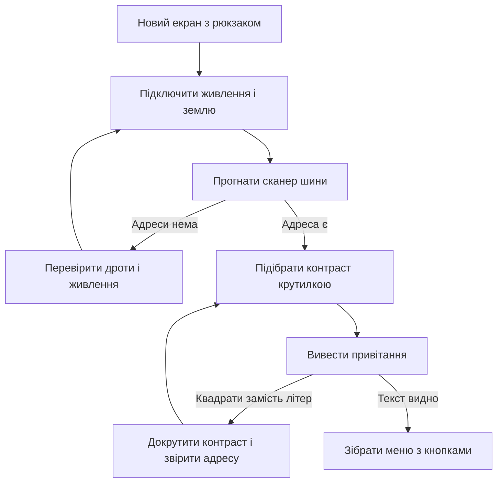

# LCD1602 - символи по I2C


*Рис. Екран LCD1602 через I2C-адаптер I2C: дві лінії замість шести, адреса модуля, крутилка контрасту, підсвітка.*

> [!tip] Призначення ноти
> Підключити символьний екран за кілька хвилин: знайти адресу сканером, виставити контраст, вивести текст і зібрати просте меню з кнопками.

## 1. Призначення

Символьний екран показує два рядки по шістнадцять знаків: цифри, латинські літери, прості знаки.

Без I2C-адаптера такий екран займає шість цифрових виходів плати, з I2C-адаптером потрібні лише дві лінії шини.

I2C-адаптер на чипі PCF8574 перетворює послідовні пакети у паралельні сигнали контролера екрана.

Ця нота закриває практику: живлення, адреса модуля, бібліотека, контраст, підсвітка, свої символи, кирилиця, меню з кнопками.

Основи двопровідної шини, адреси і сканер описані у ноті [шина двох дротів](../../../ARDUINO-Reference/04-Shini/03-I2C-Wire.md).

Графічний наступник символьних екранів описаний у ноті [графічний екран](../../../ARDUINO-Reference/11-Vivid/02-OLED-SSD1306.md).

## 2. Характеристики екрана

| Параметр | Значення | Пояснення |
| --- | --- | --- |
| Формат | Два рядки по шістнадцять знаків | Класика, є старший брат двадцять на чотири |
| Контролер | HD44780 або сумісний | Стандартні команди, море прикладів |
| Живлення логіки | Пять вольт | Від плати або стабільного блока |
| Струм підсвітки | Близько двадцяти міліампер | Світить яскраво, гріється помірно |
| Керування без I2C-адаптера | Шість виходів | Чотири біти даних плюс два службові |
| Керування з I2C-адаптером | Дві лінії шини | Дані і такти, решту робить розширювач |
| Кути огляду | Вузькі, залежить від контрасту | Для панелі приладів вистачає |

Екран добре читається без окулярів: знаки великі, контраст регулюється вручну.

Для вулиці беруть модуль без підсвітки або з малим струмом, бо сонце зїдає картинку.

Шлейф екрана короткий з коробки, довгі дроти ловлять завади і рвуть пакети.

Перед монтажем у корпус перевіряють картинку на столі: пережатий шлейф дає смуги.

## 3. I2C-адаптер PCF8574

| Елемент I2C-адаптера | Що робить | Практика |
| --- | --- | --- |
| Чип PCF8574 | Розширювач виходів через шину | Вісім біт на екран вистачає |
| Піни SDA і SCL | Дані і такти шини | До відповідних ліній плати |
| Піни VCC і GND | Живлення і земля | Пять вольт, спільна земля |
| Перемички адреси | Молодші біти адреси | Дивись таблицю адрес нижче |
| Крутилка | Опорна напруга контрасту | Маленька викрутка, повільні оберти |
| Джампер підсвітки | Живлення світлодіодів екрана | Зняв джампер, підсвітка згасла |

I2C-адаптер економить піни плати: шість виходів зливаються у два дроти шини.

Плата I2C-адаптера сідає прямо на гребінку екрана, паяти треба рівно шістнадцять пінів.

Пайку перевіряють лупою: холодний контакт дає мерехтіння або сміття у знаках.

Один I2C-адаптер тримає один екран, два екрани просять різні адреси перемичками.

```text
Рюкзак на екрані, вигляд згори:

  [крутилка контрасту]  [перемички A0 A1 A2]
  +--------------------------------------+
  | PCF8574            SDA SCL VCC GND   |
  +--------------------------------------+
  ||||||||||||||||  шістнадцять ніжок до екрана

  Правило монтажу:
  рюкзак рівно по гребінці,
  без перекосу і непропаю.
```

## 4. Адреса модуля

| Перемички | Адреса | Коли трапляється |
| --- | --- | --- |
| Усі розімкнені | Нуль ікс два сім | Наймасовіший варіант з магазину |
| Усі замкнені | Нуль ікс три еф | Другий за популярністю варіант |
| Змішана комбінація | Між ними по молодших бітах | Рідко, для пари екранів поруч |
| Невідома | Жодна не вгадується | Гнати сканер шини |

Адресу не вгадують, а міряють: сканер шини показує відповідь за секунди.

Сканер беруть з ноти про шину: проганяє усі адреси і друкує ті, що відгукнулися.

Поширена халепа: у скетчі лишилася адреса з прикладу, а модуль має іншу.

Ще одна халепа: два модулі з однаковою адресою відповідають разом і псують обмін.

Після зміни перемичок живлення знімають на секунду, щоб чип перечитав біти.

## 5. Бібліотека LiquidCrystal_I2C

| Виклик | Що робить | Типовий приклад |
| --- | --- | --- |
| Конструктор з адресою | Привязує обєкт до модуля | Адреса зі сканера, шістнадцять на два |
| Виклик init | Налаштовує контролер екрана | Один раз на старті |
| Виклик backlight | Вмикає підсвітку | Після запуску |
| Виклик noBacklight | Гасить підсвітку | Нічний режим |
| Виклик setCursor | Ставить позицію знака | Колонка і рядок з нуля |
| Виклик print | Друкує текст або число | Рядок у лапках, змінна без лапок |
| Виклик clear | Чистить екран і ставить курсор додому | Перед новим кадром |
| Виклик home | Повертає курсор додому | Без чистки памяті |

Бібліотеку ставлять через менеджер бібліотек середовища за іменем LiquidCrystal_I2C.

Є кілька однойменних бібліотек від різних авторів, беруть ту, що має приклади з init і backlight.

Шина запускається до екрана: спочатку Wire begin, потім init екрана.

Друк числа іде безпосередньо: print приймає цілі і дробові без ручного перетворення.

Оновлення раз на пів секунди вистачає оку, частіше перемальовувати не треба.

## 6. Контраст і підсвітка

| Симптом | Причина | Дія |
| --- | --- | --- |
| Екран світиться, знаків немає | Контраст викручений у край | Крутити повільно до появи знаків |
| Темні квадрати у першому рядку | Екран не запущений, контраст великий | Перевірити адресу і запуск, потім крутити |
| Знаки бліді під кутом | Низька опорна напруга | Додати трохи крутилкою |
| Підсвітка сліпить уночі | Повна яскравість | Гасити викликом або резистором у ланцюг |
| Картинка пливе від тепла | Плата гріється поруч | Винести крутилку і дати вентиляцію |

Крутилка терпить лише маленьку викрутку: велика зриває шліц за один рух.

Контраст виставляють на робочому теплі: холодний і гарячий екран просять різне.

Підсвітку для нічного годинника гасять програмно, а не висмикуванням джампера.

Часте вмикання і вимикання підсвітки робить миготіння, для дихання беруть інший екран.

## 7. Скетч привітання

```cpp
#include <Wire.h>
#include <LiquidCrystal_I2C.h>

LiquidCrystal_I2C lcd(0x27, 16, 2);

void setup() {
  Wire.begin();
  lcd.init();
  lcd.backlight();
  lcd.setCursor(0, 0);
  lcd.print("Privit, svite!");
  lcd.setCursor(0, 1);
  lcd.print("LCD ready");
}

void loop() {
  delay(500);
}
```

Адресу у конструкторі міняють на свою: нуль ікс два сім або нуль ікс три еф.

Рядки нумеруються з нуля: верхній нуль, нижній один, колонки від нуля до пятнадцяти.

Рядок довший за шістнадцять знаків обрізається, хвіст не переноситься сам.

Затримка у головному циклі нічого не малює, екран тримає кадр сам.

Для лічильника домальовують вивід змінної у другому рядку раз на секунду.

## 8. Свої символи і кирилиця

| Тема | Межа | Практика |
| --- | --- | --- |
| Свої гліфи | Вісім комірок з номерами від нуля | Іконки батареї, стрілки, градус |
| Таблиця знаків | Латиниця з коробки | Кирилиця лише в окремих партіях |
| Надійний текст | Транслітерація | Chas, Svitlo, Motor читаються всіма |
| Своя літера | Малюнок п'ять на вісім крапок | Створити викликом, вивести кодом |
| Пам'ять гліфів | Енергозалежна | Після перезапуску створити знову |

Байт гліфа малюють на папері у клітинку пять на вісім, потім кодують рядками бітів.

Верхній рядок байта відповідає верхньому ряду крапок, молодший біт правій колонці.

Свої гліфи створюють у setup після запуску екрана, а використовують за номером.

```text
Свій гліф градуса, сітка пять на вісім:

  .###.   рядок 0: 0 1 1 1 0
  #...#   рядок 1: 1 0 0 0 1
  #...#   рядок 2: 1 0 0 0 1
  .###.   рядок 3: 0 1 1 1 0
  .....   рядок 4: 0 0 0 0 0
  .....   рядок 5: 0 0 0 0 0
  .....   рядок 6: 0 0 0 0 0
  .....   рядок 7: 0 0 0 0 0

  Виклик createChar бере номер комірки і масив байтів.
```

Кирилицю для серійного виробу перевіряють на конкретній партії екранів.

Для одного примірника швидше намалювати потрібні літери як свої гліфи.

## 9. Скетч меню з кнопками

```text
Кнопки меню, підключення без дрижання:

  пін 2 ----[кнопка ВГОРУ]---- земля
  пін 3 ----[кнопка ВНИЗ]----- земля
  пін 4 ----[кнопка ОК]------- земля

  Режим ніжок INPUT_PULLUP:
  ненатиснута дає одиницю,
  натиснута дає нуль.
```

```cpp
#include <Wire.h>
#include <LiquidCrystal_I2C.h>

LiquidCrystal_I2C lcd(0x27, 16, 2);

const int BTN_UP = 2;
const int BTN_DOWN = 3;
const int BTN_OK = 4;

const char *items[] = {"Chas", "Svitlo", "Motor", "Skin"};
const int N = 4;
int pos = 0;

void drawMenu() {
  lcd.clear();
  lcd.setCursor(0, 0);
  lcd.print("> ");
  lcd.print(items[pos]);
  lcd.setCursor(0, 1);
  lcd.print("  ");
  lcd.print(items[(pos + 1) % N]);
}

bool pressed(int pin) {
  if (digitalRead(pin) == LOW) {
    delay(30);
    return digitalRead(pin) == LOW;
  }
  return false;
}

void setup() {
  Wire.begin();
  lcd.init();
  lcd.backlight();
  pinMode(BTN_UP, INPUT_PULLUP);
  pinMode(BTN_DOWN, INPUT_PULLUP);
  pinMode(BTN_OK, INPUT_PULLUP);
  drawMenu();
}

void loop() {
  if (pressed(BTN_UP)) {
    pos = (pos + N - 1) % N;
    drawMenu();
    delay(200);
  }
  if (pressed(BTN_DOWN)) {
    pos = (pos + 1) % N;
    drawMenu();
    delay(200);
  }
  if (pressed(BTN_OK)) {
    lcd.clear();
    lcd.setCursor(0, 0);
    lcd.print("OK: ");
    lcd.print(items[pos]);
    delay(800);
    drawMenu();
  }
}
```

Меню показує поточний пункт зі стрілкою і наступний без неї.

Затримка після натискання гасить дрижання контактів і повторні спрацювання.

Довгі пункти скорочують до шістнадцяти знаків разом зі стрілкою і пробілами.

## 10. Підключення до плати

```text
Звязки екрана з рюкзаком і плати:

  Плата                Рюкзак на екрані
  -----                ----------------
  SDA ----------------> SDA
  SCL ----------------> SCL
  5V -----------------> VCC
  GND ----------------> GND

  Умови стабільної картинки:
  дроти короткі, до тридцяти сантиметрів,
  земля спільна і товста,
  живлення без просідання.
```

Живлення беруть з плати лише для одного екрана, два екрани просять окремий блок.

Сигнальні дроти не ведуть поруч із силовими: завади бють по пакетах.

Перевірка перед меню: привітання видно, контраст тримається, кнопки клацають.

## 11. Mermaid: запуск екрана



Схема читається згори вниз: спочатку живлення, потім адреса, потім контраст.

Без адреси зі сканера правити скетч немає сенсу.

Квадрати у першому рядку майже завжди означають контраст або адресу.

## Типові помилки

| # | Помилка | Чому погано | Як правильно |
| --- | --- | --- | --- |
| 1 | Адреса з прикладу замість своєї | Модуль мовчить, екран темний | Прогнати сканер і вписати знайдену адресу |
| 2 | Контраст не чіпали з коробки | Знаків не видно або самі квадрати | Крутити потроху до чітких знаків |
| 3 | Виклик print до init | Контролер не запущений, сміття на екрані | Спочатку Wire begin і init, потім друк |
| 4 | Довгі дроти шини через стіл | Пакети бються, знаки пливуть | Вкоротити до тридцяти сантиметрів |
| 5 | Кирилиця безпосередньо у print | У знакогенераторі її немає, виходять крякозябри | Транслітерація або свої гліфи |
| 6 | Два екрани з однією адресою | Відповідають разом, обмін рветься | Розвести перемичками адреси |

## Офіційні джерела

- [Екрани LCD на docs.arduino.cc](https://docs.arduino.cc/learn/electronics/lcd-displays) - підключення символьних екранів, контраст, приклади скетчів.
- [Бібліотека LiquidCrystal на docs.arduino.cc](https://docs.arduino.cc/libraries/liquidcrystal/) - виклики друку, курсор, свої символи.
- [Довідник мови на arduino.cc](https://www.arduino.cc/reference/en/) - базові функції, робота з рядками і числами.

## Див. також

- [Home](../../../ARDUINO-Reference/Home.md)
- [шина двох дротів](../../../ARDUINO-Reference/04-Shini/03-I2C-Wire.md)
- [графічний екран](../../../ARDUINO-Reference/11-Vivid/02-OLED-SSD1306.md)
- [стрічки і сила](../../../ARDUINO-Reference/11-Vivid/03-NeoPixel-Servo-Rele.md)
