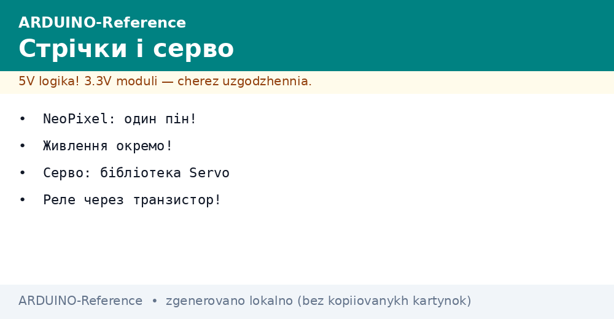
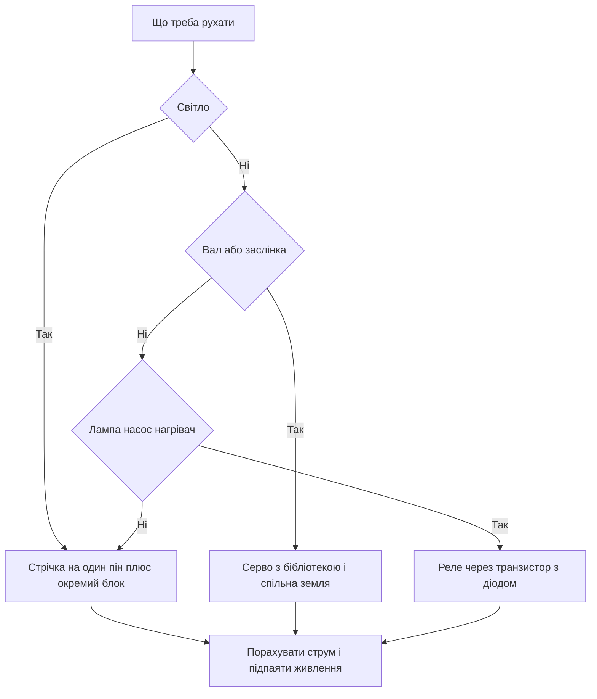

# NeoPixel, серво і реле - сила


*Рис. Сила в трьох видах: адресна стрічка на одному піні, серво з окремим живленням, реле через транзистор.*

> [!tip] Призначення ноти
> Рухати світлом, валом і навантаженням без диму: живити стрічку окремо, крутити серво бібліотекою і клацати реле через транзистор з діодом.

## 1. Призначення

Адресна стрічка дає веселку на одному піні: кожен діод має свій колір і яскравість.

Сервопривод ставить вал у заданий кут: дверцята, кермо моделі, заслінка годівниці.

Реле вмикає велике навантаження малим сигналом: лампа, насос, нагрівач.

Усі три вузли обєднує одне правило: сигналу з плати мало, силу беруть з окремого живлення.

Ця нота закриває практику: таймінги стрічки, струми і земля, бібліотека серво, транзистор і діод реле, скетчі.

Про модуляцію і таймери плати читай у ноті [широтно-імпульсна модуляція](../../../ARDUINO-Reference/03-GPIO/02-PWM-analogWrite.md).

Про символьний екран для панелі керування читай у ноті [символьний екран](../../../ARDUINO-Reference/11-Vivid/01-LCD1602.md).

Про графічний екран для панелі керування читай у ноті [графічний екран](../../../ARDUINO-Reference/11-Vivid/02-OLED-SSD1306.md).

## 2. Стрічка NeoPixel на одному піні

| Параметр | Значення | Пояснення |
| --- | --- | --- |
| Діод | WS2812 або сумісний | Контролер всередині кожного діода |
| Лінія даних | Один пін плати | Ланцюжок передає далі сам |
| Швидкість потоку | Вісімсот кілогерц | Жорсткі часові вікна бітів |
| Порядок кольорів | Зелений червоний синій | Бібліотека складає сама |
| Яскравість | Вісім біт на колір | Нуль темрява, максимум сліпить |
| Довжина ланцюжка | Десятки діодів з плати | Сотні просять окремий контролер живлення |

Протокол тримається на точних паузах: довгий імпульс одиниця, короткий нуль.

Переривання під час посилки рвуть кадр: бібліотека вимикає їх на час передачі.

Перший діод у ланцюжку найуразливіший: його палить гаряче підключення живлення.

Дані заводять через резистор близько трьохсот ом: він гасить відбиття у дроті.

```text
Ланцюжок стрічки і порядок байтів:

  плата --[R 300 Ом]--> DIN [діод 0] --> DOUT --> DIN [діод 1] --> ...

  Кадр для двох діодів:
  діод 0: зелений червоний синій
  діод 1: зелений червоний синій

  Правило: послав кадр, показав викликом,
  без показу стрічка тримає старе.
```

## 3. Живлення стрічки окремо

| Кількість діодів | Струм на максимумі | Джерело |
| --- | --- | --- |
| Один діод білим | Близько шістдесяти міліампер | Плата витягує |
| Вісім діодів білим | Близько пів ампера | Окремий блок пять вольт |
| Тридцять діодів білим | Близько двох ампер | Блок з запасом у третину |
| Шістдесят діодів білим | Близько чотирьох ампер | Товсті дроти і підпайка з обох боків |

Плата не годує стрічку: регулятор плати слабкий, доріжки тонкі, буде просідання.

Землі зєднують обов'язково: без спільної землі дані не мають відліку.

Живлення подають до зміни коду: гарячий дріт даних при живій стрічці бє по входу.

Довгу стрічку підживлюють з обох кінців: мідь стрічки тонка, хвіст рожевіє від просідання.

Конденсатор близько тисячі мікрофарад на вході стрічки згладжує кидки струму.

Яскравість у коді обмежують: половина яскравості ріже струм удвічі без втрати краси.

## 4. Скетч стрічки

```cpp
#include <Adafruit_NeoPixel.h>

#define PIN 6
#define NUM 8

Adafruit_NeoPixel strip(NUM, PIN, NEO_GRB + NEO_KHZ800);

void setup() {
  strip.begin();
  strip.setBrightness(64);
  strip.show();
}

void loop() {
  for (int i = 0; i < NUM; i++) {
    strip.clear();
    strip.setPixelColor(i, strip.Color(255, 0, 0));
    strip.show();
    delay(150);
  }
}
```

Яскравість шістдесят чотири з двохсот пятдесяти пяти береже очі і блок живлення.

Бігаюча крапка перевіряє порядок діодів і цілість ланцюжка за секунди.

Колір складають трьома числами: червоний зелений синій від нуля до максимуму.

Очищення буфера перед новим кадром прибирає хвости попереднього.

Для веселки крутять відтінок по колу кольорів замість ручного перебору.

## 5. Сервопривод через бібліотеку

| Параметр сигналу | Значення | Сенс |
| --- | --- | --- |
| Період повторення | Двадцять мілісекунд | Стандарт хобі серво |
| Імпульс мінімуму | Одна мілісекунда | Вал у крайньому лівому положенні |
| Імпульс середини | Півтори мілісекунди | Вал по центру |
| Імпульс максимуму | Дві мілісекунди | Вал у крайньому правому положенні |
| Кут | Від нуля до ста вісімдесяти градусів | Бібліотека перераховує сама |
| Живлення мотора | Окремий блок пять шість вольт | Плата такого струму не дає |

Бібліотека Servo ховає таймерну кухню: користувач задає лише кут повороту.

Сигнальний дріт несе лише керування, силу мотор бере зі свого блока.

Після команди attach частина виходів модуляції на цьому таймері вимикається.

Вал не женуть в упори ривками: старт з середини, кроки дрібні, паузи видимі.

Пластикові шестерні зриває ударне навантаження, качалку ставлять без перекосу.

## 6. Скетч серво

```cpp
#include <Servo.h>

Servo drive;

void setup() {
  drive.attach(9);
  drive.write(90);
  delay(1000);
}

void loop() {
  drive.write(0);
  delay(1000);
  drive.write(90);
  delay(1000);
  drive.write(180);
  delay(1000);
}
```

Сигнальний дріт сідає на девятий пін, живлення мотора з окремого блока.

Спільна земля плати і блока обов'язкова, без неї вал смикається хаотично.

Пауза секунду дає валу дійти до упору до наступної команди.

Плавний прохід роблять циклом з кроком один градус і паузою двадцять мілісекунд.

```text
Звязки серво з окремим живленням:

  Плата                Серво              Блок живлення
  -----                -----              -------------
  D9 -----------------> сигнал
  GND ----------------> земля <---------- мінус блока
                       плюс ------------> плюс блока 5-6 В

  Правило: плюс мотора ніколи не йде з плати,
  землі завжди спільні.
```

## 7. Реле через транзистор і діод

| Елемент | Номінал і тип | Навіщо |
| --- | --- | --- |
| Реле | Пять вольт, котушка | Клацає контакти силового кола |
| Транзистор | NPN, з запасом струму | Котушка просить більше за пін |
| Резистор бази | Близько одного кілоома | Обмежує струм з піна |
| Діод | Паралельно котушці, проти живлення | Гасить викид самоіндукції |
| Живлення котушки | Окремий блок або потужна лінія | Пік струму садить плату |
| Контакти | З запасом по струму удвічі | Пусковий струм більший за робочий |

Пін плати не тягне котушку: струм котушки у рази більший за межу виходу.

Без діода викид котушки бє по транзистору і скидає плату у перезапуск.

Діод ставлять смужкою до плюса живлення: у роботі він закритий, у викиді відкритий.

Модулі реле з оптопарою вже мають транзистор і діод на платі.

Силові контакти і низьковольтну частину розводять подалі один від одного.

```text
Ключ реле на транзисторі:

  пін D7 --[R 1 кОм]--> база NPN
  емітер -------------> земля
  колектор -----------> котушка ---> плюс 5 В
  діод паралельно котушці смужкою до плюса

  Логіка: одиниця на піні відкриває транзистор,
  котушка притягує якір, контакти клацають.
```

## 8. Скетч реле

```cpp
const int RELAY_PIN = 7;

void setup() {
  pinMode(RELAY_PIN, OUTPUT);
  digitalWrite(RELAY_PIN, LOW);
}

void loop() {
  digitalWrite(RELAY_PIN, HIGH);
  delay(2000);
  digitalWrite(RELAY_PIN, LOW);
  delay(2000);
}
```

Стартовий рівень низький: реле не повинне клацнути у момент вмикання.

Клацання раз на дві секунди чути і видно: перевірка без приладів.

Інверсні модулі вмикаються нулем: рівень перевіряють за світлодіодом модуля.

Навантаження вмикають через контакти з правильним запасом по струму і напрузі.

Запобіжник у силове коло ставлять завжди: контакти зварюються, дроти ні.

## 9. Mermaid: що за сила потрібна



Схема читається зліва направо: вибір вузла, потім живлення і земля.

Струм рахують до першого вмикання, а не після запаху гару.

Спільна земля потрібна усім трьом вузлам без винятків.

## Типові помилки

| # | Помилка | Чому погано | Як правильно |
| --- | --- | --- | --- |
| 1 | Стрічка живиться від плати | Просідання, перезапуски, гарячий регулятор | Окремий блок пять вольт зі спільною землею |
| 2 | Немає спільної землі | Дані без відліку, маячня у кольорах | Зєднати землі плати і блока товстим дротом |
| 3 | Серво живиться від плати | Пік струму садить живлення | Окремий блок пять шість вольт |
| 4 | Реле безпосередньо з піна | Струм котушки палить вихід | Ключ на транзисторі плюс резистор бази |
| 5 | Немає діода на котушці | Викид самоіндукції бє по схемі | Діод паралельно котушці смужкою до плюса |
| 6 | Повна яскравість на довгій стрічці | Ампери плавлять тонку мідь | Обмежити яскравість і підпаяти з обох боків |

## Офіційні джерела

- [Бібліотека Servo на docs.arduino.cc](https://docs.arduino.cc/libraries/servo/) - підключення серво, кути, живлення, приклади скетчів.
- [Розділ навчання на docs.arduino.cc](https://docs.arduino.cc/learn/) - статті з електроніки, живлення, керування навантаженням.
- [Довідник мови на arduino.cc](https://www.arduino.cc/reference/en/) - цифрові виходи, затримки, базові функції скетчів.

## Див. також

- [Home](../../../ARDUINO-Reference/Home.md)
- [широтно-імпульсна модуляція](../../../ARDUINO-Reference/03-GPIO/02-PWM-analogWrite.md)
- [символьний екран](../../../ARDUINO-Reference/11-Vivid/01-LCD1602.md)
- [графічний екран](../../../ARDUINO-Reference/11-Vivid/02-OLED-SSD1306.md)
