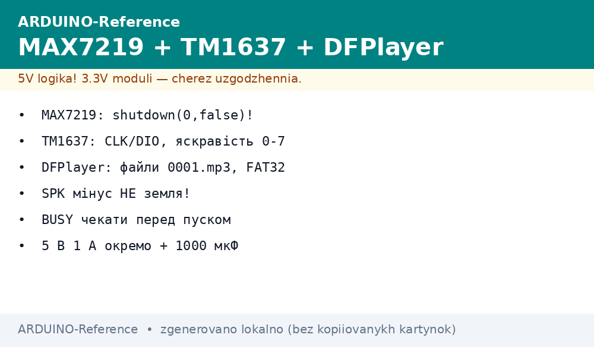
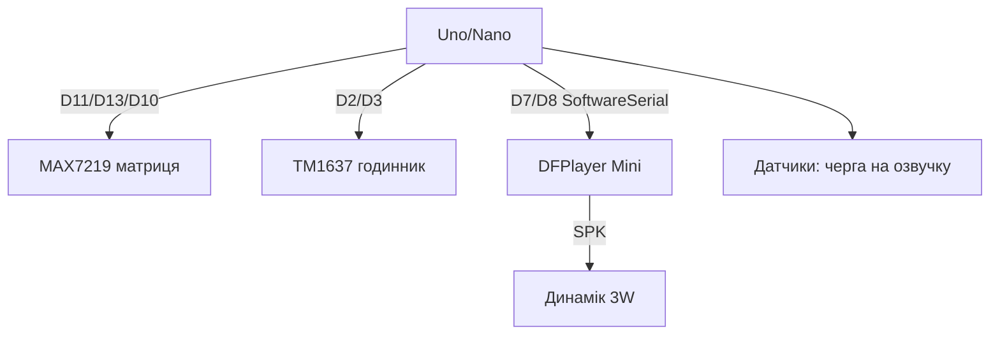

# Arduino і проста індикація - MAX7219, TM1637 та звук DFPlayer


*Рис. MAX7219 крутить матриці по SPI, TM1637 - дешеві цифри по двох дротах, DFPlayer озвучує події.*

> [!tip] Що це за нота
> Коли LCD1602 замалий, а TFT - забагато: табло, годинник, лічильник плюс голосові підказки. Усе - готові бібліотеки, нуль математики. База: [символьний LCD](../../../ARDUINO-Reference/11-Vivid/01-LCD1602.md), [шина SPI](../../../ARDUINO-Reference/04-Shini/02-SPI.md), [ШІМ-вивід](../../../ARDUINO-Reference/03-GPIO/02-PWM-analogWrite.md).

## 1. Мета

Закрити індикацію і звук трьома модулями:

- MAX7219: 8 семисегментників або матриця 8x8, каскад;
- TM1637: 4 розряди з двокрапкою, годинник за копійки;
- DFPlayer Mini: MP3 з microSD по UART, озвучка подій;
- бібліотеки: LedControl/MD_MAX72XX, TM1637Display, DFRobotDFPlayerMini.

| Модуль | Інтерфейс | Бібліотека |
| --- | --- | --- |
| MAX7219 | SPI (DIN/CLK/CS) | LedControl або MD_MAX72XX |
| TM1637 | CLK + DIO | TM1637Display |
| DFPlayer Mini | UART 9600 | DFRobotDFPlayerMini |

## 2. Архітектура



Піни не конфліктують з I2C (A4/A5) і з апаратним Serial - USB-лог лишається вільним.

## 3. MAX7219 на Arduino

- живлення 5V, логіка 5V - прямий дріт без перетворювачів рівнів;
- RSET 10 кОм за замовчуванням, для кімнати ставимо 20+ кОм;
- `lc.setIntensity(0, 8)` - яскравість 0-15;
- каскад: DOUT→DIN наступного, бібліотека знає кількість;
- матриця 8x8 - побітові рядки, шрифт у PROGMEM.

## 4. TM1637 на Arduino

- бібліотека TM1637Display: `display.showNumberDec(1234)`;
- двокрапка: `showNumberDecEx(1234, 0x40)`;
- яскравість 0-7 другим аргументом `setBrightness`;
- один модуль - одна пара пінів (адреси немає);
- для секунд - миготіння двокрапкою по `millis()`.

## 5. Робочий код

```cpp
#include <LedControl.h>
#include <TM1637Display.h>
#include <SoftwareSerial.h>
#include <DFRobotDFPlayerMini.h>

LedControl lc(11, 13, 10, 1);
TM1637Display tm(2, 3);
SoftwareSerial mp3ser(7, 8);
DFRobotDFPlayerMini mp3;

void setup() {
  lc.shutdown(0, false);
  lc.setIntensity(0, 8);
  lc.clearDisplay(0);
  tm.setBrightness(4);
  mp3ser.begin(9600);
  mp3.begin(mp3ser);
  mp3.volume(20);
  mp3.play(1);
}

void loop() {
  static unsigned long t0 = 0;
  if (millis() - t0 > 1000) {
    t0 = millis();
    int temp = analogRead(A1) * 0.488;
    lc.setDigit(0, 0, temp / 10, false);
    lc.setDigit(0, 1, temp % 10, false);
    tm.showNumberDec(millis() / 1000);
  }
  int light = analogRead(A0);
  if (light < 100) {
    mp3.play(2);
    delay(3000);
  }
}
```

Температура тут умовна з LM35 (10 мВ/°C): `analogRead × 5/1024 × 100`. Реальний датчик - див. [аналогові датчики](../../../ARDUINO-Reference/10-Sensori/04-LM35-NTC.md).

## 5.1 Матриця 8x8: біжучий рядок

```cpp
#include <MD_MAX72xx.h>
MD_MAX72XX mx(MD_MAX72XX::FC16_HW, 10, 1);

const uint8_t FONT_H[] = {0x7F, 0x08, 0x08, 0x08, 0x7F};
uint8_t scroll_buf[64];
int scroll_len = 0;

void scroll_text(const char *s) {
  scroll_len = 0;
  while (*s && scroll_len < 56) {
    scroll_buf[scroll_len++] = 0x00;
    s++;
  }
  for (int x = 0; x < scroll_len + 8; x++) {
    mx.clear();
    for (int c = 0; c < 8; c++) {
      int idx = x + c - 8;
      mx.setColumn(c, (idx >= 0 && idx < scroll_len) ? scroll_buf[idx] : 0);
    }
    delay(120);
  }
}
```

Шрифт тримаємо таблицею 5 байт на символ у PROGMEM, кадр зсуваємо кожні 120 мс. Для статичного табло вистачає LedControl, MD_MAX72XX беремо під ефекти.

## 6. DFPlayer: файли і команди

- картка FAT32, файли `0001.mp3` в корені;
- `mp3.play(n)`, `mp3.volume(0-30)`, `mp3.pause()`, `mp3.next()`;
- BUSY-пін - LOW під час гри, чекаємо перед наступним;
- рекламна вставка поверх фону - командою папки;
- SPK− не земля (міст!) - динамік тільки диференційно.

## 7. Живлення

- MAX7219 на повній яскравості: пік 8×8×20 мА - рахуємо БЖ;
- DFPlayer з динаміком: 5V 1A окремо + 1000 мкФ;
- TM1637 - міліампери, з піна 5V ок;
- разом з Uno - межа USB, для табло беремо БЖ 9V.

## 8. Типові помилки

| Симптом | Причина | Лікування |
| --- | --- | --- |
| MAX7219 темний | shutdown за замовчуванням | `lc.shutdown(0, false)` у setup |
| TM1637 показує сміття | переплутані CLK/DIO | поміняти місцями, перевірити приклад |
| DFPlayer мовчить | файли не 0001.mp3 або exFAT | FAT32, 4 цифри, картка до 32 ГБ |
| Хрипить на піках | слабке живлення | окремий стабілізатор + конденсатор |
| Конфлікт пінів | TM1637 на D11/D13 (SPI) | перенести на D2/D3 |
| Дим з SPK | мінус динаміка на землі | тільки диференційно SPK+/SPK− |

## 9. Суміжні ноти

- [символьний LCD](../../../ARDUINO-Reference/11-Vivid/01-LCD1602.md) - текстова альтернатива.
- [OLED-дисплей](../../../ARDUINO-Reference/11-Vivid/02-OLED-SSD1306.md) - графіка замість сегментів.
- [мотори](../../../ARDUINO-Reference/11-Vivid/05-Servo-Motor-L298N.md) - рух плюс індикація.
- [шина SPI](../../../ARDUINO-Reference/04-Shini/02-SPI.md) - швидкості і CS.
- [живлення VIN](../../../ARDUINO-Reference/02-Zhivlennya/01-Zhivlennya-VIN.md) - струми табло.

## Офіційні джерела

- [MAX7219 Datasheet (Analog Devices)](https://www.analog.com/en/products/max7219.html) - регістри, RSET, каскад.
- [Grove 4-Digit Display / TM1637 (Seeed)](https://www.seeedstudio.com/Grove-4-Digit-Display.html) - протокол, команди.
- [DFPlayer Mini SKU DFR0299 (DFRobot Wiki)](https://wiki.dfrobot.com/DFPlayer_Mini_SKU_DFR0299) - файли, команди, BUSY.
