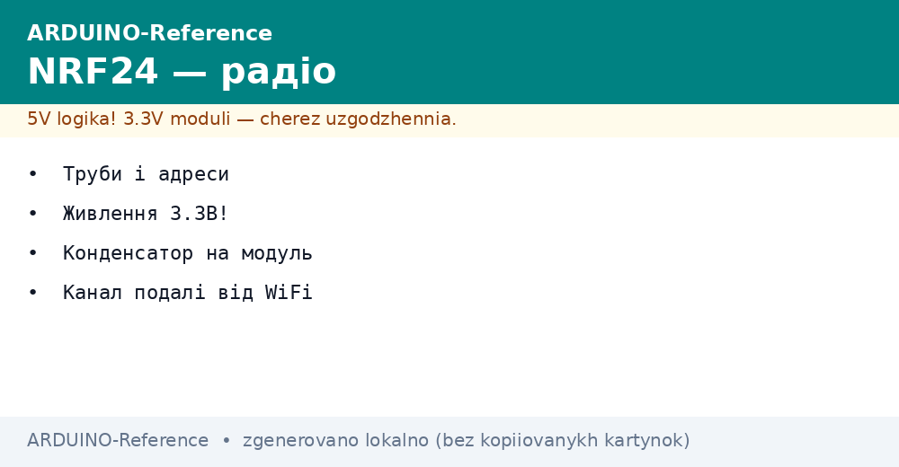
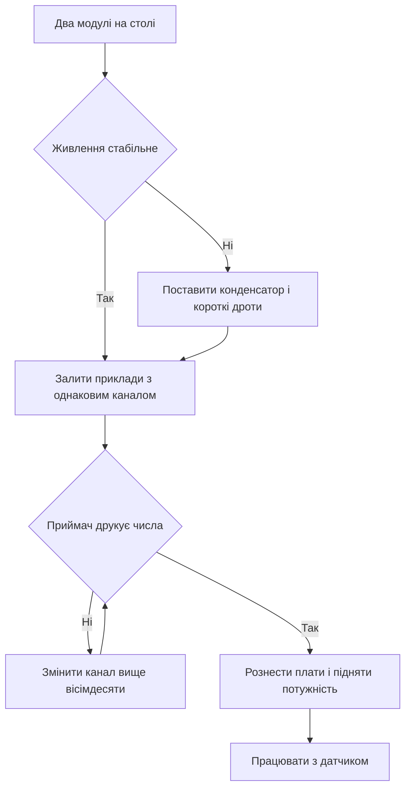

# NRF24L01 - радіо по SPI


*Рис. Модуль радіо на платі, живлення через стабілізатор, конденсатор на шині живлення і канали.*

> [!tip] Призначення ноти
> Пояснити дешеве радіо між двома платами: як живити модуль, як вибрати канал подалі від домашньої мережі і як запустити пару передавач приймач.

## 1. Призначення

Модуль дає простий канал обміну між платами без дротів на відстань кімнати або поверху.

Головна плата керує модулем через швидку шину, а сам модуль працює в ефірі на відкритій смузі.

Пара модулів замінює довгий кабель між датчиком у кімнаті і приймачем біля компютера.

Модуль коштує дешево, бібліотека відкрита, прикладів багато, тому старт швидкий.

Межа чесна: це короткі пакети телеметрії і команди, а не потокове відео або звук.

Ця нота закриває базу: живлення, підключення, бібліотека, адреси, канали і два робочі скетчі.

Базу швидкої шини дивись у ноті [швидка шина](../../../ARDUINO-Reference/04-Shini/02-SPI.md).

Класичну плату для перших дослідів описано у ноті [класичний AVR](../../../ARDUINO-Reference/01-Hardware/01-AVR-Uno.md).

## 2. Що вміє модуль

| Параметр | Значення | Практичний сенс |
| --- | --- | --- |
| Смуга | Відкрита смуга навколо двох цілих чотирьох десятих гігагерца | Без дозволу, але разом з домашніми мережами |
| Канали | Сто двадцять шість кроків по одному мегагерцу | Є куди втекти від завад |
| Швидкість в ефірі | Двісті пятьдесят кілобіт, один або два мегабіти | Повільніше означає далі і стійкіше |
| Пакет | До тридцяти двох байтів корисного навантаження | Короткі команди і покази датчиків |
| Живлення | Три цілих три десятих вольта | Пять вольтів спалить модуль |
| Керування | Швидка шина плюс два окремі сигнали | Один вибір кристала і один дозвіл передачі |
| Ціна | Найдешевший спосіб зв'язати дві плати | Для дослідів беруть пару одразу |

Модуль існує у двох версіях: маленька з друкованою антеною і велика з підсилювачем і зовнішньою антеною.

Маленька версія підходить для кімнати, велика з антеною тягне через стіни і на подвіря.

Обидві версії керуються однаково, різниця лише в дальності і апетиті до струму.

Для першого досліду беруть дві маленькі версії і кладуть їх на відстань пару метрів.

```text
Варіанти модуля:

  Маленький:
  друкована антена на платі
  струм малий, дальність кімната

  Великий:
  зовнішня антена плюс підсилювач
  струм великий, дальність будинок

  Правило:
  починати з маленької пари,
  велику брати для відстані.
```

## 3. Живлення три вольта і конденсатор

| Питання | Відповідь | Чому так |
| --- | --- | --- |
| Напруга живлення | Три цілих три десятих вольта | Вища напруга руйнує кристал |
| Пять вольтів на живлення | Заборонено | Модуль гріється і мовчить назавжди |
| Сигнали керування | Рівні плати п'ять вольтів модуль терпить через дільник або перетворювач | Краще ставити перетворювач рівнів |
| Струм у піку передачі | Десятки міліампер стрибком | Слабкий вихід плати просідає |
| Конденсатор на модулі | Електроліт десять мікрофарад плюс кераміка сто нанофарад | Згладжує стрибок передачі |
| Окремий стабілізатор | Бажаний для великої версії з антеною | Плата не тягне піки підсилювача |

Найчастіша причина мовчання модуля це просадка живлення у момент передачі.

Плата дає три вольта зі слабкого виходу, а модуль смикає струм коротким імпульсом.

Конденсатор ставлять прямо на гребінку модуля між живленням і землею.

Довгі тонкі дроти живлення замінюють короткими, землю ведуть окремим дротом.

```text
Живлення з конденсатором:

  Плата                 Модуль
  -------               ------
  3V3 ---------------- VCC
  GND ---------------- GND
                        |
  Конденсатор 10 мкФ ---+
  між VCC і GND
  якомога ближче
  до гребінки модуля

  Велика версія:
  окремий стабілізатор
  на три вольта,
  землі зєднати.
```

## 4. Підключення до плати

| Сигнал модуля | Куди на малій платі | Сенс |
| --- | --- | --- |
| VCC | Три вольта | Живлення кристала |
| GND | Земля | Спільна земля обов'язкова |
| CE | Цифрова девять | Дозвіл прийому і передачі |
| CSN | Цифрова десять | Вибір кристала на шині |
| SCK | Тринадцять | Такти шини |
| MOSI | Одинадцять | Дані від плати до модуля |
| MISO | Дванадцять | Дані від модуля до плати |
| IRQ | Не підключати | Переривання для просунутих |

Номери дев'ять і десять для двох окремих сигналів можна міняти, їх передають у конструктор бібліотеки.

Три лінії шини лишаються фіксованими, бо їх задає апаратний блок плати.

Землю зєднують першою і розривають останньою, інакше модуль ловить шум.

Дроти даних роблять короткими, довжиною до десяти сантиметрів для першого запуску.

Схему швидкої шини і роль кожного сигналу дивись у ноті [швидка шина](../../../ARDUINO-Reference/04-Shini/02-SPI.md).

## 5. Бібліотека RF24

| Дія | Виклик | Коментар |
| --- | --- | --- |
| Підключити | Підключити заголовок RF24 | Один рядок на початку |
| Створити | Створити обєкт з номерами CE CSN | Номери збігаються з дротами |
| Старт | Почати роботу модуля | Один раз у налаштуванні |
| Потужність | Виставити малу потужність для столу | На столі велика потужність забиває приймач |
| Швидкість | Виставити чверть мегабіта для дальності | Повільніше означає стійкіше |
| Канал | Виставити номер подалі від мереж | Дивись таблицю каналів нижче |
| Труба | Відкрити трубу запису або читання | Адреси парні на обох платах |

Бібліотеку ставлять через менеджер бібліотек за назвою RF24.

Після встановлення відкривають приклад передачі і приклад прийому і звіряють номери сигналів.

Потужність для настільного досліду ставлять мінімальну, інакше приймач глухне поруч.

Швидкість для першого досліду ставлять найнижчу, вона пробачає шум і слабке живлення.

## 6. Труби і адреси

| Поняття | Сенс | Практика |
| --- | --- | --- |
| Труба | Логічний канал прийому всередині модуля | Їх шість, для старту вистачає однієї |
| Адреса | Пять байтів імені труби | Однакова на передавачі і приймачі |
| Запис | Труба передачі на одному боці | Відкривають перед відправкою |
| Читання | Труба прийому на другому боці | Відкривають перед слуханням |
| Підтвердження | Автовідповідь про прийом | Вмикають для надійності |
| Повтори | Кількість спроб і пауза | Ставлять пять спроб з паузою |

Адресу вигадують будь-яку з п'яти байтів, головне однакову з обох боків.

Проста адреса з п'яти однакових символів підходить для першого досліду.

Для трьох вузлів роблять окремі адреси, щоб пакети не плутались.

Довжину пакета тримають однаковою, структуру описують масивом байтів.

```text
Пара адрес для старту:

  Вузол А пише на адресу 00001
  Вузол Б слухає адресу 00001

  Зворотний напрям:
  Вузол Б пише на адресу 00002
  Вузол А слухає адресу 00002

  Правило:
  адреси парні,
  напрями дзеркальні.
```

## 7. Канали подалі від домашньої мережі

| Канал модуля | Частота | Сусіди |
| --- | --- | --- |
| Низькі до сімдесяти | Нижче домашніх мереж | Відносно тихо |
| Сімдесят шість | Середина смуги, типовий приклад | Часто зайнято прикладами сусідів |
| Вісімдесят три і вище | Вище основних домашніх каналів | Тихе місце для своїх пакетів |
| Сто і вище | Верх смуги | Найтихіше, але перевірити прийом |
| Двадцять | Перетин з домашньою мережею | Гірший вибір для старту |

Домашня мережа займає широку смугу, а модуль вузький, тому між мережами є вікна тиші.

Практичний прийом: піднятися вище вісімдесяти і перевірити зв'язок на кількох сусідніх.

Якщо пакети губляться вечорами, коли сусіди дивляться відео, канал міняють.

Сканувати ефір можна прикладом сканера з бібліотеки, він показує шум по каналах.

## 8. Скетч передавача

Передавач читає кнопку або датчик і шле короткий пакет кожну секунду.

```cpp
#include <SPI.h>
#include <RF24.h>

const int PIN_CE = 9;
const int PIN_CSN = 10;

RF24 radio(PIN_CE, PIN_CSN);
const uint8_t ADDR[6] = "00001";
unsigned long count = 0;

void setup() {
  Serial.begin(9600);
  radio.begin();
  radio.setPALevel(RF24_PA_LOW);
  radio.setDataRate(RF24_250KBPS);
  radio.setChannel(90);
  radio.openWritingPipe(ADDR);
  radio.stopListening();
  Serial.println("TX ready");
}

void loop() {
  count = count + 1;
  bool ok = radio.write(&count, sizeof(count));
  if (ok) {
    Serial.println("sent ok");
  } else {
    Serial.println("sent fail");
  }
  delay(1000);
}
```

Плата починає з малої потужності і повільної швидкості для стійкого старту.

Канал дев'яносто лежить вище домашніх мереж і зазвичай чистий.

Підтвердження приходять автоматично, виклик повертає успіх або невдачу.

Лічильник росте кожну секунду, на приймачі видно пропуски за розривами чисел.

## 9. Скетч приймача

Приймач слухає ту саму адресу і друкує отримані числа у монітор порту.

```cpp
#include <SPI.h>
#include <RF24.h>

const int PIN_CE = 9;
const int PIN_CSN = 10;

RF24 radio(PIN_CE, PIN_CSN);
const uint8_t ADDR[6] = "00001";
unsigned long got = 0;

void setup() {
  Serial.begin(9600);
  radio.begin();
  radio.setPALevel(RF24_PA_LOW);
  radio.setDataRate(RF24_250KBPS);
  radio.setChannel(90);
  radio.openReadingPipe(1, ADDR);
  radio.startListening();
  Serial.println("RX ready");
}

void loop() {
  if (radio.available()) {
    radio.read(&got, sizeof(got));
    Serial.print("got ");
    Serial.println(got);
  }
}
```

Канал, швидкість і адреса збігаються з передавачем до останньої цифри.

Приймач після старту переходить у слухання і чекає пакети.

Якщо чисел немає, першим перевіряють живлення і конденсатор, а не код.

Другим кроком міняють канал і кладуть модулі далі один від одного.

## 10. Mermaid: запуск пари



Схема читається згори вниз: спочатку живлення, потім код, потім канал, потім відстань.

Живлення вирішує більшість випадків мовчання, код винен рідше.

Канал міняють кроками по пять вгору, поки прийом не стане чистим.

Потужність піднімають лише після чистого прийому на столі.

## Типові помилки

| # | Помилка | Чому погано | Як правильно |
| --- | --- | --- | --- |
| 1 | Живлення від пяти вольтів | Кристал гріється і гине | Тільки три вольта, перевірити напис на гребінці |
| 2 | Немає конденсатора на гребінці | Провал у момент передачі дає тишу | Десять мікрофарад прямо на модулі |
| 3 | Канал за замовчуванням серед мереж | Пакети губляться вечорами | Канал дев'яносто і вище, перевірити сканером |
| 4 | Різні адреси на двох платах | Передавач шле у порожнечу | Однакова адреса з обох боків |
| 5 | Максимальна потужність на столі | Приймач поруч глухне | Мінімальна потужність для столу, велика для відстані |
| 6 | Довгі дроти шини через макетку | Такти бються, обмін рветься | Короткі дроти до десяти сантиметрів, спільна земля |

## Офіційні джерела

- [Мережа RF24 на docs.arduino.cc](https://docs.arduino.cc/learn/communication/wireless/) - огляд бездротових варіантів, поради з живлення і антен.
- [Довідка SPI на arduino.cc](https://www.arduino.cc/en/Reference/SPI) - сигнали шини, швидкості, приклад обміну з підлеглим.

## Див. також

- [Home](../../../ARDUINO-Reference/Home.md)
- [класичний AVR](../../../ARDUINO-Reference/01-Hardware/01-AVR-Uno.md)
- [швидка шина](../../../ARDUINO-Reference/04-Shini/02-SPI.md)
- [живлення від VIN](../../../ARDUINO-Reference/02-Zhivlennya/01-Zhivlennya-VIN.md)
- [безконтактні картки](../../../ARDUINO-Reference/12-Moduli-zvyazku/02-RC522-RFID.md)
- [поверхи розширення](../../../ARDUINO-Reference/14-Devboards/01-Shildi.md)
