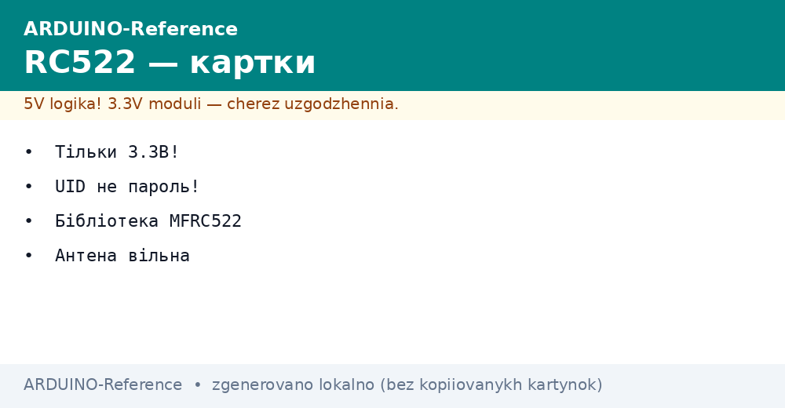
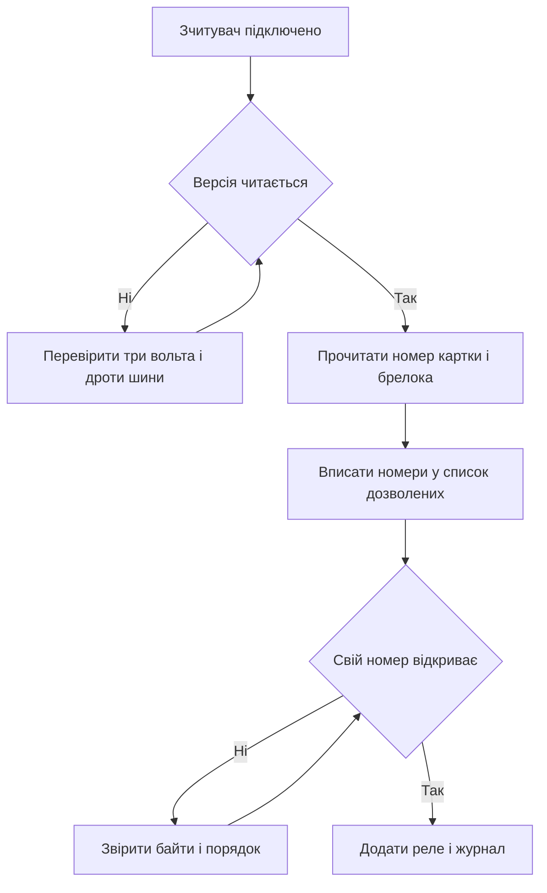

# RC522 - картки на Arduino


*Рис. Зчитувач карток поруч з платою, підключення через швидку шину і прикладена картка.*

> [!tip] Призначення ноти
> Навчити читати номер картки і будувати просту перевірку доступу: правильне живлення, бібліотека, читання номера і чесна межа захисту.

## 1. Призначення

Зчитувач дозволяє відкривати замок, відмічати прихід або вмикати пристрій дотиком картки.

Картка сама нічого не рахує, вона лише віддає свій номер у відповідь на запит поля.

Плата звіряє номер зі списком дозволених і вмикає реле або світлодіод.

Рішення дешеве і наочне, тому його люблять гуртки, лабораторії і домашні майстерні.

Межа чесна: номер картки читається будь-яким зчитувачем, тому це пропуск, а не пароль.

Ця нота закриває практику: живлення, підключення, бібліотека, читання номера і скетч контролю доступу.

Базу швидкої шини дивись у ноті [швидка шина](../../../ARDUINO-Reference/04-Shini/02-SPI.md).

Класичну плату описано у ноті [класичний AVR](../../../ARDUINO-Reference/01-Hardware/01-AVR-Uno.md).

## 2. Що всередині комплекту

| Елемент | Що це | Навіщо |
| --- | --- | --- |
| Плата зчитувача | Кристал і антена у вигляді доріжок | Створює поле і читає відповідь |
| Біла картка | Пластик з чипом всередині | Носити у кишені як пропуск |
| Синій брелок | Маленький корпус з тим самим чипом | Чепляти на ключі |
| Гребінка контактів | Ряд отворів під штирі | Припаяти і вставити у макетку |
| Перемички | Тонкі дроти для макетки | Зєднати з платою коротко |

Картка і брелок з комплекту мають різні номери, обидва підходять для дослідів.

Номер надрукований на картці не завжди збігається з електронним, вірити треба зчитаному.

Поле зчитувача бачить картку на відстані до пяти сантиметрів, через стіл не бачить.

Метал поруч з антеною ріже дальність, тому плату тримають далі від корпусів.

```text
Склад набору:

  Зчитувач ......... плата з антеною
  Картка ........... білий прямокутник
  Брелок ........... синє овальне кільце
  Дроти ............ короткі перемички

  Правило:
  спочатку читати обидва мітки,
  записати номери у зошит.
```

## 3. Тільки три вольта

| Питання | Відповідь | Чому так |
| --- | --- | --- |
| Живлення зчитувача | Три цілих три десятих вольта | Пять вольтів перегріває вхід |
| Сигнал скидання | Рівень плати через дільник бажаний | Прямі пять вольтів ризикують |
| Решта сигналів | Через швидку шину на апаратних пінах | Швидкість стабільна |
| Земля | Спільна з платою | Без землі читання рветься |
| Струм поля | Помірний, виходу плати вистачає | Окремий блок не потрібен |
| Довгі дроти | До десяти сантиметрів | Довші ловлять шум |

Найчастіша помилка це живлення від пяти вольтів, після чого зчитувач гріється і мовчить.

Правильний вихід на платі позначений трьома вольтами, його і беруть.

Якщо плата дає слабкі три вольта, ставлять окремий стабілізатор і зєднують землі.

Перемички живлення роблять короткими і товстими, сигнальні поруч не петляють.

Живлення плати від зовнішнього блока описано у ноті [живлення від VIN](../../../ARDUINO-Reference/02-Zhivlennya/01-Zhivlennya-VIN.md).

## 4. Підключення до плати

| Сигнал зчитувача | Куди на малій платі | Сенс |
| --- | --- | --- |
| VCC | Три вольта | Живлення поля |
| GND | Земля | Спільна земля |
| RST | Цифрова девять | Скидання кристала |
| SDA | Цифрова десять | Вибір кристала на шині |
| SCK | Тринадцять | Такти шини |
| MOSI | Одинадцять | Дані до зчитувача |
| MISO | Дванадцять | Дані від зчитувача |
| IRQ | Не підключати | Переривання для просунутих |

Сигнали скидання і вибору можна рухати на інші цифрові, їх передають у конструктор.

Три лінії шини фіксовані, бо їх задає апаратний блок.

Порядок підключення простий: земля, живлення, сигнали, потім прошивка.

Після монтажу картку підносять на пару сантиметрів і дивляться відповідь у моніторі порту.

```text
Зєднання зі зчитувачем:

  Плата              Зчитувач
  -------            --------
  3V3 -------------- VCC
  GND -------------- GND
  9 ---------------- RST
  10 --------------- SDA
  11 --------------- MOSI
  12 --------------- MISO
  13 --------------- SCK

  Правило:
  живлення три вольта,
  дроти короткі.
```

## 5. Бібліотека MFRC522

| Дія | Виклик | Коментар |
| --- | --- | --- |
| Підключити | Підключити заголовок MFRC522 | На початку скетча |
| Створити | Створити обєкт з пінами вибору і скидання | Номери збігаються з дротами |
| Старт шини | Почати роботу шини | Один раз у налаштуванні |
| Старт чипа | Ініціалізувати зчитувач | Після старту шини |
| Нова картка | Перевірити наявність мітки у полі | Повертає так або ні |
| Читати номер | Прочитати серійний номер | Масив байтів і довжина |
| Пауза | Зупинити криптоблок і дати спокій | Після кожного читання |

Бібліотеку ставлять через менеджер за назвою MFRC522.

Приклад читання номера відкривають з меню прикладів і звіряють номери пінів.

Версію прошивки зчитувача друкують на старті, нулі означають проблему з дротами.

Якщо версія читається, а картка не бачиться, картку присувають ближче і знімають чохол.

## 6. Читання номера

| Крок | Що відбувається | Деталь |
| --- | --- | --- |
| Поле увімкнено | Антена випромінює запит | Світлодіод на платі світить |
| Картка у полі | Мітка живиться від поля | Дальність до пяти сантиметрів |
| Відповідь | Картка віддає номер | Чотири або сім байтів |
| Друк | Плата друкує номер у порт | Шістнадцяткові пари через двокрапку |
| Пауза | Картку прибирають | Повторне читання не дублюється |

Номер друкують у зручному вигляді: кожен байт двома знаками, між байтами двокрапка.

Прочитані номери записують і вставляють у скетч контролю доступу як дозволені.

Читання повторюють для картки і для брелока, номери різні, обидва зберігають.

Телефон з безконтактом може теж давати номер, але нестабільно, для дослідів беруть пластик.

```text
Приклад виводу номера:

  Картка прикладена:
  номер 3А 4Б 7В 1С

  Брелок прикладено:
  номер 9Д 2Е 5Ж 8З

  Дія:
  скопіювати обидва
  у список дозволених.
```

## 7. Номер не пароль

| Міф | Правда | Висновок |
| --- | --- | --- |
| Номер унікальний назавжди | Номер копіюється заготовкою за хвилину | Для сейфа не годиться |
| Захист достатній для дому | Достатній від випадкових, не від навмисних | Додавати кнопку або код |
| Шифрована картка безпечна | Побутовий зчитувач читає лише відкритий номер | Криптографію тут не чіпають |
| Блокування по номеру надійне | Список у коді читається з прошивки | Серйозний замок окремо |
| Дальність велика | Поле бачить лише поруч | Підслухати здалеку важко |

Чесна роль цього рішення це зручний пропуск для гуртка, шафи або іграшкового шлагбаума.

Для дверей підїзду або каси потрібні системи з ключами і сервером, а не один зчитувач.

Користувачам пояснюють просто: картка як ключ від поштової скриньки, а не як печатка банку.

Журнал подій ведуть на платі або компютері, щоб бачити чужі спроби.

## 8. Скетч читання номера

Простий скетч друкує номер кожної прикладеної мітки.

```cpp
#include <SPI.h>
#include <MFRC522.h>

const int PIN_RST = 9;
const int PIN_SDA = 10;

MFRC522 reader(PIN_SDA, PIN_RST);

void setup() {
  Serial.begin(9600);
  SPI.begin();
  reader.PCD_Init();
  Serial.println("show firmware");
  reader.PCD_DumpVersionToSerial();
  Serial.println("bring card");
}

void loop() {
  if (!reader.PICC_IsNewCardPresent()) {
    return;
  }
  if (!reader.PICC_ReadCardSerial()) {
    return;
  }
  Serial.print("UID:");
  for (byte i = 0; i < reader.uid.size; i++) {
    Serial.print(" ");
    Serial.print(reader.uid.uidByte[i], HEX);
  }
  Serial.println();
  reader.PICC_HaltA();
  reader.PCD_StopCrypto1();
  delay(500);
}
```

Версія прошивки друкується на старті для перевірки дротів.

Якщо версія нулі, перевіряють живлення три вольта і лінії шини.

Номер з монітора порту копіюють у наступний скетч як дозволений.

Затримка у кінці прибирає дублі одного прикладання.

## 9. Скетч контролю доступу

Скетч звіряє номер зі списком і вмикає світлодіод на пять секунд.

```cpp
#include <SPI.h>
#include <MFRC522.h>

const int PIN_RST = 9;
const int PIN_SDA = 10;
const int PIN_LED = 7;
const int PIN_BUZZ = 6;

MFRC522 reader(PIN_SDA, PIN_RST);

// Record UID from previous sketch here
const byte GOOD_1[4] = {0x3A, 0x4B, 0x7C, 0x1D};
const byte GOOD_2[4] = {0x9E, 0x2F, 0x5A, 0x8B};

bool sameUid(MFRC522::Uid *u, const byte *g) {
  if (u->size != 4) {
    return false;
  }
  for (byte i = 0; i < 4; i++) {
    if (u->uidByte[i] != g[i]) {
      return false;
    }
  }
  return true;
}

void setup() {
  pinMode(PIN_LED, OUTPUT);
  pinMode(PIN_BUZZ, OUTPUT);
  digitalWrite(PIN_LED, LOW);
  Serial.begin(9600);
  SPI.begin();
  reader.PCD_Init();
  Serial.println("access ready");
}

void loop() {
  if (!reader.PICC_IsNewCardPresent()) {
    return;
  }
  if (!reader.PICC_ReadCardSerial()) {
    return;
  }
  bool ok = sameUid(&reader.uid, GOOD_1) || sameUid(&reader.uid, GOOD_2);
  if (ok) {
    Serial.println("open");
    digitalWrite(PIN_LED, HIGH);
    digitalWrite(PIN_BUZZ, HIGH);
    delay(200);
    digitalWrite(PIN_BUZZ, LOW);
    delay(5000);
    digitalWrite(PIN_LED, LOW);
  } else {
    Serial.println("deny");
    digitalWrite(PIN_BUZZ, HIGH);
    delay(600);
    digitalWrite(PIN_BUZZ, LOW);
  }
  reader.PICC_HaltA();
  reader.PCD_StopCrypto1();
}
```

Список дозволених тримають коротким, два три номери для початку.

Світлодіод замінює замок у настільному макеті, реле ставлять через транзистор окремо.

Звук короткий для своїх, довгий для чужих, щоб різниця чулася здалеку.

Журнал у порт пишуть завжди, щоб бачити спроби підбору.

## 10. Mermaid: від читання до замка



Схема читається згори вниз: спочатку звязок з кристалом, потім номери, потім логіка.

Версія нуль означає проблему монтажу, а не коду.

Номери копіюють уважно, порядок байтів не міняють.

Реле ставлять лише після стабільного читання обох міток.

## Типові помилки

| # | Помилка | Чому погано | Як правильно |
| --- | --- | --- | --- |
| 1 | Живлення від пяти вольтів | Перегрів і мовчання кристала | Тільки три вольта на VCC |
| 2 | Довгі дроти через всю макетку | Шум бє обмін | Короткі дроти, земля поруч |
| 3 | Номер вважають паролем | Копія мітки відкриває замок | Це пропуск, для серйозного захисту інша система |
| 4 | Один номер у списку без запасу | Друга мітка з комплекту не працює | Зчитати і вписати обидва номери |
| 5 | Реле безпосередньо від піни | Струм котушки палить вихід | Реле через транзистор з окремим живленням |
| 6 | Картка у чохлі з металом | Поле не пробиває екран | Прикладати чистий пластик ближче |

## Офіційні джерела

- [Бібліотека MFRC522 на docs.arduino.cc](https://docs.arduino.cc/libraries/mfrc522/) - встановлення, приклад читання номера, опис викликів.
- [Довідка SPI на arduino.cc](https://www.arduino.cc/en/Reference/SPI) - сигнали шини, швидкості, правила спільного використання.

## Див. також

- [Home](../../../ARDUINO-Reference/Home.md)
- [класичний AVR](../../../ARDUINO-Reference/01-Hardware/01-AVR-Uno.md)
- [швидка шина](../../../ARDUINO-Reference/04-Shini/02-SPI.md)
- [радіомодуль](../../../ARDUINO-Reference/12-Moduli-zvyazku/01-NRF24.md)
- [поверхи розширення](../../../ARDUINO-Reference/14-Devboards/01-Shildi.md)
- [дешеві копії](../../../ARDUINO-Reference/14-Devboards/02-Kloni-CH340.md)
- [сенсорний бік RC522](../../../ARDUINO-Reference/10-Sensori/07-RFID-RC522.md) - картки доступу і формати даних
