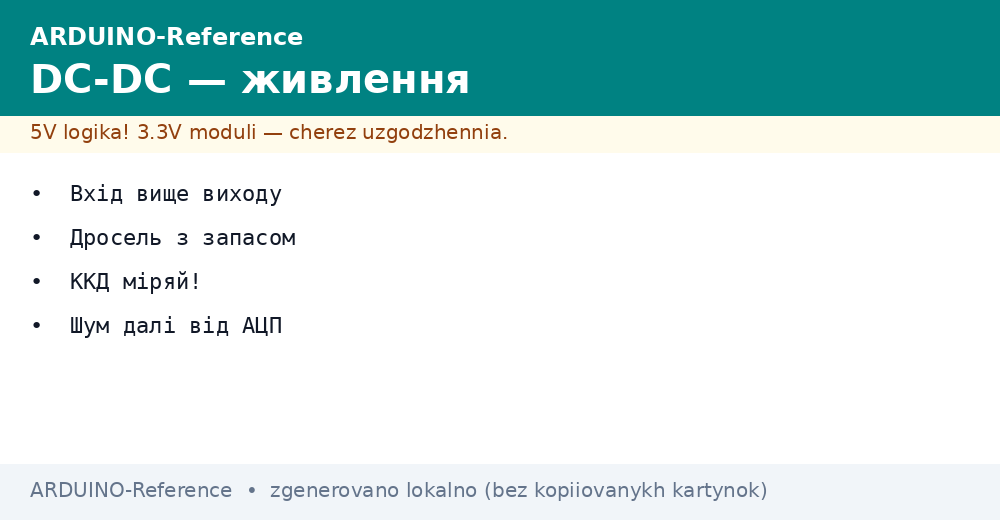
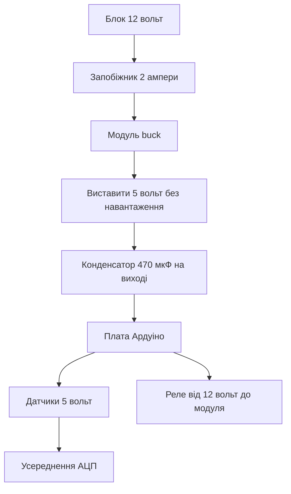

# DC-DC перетворювачі - живлення вузла


*Рис. Імпульсний модуль знижує дванадцять вольт до пяти для плати Ардуіно і датчиків.*

> [!tip] Призначення ноти
> Показати, як живити вузол від дванадцяти вольт без праски з лінійного стабілізатора і без шуму в АЦП.

## 1. Призначення

Вузол на дачі або у теплиці часто живиться від блока на 12 вольт. Світлодіодні стрічки, насоси, замки все просить дванадцять. А плата Ардуіно хоче пять. Вмикати дванадцять прямо у гніздо плати можна, але вбудований стабілізатор гріється як праска і рано чи пізно йде у захист.

Імпульсний знижувальний перетворювач buck вирішує задачу красиво. Він ріже 12 вольт у 5 вольт з коефіцієнтом корисної дії понад вісімдесят відсотків. Гріється слабо, струм тримає ампери, крутилкою виставляється потрібна напруга. Модуль на LM2596 коштує дешево і закриває більшість задач.

Другий бонус це стабільність. Довгі дроти від блока дають просадки, а перетворювач біля вузла їх вирівнює. Датчики отримують чисті пять вольт, АЦП не плаває, реле не дрижать.

## 2. Чому не лінійний стабілізатор

| Параметр | Лінійний 7805 | Імпульсний buck |
| --- | --- | --- |
| ККД з 12 В у 5 В | Близько 42 відсотки | Понад 80 відсотків |
| Тепло при струмі 0.5 А | Близько 3.5 Вт у тепло | Менше 1 Вт у тепло |
| Радіатор | Потрібен вже при 0.3 А | Не потрібен до 1 А |
| Струм | До 1 А з радіатором | До 2 або 3 А за версією |
| Шум | Майже немає | Є, лікується фільтром |

Лінійний стабілізатор спалює зайву напругу у тепло. Різниця 7 вольт при струмі пів ампера це 3.5 вата. Корпус без радіатора так гріти не вміє. Тому вузол з екраном і реле на лінійнику постійно вилітає у тепловий захист.

Імпульсний модуль працює ключем і дроселем. Транзистор або відкритий, або закритий, тепла мало. Недолік це високочастотний шум. Його прибирають відстанню від аналогових ланцюгів і конденсаторами.

## 3. Модуль LM2596 з крутилкою

| Елемент | Призначення | Практика |
| --- | --- | --- |
| Мікросхема LM2596 | Керує ключем | Фіксована частота близько 150 кГц |
| Дросель | Накопичує енергію | Не перекривати магнітом |
| Крутилка | Виставлення напруги | Крутити без поспіху, дивитись тестер |
| Світлодіод | Індикація роботи | Гасне при короткому на виході |
| Клеми вхід і вихід | Підключення дротів | Плюс і мінус не плутати |

Налаштування просте. Підключають вхід 12 вольт, вихід вільний, тестер на вихідні клеми. Крутилку обертають, поки тестер не покаже 5.0 вольт. Лише потім підключають плату Ардуіно. Порядок важливий, бо з заводу модуль може видавати і 12, і 20 вольт.

Крутилка багатооборотна. Один оберт змінює мало, тому крутять спокійно і рахують. Після налаштування краплю лаку на гвинт, щоб не збилось від вібрації.

```text
Налаштування LM2596 покроково:
  1. Вхід 12В на клеми IN плюс до плюса мінус до мінуса
  2. Вихід OUT вільний, тестер на OUT у режимі 20В
  3. Крутилка за годинником піднімає, проти знижує
  4. Виставити 5.0В, зачекати хвилину, перевірити знову
  5. Вимкнути вхід, підключити плату, ввімкнути назад
```

## 4. Схема живлення вузла

| Ланцюг | Провід | Захист |
| --- | --- | --- |
| Блок 12 В до модуля | Мідь 0.75 кв | Запобіжник 2 А на плюсі |
| Модуль до плати Уно | Короткий 0.5 кв | Конденсатор 470 мкФ на виході |
| Датчики 5 В | Від плати або модуля | Конденсатор 100 нФ біля кожного |
| Аналогові датчики | Окремий дріт землі | Земля зіркою до модуля |
| Реле і мотори | Прямо від 12 В | Діод на котушці реле |

Запобіжник на вході рятує від пожежі при короткому. Діод на котушці реле гасить викид при вимиканні. Без діода викид бє по ключу і за живленням всього вузла.

```text
ASCII схема вузла на 12 вольт:
  Блок 12В --запобіжник--> IN+ LM2596 --OUT+ 5В--> VIN плати або 5В пін
  Блок GND  -------------- IN- LM2596 --OUT- GND-> GND плати зіркою
  Реле 12В береться ДО модуля, керування через транзистор
  Датчики 5В біля плати, конденсатори 100 нФ біля кожного
```

Живлення 5 вольт подають або у пін 5V плати, або у гніздо USB через обрізок кабелю. У розєм живлення плати вже не подають, бо там чекають сім і більше вольт. Плутанина тут палить плату.

## 5. ККД і тепло на практиці

При струмі 0.2 ампера модуль ледь теплий. При 1 ампері теплий, але палець тримається. При 2 амперах потрібен обдув або радіатор на мікросхему. Вузол з Ардуіно, екраном і парою датчиків зазвичай бере 0.15 або 0.3 ампера, тому проблем немає.

Вимір струму роблять тестером у розрив плюса. Міряють у трьох станах. Сон вузла, робота без реле, робота з реле. За найбільшим числом вибирають блок з запасом у півтора раза.

## 6. Шум і чистий АЦП

Імпульсний модуль дає пилку на виході з частотою сотні кілогерц. Цифровим схемам вона байдужа, а аналоговий вхід її бачить. Лікується трьома кроками. Модуль подалі від аналогових дротів, конденсатор 470 мкФ на виході, усереднення десяти вимірів у коді.

| Прийом | Що дає |
| --- | --- |
| Відстань 10 см від АЦП дротів | Менше наведень |
| Конденсатор 470 мкФ плюс 100 нФ на виході | Гладка напруга |
| Усереднення 10 вимірів | Шум ділиться на три |
| Окрема земля аналогової частини | Немає спільних просадок |
| Вимір при вимкнених реле | Тихе вікно для АЦП |

Для точних вимірів датчик температури живлять через RC фільтр. Резистор 100 ом плюс конденсатор 10 мкФ біля датчика. Фільтр ріже високі частоти модуля і не заважає повільній температурі.

## 7. Скетч контролю живлення

```cpp
const int PIN_VIN = A0;
const int PIN_LED = 13;
float vin = 0;

void setup() {
  Serial.begin(9600);
  pinMode(PIN_LED, OUTPUT);
}

void loop() {
  long sum = 0;
  for (int i = 0; i < 10; i++) {
    sum += analogRead(PIN_VIN);
    delay(5);
  }
  float avg = sum / 10.0;
  vin = avg * (5.0 / 1023.0) * 3.0;
  Serial.print(F("VIN="));
  Serial.println(vin);
  if (vin < 11.0) {
    digitalWrite(PIN_LED, HIGH);
  } else {
    digitalWrite(PIN_LED, LOW);
  }
  delay(1000);
}
```

Дільник з резисторів 20к і 10к зменшує 12 вольт до рівня входу АЦП. Коефіцієнт три у формулі саме звідти. Усереднення десяти вимірів прибирає шум модуля. Світлодіод сигналізує просадку блока нижче одинадцяти.

## 8. Вибір модуля під задачу

| Задача | Модуль | Коментар |
| --- | --- | --- |
| Вузол з Ардуіно і датчиками | LM2596 2 А | Дешево і вистачає |
| Вузол з екраном і реле | LM2596 3 А або XL4015 | Запас по струму |
| Батарейний вузол | MP1584 міні | Менше споживання в простої |
| Дві напруги 5 і 3.3 В | Два модулі або один плюс LDO | Аналогова частина через LDO для тиші |

Міні модулі на MP1584 зручні для батарейних вузлів, бо менше беруть у простої. Для стаціонарного вузла від мережі різниці немає, беруть великий LM2596 з клемами і радіатором.

## Mermaid: живлення вузла



Схема читається зверху вниз. Запобіжник першим, налаштування напруги до підключення плати, реле живиться до модуля окремо. Аналогові виміри усереднюються.

## Типові помилки

| # | Помилка | Чому погано | Як правильно |
| --- | --- | --- | --- |
| 1 | Підключення плати до неналаштованого модуля | На виході може бути 20 вольт | Спочатку тестер, потім плата |
| 2 | Живлення реле від виходу 5 вольт | Просадки і перезапуски плати | Реле від 12 вольт до модуля |
| 3 | Довгі тонкі дроти 12 вольт | Падіння напруги і гул | Мідь 0.75 кв і модуль біля вузла |
| 4 | Модуль впритул до АЦП дротів | Шум у вимірах | Відстань 10 см і конденсатори |
| 5 | Немає запобіжника | Коротке плавить дроти | Запобіжник 2 А на плюсі блока |
| 6 | Подача 5 вольт у розєм живлення плати | Плата не стартує нормально | Пять вольт у пін 5V або USB |

## Офіційні джерела

- [LM2596 datasheet (Texas Instruments)](https://www.ti.com/product/LM2596) - струми, ККД, типова схема buck перетворювача.
- [Arduino power guide](https://docs.arduino.cc/learn/electronics/power-pins/) - виводи живлення плат і межі струму.

## Див. також

- [Home](../../../ARDUINO-Reference/Home.md)
- [рівні і заряд](../../../ARDUINO-Reference/13-Moduli-zhivlennya-rivniv/02-Level-Shift-TP4056.md)
- [живлення від VIN](../../../ARDUINO-Reference/02-Zhivlennya/01-Zhivlennya-VIN.md)
- [автономне живлення](../../../ARDUINO-Reference/02-Zhivlennya/02-Batareyki.md)
- [класичний AVR](../../../ARDUINO-Reference/01-Hardware/01-AVR-Uno.md)
