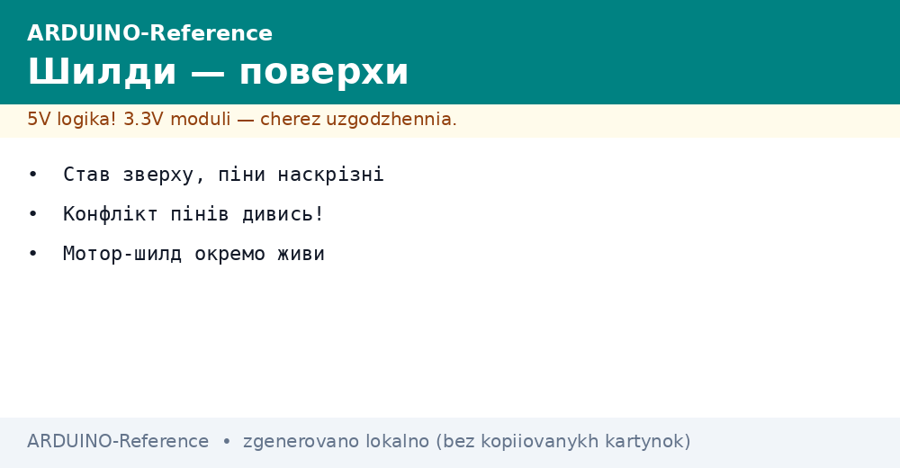
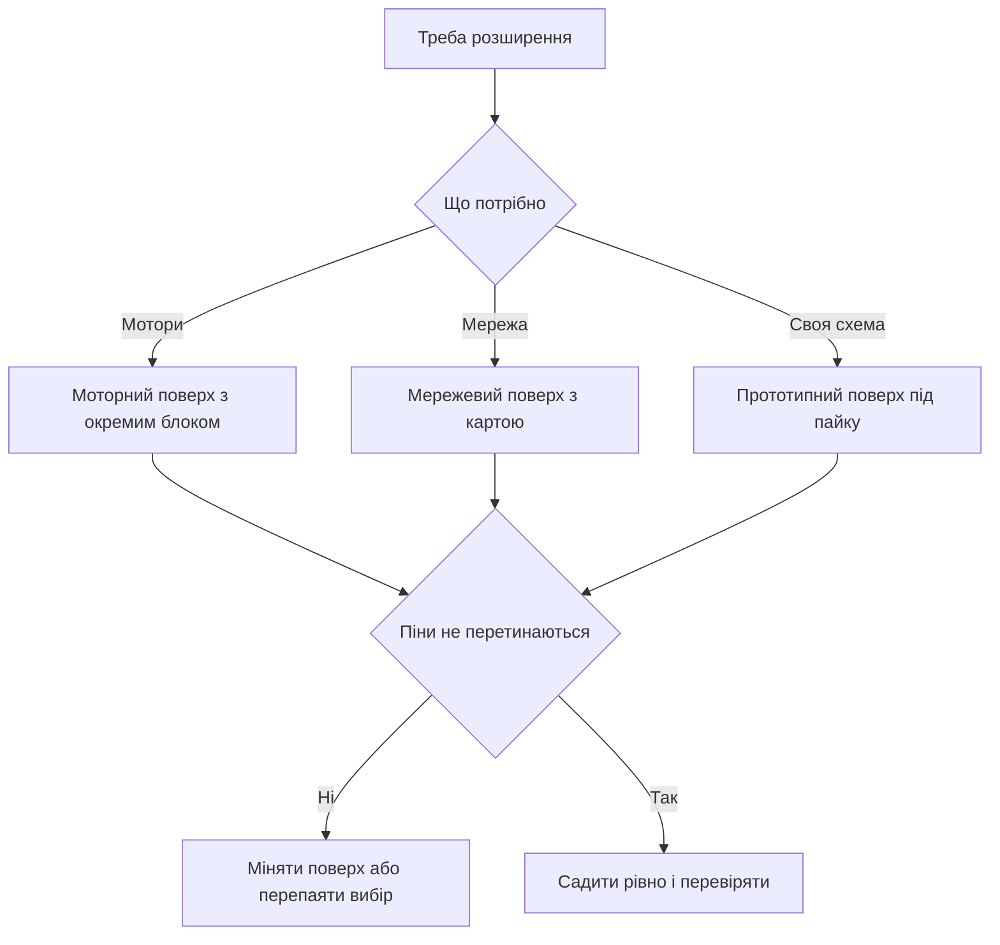

# Шилди Arduino - поверхи розширення


*Рис. Плата розширення поверх основної, наскрізні гребінки, окреме живлення моторів і прототипне поле.*

> [!tip] Призначення ноти
> Пояснити поверхи розширення: як вони стають зверху, чому піни конфліктують, як живити мотори окремо і коли брати прототип або мережу.

## 1. Призначення

Шилд це готова плата, яка стає зверху на основну і одразу дає мотори, мережу або поле для пайки.

Замість десятка перемичок отримують один поверх з розємами, драйвером і написами.

Поверхів можна ставити кілька, вони складаються стопкою через довгі штирі.

Кожен поверх забирає частину пінів під себе, решта проходить наскрізь догори.

Ця нота показує механіку посадки, карту конфліктів, живлення моторів, прототипне поле, мережевий поверх і приклади.

Базову плату описано у ноті [класичний AVR](../../../ARDUINO-Reference/01-Hardware/01-AVR-Uno.md).

Огляд готових плат є у ноті [огляд плат](../../../ARDUINO-Reference/00-Start/04-Devkit-plati.md).

## 2. Як поверх стає зверху

| Елемент | Що робить | Деталь |
| --- | --- | --- |
| Штирі знизу | Входять у гнізда основної плати | Довгі, проходять крізь свою плату |
| Гнізда зверху | Приймають наступний поверх | Копія розкладки основної |
| Ключі і пропуски | Не дають вставити навпаки | Звіряти написи біля країв |
| Механіка | Тримається тертям гнізд | Для дороги беруть гвинтові стійки |
| Висота деталей | Електроліти і розєми заважають | Перед посадкою приміряти без тиску |

Посадка йде рівно без перекосу: ставлять поверх, притискають по кутах по черзі.

Знімають хитанням уздовж довгої сторони, тягнути за дроти заборонено.

Якщо поверх не сідає, дивляться зігнуті штирі, а не тиснуть сильніше.

Після посадки перевіряють, що жоден штир не пройшов повз гніздо.

```text
Посадка поверху:

  Верхній поверх .... гнізда вгору
  Середній поверх ... штирі вниз
  Основна плата ..... гнізда приймають

  Порядок:
  приміряти без тиску,
  натиснути кути по черзі,
  перевірити кожен ряд.

  Зняття:
  хитати уздовж,
  не тягнути за дроти.
```

## 3. Наскрізні піни і що проходить догори

| Група | Проходить догори | Коментар |
| --- | --- | --- |
| Живлення | Пять вольтів, три вольта, земля, вхід | Спільні для всієї стопки |
| Аналогові | Шість входів | Можна ділити між поверхами через увагу |
| Цифрові вільні | Ті, що поверх не чіпає | Доступні наступному поверху |
| Зайняті поверхом | Не чіпати зверху | Там драйвер або мережа |
| Скидання | Спільна лінія | Кнопка скидає всю стопку |
| Опорна напруга | Для перетворювачів | Рідко, але проходить |

Правило просте: вільний пін проходить догори, зайнятий лишається у свого власника.

Перед купівлею другого поверху виписують зайняті піни обох і шукають перетин.

Якщо перетину немає, поверхи дружать, якщо є, один міняють або перепаюють.

Документацію поверху читають до замовлення, а не після отримання посилки.

## 4. Конфлікти пінів

| Поверх | Забирає | З ким свариться |
| --- | --- | --- |
| Моторний на два канали | Чотири цифрові плюс шим | З мережевим за шим і вибір |
| Мережевий | Швидка шина плюс десять і чотири | З картою памяті за вибір |
| Екранний | Швидка шина плюс дані і скидання | З будь-яким, що хоче ту саму шину без транзакцій |
| Релейний | По одному цифровому на реле | З моторним за цифрові |
| Прототипний | Нічого не забирає | Дружить з усіма, якщо не коротити |

Найболючіший вузол це швидка шина: її хочуть одразу екран, мережа і карта памяті.

Шина вміє ділитись, якщо кожен пристрій має свій вибір і свою транзакцію.

Деталі спільного використання дивись у ноті [швидка шина](../../../ARDUINO-Reference/04-Shini/02-SPI.md).

Другий вузол це шим для моторів: таймери спільні, два поверхи смикають один таймер.

```text
Перевірка дружби поверхів:

  1. Виписати зайняті піни першого.
  2. Виписати зайняті піни другого.
  3. Знайти спільні номери.
  4. Спільна шина плюс різні вибори = можна.
  5. Спільний шим або переривання = міняти.

  Приклад:
  мотор 3 11 12 13 плюс мережа 10 11 12 13
  шина спільна, вибори різні = живуть.
```

## 5. Моторний поверх з окремим живленням

| Питання | Відповідь | Чому так |
| --- | --- | --- |
| Живлення логіки | Від основної плати | Мізки окремо, сила окремо |
| Живлення моторів | Окремий блок на гвинтовій колодці | Струм мотора рве логіку |
| Перемичка живлення | Зняти при окремому блоці | Інакше два блоки зустрінуться |
| Земля | Спільна між блоками | Без спільної землі керування пливе |
| Струм | Ампери у піку старту | Батарейки просідають, беруть блок |
| Охолодження | Радіатор на драйвері гріється | Без обдуву довго не тиснути |

Мотор у старті смикає струм у рази більший за робочий, плата такого не дає.

Тому сила йде з окремого блока, а плата лише відкриває ключі драйвера.

Перемичку між живленнями знімають, інакше блок живлення сперечається з портом.

Землі зєднують товстим дротом, тонка перемичка на макетці плавиться.

Зовнішнє живлення плати описано у ноті [живлення від VIN](../../../ARDUINO-Reference/02-Zhivlennya/01-Zhivlennya-VIN.md).

## 6. Прототипний поверх

| Можливість | Як робити | Навіщо |
| --- | --- | --- |
| Поле отворів | Паяти свої деталі | Датчик або кнопки поруч |
| Кнопка і світлодіод | Запаяти одразу | Перевірка без макетки |
| Гвинтова колодка | Вивести живлення | Надійніше за перемички |
| Місце під мікросхему | Панелька під корпус | Аналоговий фронт або ключі |
| Написи | Підписати маркером | Через місяць зрозуміло |

Прототипний поверх це чиста плата з тими самими гребінками, але без драйвера.

На ній збирають свою обвязку: дільники, кнопки, транзистори для реле, розєми датчиків.

Доріжки ріжуть і зєднують дротом, живлення ведуть широкими перемичками.

Після налагодження поверх лишається у виробі, макетка звільняється для наступного досліду.

```text
План прототипу:

  Кнопка ...... цифрова два плюс земля
  Світлодіод .. цифрова сім через резистор
  Датчик ...... аналог нуль плюс живлення
  Реле ........ транзистор плюс діод

  Правило:
  спочатку макетка,
  потім пайка на поверсі.
```

## 7. Мережевий поверх

| Питання | Відповідь | Деталь |
| --- | --- | --- |
| Швидка шина | Зайнята мережею | Ділиться лише через транзакції |
| Карта памяті | Часто вбудована з окремим вибором | Файли для сторінок |
| Живлення | Аптеит помірний, вистачає плати | Окремий блок не потрібен |
| Розєм | Звичайна кручена пара | Довжина десятки метрів |
| Бібліотека | Мережева плюс файлова | Приклади сервера всередині |

Мережевий поверх перетворює плату на маленький сервер: показує покази датчиків у браузері.

Картку памяті форматують у звичайну файлову систему, імена роблять короткими.

Дроти мережі не кладуть поруч з моторами, наводки бють пакети.

Для першого досліду підіймають приклад сервера і відкривають адресу у браузері.

## 8. Приклад з моторним поверхом

Поверх на два канали крутить пару коліс візка вперед, назад і розвороти.

```cpp
const int PIN_PWM_A = 3;
const int PIN_DIR_A = 12;
const int PIN_PWM_B = 11;
const int PIN_DIR_B = 13;

void motorA(int speed) {
  if (speed >= 0) {
    digitalWrite(PIN_DIR_A, HIGH);
    analogWrite(PIN_PWM_A, speed);
  } else {
    digitalWrite(PIN_DIR_A, LOW);
    analogWrite(PIN_PWM_A, -speed);
  }
}

void motorB(int speed) {
  if (speed >= 0) {
    digitalWrite(PIN_DIR_B, HIGH);
    analogWrite(PIN_PWM_B, speed);
  } else {
    digitalWrite(PIN_DIR_B, LOW);
    analogWrite(PIN_PWM_B, -speed);
  }
}

void setup() {
  pinMode(PIN_PWM_A, OUTPUT);
  pinMode(PIN_DIR_A, OUTPUT);
  pinMode(PIN_PWM_B, OUTPUT);
  pinMode(PIN_DIR_B, OUTPUT);
}

void loop() {
  motorA(180);
  motorB(180);
  delay(1500);
  motorA(0);
  motorB(0);
  delay(500);
  motorA(-150);
  motorB(150);
  delay(800);
}
```

Швидкість задають числом від нуля до двохсот пятьдесяти пяти, напрям окремою піном.

Живлення моторів окреме, перемичка знята, землі з'єднані.

Перед заїздом колеса піднімають у повітря і перевіряють напрями.

Якщо візок їде боком, міняють полярність одного мотора у коді.

## 9. Приклад з прототипним поверхом

Кнопка з підтяжкою і світлодіод через резистор без макетки.

```cpp
const int PIN_BTN = 2;
const int PIN_LED = 7;

void setup() {
  pinMode(PIN_BTN, INPUT_PULLUP);
  pinMode(PIN_LED, OUTPUT);
}

void loop() {
  int b = digitalRead(PIN_BTN);
  if (b == LOW) {
    digitalWrite(PIN_LED, HIGH);
  } else {
    digitalWrite(PIN_LED, LOW);
  }
  delay(20);
}
```

Кнопка йде між піном і землею, підтяжка всередині кристала.

Затримка двадцять мілісекунд прибирає брязкіт контактів.

Світлодіод ставлять через резистор, без резистора кристал перегрівається.

Цей приклад паяють першим на чистому поверсі для тренування.

## 10. Mermaid: вибір поверху



Схема читається згори вниз: задача визначає поверх, карта пінів визначає дружбу.

Мотори завжди з окремим блоком, мережа з короткою крученою парою.

Прототип беруть, коли готового поверху під задачу немає.

Посадку перевіряють до вмикання живлення.

## Типові помилки

| # | Помилка | Чому погано | Як правильно |
| --- | --- | --- | --- |
| 1 | Два поверхи на одні піни | Обидва смикають одну лінію | Виписати зайняті піни до купівлі |
| 2 | Мотори від плати без блока | Просідання і перезавантаження | Окремий блок, перемичку зняти, землі зєднати |
| 3 | Крива посадка повз гніздо | Штир гне і коротить сусіда | Садити рівно, перевірити кожен ряд |
| 4 | Спільна шина без транзакцій | Пристрої збивають режими | Кожен обмін у своїй транзакції |
| 5 | Реле без транзистора і діода | Викид котушки бє вихід | Транзистор плюс діод паралельно котушці |
| 6 | Довгі силові поруч з шиною | Наводки бють обмін | Силові окремо, сигнальні коротко |

## Офіційні джерела

- [Огляд шилдів на docs.arduino.cc](https://docs.arduino.cc/hardware/shields/) - механіка посадки, сумісність, приклади поверхів.
- [Моторний шилд на arduino.cc](https://www.arduino.cc/en/Main/ArduinoMotorShieldR3) - канали драйвера, живлення, таблиця пінів.

## Див. також

- [Home](../../../ARDUINO-Reference/Home.md)
- [огляд плат](../../../ARDUINO-Reference/00-Start/04-Devkit-plati.md)
- [класичний AVR](../../../ARDUINO-Reference/01-Hardware/01-AVR-Uno.md)
- [швидка шина](../../../ARDUINO-Reference/04-Shini/02-SPI.md)
- [живлення від VIN](../../../ARDUINO-Reference/02-Zhivlennya/01-Zhivlennya-VIN.md)
- [дешеві копії](../../../ARDUINO-Reference/14-Devboards/02-Kloni-CH340.md)
