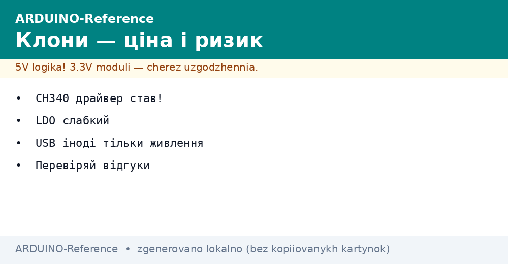
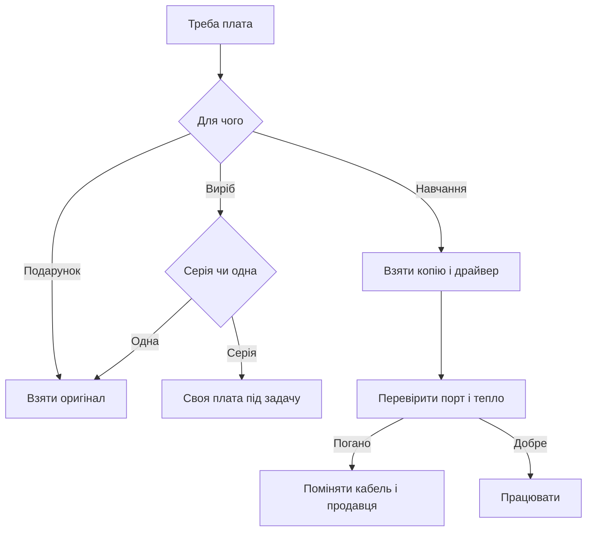

# Клони Arduino - ціна і ризик


*Рис. Дешева копія плати, перетворювач порту, стабілізатор живлення і перевірка перед купівлею.*

> [!tip] Призначення ноти
> Пояснити різницю ціни і ризику: який драйвер ставити, як перевірити копію перед купівлею і коли копія годиться, а коли брати оригінал.

## 1. Призначення

Копія повторює схему класичної плати, але економить на перетворювачі порту, стабілізаторі і розємах.

Ціна нижча у рази, тому для гуртка, класу або домашніх дослідів беруть саме копії.

Якість гуляє від партії до партії: одна працює роками, інша гріється з коробки.

Головний біль це драйвер перетворювача, його ставлять окремо, інакше порт не бачить плату.

Ця нота дає карту відмінностей, встановлення драйвера, перевірку перед купівлею і чесну межу застосування.

Базову класику описано у ноті [класичний AVR](../../../ARDUINO-Reference/01-Hardware/01-AVR-Uno.md).

Огляд готових плат є у ноті [огляд плат](../../../ARDUINO-Reference/00-Start/04-Devkit-plati.md).

## 2. Чим копія відрізняється

| Вузол | Оригінал | Копія | Наслідок |
| --- | --- | --- | --- |
| Перетворювач порту | Фірмовий чип з драйвером у системі | Дешевий CH340 з окремим драйвером | Без драйвера порт мовчить |
| Стабілізатор | Запас по струму і теплу | Слабкий корпус гріється | Датчики з апетитом не тягне |
| Розєм порту | Міцний, тримає сотні вмикань | Хитається, контакти тонкі | Кабель тримати нерухомо |
| Друк і шовкографія | Чіткі написи і маска | Написи пливуть, маски тонкі | Звіряти піни уважніше |
| Завантажувач | Прошитий і перевірений | Іноді старий або кривий | Перепрошити через утиліту |
| Ціна | Вища у рази | Дешева | Для навчання беруть копії |

Копія підходить для навчання: помилятися не шкода, дим не болить гаманцю.

Оригінал беруть для подарунка, виставки або виробу на роки.

Для класу беруть десяток копій і один оригінал як еталон для порівняння.

Завантажувач і утиліту прошивки описано у ноті [завантажувач і avrdude](../../../ARDUINO-Reference/09-Proshivka/02-Bootloader-AVRDUDE.md).

```text
Вибір за задачею:

  Навчання і гурток ..... копія
  Домашні досліди ....... копія
  Подарунок ............. оригінал
  Виріб на роки ......... оригінал
  Клас на десять місць .. копії плюс еталон

  Правило:
  ризик розмазати
  по кількості.
```

## 3. Перетворювач CH340 і драйвер

| Питання | Відповідь | Деталь |
| --- | --- | --- |
| Що це | Дешевий міст між портом і послідовною лінією | Стоїть поруч з розємом |
| Чому порт не бачить | Драйвера немає у системі | Ставити окремо з сайту виробника |
| Де брати | Сайт виробника чипа | Не ставити з випадкових збірок |
| Перевірка | Після встановлення порт зявляється у списку | Назва містить CH340 |
| Швидкість | Стандартні швидкості тримає | Високі рідко, але для прошивки вистачає |
| Скидання | Автоматичне через конденсатор | Іноді тиснуть кнопку вручну |

Драйвер ставлять до першого підключення плати, інакше система показує невідомий пристрій.

Після встановлення компютер перезавантажують і дивляться список портів.

Кабель беруть з даними, а не лише зарядний, інакше порт не зявиться ніколи.

Якщо порт зникає при дотику до кабеля, винен розєм копії або тонкий кабель.

```text
Порядок запуску копії:

  1. Встановити драйвер CH340.
  2. Перезавантажити компютер.
  3. Взяти кабель з даними.
  4. Підключити плату.
  5. Знайти новий порт у списку.
  6. Залити приклад миготіння.

  Нема порту:
  інший кабель,
  інше гніздо,
  перевстановити драйвер.
```

## 4. Слабкий стабілізатор

| Питання | Відповідь | Практика |
| --- | --- | --- |
| Корпус | Маленький без тепловідводу | Гріється швидко |
| Струм | Запас малий | Плату з екраном живити окремо |
| Вхідна напруга | Нижча межа краща | Девять вольтів межа, дванадцять ризик |
| Мотори і реле | Не від плати | Окремий блок, землі спільні |
| Перевірка пальцем | Теплий нормально, гарячий погано | Гарячий зняти живлення |
| Довга робота | Додати обдув або знизити вхід | Або живити повз стабілізатор |

Стабілізатор гріється тим більше, чим вища вхідна напруга і чим більше навішано датчиків.

Практична межа для копії це плата плюс пара датчиків, решта через окремий блок.

Зовнішнє живлення через вхід описано у ноті [живлення від VIN](../../../ARDUINO-Reference/02-Zhivlennya/01-Zhivlennya-VIN.md).

Екран з підсвіткою, радіо з підсилювачем і сервопривід завжди живлять окремо.

## 5. Кабель без даних

| Ознака | Сенс | Дія |
| --- | --- | --- |
| Живлення є, порту немає | Кабель лише зарядний | Взяти кабель з даними |
| Порт зявляється і зникає | Тріщина у дроті або розєм | Замінити кабель |
| Порт є, прошивка рветься | Тонкі дроти, просадка | Короткий товстий кабель |
| Все добре на столі, глюки на виробі | Довгий кабель через кімнату | Короткий кабель плюс окреме живлення |
| Шум поруч з мотором | Наводки на лінію | Рознести кабелі |

Зарядні кабелі зовні такі самі, але всередині немає ліній даних.

Перевірка проста: тим самим кабелем підключити телефон, якщо компютер не бачить дані, кабель зарядний.

Для прошивки тримають окремий перевірений короткий кабель і не дають його у дорогу.

Розєм копії тримають нерухомо під час прошивки, дотик збиває контакт.

## 6. Перевірка перед купівлею

| Крок | На що дивитись | Добре | Погано |
| --- | --- | --- | --- |
| Фото плати | Написи і маска | Чіткі, рівні ряди | Пливи, плями, криві ряди |
| Чип перетворювача | Маркування | Читається CH340 | Зтерте або порожнє |
| Стабілізатор | Корпус | Рівний, без патьоків | Кривий, з кульками припою |
| Гребінки | Ряди штирів | Рівні, однакова висота | Криві, різна висота |
| Розєм | Металева рамка | Сидить рівно | Хитається, щілина |
| Відгуки | Згадки про драйвер | Пишуть який драйвер став | Тиша або скарги на порт |

У продавця питають версію завантажувача і чи плата прошивається з коробки.

Для першої купівлі беруть одну плату, ганяють тиждень, потім добирають партію.

Партію для класу беруть в одного продавця, щоб однакові драйвери і однакові карти пінів.

Чек і переписку зберігають, бо повернення копії це листування з фото.

```text
Огляд посилки:

  Коробка ........... плата у пакеті
  Візуально ......... рівні ряди, чиста маска
  Нюхом ............. без гару
  Пальцем ........... нічого не хитається
  Порт .............. став і зявився
  Миготіння ......... заливається з першого разу

  Далі:
  ганяти добу,
  гріти стабілізатор,
  смикати кабель.
```

## 7. Коли копія ок, а коли оригінал

| Задача | Що брати | Чому |
| --- | --- | --- |
| Гурток і перші кроки | Копія | Не шкода спалити, досвід той же |
| Домашні датчики | Копія | Працює роками у корпусі |
| Подарунок другу | Оригінал | Коробка, підтримка, враження |
| Шкільний конкурс | Оригінал для показу плюс копії для запасу | Показ без сюрпризів |
| Виріб на замовлення | Оригінал або своя плата | Відповідальність за гарантію |
| Довга робота без нагляду | Оригінал з перевіреним живленням | Менше дзвінків вночі |

Копія вчить тому самому: код, піни, шини, живлення переносяться один в один.

Різниця лише у дрібницях: драйвер, тепло, механіка розєма.

Дорослий виріб рахують чесно: час на боротьбу з копією дорожчий за різницю ціни.

Для серії роблять свою плату під задачу, а не купують десяток копій.

## 8. Приклад перевірки порту і миготіння

Перший скетч доводить, що драйвер став, кабель з даними і завантажувач живий.

```cpp
const int PIN_LED = 13;

void setup() {
  pinMode(PIN_LED, OUTPUT);
  Serial.begin(9600);
  Serial.println("clone check");
}

void loop() {
  digitalWrite(PIN_LED, HIGH);
  Serial.println("on");
  delay(500);
  digitalWrite(PIN_LED, LOW);
  Serial.println("off");
  delay(500);
}
```

Світлодіод на тринадцятій миготить, у порт сиплються рядки.

Якщо рядки є, а миготіння немає, дивляться світлодіод, а не драйвер.

Якщо миготіння є, а рядків немає, звіряють швидкість монітора порту.

Якщо немає нічого, міняють кабель і гніздо, потім перевстановлюють драйвер.

## 9. Приклад тесту живлення

Другий скетч гріє стабілізатор чесно: вмикає навантаження і дивиться перезавантаження.

```cpp
const int PIN_LED = 13;
const int PIN_LOAD = 7;

void setup() {
  pinMode(PIN_LED, OUTPUT);
  pinMode(PIN_LOAD, OUTPUT);
  digitalWrite(PIN_LOAD, LOW);
  Serial.begin(9600);
  Serial.println("power test");
}

void loop() {
  digitalWrite(PIN_LOAD, HIGH);
  digitalWrite(PIN_LED, HIGH);
  Serial.println("load on");
  delay(2000);
  digitalWrite(PIN_LOAD, LOW);
  digitalWrite(PIN_LED, LOW);
  Serial.println("load off");
  delay(2000);
}
```

Навантаженням служить світлодіод через резистор або реле через транзистор.

Плату живлять від зовнішнього блока через вхід, дивляться тепло стабілізатора.

Якщо плата перезавантажується під навантаженням, живлення слабке.

Таку копію лишають для легких задач без апетитних датчиків.

## 10. Mermaid: купувати чи ні



Схема читається згори вниз: задача визначає клас плати, перевірка визначає довіру.

Копію без перевірки у виріб не ставлять.

Оригінал без перевірки живлення теж не ставлять.

Свою плату роблять, коли копій треба більше десяти.

## Типові помилки

| # | Помилка | Чому погано | Як правильно |
| --- | --- | --- | --- |
| 1 | Драйвер не ставити | Порт не бачить плату | Встановити драйвер з сайту виробника |
| 2 | Кабель зарядний | Живлення є, даних немає | Кабель з даними, перевірити телефоном |
| 3 | Дванадцять вольтів на вхід копії | Стабілізатор кипить | Девять вольтів межа, краще сім |
| 4 | Мотори від плати | Просідання і перезавантаження | Окремий блок, спільна земля |
| 5 | Старий завантажувач | Прошивка рветься наприкінці | Вибрати стару версію у меню або перепрошити |
| 6 | Вся партія відразу | Брак множиться на десять | Одна на пробу, потім партія |

## Офіційні джерела

- [Драйвери і плати на docs.arduino.cc](https://docs.arduino.cc/software/ide/) - встановлення середовища, вибір порту, перша прошивка.
- [Порівняння плат на arduino.cc](https://www.arduino.cc/en/hardware) - оригінальні плати, живлення, карти розємів.

## Див. також

- [Home](../../../ARDUINO-Reference/Home.md)
- [огляд плат](../../../ARDUINO-Reference/00-Start/04-Devkit-plati.md)
- [класичний AVR](../../../ARDUINO-Reference/01-Hardware/01-AVR-Uno.md)
- [завантажувач і avrdude](../../../ARDUINO-Reference/09-Proshivka/02-Bootloader-AVRDUDE.md)
- [поверхи розширення](../../../ARDUINO-Reference/14-Devboards/01-Shildi.md)
- [радіомодуль](../../../ARDUINO-Reference/12-Moduli-zvyazku/01-NRF24.md)
