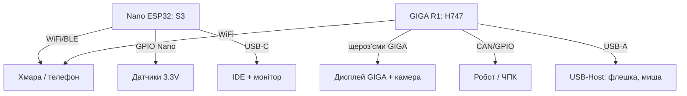

# Arduino 32-бітні флагмани - Nano ESP32 та GIGA R1 WiFi


*Рис. Nano ESP32 - кишеньковий WiFi/BLE-вузол, GIGA R1 - промисловий монстр на STM32H7 з купою периферії.*

> [!tip] Що це за нота
> Коли Uno замалий, а ESP32-голий чип - незручний: офіційні 32-бітні плати Arduino з підтримкою IDE, хмари і шилдів. База: [платформа AVR Uno](../../../ARDUINO-Reference/01-Hardware/01-AVR-Uno.md), [Due і Zero](../../../ARDUINO-Reference/01-Hardware/03-Due-Zero-ARM.md), [Nano 33 BLE](../../../ARDUINO-Reference/01-Hardware/05-Nano33-BLE-ARM.md).

## 1. Мета

Обрати правильний флагман під задачу:

- Nano ESP32: WiFi/BLE-проєкти у форм-факторі Nano;
- GIGA R1 WiFi: робот, ЧПК, HMI, машинний зір (камера + дисплей);
- обидва - Arduino IDE 2 і Arduino Cloud з коробки;
- сумісність з 5V шилдами - через логіку плат.

| Плата | Ядро | Пам'ять | Радіо | Форм-фактор |
| --- | --- | --- | --- | --- |
| Nano ESP32 | ESP32-S3, 240 МГц | 16 МБ flash, 512 КБ SRAM | WiFi + BLE 5 | Nano (30 пінів) |
| GIGA R1 WiFi | STM32H747 (M7+M4) | 16 МБ flash, 1 МБ RAM | WiFi + BT (Murata) | Mega (GIGA-форм) |

## 2. Архітектура



Nano ESP32 - 3.3V логіка (5V датчики через перетворювач рівнів!). GIGA - 3.3V з 5V-толерантними цифровими входами, але АЦП тільки 3.3V.

## 3. Nano ESP32 детально

- ESP32-S3 з USB-OTG: прошивка і CDC-монітор по одному USB-C;
- Arduino-ядро ESP32 + Arduino-патчі (LED_BUILTIN = RGB!);
- MicroPython - другим ядром за бажанням;
- BLE і WiFi одночасно - вистачає пам'яті;
- deep-sleep - мікроампери, будильник по тачу/таймеру;
- ціна рівня оригінального Nano, можливості - ESP32-S3.

## 4. GIGA R1 WiFi детально

- два ядра: M7 480 МГц (обчислення) + M4 240 МГц (периферія);
- роз'єми під офіційний дисплей 800×480 і камеру OV767x;
- USB-A host, Ethernet (зовнішній PHY через роз'єм?), CAN-FD;
- DAC, АЦП 16 біт, таймери для моторів - спадщина STM32;
- Arduino Cloud і Edge Impulse - TinyML на M7;
- ціна - як 5 китайських Uno, брати під справжню задачу.

## 5. Робочий код

```cpp
#if defined(ARDUINO_NANO_ESP32)
#include <WiFi.h>
#include <PubSubClient.h>
WiFiClient net;
PubSubClient mqtt(net);
#endif

#ifdef GIGA_R1_M7
#include <WiFi.h>
#endif

void setup() {
  Serial.begin(115200);
  pinMode(LED_BUILTIN, OUTPUT);
  WiFi.begin("ssid", "pass");
  while (WiFi.status() != WL_CONNECTED) {
    delay(500);
  }
#if defined(ARDUINO_NANO_ESP32)
  mqtt.setServer("broker.local", 1883);
  mqtt.connect("nano-node");
#endif
}

void loop() {
  digitalWrite(LED_BUILTIN, HIGH);
  delay(500);
  digitalWrite(LED_BUILTIN, LOW);
  delay(500);
#if defined(ARDUINO_NANO_ESP32)
  mqtt.loop();
  mqtt.publish("nano/uptime", String(millis()).c_str());
#endif
}
```

Макроси `ARDUINO_NANO_ESP32` і `GIGA_R1_M7` ставить ядро автоматично - один скетч на обидві плати з `#ifdef`.

## 6. Вибір плати

| Задача | Плата |
| --- | --- |
| Домашній IoT-вузол, батарея | Nano ESP32 |
| Робот з камерою і дисплеєм | GIGA R1 + дисплей |
| BLE-датчик для телефона | Nano ESP32 (або Nano 33 BLE) |
| ЧПК/3D-принтер електроніка | GIGA R1 (таймери, CAN) |
| Навчання з нуля, 5V модулі | Uno R3, не флагмани |

## 6.1 Живлення флагманів: струми

| Режим | Nano ESP32 | GIGA R1 |
| --- | --- | --- |
| Сон (deep-sleep) | ~10 мкА | ~100 мкА (M4 жевріє) |
| Активний без радіо | ~50 мА | ~200 мА |
| WiFi TX пік | ~400 мА | ~350 мА |
| Дисплей GIGA + камера | - | +400 мА |

Обидві плати живимо 5V (USB-C / VIN): вбудовані buck дають 3.3V. Піки WiFi згладжуємо конденсатором 470 мкФ біля VIN, якщо БЖ слабкий.

## 7. Підводні камені

- Nano ESP32: RGB-світлодіод замість звичайного - `digitalWrite` дає не той колір, що чекали;
- GIGA: перша прошивка довга (16 МБ), не лякатись;
- обидві - 3.3V, старі 5V шилди тільки через узгодження;
- BLE на Nano ESP32 і WiFi одночасно - стежити за heap;
- Arduino Cloud вимагає реєстрації плати - безкоштовний тариф обмежений.

## 8. Типові помилки

| Симптом | Причина | Лікування |
| --- | --- | --- |
| Nano ESP32 не прошивається | не той порт (їх два: DFU і CDC) | обрати порт після подвійного ресету |
| WiFi конектиться хвилину | ядро ESP32 старе | оновити esp32-ядро в Boards Manager |
| GIGA не бачить камеру | шлейф не тим боком | синя смуга до роз'єму, защіпнути |
| 5V датчик мовчить | логіка 3.3V | перетворювач рівнів рівнів, живлення датчика окремо |
| Cloud не приймає плату | не той скетч (треба Cloud-шаблон) | створити Thing, залити згенерований код |
| RGB світить не так | спільний анод, інверсія | `digitalWrite(LOW)` = увімкнути колір |

## Див. також

- [платформа AVR Uno](../../../ARDUINO-Reference/01-Hardware/01-AVR-Uno.md) - з чого починати.
- [Due і Zero](../../../ARDUINO-Reference/01-Hardware/03-Due-Zero-ARM.md) - перші 32-бітні.
- [Nano 33 BLE](../../../ARDUINO-Reference/01-Hardware/05-Nano33-BLE-ARM.md) - BLE-попередник.
- [середовище IDE і CLI](../../../ARDUINO-Reference/09-Proshivka/01-IDE-CLI.md) - ядра і менеджери плат.
- [HTTP і веб-клієнт](../../../ARDUINO-Reference/15-Protokoli/03-HTTP-Web.md) - вихід у хмару.

## Офіційні джерела

- [Nano ESP32 (Arduino docs)](https://docs.arduino.cc/hardware/nano-esp32/) - піни, S3, MicroPython.
- [GIGA R1 WiFi (Arduino docs)](https://docs.arduino.cc/hardware/giga-r1-wifi/) - H747, дисплей, камера.
- [Getting Started (Arduino docs)](https://docs.arduino.cc/learn/) - Cloud, IDE 2, ядра.
