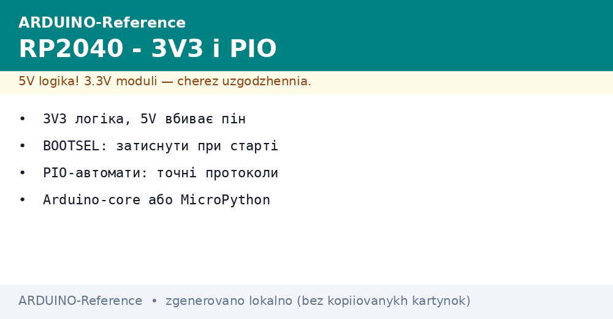
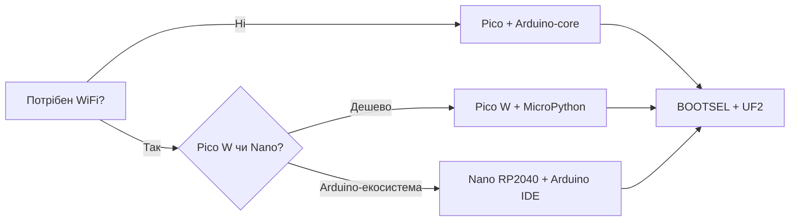

# RP2040 на Arduino-рейках - Pico, Nano RP2040, 3V3 і PIO


*Рис. RP2040 - 3V3-логіка і PIO-автомати: BOOTSEL при старті, точні протоколи без CPU.*

> [!tip] Призначення ноти
> Посадити RP2040 на знайомі Arduino-рейки: коли брати Pico/Nano RP2040 замість AVR,
> як не вбити пін п'ятьма вольтами і що робити з PIO-автоматами.

## 1. Плати: Pico, Pico W, Nano RP2040 Connect

| Плата | Чип | Пам'ять | Радіо | Форм-фактор |
| --- | --- | --- | --- | --- |
| Pico | RP2040 2xM0+ 133 МГц | 264 КБ SRAM, 2 МБ flash | Нема | DIP-40, micro-USB |
| Pico W | RP2040 + CYW43439 | 264 КБ SRAM, 2 МБ flash | WiFi 4 (BT лише C SDK) | DIP-40 |
| Pico 2 / 2 W | RP2350 2xM33 150 МГц | 520 КБ SRAM, 4 МБ flash | W: WiFi (BT лише C SDK) | DIP-40 |
| Nano RP2040 Connect | RP2040 + NINA-W102 | 264 КБ SRAM, 16 МБ flash | WiFi + BLE, IMU, мікрофон | Nano DIP-30 |

## 2. Головне правило: 3V3-логіка

- Піни RP2040 **не толерантні до 5V**: 5V на вході вбиває пін назавжди;
- датчики 5V (HC-SR04, старі енкодери) тільки через перетворювач рівнів або дільник;
- живлення плати 5V по USB приймається, але логіка скрізь 3V3;
- АЦП: 12 біт, опора 3V3 (а не 5V як на Uno) - формули перерахунку міняються.

## 3. BOOTSEL і прошивка

- Утримуй BOOTSEL при подачі живлення: плата з'являється як USB-диск RPI-RP2;
- Arduino IDE: плати RP2040 (через Boards Manager, ядро Arduino-Mbed або Earlephilhower);
- перетягни `.uf2` на диск - прошивка без кнопок і програматорів;
- MicroPython: `.uf2` з micropython.org, далі Thonny + REPL.

## Mermaid: вибір прошивки



## 4. Arduino-core проти MicroPython

| Критерій | Arduino-core (Mbed/Earlephilhower) | MicroPython |
| --- | --- | --- |
| Старт | Скетч, `setup/loop` | REPL, `main.py` |
| Бібліотеки Arduino | Так (Wire, SPI, Servo) | Частково (machine, network) |
| WiFi | WiFiNINA (Nano) / CYW43 (Pico W) | `network.WLAN` |
| Точний час | PIO + IRQ | PIO через `rp2` |
| Дебаг | Serial + лог. аналізатор | REPL + print |

## 5. PIO-автомати коротко

- 2 блоки PIO x 4 автомати: точні протоколи (WS2812, DHT, I2S) без участі CPU;
- автомат женуть програму до 32 інструкцій на частоті до 133 МГц;
- з Arduino: бібліотека `PicoPIO` (Earlephilhower core) або асемблер PIO вручну;
- приклад: WS2812 на 800 кГц - один автомат, CPU вільний для логіки.

```cpp
// PIO-blink вбудованим LED через Arduino-core (Earlephilhower)
#include <hardware/pio.h>
void setup() {
  pinMode(LED_BUILTIN, OUTPUT);
}
void loop() {
  digitalWrite(LED_BUILTIN, HIGH);
  delay(500);
  digitalWrite(LED_BUILTIN, LOW);
  delay(500);
}
```

## 6. WiFi на Nano RP2040 і Pico W

- Nano RP2040: модуль NINA-W102 (ESP32 всередині) - бібліотека WiFiNINA, BLE теж;
- Pico W: CYW43439 - WiFi 4 через `CYW43`; BT лише через C SDK/BTstack, у MicroPython нема;
- антена на платі: не закривати металом, інакше -10 дБ і обриви;
- живлення WiFi: піки 300+ мА - USB 500 мА вистачає, але з запасом.

## 7. Типові помилки

| Симптом | Причина | Лікування |
| --- | --- | --- |
| Пін мовчить після 5V | Вбитий вхід перевищенням | Тільки заміна плати; далі через перетворювач рівнів |
| Не видно RPI-RP2 | BOOTSEL не затиснутий при старті | Затиснути кнопку до подачі живлення |
| UF2 не прошивається | Кабель charge-only без даних | Кабель з даними; інший порт без хаба |
| WiFi не конектиться | 5 ГГц мережа або закритий металом | Тільки 2.4 ГГц; прибрати метал від антени |
| АЦП бреше на 20% | Формула під 5V опору | Опора 3V3: `volt = raw * 3.3 / 4095` |
| MicroPython завис на BT | BT на CYW43439 без підтримки | BT лише C SDK; у MP тільки WiFi |

## 8. Живлення RP2040-плат у полі

- Pico по USB: 5V 500 мА вистачає з запасом; VSYS 1.8-5.5V для батарейних вузлів;
- Nano RP2040: VIN 5-21V через MP2322, але гріється на 12V+ - для довгих ліній брати 5V;
- Pico W з WiFi: середнє 100 мА, піки 300 мА - тонкі USB-кабелі просаджують;
- deep-sleep RP2040: ~1 мА з флешкою у sleep, мікроконтролер без периферії - десятки мікроампер;
- батарея Li-Ion на VSYS напряму: 3.0-4.2V входить у 1.8-5.5V, але без захисту від перерозряду - додати DW01.

## 9. Швидка шпаргалка RP2040

- BOOTSEL при старті - диск RPI-RP2 - перетягнути UF2 - готово;
- 3V3 всюди: АЦП опора 3.3V, I2C pull-up до 3V3, UART рівні 3V3;
- Arduino-core для скетчів, MicroPython для швидких експериментів у REPL;
- PIO для WS2812/DHT/I2S: один автомат замість біт-бенгу на CPU;
- WiFi тільки 2.4 ГГц; антену не закривати металом і рукою.

## 10. Pico W проти Nano RP2040 Connect

| Критерій | Pico W | Nano RP2040 Connect |
| --- | --- | --- |
| Ціна | Найнижча | Вища (IMU + мікрофон) |
| WiFi | CYW43439, тільки WiFi | NINA-W102, WiFi + BLE |
| Датчики на борту | Нема | IMU, мікрофон |
| Arduino IDE | Через ядро Mbed/Earlephilhower | З коробки |
| Flash | 2 МБ | 16 МБ |

## 11. Дебаг RP2040 без болю

- Serial через USB-CDC: `Serial.begin(115200)` працює одразу після прошивки;
- printf-дебаг у REPL (MicroPython) швидший за перепрошивку скетчу;
- логічний аналізатор на PIO-пінах покаже джиттер краще за осцилограф;
- `picotool` зчитує flash і перезавантажує в BOOTSEL без кнопки.

## Див. також

- [Uno-класика](../../../ARDUINO-Reference/01-Hardware/01-AVR-Uno.md) - коли вистачає AVR;
- [R4-флагман](../../../ARDUINO-Reference/01-Hardware/04-Uno-R4.md) - 32-бітна альтернатива;
- [Клони](../../../ARDUINO-Reference/14-Devboards/02-Kloni-CH340.md) - як не купити підробку;
- [Цифра](../../../ARDUINO-Reference/03-GPIO/01-Digital-pini.md) - піни AVR проти 3V3;
- [PlatformIO](../../../ARDUINO-Reference/09-Proshivka/03-PlatformIO.md) - PIO-проєкти під RP2040.

## Офіційні джерела

- [Nano RP2040 Connect (Arduino docs)](https://docs.arduino.cc/hardware/nano-rp2040-connect/) - піни, NINA, IMU, мікрофон.
- [RP2040 Datasheet (Raspberry Pi)](https://datasheets.raspberrypi.com/rp2040/rp2040-datasheet.pdf) - PIO, АЦП, USB, BOOTSEL.
- [Microcontrollers docs (Raspberry Pi)](https://www.raspberrypi.com/documentation/microcontrollers/) - Pico SDK і MicroPython.
- [PlatformIO docs (PlatformIO)](https://docs.platformio.org/en/latest/) - плати RP2040, upload, monitor.
