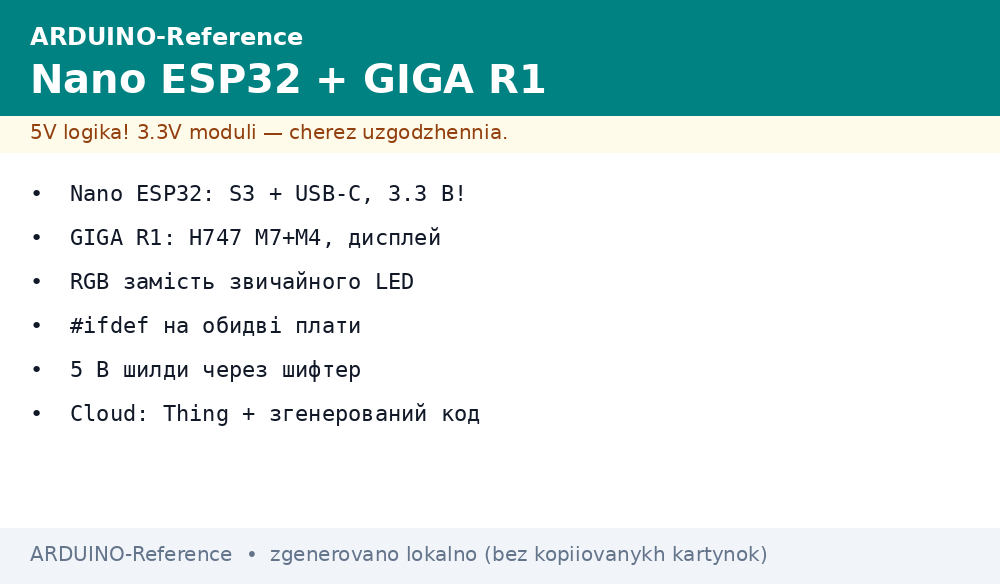

# Arduino 32-бітні флагмани - Nano ESP32 та GIGA R1 WiFi

*Рис. Nano ESP32 - кишеньковий WiFi/BLE-вузол, GIGA R1 - промисловий монстр на STM32H7 з купою периферії.*

> [!tip] Призначення ноти
> Розібрати, коли класична AVR-форма не витримує - і як перевести проєкт на 32-бітні плати Arduino без втрати інвестицій у код.

## 1. Чому не AVR

- 16 МГц / 8 біт → обчислення з точкою з’являються з болем (float = 4× повільніше);
- 2 КБ SRAM → не вміщають JSON/Web/API-клієнт;
- USB → лише через окремий чип (CH340/ATmega16U2), не нативний;
- BLE/WiFi → зовнішній модуль, не вбудований.

## 2. Nano ESP32 - ESP32-S3 в Arduino-формі

| Параметр | Nano ESP32 | GIGA R1 WiFi |
| --- | --- | --- |
| Мікроконтролер | ESP32-S3 (Xtensa LX7, 240 МГц) | STM32H747 (Cortex-M7 480 МГц + M4) |
| Пам'ять | 512 КБ SRAM + 8 МБ QSPI-флеш | 1 МБ SRAM + 8 МБ флеш |
| WiFi / BLE | 802.11 b/g/n + BLE 5 | WiFi + BT через модуль ESP32-C6 |
| Піни GPIO | 22 / 12 PWM / 2 ADC / 2 DAC | 76 / 12 PWM / 3 ADC |
| USB | USB-CDC (віртуальний COM) | USB-OTG (device + host) |
| Живлення | 5 В через USB / VIN (7-12 В) | 7-12 В / PoE-HAT через Ethernet |

## 3. Перехід з AVR-коду

- `digitalWrite` / `analogRead` - сумісні, але `analogWrite` на ESP32 = LEDC (частота/розрядність за ядром);
- `Serial` → `Serial2` (UART) або `Serial1`; `Serial` залишається USB-CDC;
- `delay()` / `millis()` - працюють, але для точності краще `esp_timer_get_time()` (ESP32) / `HAL_Delay()` (GIGA);
- `attachInterrupt` - сумісний; для BLE/WiFi - `WiFi.h` / `BLEDevice.h` (ESP-IDF-обгортка).

## 4. Вибір під задачу

- **Чутливий сенсор / MQTT-вузол** → Nano ESP32 (малий, WiFi з коробки, споживання ~15 мА активний);
- **Промисловий шлюз / Modbus / Ethernet / LoRa** → GIGA R1 (STM32H7-FPUs, USB-host, Ethernet-native);
- **Мікро-робот з WiFi** → Nano ESP32 + 18650 + buck + PCB.

## 5. Типові помилки

| Симптом | Причина | Лікування |
| --- | --- | --- |
| UART не відповідає | ESP32-S3 має 3 UART, пін-розклад залежить від core | Перевірте `Serial2.begin()`; не плутайте GPIO0/1 з USB |
| BLE не з’єднується | Підключено стару версію ESP32-BLE-lib | Оновіть до 2.x через Library Manager; перевірте UUID |
| WiFi падає після sleep | ESP32-S3 в deep-sleep втрачає стан WiFi | Використовуйте `WiFi.setSleep()` або прокидайтеся через ULP |
| GIGA не бачить USB-stick | USB-host не увімкнено в `.io` | У CubeMX увімкніть USB-OTG Host; в коді `USB.begin()`;
| Live - GIGA перегрівається | Без кулера на STM32H7 під 100 % навантаження | Додайте радіатор + корпус з вентиляцією |

## 6. Суміжні ноти

- [AVR-Uno](../../../ARDUINO-Reference/01-Hardware/01-AVR-Uno.md) - класичний старт;
- [UART](../../../ARDUINO-Reference/04-Shini/01-UART.md) - серійний порт на обох;
- [LoRa](../../../ARDUINO-Reference/05-Radio/01-LoRa-moduli.md) - радіо на GIGA через модуль;
- [16-біт](../../../ARDUINO-Reference/07-Timeri-Son/03-Timeri-16bit-Deep.md) - таймери AVR vs ESP32/STM32;
- [Клони](../../../ARDUINO-Reference/14-Devboards/02-Kloni-CH340.md) - як не купити підробку замість флагмана.

## Офіційні джерела

- [Arduino Nano ESP32 Docs (Arduino)](https://docs.arduino.cc/hardware/nano-esp32/) - піни, живлення, завантаження.
- [Arduino GIGA R1 WiFi Docs (Arduino)](https://docs.arduino.cc/hardware/giga-r1-wifi/) - STM32H7, USB-OTG, Pinout.
- [PlatformIO Arduino ESP32 (PlatformIO)](https://docs.platformio.org/en/latest/frameworks/arduino.html) - core + lib_deps.
- [ESP32-S3 Datasheet (Espressif)](https://www.espressif.com/sites/default/files/esp32-s3_datasheet_en.pdf) - DMA, USB-OTG, WiFi/BLE.
