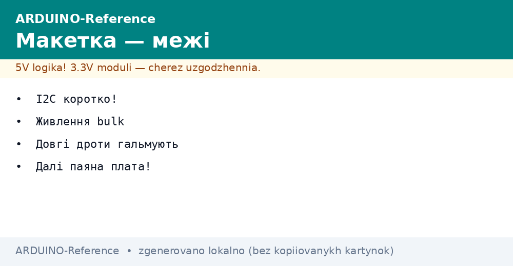
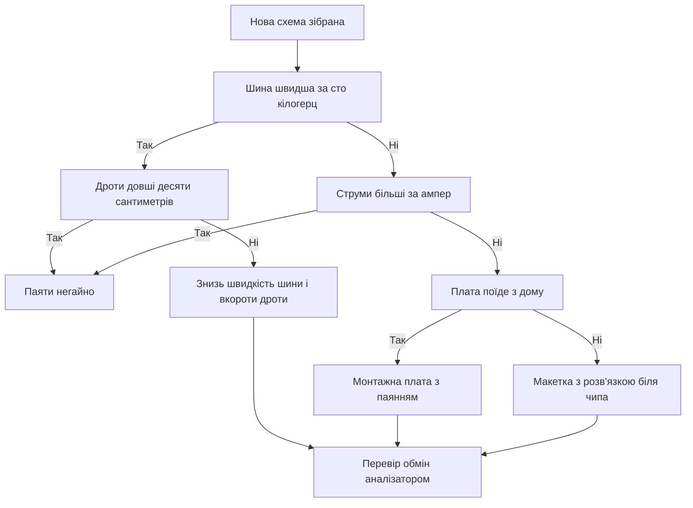

# Макетка і плата - від дротів до паяння


*Рис. Макетна плата: смуги живлення, розрив посередині, розв'язка біля чипа і перехід до паяння.*

> [!tip] Призначення ноти
> Навчити збирати надійні схеми на макетці і вчасно переходити на паяння: як ідуть смуги живлення, де стоїть розв'язка і коли дроти стають ворогом шин.

## 1. Призначення

Макетна плата - це чернетка схеми: зібрав за хвилини, переставив дроти, перевірив ідею без паяльника.
Але кожен контакт макетки - це опір, ємність і антена для шумів: чим більше дротів, тим далі схема від ідеалу.
Нота показує, як витиснути з макетки максимум: порядок смуг, розвʼязка біля кожної мікросхеми, короткі дроти шин.
Далі - межа: швидкі шини, великі струми і вібрація вимагають паяння, макетка тут не тримає.
Фінал - перша друкована плата: мінімальні правила трасування, які прийме будь-яке виробництво.
Пройдеш шлях від першого світлодіода до плати з власним шовкографічним підписом.

## 2. Анатомія макетної плати

| Елемент | Як влаштовано | Що це дає |
| --- | --- | --- |
| Смуги живлення з боків | Довгі суцільні контакти уздовж краю | Розносять плюс і землю по всій довжині |
| Розрив смуг посередині | Щілина ділить смугу на дві половини | Верх і низ треба зʼєднувати перемичками |
| Центральний жолоб | Канавка ділить поле на дві половини | Мікросхема сідає впоперек, піни з різних боків |
| Пʼятірки отворів | Пʼять отворів одного вузла впоперек | Один сигнал на пʼять точок підключення |
| Нумерація рядів | Цифри і літери уздовж поля | Можна записати схему на папері за координатами |

```text
Макетка на 830 точок, вигляд зверху (спрощено):
  + ----+---- ----+---- +      сині і червоні смуги живлення
  - ----+---- ----+---- -      розрив посередині кожної смуги
        1..30 | 31..63          ліва і права половини поля
     a b c d e | f g h i j      п'ятірки отворів, жолоб посередині
```

Розрив смуг посередині - пастка номер один: зібрана верхня половина, а нижня без живлення.
Правило: одразу після установки плати кинь дві перемички через розрив, плюс до плюса, землю до землі.
Смуги живлення веди з одного боку: плюс ліворуч червоним, земля праворуч чорним, кольори не міняй ніколи.
Дроти живлення бери короткі і товсті: довгий тонкий дріт під навантаженням дає просідання.
Кожну мікросхему саджай упоперек жолоба: корпус посередині, піни ліворуч і праворуч у своїх пʼятірках.

## 3. Розв'язка: маленькі конденсатори великої важливості

| Деталь | Номінал | Куди ставити |
| --- | --- | --- |
| Кераміка на кожну мікросхему | Сто нанофарад | Між живленням і землею, впритул до пінів |
| Обʼємний на вхід шини | Десять мікрофарад електроліт | На смуги живлення біля входу з плати |
| Обʼємний на двигуни і реле | Сто і більше мікрофарад | Безпосередньо на клеми споживача |
| Додаткова кераміка на радіо | Один мікрофарад плюс сто нанофарад | На піни живлення модуля парою |

Мікросхема споживає струм ривками: на фронтах їй треба енергія швидше, ніж дають довгі дроти.
Керамічний конденсатор впритул до пінів - це місцевий запас енергії на кожен фронт.
Без розвʼязки симптоми загадкові: скидання на старті передачі, шум на АЦП, зависання шин.
Електроліт на вході тримає повільні просідання: двигун стартував, напруга сіла, електроліт підставив плече.
Полярність електроліта критична: смужка мінус на землю, плюс до шини, переплутаєш - буде гучний урок.
Танталові конденсатори на макетці краще не використовувати: вони не прощають перевищення напруги.

```text
Розв'язка цифрового вузла на макетці:
  Шина 5V ----+----[100n]----+ до VCC мікросхеми (коротко!)
              |              |
  Шина GND ---+--------------+ до GND мікросхеми (коротко!)
  На вході смуг: електроліт 10 мкФ між 5V і GND
  Дроти розв'язки коротші за ніготь, інакше толку мало
```

## 4. Межі макетки для шин

| Шина | Швидкість | Вердикт на макетці |
| --- | --- | --- |
| Кнопки і світлодіоди | Герци | Працює завжди, хоч через пів метра дротів |
| UART 9600 | Кілогерци | Працює впевнено, земля спільна обовʼязкова |
| I2C 100 кілогерц | Сто кілогерц | Працює з короткими дротами до десяти сантиметрів |
| I2C 400 кілогерц | Чотириста кілогерц | Ненадійно: ємність контактів ріже фронти |
| SPI 8 мегагерц | Мегагерци | Не працює: дзвін, перехресні наведення, збої |
| Аналогові мілівольти | Постійна | Шумить: дроти ловлять мережу пʼятдесят герц |

Правило довжини: сигнальні дроти коротші десяти сантиметрів, земляні - ще коротші.
Підтяжки шини I2C на макетці став менші за розрахункові: чотири цілих сім десятих кілоома замість десяти.
Екран і довгі шлейфи на SPI - прямий шлях до артефактів: знижуй швидкість або паяй.
Аналогові сигнали веди окремо від цифрових: кручена пара з землею прибирає половину шумів.
Кварцовий резонатор і його конденсатори на макетці не живуть: зайва ємність зриває генерацію.
Якщо схема працює тільки коли тримаєш її пальцем - це не магія, це ємність твого тіла замість відсутньої землі.

## 5. Коли паяти: сигнали переходу

| Симптом | Що відбувається | Рішення |
| --- | --- | --- |
| Схема працює через раз | Контакти окислилися або розхиталися | Пересадити на нову макетку або паяти |
| Дотик до дроту все лагодить | Мікрообрив або холодний контакт | Замінити дріт, потім паяти вузол |
| Плата їде на виставку | Вібрація в дорозі розбере макетку | Паяна плата або хоча б гнізда з фіксацією |
| Струми більше ампера | Контакти гріються і пливуть | Клемники і паяння, макетка під забороною |
| Вулична вологість | Окислення за тижні | Паяння плюс лак для захисту |

Паяння починається з монтальної плати з отворами: та сама логіка макетки, але контакти паяні.
Дроти між точками - монтажний дріт в ізоляції, кінці зачищені не довше пʼяти міліметрів.
Потужні кола веди окремими товстими дротами, сигнальні - тонкими, землю - зіркою в одну точку.
Після паяння - миття флюсу спиртом: липкий флюс збирає пил і дає витоки на аналогу.
Перший паяний вузол завжди фотографуй з обох боків: це документація і страховий поліс.

## 6. Перша друкована плата: мінімум правил

| Правило | Цифра | Чому так |
| --- | --- | --- |
| Ширина сигнальних доріжок | Чверть міліметра і ширше | Тонші рвуться і відшаровуються |
| Ширина живлення | Міліметр на ампер струму | Вузька доріжка гріється і падає напруга |
| Зазор між доріжками | Чверть міліметра мінімум | Менше - ризик замикання на виробництві |
| Отвори під виводи | Діаметр виводу плюс три десяті | Запас на припій і неточність свердління |
| Контур плати і кріплення | Три міліметри від краю до міді | Отвори і фреза не рвуть доріжки |
| Шовкографія | Познач плюс, землю і першу пін | Через рік сам не згадаєш, де що |

```text
Шарова структура першої плати початківця:
  Верх:  компоненти, шовкографія, доріжки сигналів
  Низ:   суцільна земля (полігон), трохи доріжок живлення
  Правило: земля суцільна, рвати її доріжками заборонено
  Розв'язка 100 нФ біля кожної мікросхеми лишається!
```

Замовляй плату з паяльною маскою і шовкографією: різниця в ціні копійчана, а монтаж легший у рази.
Перший тираж - пʼять штук мінімальної партії: одна на помилки, одна в роботу, решта про запас.
Перевірка плати перед запаюванням: продзвонка живлення на коротке, візуальний контроль під лупою.
Запаюй від низького до високого: резистори, кераміка, мікросхеми, електроліти, клемники.
Перше вмикання - через блок із межею сто міліампер, як велить нота про прилади.

## 7. Тестовий скетч для нової збірки

```cpp
// Обхід усіх цифрових виводів по черзі.
// Дозволяє перевірити пайку і відсутність замикань між сусідами.
void setup() {
  Serial.begin(9600);
  for (int pin = 2; pin <= 13; pin++) {
    pinMode(pin, OUTPUT);
    digitalWrite(pin, LOW);
  }
  Serial.println("Pin walk ready. Send any char to step.");
}

void loop() {
  static int current = 2;
  if (Serial.available()) {
    Serial.read();
    digitalWrite(current, LOW);
    current = (current >= 13) ? 2 : current + 1;
    digitalWrite(current, HIGH);
    Serial.print("HIGH on D");
    Serial.println(current);
  }
}
```

Крокуй виводами і дивися світлодіод-пробник: зайшов не туди - шукай перемичку припою.
Якщо два сусідні виводи завжди в одному стані - між ними місток, потрібен паяльник і обплетення.
Прогін починай без навантаження: реле і двигуни підключай після чистого проходу всіх виводів.
Журнал прогону веди на папері: номер виводу, стан, зауваження - це паспорт плати.

## 8. Mermaid: макетка чи паяння



## Типові помилки

| # | Помилка | Чому погано | Як правильно |
| --- | --- | --- | --- |
| 1 | Забули перемички через розрив смуг посередині | Половина схеми без живлення, симптоми містичні | Одразу кинь плюс і землю через розрив |
| 2 | Немає кераміки біля мікросхеми | Скидання і шум АЦП на кожному фронті | Сто нанофарад впритул до пінів живлення |
| 3 | Сигнальні дроти по пів метра | Ємність і антени вбивають швидкі шини | Коротше десяти сантиметрів, земля ще коротша |
| 4 | Електроліт переплутано полярністю | Нагрів, вибух, електроліт на стелі | Смужка мінус на землю, перевір двічі |
| 5 | Струм ампери через контакти макетки | Контакти гріються, плавляться, падають | Клемники і паяння для силових кіл |
| 6 | Земля шлейфом через усю плату | Просадки і перехресні завади між вузлами | Земля зіркою в одну точку біля входу |

## Офіційні джерела

- [Arduino documentation - основи зʼєднань і макетування](https://docs.arduino.cc/built-in-examples/basics/) - базові приклади збірки кіл для початківців.
- [Arduino UNO R3 - схема плати як зразок](https://docs.arduino.cc/hardware/uno-rev3/) - розв'язка, стабілізатор, трасування живлення.
- [ATmega328P datasheet - розділ живлення і розв'язки](https://ww1.microchip.com/downloads/en/DeviceDoc/Atmel-7810-Automotive-Microcontrollers-ATmega328P_Datasheet.pdf) - вимоги до конденсаторів біля пінів.

## Див. також

- [Home](../../../ARDUINO-Reference/Home.md)
- [вимірювальні прилади](../../../ARDUINO-Reference/17-Lab/01-Priladi.md)
- [живлення від VIN](../../../ARDUINO-Reference/02-Zhivlennya/01-Zhivlennya-VIN.md)
- [відповіді на питання](../../../ARDUINO-Reference/99-Dodatki/01-Troubleshooting-FAQ.md)
- [списки і даташити](../../../ARDUINO-Reference/99-Dodatki/02-Cheklisti-Datasheet.md)
