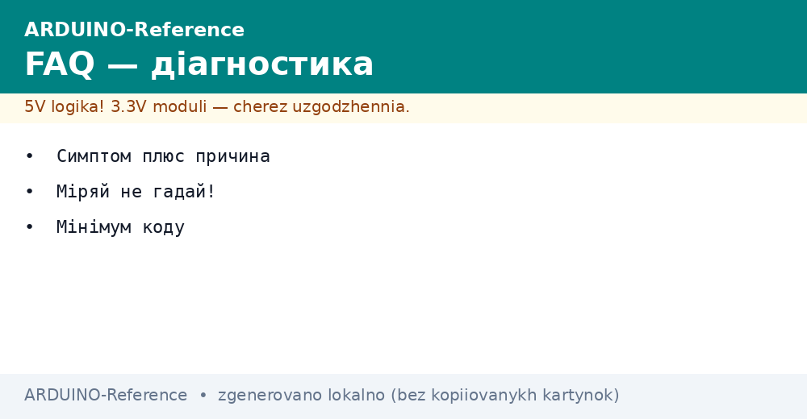
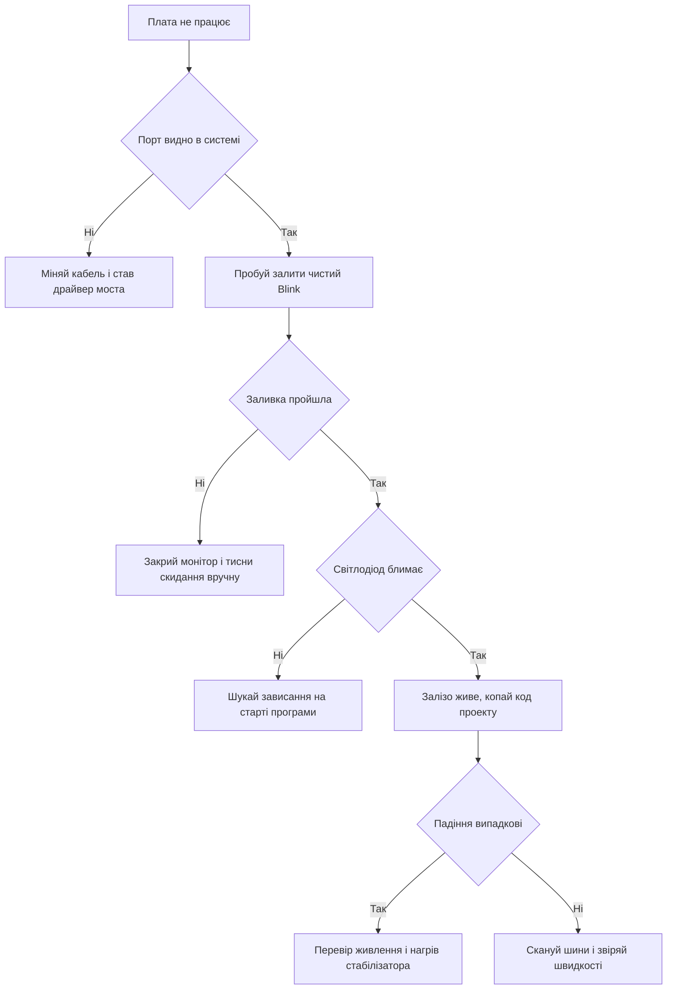
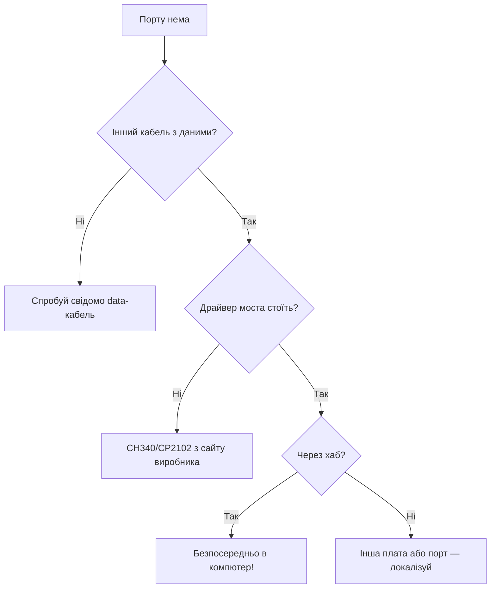
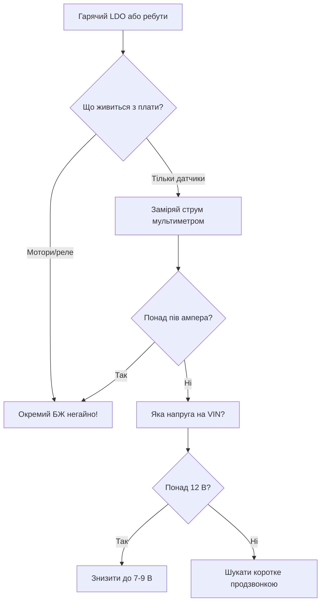

# Troubleshooting Arduino - питання і відповіді


*Рис. Карта діагностики: від симптому через причину до рішення за п'ять кроків.*

> [!tip] Призначення ноти
> Дати швидку карту самодопомоги: симптом, найімовірніша причина, рішення і мінімальний приклад, який відтворює або спростовує баг.

## 1. Призначення

Коли плата не працює, спокуса міняти все одразу: код, дроти, плату, компʼютер.
Правильний шлях коротший: один симптом, одна гіпотеза, одна перевірка за раз.
Нота збирає часті питання у таблицю симптом-причина-рішення: відповідь знаходиться за хвилину.
Дерево рішень нижче веде від мертвої плати до робочого сетапу без зайвих рухів.
Мінімальні приклади відсікають половину підозр: чистий Blink чесніший за тисячу рядків проекту.
Порядок перевірок іде від дешевого до дорогого: кабель, порт, живлення, код, залізо.
Записуй, що перевірив: журнал економить години при повторенні проблеми.

## 2. Велика таблиця: симптом, причина, рішення

| Симптом | Найімовірніша причина | Рішення |
| --- | --- | --- |
| Скетч не заливається, помилка доступу | Порт зайнятий монітором або іншою програмою | Закрий монітор порту, обери правильний порт, повтори |
| Порт зник зі списку | Поганий кабель без ліній даних або драйвер моста | Заміни кабель на перевірений, встанови драйвер перетворювача |
| Заливка починається і рветься | Просідання живлення або автоперезавантаження не спрацювало | Короткий кабель, натисни скидання вручну в момент заливки |
| Скетч залишився, але не стартує | Зависання в очікуванні порту або у початку програми | Прибери очікування порту без таймауту, додай миготіння на старті |
| Сміття в моніторі порту | Швидкість монітора не збігається зі скетчем | Вистав однакову швидкість з обох боків, почни з 9600 |
| Датчик I2C мовчить | Не та адреса, немає живлення або слабкі підтяжки | Прогони сканер шини, перевір живлення і землю модуля |
| Стабілізатор гріється | Перевантаження виходу або вхідна напруга зависока | Зніми навантаження, знизь вхідну напругу, додай радіатор |
| Скетч не влазить у памʼять | Рядки і буфери зʼїли флеш або оперативну | Перенеси рядки у програмну памʼять, зменши буфери |
| Плата перезавантажується циклами | Струм старту перевищує можливості живлення | Окреме живлення двигунів, електроліт на шину, товсті дроти |
| Працює на USB, мовчить на батареї | Батарея сіла або не тягне струм | Заміряй напругу під навантаженням, візьми свіже джерело |

```text
Швидкий опит мертвої плати за одну хвилину:
  Живлення горить? ......... ні -> кабель, гніздо, запобіжник USB
  Порт видно? ............... ні -> кабель з даними, драйвер моста
  Заливка йде? .............. ні -> монітор закритий, плата обрана вірно
  Старт миготить? ........... ні -> зависання на старті, спрости setup
  Дані в моніторі? .......... ні -> швидкість, земля, рівні сигналів
```

## 3. Не заливається: розбір по кроках

| Крок | Перевірка | Як зрозуміти, що крок пройдено |
| --- | --- | --- |
| 1 | Плата обрана саме та | Назва плати збігається з написом на текстоліті |
| 2 | Порт обраний вірно | Порт зникає зі списку при відʼєднанні плати |
| 3 | Кабель із даними | Через нього видно порт і йде заливка Blink |
| 4 | Монітор порту закритий | Жодне вікно не тримає порт під час заливки |
| 5 | Драйвер моста встановлено | Мікросхема біля USB розпізнана системою |
| 6 | Ручне скидання у вікно заливки | Світлодіод блимнув, заливка стартувала |

Помилка доступу майже завжди означає зайнятий порт: монітор, плоттер або друга копія середовища.
Помилка синхронізації натякає на чужий завантажувач: обери відповідний пункт у меню процесора.
Клони з дешевим мостом потребують драйвера: без нього порт не зʼявиться ніколи.
Довгий кабель через хаб без живлення - класика обривів: встроми плату прямо в компʼютер.
Якщо заливка рветься на великому скетчі - спробуй мінімальний Blink: відсіче проблему коду.

## 4. Порт зник: кабель, драйвер, залізо

| Ознака | Діагноз | Дія |
| --- | --- | --- |
| Порт був, зник після нового кабелю | Кабель тільки для заряджання | Поверни старий кабель або купи з лініями даних |
| Порт ніколи не зʼявлявся | Немає драйвера моста USB | Встанови драйвер під свою мікросхему моста |
| Порт зникає при дотику | Тріщина пайки гнізда | Пропаяти гніздо або замінити плату |
| Порт є, але заливка мовчить | Завантажувач стертий | Перешити завантажувач через програматор |
| Вся шина USB підвисає | Коротке на платі садить шину | Негайно відʼєднай, продзвони живлення |

```text
Тест кабелю за десять секунд:
  1. Увімкни USB-тестер між кабелем і платою.
  2. Струм росте при підключенні -> живлення йде.
  3. Порт з'явився в системі -> лінії даних цілі.
  4. Живлення є, порту нема -> кабель зарядний, у смітник.
```

## 5. Скетч не стартує: підступний початок програми

| Пастка на старті | Чому висить | Ліки |
| --- | --- | --- |
| Очікування порту без таймауту | На живленні від батареї порту немає ніколи | Чекай не довше двох секунд або прибери очікування |
| Датчик не відповідає у старті | Цикл очікування датчика нескінченний | Додай лічильник спроб і продовжуй без датчика |
| Довга калібровка з блиманням | Здається, що плата мертва | Один короткий блим на старті, деталі потім |
| Памʼять вичерпана глобальними буферами | Стек зустрічається з купою | Зменши буфери, рядки у програмну памʼять |

Золоте правило старту: світлодіод має блимнути у першу секунду після подачі живлення.
Немає блимання - проблема в живленні або в початку програми, далі код не читай.
Блимнуло і зависло - розставляй маяки: блим після кожного етапу старту.
Маяки показують точне місце зупинки краще за будь-які припущення.

## 6. Сміття в моніторі і мовчання I2C

| Симптом на шині | Причина | Перевірка |
| --- | --- | --- |
| Ієрогліфи замість тексту | Швидкість монітора інша | Вистав однакову швидкість, почни з 9600 |
| Текст рветься шматками | Земля не спільна або рівні не ті | Спільна земля, рівні узгоджені |
| Сканер I2C нічого не бачить | Модуль без живлення | Заміряй живлення прямо на пінах модуля |
| Адреса не та, що в уроці | Ревізія модуля інша | Довірся сканеру, а не уроку |
| Дані є, але значення дивні | Порядок байтів переплутано | Читай паспорт: старший байт першим чи ні |

Сканер шини - перший скетч для будь-якого мовчазного модуля: він відповідає на питання про адресу.
Підтяжки шини перевіряй мультиметром без живлення: обрив дає нескінченність, коротке дає нулі.
Два ведучі на одній шині з різними швидкостями - гарантоване сміття: лиши одного.

## 7. Гріється стабілізатор і великий скетч

| Проблема | Межа | Вихід |
| --- | --- | --- |
| Нагрів лінійного стабілізатора | Палець не тримає - уже забагато | Знизь вхідну напругу або розвантаж вихід |
| Падіння на стабілізаторі велике | Різниця вхід-вихід множиться на струм | Живи логіку безпосередньо від пʼяти вольт |
| Флеш вичерпана | Заливка відхилена компонувальником | Прибери бібліотеки-монстри, спрости рядки |
| Оперативна вичерпана | Дивні падіння у роботі | Менші буфери, економія кожного байта |
| Рядки зʼїдають памʼять | Кожен рядок дублюється в оперативній | Зберігай тексти у програмній памʼяті |

Оцінка нагріву без термометра: теплий - норма, гарячий - привід рахувати, обпікає - вимикай.
Потужність нагріву дорівнює падінню напруги, помноженому на струм: рахується на коліні за секунди.
Десять вольт різниці при пів ампера - пʼять ват тепла: маленькому корпусу це вирок.

## 8. Мінімальний приклад для відтворення багу

```cpp
// Мінімальний баг-репорт у коді: лише підозрюваний вузол.
// Якщо глюк зник — винен прибраний код, повертай шматками.
// Якщо лишився — винен цей вузол або залізо.
#include <Wire.h>

void setup() {
  Serial.begin(9600);
  pinMode(LED_BUILTIN, OUTPUT);
  digitalWrite(LED_BUILTIN, HIGH);  // маяк: старт пройдено
  Wire.begin();
  Serial.println("Scan start");
}

void loop() {
  static unsigned long last = 0;
  if (millis() - last > 1000) {
    last = millis();
    digitalWrite(LED_BUILTIN, !digitalRead(LED_BUILTIN));
    Serial.print("tick free=");
    Serial.println(freeRam());
  }
}

int freeRam() {
  extern int __heap_start, *__brkval;
  int v;
  return (int)&v - (__brkval == 0 ? (int)&__heap_start : (int)__brkval);
}
```

Правила мінімального прикладу: один файл, без сторонніх бібліотек, з маяком старту.
Приклад має вміщатися на екран: більше пʼятдесяти рядків - уже не мінімальний.
До прикладу додають три факти: що очікував, що отримав, що вже перевірив.
Без цих фактів будь-яке питання перетворюється на вгадування.

## 9. Mermaid: дерево рішень діагностики



## 10. Рівні діагностики: L1, L2, L3

| Рівень | Що робимо | Інструмент | Час |
| --- | --- | --- | --- |
| L1 Швидкий фікс | Кабель, порт, кнопка reset, приклад Blink | Очі і IDE | 5 хвилин |
| L2 Софт і конфіг | Плата в IDE, бібліотеки, швидкості, SRAM | Монітор, verbose-лог | Година |
| L3 Глибина | Живлення осцилографом, брак, ревізія | Мультиметр, осцилограф | День |

```text
Правило ескалації:
  L1 двічі не допоміг — іди на L2, не міняй кабелі годину;
  L2 не допоміг — мінімальний скетч і міряй залізо (L3).
```

## 11. Дерево рішень: порт зник



## 12. Дерево рішень: гріється і ребутиться



## 13. Війністорії: як це було (В1-В5)

### В1. Кабель-зарядка зжер вечір

| Поле | Запис |
| --- | --- |
| Симптом | Порту немає взагалі |
| Вимір | Той же порт з іншим кабелем - є |
| Причина | Тонкий кабель без ліній даних |
| Фікс | Маркувати data-кабелі ізолентою |

### В2. Монітор тримає порт

| Поле | Запис |
| --- | --- |
| Симптом | Заливка падає з зайнятим портом |
| Вимір | Закритий монітор - заливка йде |
| Причина | Два процеси на одному COM |
| Фікс | Закривати монітор і плотер перед заливкою |

### В3. 9 В на VIN і гарячий LDO

| Поле | Запис |
| --- | --- |
| Симптом | Ребути кожні хвилини |
| Вимір | LDO обпікає, струм 400 мА |
| Причина | Перепад 9→5 В гріє стабілізатор |
| Фікс | VIN 7.5 В або окремий buck |

### В4. Адреса I2C не та

| Поле | Запис |
| --- | --- |
| Симптом | Датчик мовчить з прикладу |
| Вимір | Сканер показав 0x3F замість 0x27 |
| Причина | Ревізія I2C-адаптера інша |
| Фікс | Сканер перед кожним новим модулем |

### В5. SRAM зїли рядки

| Поле | Запис |
| --- | --- |
| Симптом | Випадкові падіння на довгих текстах |
| Вимір | Вільної RAM лишилось 200 байт |
| Причина | Рядки в SRAM замість Flash |
| Фікс | F() і PROGMEM скрізь у текстах |

## Типові помилки

| # | Помилка | Чому погано | Як правильно |
| --- | --- | --- | --- |
| 1 | Міняти все одразу без гіпотези | Неясно, що допомогло, баг повернеться | Одна перевірка за раз, журнал результатів |
| 2 | Віра уроку замість сканера шини | Адреси модулів відрізняються за ревізіями | Сканер показує фактичну адресу |
| 3 | Очікування порту без таймауту | На батареї скетч висить вічно | Таймаут дві секунди або старт без порту |
| 4 | Ігнорування нагріву стабілізатора | Тепловий захист дає циклічні перезапуски | Рахуй потужність, розвантажуй вихід |
| 5 | Довгий кабель через пасивний хаб | Обриви заливки і фантомні баги | Плату прямо в компʼютер коротким кабелем |
| 6 | Питання без мінімального прикладу | Ніхто не відтворить баг і не допоможе | Один файл, маяк старту, три факти |

## Офіційні джерела

- [Arduino - гайд з усунення проблем із заливкою](https://support.arduino.cc/hc/en-us/sections/360003198300-Upload-issues) - порти, драйвери, завантажувач.
- [Arduino - довідка мови і приклад сканера шин](https://docs.arduino.cc/learn/communication/wire/) - бібліотека обміну і приклади.
- [ATmega328P datasheet - сторожовий таймер і скидання](https://ww1.microchip.com/downloads/en/DeviceDoc/Atmel-7810-Automotive-Microcontrollers-ATmega328P_Datasheet.pdf) - причини скидань і зависань.

## Див. також

- [Home](../../../ARDUINO-Reference/Home.md)
- [середовище і CLI](../../../ARDUINO-Reference/09-Proshivka/01-IDE-CLI.md)
- [завантажувач і avrdude](../../../ARDUINO-Reference/09-Proshivka/02-Bootloader-AVRDUDE.md)
- [вимірювальні прилади](../../../ARDUINO-Reference/17-Lab/01-Priladi.md)
- [списки і даташити](../../../ARDUINO-Reference/99-Dodatki/02-Cheklisti-Datasheet.md)
