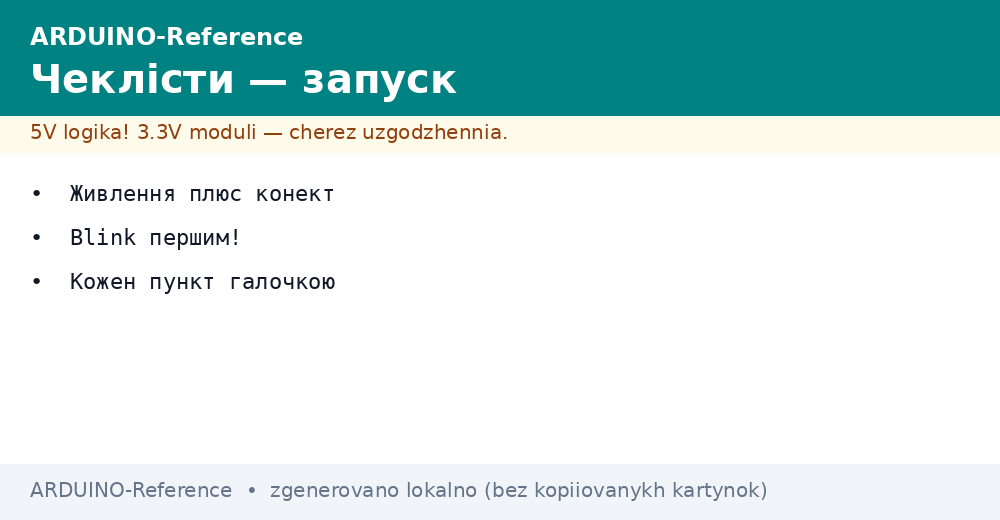
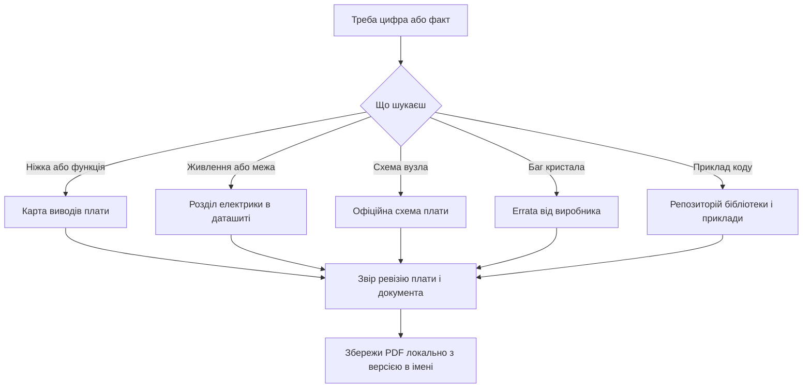

# Чеклісти і даташити Arduino


*Рис. Паперові чеклісти першого запуску і набір ключових документів: даташити, схеми, карти виводів.*

> [!tip] Призначення ноти
> Зібрати в одному місці контрольні списки перед вмиканням і карту документів: де брати даташити, схеми плат і які розділи читати першими.

## 1. Призначення

Чекліст - це памʼять на папері: він не втомлюється, не поспішає і не пропускає пункти.
Перший запуск без чекліста перетворюється на лотерею: пощастить чи піде дим.
Даташит - це паспорт компонента: усі межі, усі режими, усі підводні камені в одному файлі.
Новачки бояться даташитів через обсяг, але читати треба не весь: вистачає пʼяти ключових розділів.
Нота дає два списки: перший запуск готової плати і перевірка плати власного проектування.
Далі - карта джерел: офіційний сайт, виробники мікросхем, виробники модулів.
Фінал - ключові документи екосистеми: що завантажити і покласти поруч із робочим місцем.

## 2. Чекліст першого запуску готової плати

| Номер | Пункт | Як перевірити |
| --- | --- | --- |
| 1 | Огляд плати під лупою | Немає містків припою, тріщин, здутих конденсаторів |
| 2 | Комплектність і версія | Назва і ревізія збігаються з документацією |
| 3 | Кабель із лініями даних | Порт зʼявляється при підключенні плати |
| 4 | Середовище бачить порт | Список портів реагує на відʼєднання |
| 5 | Заливка Blink проходить | Світлодіод блимає з періодом в одну секунду |
| 6 | Шина пʼять вольт у нормі | Мультиметр показує від 4.75 до 5.25 |
| 7 | Шина три і три вольта у нормі | Мультиметр показує від 3.2 до 3.4 |
| 8 | Струм спокою відповідає нормі | USB-тестер показує десятки міліампер |
| 9 | Кнопка скидання працює | Натискання перезапускає блимання з початку |
| 10 | Монітор порту показує текст | Швидкості збігаються, сміття немає |

```text
Протокол першого запуску (заповни від руки):
  Дата ............  Плата ............ Ревізія ....
  Кабель: [ ] дані є  Порт: ................
  5V = ......  3V3 = ......  Струм спокою = ......
  Blink: [ ] так  Скидання: [ ] так  Монітор: [ ] чисто
  Підпис ............  Наступний крок ............
```

Пункти йдуть від дешевого до дорогого: огляд очима, потім кабель, потім живлення, потім код.
Жоден пункт не пропускають: викреслюють тільки після фактичної перевірки, а не з памʼяті.
Невдача на пункті зупиняє список: далі не йдуть, поки пункт не стане зеленим.
Заповнений протокол зберігають: при повторній проблемі видно, що вже було нормою.
Перший запуск роблять на столі без модулів: гола плата, кабель, мультиметр - більше нічого.

## 3. Чекліст своєї плати перед вмиканням

| Номер | Пункт | Як перевірити |
| --- | --- | --- |
| 1 | Схема звірена з платою | Кожна доріжка починається і закінчується там, де треба |
| 2 | Живлення не замкнуте на землю | Продзвонка показує розрив між шинами |
| 3 | Полярність електролітів | Смужка мінус на землю, плюс до шини живлення |
| 4 | Перша пін кожної мікросхеми | Ключ корпуса збігається з ключем на шовкографії |
| 5 | Номінали резисторів підтяжок | Маркування відповідає схемі, обривів немає |
| 6 | Розвʼязка біля кожної мікросхеми | Сто нанофарад впритул до пінів живлення |
| 7 | Кварц і його конденсатори | Номінали за даташитом, доріжки короткі |
| 8 | Розʼєм програмування доступний | Щупи або перехідник дістають до всіх контактів |
| 9 | Межа струму на блоці виставлена | Сто міліампер перед першим вмиканням |
| 10 | Вогнегасник метафоричний поруч | Рука на вимикачі, очі на платі перші секунди |

```text
Обхід своєї плати перед першим вмиканням:
  1. Продзвони плюс на землю: писку бути не повинно.
  2. Продзвони землю на корпус роз'ємів: писк має бути.
  3. Перевір полярність кожного електроліта окремо.
  4. Приклади лінійку: висота деталей не заважає корпусу.
  5. Подай живлення через межу і дивися на струм.
  6. Струм нульовий -> шукай обрив, великий -> шукай коротке.
```

Свою плату вмикають у два етапи: спочатку живлення без мікросхем, потім повна збірка.
Без мікросхем перевіряють шини: напруги в нормі, нагріву немає, струм мізерний.
Панельки під мікросхеми на першій платі - не ганьба, а страховка від перепаювання.
Фото обох боків до вмикання - обовʼязкове: після ремонту не доведеш, як було.

## 4. Де брати даташити: карта джерел

| Джерело | Що там лежить | Коли йти туди |
| --- | --- | --- |
| Офіційний сайт проекту | Схеми плат, карти виводів, характеристики | Перша зупинка для будь-якої фірмової плати |
| Сайт виробника мікросхеми | Даташит, errata, приклади застосування | Точні межі, режими, регістри |
| Сайт виробника модуля | Схема модуля, опис виводів, бібліотеки | Модуль поводиться не за уроком |
| Репозиторій плати | Гербери, специфікація, перелік деталей | Повторення або ремонт чужої плати |
| Форум і трекер проекту | Відомі граблі і виправлення | Проблема схожа на масову |

Пріоритет джерел: виробник важливіший за урок, даташит важливіший за форум.
Уроки застарівають за рік, даташит живе десятиліттями: цифри звіряй із першоджерелом.
Ревізію документа звіряй із ревізією заліза: стара схема до нової плати дає хибні поради.
Файл даташита зберігай локально з версією в імені: сайти переїжджають, посилання гниють.
Сумнівний PDF з файлообмінника - остання надія: шукай той же документ у виробника.

## 5. Ключові документи екосистеми

| Документ | Що всередині | Читати першим |
| --- | --- | --- |
| ATmega328P datasheet | Памʼять, живлення, таймери, АЦП, інтерфейси | Електричні характеристики і межі виводів |
| Схема плати Uno | Стабілізатор, міст USB, розвʼязка, скидання | Ланцюг живлення і кнопка скидання |
| Схема плати Nano | Перетворювач USB, компактна розводка | Відмінності живлення від великої плати |
| Карта виводів плати | Відповідність пінів функціям | ШІМ, переривання, шини одним поглядом |
| Опис завантажувача | Протокол заливки, запобіжники | Коли заливка не йде або чип голий |
| Errata мікросхеми | Відомі помилки кристала | Коли все за даташитом, а не працює |

```text
П'ять розділів даташита, які читають першими:
  1. Features ............ можливості однією сторінкою
  2. Pinout .............. карта ніжок і альтернативні функції
  3. Electrical ........... межі напруг, струмів, температур
  4. Clock ................ джерела тактування і запуск
  5. Typical application .. зразок обв'язки від виробника
  Решту читають точково, за потребою проекту.
```

Повний даташит на вісімсот сторінок читати підряд не треба: це довідник, а не роман.
Закладки в переглядачі економлять години: таблиця регістрів, карта переривань, приклад обвʼязки.
Електричні характеристики - святе: абсолютні максимуми ніколи не перевищують навіть короткочасно.
Розділ типового застосування копіюють у свою схему: виробник уже наступив на ці граблі.

## 6. Самоперевірка скетчем після чеклістів

```cpp
// Фінальний Bills of health: живлення, пам'ять, шина.
// Проганяють після кожного чекліста, цифри записують у протокол.
void setup() {
  Serial.begin(9600);
  pinMode(LED_BUILTIN, OUTPUT);
  digitalWrite(LED_BUILTIN, HIGH);
  Serial.println("Health check start");
  Serial.print("A0 ref = ");
  Serial.println(analogRead(A0));
  Serial.print("Free RAM = ");
  Serial.println(freeRam());
  digitalWrite(LED_BUILTIN, LOW);
  Serial.println("Health check done");
}

void loop() {
}

int freeRam() {
  extern int __heap_start, *__brkval;
  int v;
  return (int)&v - (__brkval == 0 ? (int)&__heap_start : (int)__brkval);
}
```

Цифри прогону записують у протокол поруч із вимірами мультиметра.
Вільна памʼять менше двохсот байтів - привід зменшити буфери до підключення модулів.
Покази АЦП на відомому дільнику звіряють із мультиметром: розбіжність шукають у землі.

## 7. Mermaid: від питання до документа



## Типові помилки

| # | Помилка | Чому погано | Як правильно |
| --- | --- | --- | --- |
| 1 | Перший запуск без чекліста | Пропущений пункт ціною в плату | Іди списком зверху вниз, викреслюй фактом |
| 2 | Читання даташита з середини навмання | Губиш межі і спалюєш виводи | Почни з пʼяти розділів: функції, піни, електрика |
| 3 | Схема іншої ревізії плати | Поради не збігаються із залізом | Звір ревізію на текстоліті і в документі |
| 4 | Довіра уроку замість виробника | Уроки застарівають, цифри пливуть | Цифри тільки з даташита виробника |
| 5 | Посилання без локальної копії | Сайт переїхав, документ загублено | Збережи PDF із версією в імені файла |
| 6 | Вмикання своєї плати на повну без межі | Перша помилка стає останньою | Сто міліампер межі і рука на вимикачі |

## Офіційні джерела

- [Arduino documentation - схеми, карти виводів, характеристики](https://docs.arduino.cc/hardware/) - перша зупинка за документами плат.
- [ATmega328P datasheet - виробник мікросхеми](https://ww1.microchip.com/downloads/en/DeviceDoc/Atmel-7810-Automotive-Microcontrollers-ATmega328P_Datasheet.pdf) - повний паспорт класичного чипа.
- [Arduino UNO R3 - схема і файли плати](https://docs.arduino.cc/hardware/uno-rev3/) - зразок схеми, розвʼязки і живлення.

## Див. також

- [Home](../../../ARDUINO-Reference/Home.md)
- [гід по довіднику](../../../ARDUINO-Reference/00-Start/01-Yak-koristuvatis-dovidnikom.md)
- [класичний AVR](../../../ARDUINO-Reference/01-Hardware/01-AVR-Uno.md)
- [макетка і плата](../../../ARDUINO-Reference/17-Lab/02-Maketka-PCB.md)
- [відповіді на питання](../../../ARDUINO-Reference/99-Dodatki/01-Troubleshooting-FAQ.md)
