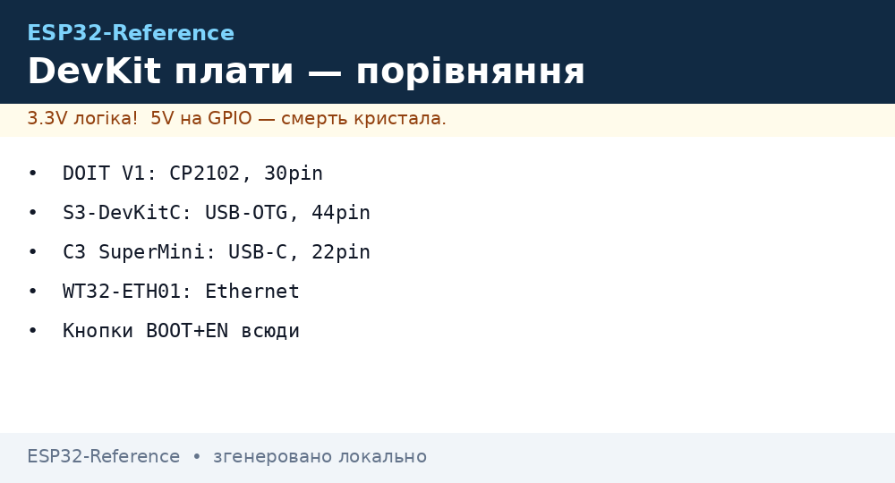

# DevKit плати - вибір та живлення

EN version: `00-Start/04-Dev-Boards.en.md`

> [!tip] Що купити у 2026
> Перша плата - **ESP32-DevKitC V4 / DOIT V1 (WROOM-32)** для сумісності. Друга - **ESP32-S3-DevKitC-1** для камери/дисплеїв. Третя - **C3 SuperMini** для мініатюрних датчиків. Порівняння кристалів - [Порівняння чипів](../../../ESP32-Reference/00-Start/03-Porivnyannya-chipiv.md), терміни - [Глосарій](../../../ESP32-Reference/00-Start/02-Glosariy.md), прошивка - [Вибір середовища](../../../ESP32-Reference/00-Start/05-Vibir-seredovischa.md).
>
> [!warning] 5V тільки на VIN/USB!
> На DevKit пін `5V/VIN` - це вхід живлення. Усі GPIO, TX/RX, SDA/SCL - **3.3V**. Підключення 5V-датчика сигналом до GPIO = смерть піна або чипа. Використовуйте [шаблон узгодження рівнів](../../../ESP32-Reference/_templates/Component-Template.md).

## Огляд популярних плат

| Плата | Модуль / чип | USB-UART | USB-роз'єм | PSRAM | Особливості |
| --- | --- | --- | --- | --- | --- |
| DOIT DevKit V1 | WROOM-32 (Classic) | CP2102 | Micro-USB | Ні | 30 пінів, широка, еталон прикладів |
| DevKitC V4 | WROOM-32E | CP2102N | Micro-USB | Ні | Вузька, якісний LDO |
| WROVER-Kit | WROVER-B | FTDI | Micro-USB | 8 МБ | LCD + камера, дорога |
| ESP32-S3-DevKitC-1 | S3-WROOM-1 | CP2102N + native | 2× USB-C | 8 МБ Octal | Кнопки BOOT/RESET, RGB |
| ESP32-C3 SuperMini | C3FN4 | Native CDC | USB-C | Ні | 22×18 мм, 4 мА deep-sleep |
| Generic C3 DevKitM | C3-MINI-1 | Native CDC | Micro-USB | Ні | Дешева, гірший LDO |

Карта довідника - [Home](../../../ESP32-Reference/Home.md), як шукати - [Як користуватись](../../../ESP32-Reference/00-Start/01-Yak-koristuvatis-dovidnikom.md).

## Живлення та USB-UART

| Елемент | CP2102/CP2102N | CH340C/G | Native USB (S3/C3) |
| --- | --- | --- | --- |
| Драйвер | Потрібен (SiLabs) | Потрібен (WCH) | Не потрібен (CDC) |
| Стабільність | Висока | Середня, підробки | Висока |
| Швидкість flash | 921600 бод | 460800 бод | 921600 бод |
| 3.3V вихід | 100 мА max | Слабкий | - |

> [!tip] Живлення проєкту
> USB дає 500 мА. LDO AMS1117 на DOIT гріється вже при 400 мА. Для реле/серво/моторів - окремий блок 5V 2A зі спільною GND. Електроліт 470-1000 мкФ на VIN+GND прибирає brownout при піках Wi-Fi (до 500 мА).
>
> [!warning] Підробки
> Ознаки підробки: CH340 замість заявленого CP2102, напис WROOM без лого Espressif, AMS1117 без маркування, плаваючий MAC, нестабільна прошивка на 921600. Лікується зниженням швидкості до 115200 та якісним кабелем (data, не charge-only).

## Кнопки BOOT/EN

| Дія | BOOT (GPIO0) | EN | Результат |
| --- | --- | --- | --- |
| Робота | Відпущена | Натиснути → відпустити | Reset |
| Download-режим вручну | Утримувати | Натиснути → відпустити, потім відпустити BOOT | `waiting for download` |
| Авто-прошивка | DTR/RTS схема | DTR/RTS схема | esptool сам вводить у режим |

Якщо авто-reset не працює (дешеві плати), вводьте вручну за таблицею вище.

## Як відрізнити підробку

| Ознака | Оригінал | Підробка |
| --- | --- | --- |
| Шовкографія | Чітка, `ESP32 DEVKITV1` | Розмита, помилки |
| Екран модуля | Лазерне гравіювання, FCC | Наклейка, без лого |
| LDO | AMS1117-3.3 з маркуванням | Без маркування, гріється |
| USB-UART | CP2102 з кварцом | CH340 без кварца, напис CP2102 |
| Конденсатори | Танталові біля антени | Кераміка, менше ємності |

## Типові схеми живлення

> [!example] Фото/схема: 
> Еталон: живлення DevKit від USB + зовнішній датчик 5V:

| ESP32 DevKit | Зовнішній модуль | Примітка |
| --- | --- | --- |
| 5V (VIN) | VCC реле 5V / HC-SR04 VCC | Живлення 5V-модулів |
| 3V3 | VCC I2C-датчика 3.3V | До 400 мА сумарно |
| GND | GND усіх модулів | Спільна земля обов'язкова |
| GPIO (3.3V) | SDA/SCL, RX/TX через level-shifter якщо модуль 5V | Ніколи 5V безпосередньо! |
| EN / GPIO0 | Кнопки на платі | Для download-режиму |

## Див. також

- [Головна карта](../../../ESP32-Reference/Home.md)
- [Як користуватись](../../../ESP32-Reference/00-Start/01-Yak-koristuvatis-dovidnikom.md)
- [Глосарій](../../../ESP32-Reference/00-Start/02-Glosariy.md)
- [Порівняння чипів](../../../ESP32-Reference/00-Start/03-Porivnyannya-chipiv.md)
- [Вибір середовища](../../../ESP32-Reference/00-Start/05-Vibir-seredovischa.md)
- [Шаблон компонента](../../../ESP32-Reference/_templates/Component-Template.md)
- [DOIT DevKitV1 / NodeMCU-32S](../../../ESP32-Reference/14-Devboards/01-DOIT-DevKitV1-NodeMCU32S.md)
- [02-Wemos-D1-R32](../../../ESP32-Reference/14-Devboards/02-Wemos-D1-R32.md)
- [LILYGO T-Display / T-Beam](../../../ESP32-Reference/14-Devboards/03-LILYGO-TDisplay-TBeam.md)
- [04-Heltec-WiFi-LoRa32](../../../ESP32-Reference/14-Devboards/04-Heltec-WiFi-LoRa32.md)
- [ESP32-CAM](../../../ESP32-Reference/14-Devboards/05-ESP32-CAM.md)
- [M5Stack Core / Stick](../../../ESP32-Reference/14-Devboards/06-M5Stack-Core-Stick.md)
- [Feather HUZZAH32 / Thing](../../../ESP32-Reference/14-Devboards/07-Feather-Huzzah32-Thing.md)
- [S3-DevKitC / C3-SuperMini / XIAO](../../../ESP32-Reference/14-Devboards/08-S3-DevKitC-C3-SuperMini-XIAO.md)
- [WT32-ETH01 / Olimex](../../../ESP32-Reference/14-Devboards/09-WT32-ETH01-Olimex.md)
