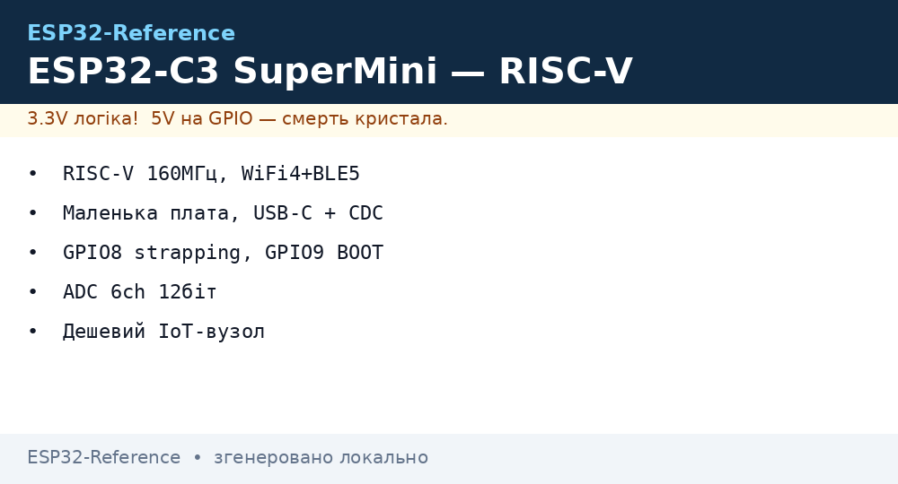
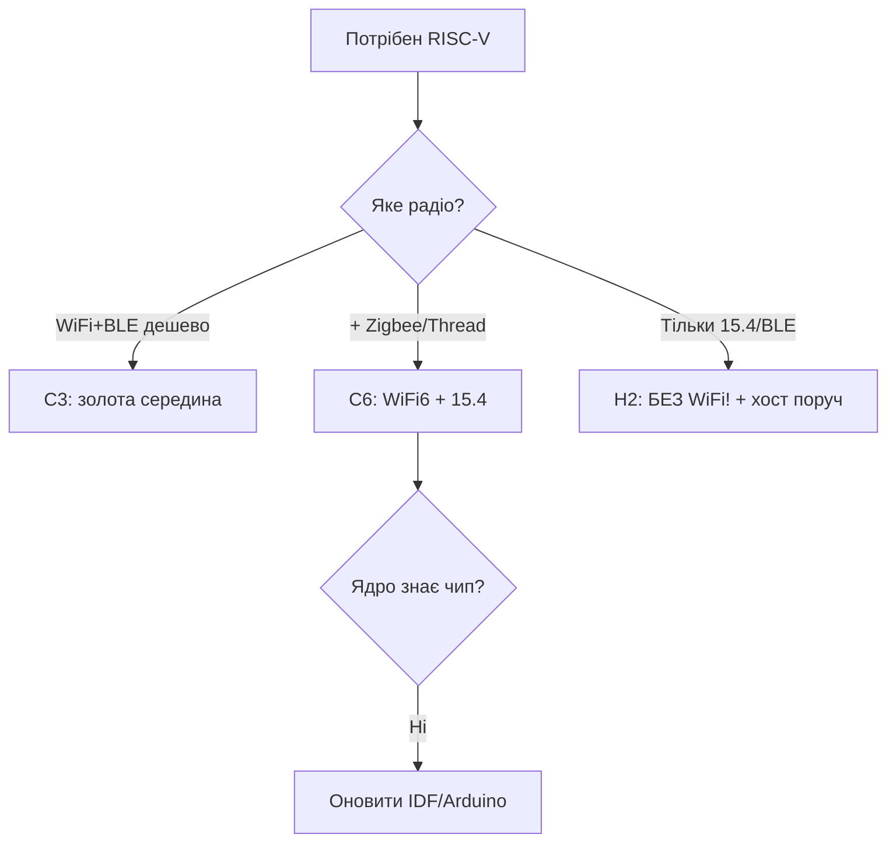

# ESP32-C3 / C6 / H2 - лінійка RISC-V




> [!warning] Усі RISC-V - строго 3.3V!
> C3, C6, H2 живляться від **3.3V**, GPIO не 5V-tolerant. На платах SuperMini LDO робить 3.3V з 5V USB.

## Призначення

ESP32-C3 / C6 / H2 - лінійка RISC-V - Порівняння; Коли брати C3 SuperMini; Таблиця з'єднань ESP32|Модуль. ESP32-C3 / C6 / H2 - лінійка RISC-V. C3, C6, H2 живляться від 3.3V, GPIO не 5V-tolerant. На платах SuperMini LDO робить 3.3V з 5V USB.

## Порівняння

| Параметр | C3 | C6 | H2 |
| --- | --- | --- | --- |
| CPU | RISC-V 160 МГц | RISC-V 160 МГц | RISC-V 96 МГц |
| WiFi | WiFi 4 | WiFi 6 | немає |
| BLE | BLE 5.0 | BLE 5.3 | BLE 5.2 |
| 802.15.4 | немає | Zigbee + Thread | Zigbee + Thread + Matter |
| USB | USB-JTAG | USB-JTAG | USB-JTAG |
| GPIO | 22 | 30 | 19 |
| Живлення | **3.3V** | **3.3V** | **3.3V** |

> [!info] H2 без WiFi
> H2 - це тільки 802.15.4 + BLE для Matter-шлюзів. Йому потрібен border router (наприклад C6 або S3). Див. [03-Porivnyannya-chipiv](../../../ESP32-Reference/00-Start/03-Porivnyannya-chipiv.md).

## Коли брати C3 SuperMini

| Сценарій | Вибір | Чому |
| --- | --- | --- |
| BLE-сенсор на батареї | C3 SuperMini | Дешевий, малий, BLE 5 |
| WiFi6 + Matter | C6 | WiFi6 + Zigbee в одному |
| Тільки Zigbee-кінцевий | H2 | Найнижче споживання |
| Камера / AI | Не C3, бери S3 | C3 не тягне камеру, див. [03-ESP32-S3](../../../ESP32-Reference/01-Hardware/03-ESP32-S3.md) |

> [!tip] C3 SuperMini пастка
> На клонах SuperMini пін 5V - це вхід USB 5V, а пін 3V3 - вихід **3.3V** LDO. Не подавай 5V на пін 3V3! Антена PCB слабша - див. [08-Anteni-RF](../../../ESP32-Reference/01-Hardware/08-Anteni-RF.md). Живлення: [01-Lancjugi-zhivlennya](../../../ESP32-Reference/02-Zhivlennya/01-Lancjugi-zhivlennya.md).

## Таблиця з'єднань ESP32|Модуль

| ESP32 | Модуль | Опис |
| --- | --- | --- |
| 3V3 | C3-SuperMini 3V3 | Вихід **3.3V**, макс 300 мА |
| GND | C3-SuperMini GND | Спільна земля |
| GPIO8 | Модуль WS2812 | Вбудований LED, 3.3V логіка |
| GPIO20/21 | Модуль UART | RX/TX рівень 3.3V |
| GPIO4 | Модуль сенсор | ADC 0-3.3V |

## Офіційні джерела

- [ESP32-C3 - сторінка продукту (Espressif)](https://www.espressif.com/en/products/socs/esp32-c3) - RISC-V, BLE 5, фото.
- [ESP32-C6 - сторінка продукту (Espressif)](https://www.espressif.com/en/products/socs/esp32-c6) - WiFi 6, 802.15.4, Matter.
- [ESP32-H2 - сторінка продукту (Espressif)](https://www.espressif.com/en/products/socs/esp32-h2) - BLE + Zigbee/Thread.
- [ESP32 BLE - туторіал з кодом (RNT)](https://randomnerdtutorials.com/esp32-bluetooth-low-energy-ble-arduino-ide/) - GATT server/scanner.

## eFuse і захист (C3 / C6 / H2)

> [!danger] RISC-V eFuse - теж необоротні!
> Правило одне для всіх: `0` → `1` назавжди. У C3/C6/H2 менше блоків, ніж у S3, тому помилка в `KEY_PURPOSE` коштує дорожче - запасного блоку може не бути. Читай `summary` до, а не після. База: [04-Secure-Boot-Encrypt](../../../ESP32-Reference/08-Pamyat/04-Secure-Boot-Encrypt.md).

### Ключові біти по чипах

| Біт / поле | C3 | C6 | H2 | Необоротність |
| --- | --- | --- | --- | --- |
| `JTAG_DISABLE` | + | + | + | Так |
| `FLASH_CRYPT_CNT` | 7 бітів, непарне = ON | 7 бітів | 7 бітів | Тільки допалювати |
| `SECURE_BOOT_EN` | + (ECDSA) | + | + | Так |
| `KEY_PURPOSE_0..5` | 6 блоків | 6 блоків | 6 блоків | Один раз! |
| `UART_DOWNLOAD_DIS` | + | + | + | Так, останнім |
| `DISABLE_DL_ENCRYPT/DECRYPT/CACHE` | + | + | + | Так |
| `XTS_AES_128_KEY` призначення | + | + (для XTS) | + | Один раз |
| `SECURE_BOOT_KEY_REVOKE` | 3 шт | 3 шт | 3 шт | Так |
| Особливе | `USB_JTAG` без свопу | `LP_MEM` ізоляція | Без WiFi - менше векторів | - |

```bash
# C3 / C6 / H2 — інспекція (підстав свій чип)
espefuse.py --chip esp32c3 --port /dev/ttyUSB0 summary
espefuse.py --chip esp32c6 --port /dev/ttyACM0 summary
espefuse.py --chip esp32h2 --port /dev/ttyACM0 summary

# Безпечні get-запити
espefuse.py --chip esp32c3 --port /dev/ttyUSB0 get FLASH_CRYPT_CNT
espefuse.py --chip esp32c6 --port /dev/ttyACM0 get SECURE_BOOT_EN

# Пропалювання ключа (приклад C6, XTS)
python3 -c "import os; open('/tmp/opencode/c6_xts.bin','wb').write(os.urandom(32))"
espefuse.py --chip esp32c6 --port /dev/ttyACM0 burn_key BLOCK_KEY0 /tmp/opencode/c6_xts.bin XTS_AES_128_KEY
```

> [!warning] C3 SuperMini-клони і захист
> На дешевих клонах UART-міст already кривий - не плутай «не прошивається через захист» з «не прошивається через кривий CH340». Ознака захисту: `summary` показує `UART_DOWNLOAD_DIS=1`. Ознака клона: сміття в консолі на 115200 при справному BOOT. Живлення клонів: [01-Lancjugi-zhivlennya](../../../ESP32-Reference/02-Zhivlennya/01-Lancjugi-zhivlennya.md).

```c
// ESP-IDF: єдина діагностика для C3/C6/H2
#include "esp_flash_encrypt.h"
#include "esp_secure_boot.h"
void riscv_prot(void) {
    ESP_LOGI("riscv", "crypt=%d sb=%d",
        esp_flash_encryption_enabled(), esp_secure_boot_enabled());
}
```

## Типові тактові / кварци (C3 / C6 / H2)

| Джерело | C3 | C6 | H2 | Призначення |
| --- | --- | --- | --- | --- |
| XTAL | 40 МГц | 40 МГц | 32 МГц | Опора |
| CPU max | 160 МГц (single) | 160 МГц + LP 20 МГц | 96 МГц + LP | Ядро RISC-V |
| APB | 80 МГц | 80 МГц | 32-64 МГц | Шини |
| USB-JTAG | 48 МГц (від PLL) | 48 МГц | 48 МГц | Прошивка+дебаг по USB |
| RTC_SLOW | 150 кГц / 32.768 кГц | 150 кГц / 32.768 кГц + RV32 LP-core | 150 кГц / 32.768 кГц | Сон, ULP |
| Radio PHY | 2.4 ГГц BLE/WiFi4 | WiFi6 + BLE5.3 + 15.4 | BLE5.2 + 15.4 | Радіо-домен |
| Допуск кварцу | ±10 ppm | ±10 ppm (WiFi6 строгіший!) | ±20 ppm | Точність |

Розрахунок для WiFi6 (C6):

```text
WiFi6 (OFDMA) чутливіший до фазового шуму, ніж WiFi4.
Кварц ±10 ppm обовʼязковий; ±20 ppm дає retries і просадки MCS.
Перевірка: ping -c 100 → loss >5% при сильному RSSI = підозра на кварц/живлення.
Живлення RF: чисті 3.3V за [[02-Zhivlennya/01-Lancjugi-zhivlennya]], RF-розводка: [[08-Anteni-RF]].
```

```cpp
// C3/C6: економія на батареї
#include <Arduino.h>
void setup() {
  Serial.begin(115200);
  setCpuFrequencyMhz(80); // C3/C6: WiFi живий, струм -35%
  Serial.println(getCpuFrequencyMhz());
}
// H2 (802.15.4): CPU 96 МГц вистачає завжди, нижче — тільки light-sleep
```

## Режим завантаження (C3 / C6 / H2)

| Режим | C3: GPIO8/9 | C6: GPIO8/9 | H2: GPIO8/9 | EN | Лог |
| --- | --- | --- | --- | --- | --- |
| SPI-boot | GPIO8 HIGH, GPIO9 HIGH | GPIO8 HIGH, GPIO9 HIGH | GPIO8 HIGH, GPIO9 HIGH | HIGH | `boot:0x8`, старт з flash |
| Download | GPIO9 LOW при reset | GPIO9 LOW при reset | GPIO9 LOW при reset | фронт 0→1 | `waiting for download` |
| JTAG USB | GPIO8 HIGH, GPIO9 HIGH | ті ж | ті ж | HIGH | Boot + OpenOCD |
| Пастка | GPIO8 LOW при boot = «застряг» | GPIO8 LOW = те ж | GPIO8 LOW = те ж | - | Не тримай LED на GPIO8 до GND! |

> [!danger] GPIO8-пастка SuperMini
> На C3 SuperMini вбудований WS2812 висить на GPIO8. Зовнішня підтяжка GPIO8 до GND (наприклад, кнопка) зірве завантаження. Світлодіод - через резистор, кнопки - на інші піни. Повна таблиця: [07-Boot-Strapping-Reset](../../../ESP32-Reference/01-Hardware/07-Boot-Strapping-Reset.md), огляд GPIO: [01-GPIO-oglyad](../../../ESP32-Reference/03-GPIO/01-GPIO-oglyad.md).

```bash
esptool.py --chip esp32c3 --port /dev/ttyUSB0 flash_id
esptool.py --chip esp32c6 --port /dev/ttyACM0 flash_id
# Мовчить? BOOT(GPIO9)→GND, EN клік, ший, відпусти BOOT
```

| Лог C3/C6/H2 | Значення | Дія |
| --- | --- | --- |
| `boot:0x8` | Норма | Працюй |
| `waiting for download` | ROM чекає | Ший |
| `invalid chip id` в esptool | Не той `--chip` | Підстав c3/c6/h2 правильно |
| `flash read err` | SiP-flash vs зовнішня, не той розмір | Див. [06-Flash-PSRAM](../../../ESP32-Reference/01-Hardware/06-Flash-PSRAM.md) |

### Mermaid: C3 vs C6 vs H2



## Типові помилки

| # | Помилка | Чому погано | Як правильно |
| --- | --- | --- | --- |
| 1 | H2 як WiFi-вузол | WiFi немає фізично | H2 - mesh/BLE + хост |
| 2 | Старе ядро + C6/H2 | Не компілюється | IDF 5.1+ / свіжий core |
| 3 | Роутер Thread на батареї | Роутер не спить | Роутер - мережа, SED - батарея |
| 4 | GPIO8/9 зайняті при boot | Висить у download | Звільнити strapping |

## Див. також

- [Home](../../../ESP32-Reference/Home.md)
- [03-Porivnyannya-chipiv](../../../ESP32-Reference/00-Start/03-Porivnyannya-chipiv.md)
- [01-GPIO-oglyad](../../../ESP32-Reference/03-GPIO/01-GPIO-oglyad.md)
- [02-Strapping-pini](../../../ESP32-Reference/03-GPIO/02-Strapping-pini.md)
- [01-Lancjugi-zhivlennya](../../../ESP32-Reference/02-Zhivlennya/01-Lancjugi-zhivlennya.md)
- [01-ESP32-Classic](../../../ESP32-Reference/01-Hardware/01-ESP32-Classic.md)
- [05-Moduli-WROOM-WROVER-MINI](../../../ESP32-Reference/01-Hardware/05-Moduli-WROOM-WROVER-MINI.md)
- [C6/H2 mesh глибоко](../../../ESP32-Reference/01-Hardware/11-ESP32-C6-H2-Mesh.md)
