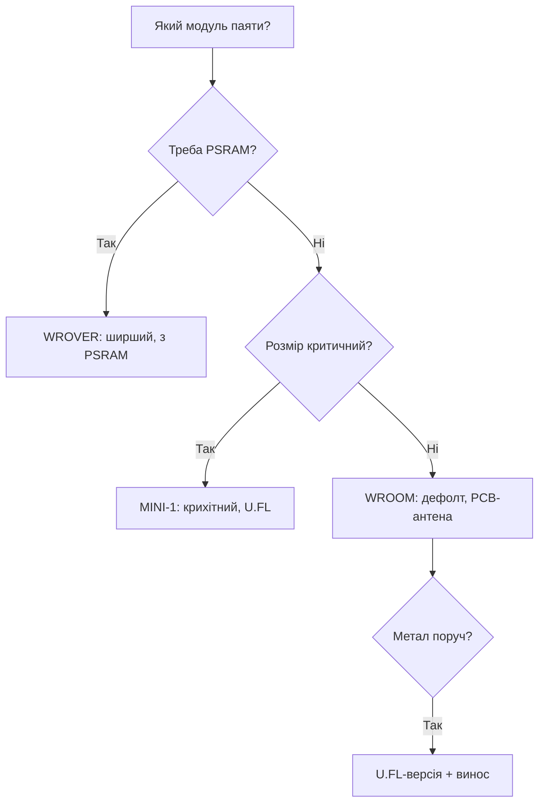

# Модулі WROOM vs WROVER vs MINI-1


> [!warning] Усі модулі - 3.3V!
> WROOM, WROVER, MINI-1 живляться тільки **3.3V** (3.0-3.6V). Пін EN підтягни до 3.3V. Антена PCB не любить металу поруч.

## Призначення

Модулі WROOM vs WROVER vs MINI-1 - Порівняння; Таблиця вибору; Антени і струм. Суміжні теми: живлення модулів - [Ланцюги живлення](../../../ESP32-Reference/02-Zhivlennya/01-Lancjugi-zhivlennya.md), памʼять - [Flash і PSRAM](../../../ESP32-Reference/01-Hardware/06-Flash-PSRAM.md), порівняння чипів - [Порівняння чипів](../../../ESP32-Reference/00-Start/03-Porivnyannya-chipiv.md). WROOM - дефолт з PCB-антеною; WROVER додає PSRAM для камер і GUI; MINI-1 - крихітний з U.FL під зовнішню антену.

## Порівняння

| Параметр | WROOM-32 | WROVER | MINI-1 (C3/S3) |
| --- | --- | --- | --- |
| Розмір | 18x25.5x3.1 мм | 18x31.4x3.3 мм | 13.2x16.6x2.4 мм |
| Пам'ять | 4 МБ flash | 4-16 МБ + PSRAM | 4-8 МБ, опц. PSRAM |
| Антена | PCB | PCB / IPEX | PCB |
| Струм TX | до 500 мА | до 500 мА | C3 до 350 мА |
| Живлення | **3.3V** | **3.3V** | **3.3V** |

> [!info] IPEX тільки у WROVER
> Версії WROVER-I / WROOM з літерою U мають розєм IPEX для зовнішньої антени. Без антени не вмикай WiFi на передачу - згорить PA. Див. [08-Anteni-RF](../../../ESP32-Reference/01-Hardware/08-Anteni-RF.md).

## Таблиця вибору

| Задача | Бери | Чому |
| --- | --- | --- |
| Звичайний IoT | WROOM-32 | Дешево, вистачає без PSRAM |
| Дисплей LVGL / камера | WROVER | Потрібен PSRAM, див. [06-Flash-PSRAM](../../../ESP32-Reference/01-Hardware/06-Flash-PSRAM.md) |
| Компактний BLE | MINI-1 C3 | Маленький, BLE 5 |
| Далеко ESP-NOW | WROVER-I + антена | IPEX + 5 dBi, див. [08-Anteni-RF](../../../ESP32-Reference/01-Hardware/08-Anteni-RF.md) |

## Антени і струм

| Тип | Посилення | Keepout | Примітка |
| --- | --- | --- | --- |
| PCB | 2 dBi | 15 мм без міді | Не закривати металом |
| IPEX зовнішня | 3-5 dBi | Кабель до 15 см | Живлення PA все одно **3.3V** |

## Таблиця з'єднань ESP32|Модуль

| ESP32 | Модуль | Опис |
| --- | --- | --- |
| 3V3 | WROOM 3V3 | Вхід **3.3V**, 600 мА + конденсатори |
| GND | WROOM GND | Земля + екран |
| EN | Модуль EN | RC-ланцюг, див. [07-Boot-Strapping-Reset](../../../ESP32-Reference/01-Hardware/07-Boot-Strapping-Reset.md) |
| TX0/RX0 | Модуль UART | Прошивка 3.3V рівень |
| GPIO0 | Модуль BOOT | Кнопка на GND |

## 7. Ревізії модулів (виробник Espressif / рекомендов. 2025-2026)

- **WROOM-32** — rev v1.3 (USB-OTG FS stable), rev v1.4 (USB-OTG + антистатичний ESD); WROOM-32E — додана PSRAM до 8 МБ, ESP32-C3-WROOM-02 — 4 МБ флеш.
- **WROVER-B** — відрізняється від WROVER-A додатковим PSRAM (8 МБ vs 4 МБ) та зменшеним струмом в sleep (~8 мкА vs ~15 мкА); використовуйте для камер/GPU.
- **MINI-1 (C3/S3)** — rev для S3 с USB-OTG HS; для C3 — без HS, тільки FS; перевіряйте даташит на `ESP32-S3-WROOM-1-N` vs `C3-MINI-1-U`.

## Офіційні джерела

- [ESP Modules - каталог з фото (Espressif)](https://www.espressif.com/en/products/modules) - WROOM/WROVER/MINI-1, розміри, антени.
- [ESP32 - сторінка продукту (Espressif)](https://www.espressif.com/en/products/socs/esp32) - база чипа.
- [ESP32 Pinout - туторіал з фото (RNT)](https://randomnerdtutorials.com/esp32-pinout-reference-gpios/) - DevKit-піни.

## Повна таблиця модулів Espressif

> [!info] Як читати назву
> `ESP32-WROOM-32E` = чип Classic + PCB-антена, `U` в кінці = IPEX (зовнішня антена), `WROVER` = +PSRAM, `MINI-1` = компактний C3/S3-варіант, `N4R2` = 4 МБ flash + 2 МБ PSRAM. Ціни - орієнтир роздробу 2025-2026, для проєктного бюджетування.

| Модуль | Чип | Розмір, мм | Антена | Flash | PSRAM | живлення 3.3V, пік | Ціна ~$ | Коли брати |
| --- | --- | --- | --- | --- | --- | --- | --- | --- |
| WROOM-32 | Classic D0WD | 18×25.5×3.1 | PCB, 2 dBi | 4 МБ | немає | 500 мА | 2.5-3.5 | Дешевий IoT, сенсори |
| WROOM-32D | Classic D0WD-V3 | 18×25.5×3.1 | PCB | 4/8/16 МБ | немає | 500 мА | 2.5-4 | Оновлений 32, той же футпринт |
| WROOM-32E | Classic D0WD-V3 | 18×25.5×3.1 | PCB | 4/8 МБ | немає | 500 мА | 2.5-4 | Масовий вибір для серії |
| WROOM-32U | Classic D0WD-V3 | 18×19.2×3.1 | IPEX | 4/8 МБ | немає | 500 мА | 3-4.5 | Корпус-метал, потрібна виносна антена |
| WROVER | Classic D0WD | 18×31.4×3.3 | PCB | 4 МБ | 4 МБ SPI | 500 мА | 4-5.5 | Камера, LVGL починається тут |
| WROVER-E | Classic D0WD-V3 | 18×31.4×3.3 | PCB | 8 МБ | 8 МБ SPI | 500 мА | 4.5-6 | Дисплей 320×240 + WiFi |
| WROVER-B | Classic D0WD-V3 | 18×31.4×3.3 | PCB | 8 МБ | 8 МБ SPI | 500 мА | 4.5-6 | Те саме, інший постачальник flash |
| WROVER-I | Classic D0WD-V3 | 18×31.4×3.3 | IPEX | 8-16 МБ | 8 МБ SPI | 500 мА | 5-7 | ESP-NOW далеко, див. [08-Anteni-RF](../../../ESP32-Reference/01-Hardware/08-Anteni-RF.md) |
| MINI-1 (C3) | ESP32-C3 | 13.2×16.6×2.4 | PCB | 4 МБ | немає | 350 мА | 1.5-2.5 | Компактний BLE-сенсор |
| MINI-1U (C3) | ESP32-C3 | 13.2×19.2×2.4 | IPEX | 4 МБ | немає | 350 мА | 2-3 | Компакт + виносна антена |
| S3-WROOM-1 | ESP32-S3 | 18×25.5×3.1 | PCB | 8/16 МБ | опц. 2-8 МБ Octal | 500 мА | 3.5-5 | AI, камера OV2640 |
| S3-WROOM-1U | ESP32-S3 | 18×19.2×3.1 | IPEX | 8/16 МБ | опц. Octal | 500 мА | 4-5.5 | Камера в метал-корпусі |
| S3-WROOM-2 | ESP32-S3 | 18×31.4×3.3 | PCB | 16 МБ | 8-16 МБ Octal | 500 мА | 5-7 | LVGL 800×480, N16R8 |
| C3-MINI-1 | ESP32-C3FH4 | 13.2×16.6×2.4 | PCB | 4 МБ вбуд. | немає | 350 мА | 1.2-2 | SuperMini-серце, найдешевший |
| C6-WROOM-1 | ESP32-C6 | 18×25.5×3.1 | PCB | 8 МБ | немає | 350 мА | 2.5-3.5 | WiFi6 + Matter-вузол |
| H2-MINI-1 | ESP32-H2 | 13.2×16.6×2.4 | PCB | 4 МБ | немає | 250 мА | 2-3 | Zigbee-кінцевий, батарейка |

### Розшифровка маркування NxxRx

```text
N4R2 = 4 МБ flash + 2 МБ PSRAM (Octal на S3, SPI на Classic)
N8R2 = 8 МБ flash + 2 МБ PSRAM — мінімум для камери 640×480
N16R8 = 16 МБ flash + 8 МБ PSRAM — LVGL + камера + OTA одночасно
Без літери R (напр. N4) = PSRAM немає взагалі → камеру/LVGL не плануй!
Перевірка по факту, а не по наклейці:
esptool.py --port /dev/ttyUSB0 flash_id
# + в коді:
ESP.getFlashChipSize(); ESP.getPsramSize();
```

### Вибір за струмом і живленням

| Модуль | Середній WiFi, 3.3V | Пік TX | LDO мінімум | Конденсатори |
| --- | --- | --- | --- | --- |
| WROOM-32/D/E | 160-260 мА | 500 мА | 600 мА (ME6211/AMS1117) | 100nF + 10uF + 470uF |
| WROVER/E/B/I | 180-280 мА | 500 мА | 800 мА | Ті ж + PSRAM-розвʼязка |
| MINI-1 C3 | 100-200 мА | 350 мА | 500 мА | 100nF + 10uF + 220uF досить |
| S3-WROOM-1/2 | 180-300 мА | 500 мА | 800 мА-1 А | 100nF + 10uF + 470uF, земля суцільна |
| C6/H2 | 100-200 мА | 350 мА | 500 мА | 100nF + 10uF |

> [!warning] U-версії без антени не вмикати!
> WROOM-32U / WROVER-I / MINI-1U / S3-WROOM-1U без накрученої антени палять PA за секунди передачі. Перша дія після розпакування - накрутити антену, друга - увімкнути. Деталі: [08-Anteni-RF](../../../ESP32-Reference/01-Hardware/08-Anteni-RF.md).

```cpp
// Універсальна самодіагностика модуля (Arduino)
#include <Arduino.h>
void setup() {
  Serial.begin(115200);
  Serial.printf("Flash: %d bytes\n", ESP.getFlashChipSize());
  Serial.printf("PSRAM: %d bytes\n", ESP.getPsramSize());
  Serial.printf("Chip: %s rev %d\n", ESP.getChipModel(), ESP.getChipRevision());
  // Очікуєш PSRAM 8 МБ, а бачиш 0 → у тебе WROOM, а не WROVER. Міняй плату.
}
void loop() {}
```

Суміжні теми: живлення модулів - [01-Lancjugi-zhivlennya](../../../ESP32-Reference/02-Zhivlennya/01-Lancjugi-zhivlennya.md), памʼять - [06-Flash-PSRAM](../../../ESP32-Reference/01-Hardware/06-Flash-PSRAM.md), порівняння чипів - [03-Porivnyannya-chipiv](../../../ESP32-Reference/00-Start/03-Porivnyannya-chipiv.md).

### Посадка на плату і сумісність футпринтів

| Перехід | Сумісність | Що перевірити |
| --- | --- | --- |
| WROOM-32 → WROOM-32D/E | Пін-в-пін | Тільки прошивку перезбери під новий реліз чипа |
| WROOM → WROVER (довший на 6 мм) | Футпринт ширший! | Keepout під додаткові 6 мм + PSRAM-піни не розводь як GPIO |
| WROOM → S3-WROOM-1 | Той же габарит 18×25.5 | Живлення те саме 3.3V, але strapping інші: [07-Boot-Strapping-Reset](../../../ESP32-Reference/01-Hardware/07-Boot-Strapping-Reset.md) |
| MINI-1 C3 → MINI-1U | PCB vs IPEX, довжина +2.6 мм | Отвір під pigtail + місце під SMA |
| Будь-який PCB → U-версія | Ні, потрібен редизайн | Виносна антена + keepout під розʼєм |

```text
Чеклист монтажу модуля (перед паянням):
[ ] Keepout 15 мм під антеною — без міді з обох боків плати
[ ] 100nF + 10uF ≤10 мм від 3V3, 470uF на шині
[ ] EN: 10к до 3.3V + 1uF (див. [[07-Boot-Strapping-Reset]])
[ ] GPIO0 вільний для BOOT (кнопка на GND)
[ ] U-версія: антена накручена ДО першого TX
[ ] Після пайки: flash_id + getFlashChipSize + getPsramSize в лог
```

### Mermaid: вибір модуля



## Типові помилки

| # | Помилка | Чому погано | Як правильно |
| --- | --- | --- | --- |
| 1 | WROOM для камери | Немає PSRAM | WROVER / S3R8 |
| 2 | PCB-антена в металі | Мінус 15 дБ і гірше | U.FL-версія + винос |
| 3 | MINI-1 без перевірки U.FL | Немає куди ввіткнути | Перевірити варіант при закупівлі |
| 4 | Плутанина 30 vs 38 пін | Не той footprint | Звірити креслення |

## Див. також

- [Home](../../../ESP32-Reference/Home.md)
- [03-Porivnyannya-chipiv](../../../ESP32-Reference/00-Start/03-Porivnyannya-chipiv.md)
- [01-GPIO-oglyad](../../../ESP32-Reference/03-GPIO/01-GPIO-oglyad.md)
- [02-Strapping-pini](../../../ESP32-Reference/03-GPIO/02-Strapping-pini.md)
- [01-Lancjugi-zhivlennya](../../../ESP32-Reference/02-Zhivlennya/01-Lancjugi-zhivlennya.md)
- [01-ESP32-Classic](../../../ESP32-Reference/01-Hardware/01-ESP32-Classic.md)
- [08-Anteni-RF](../../../ESP32-Reference/01-Hardware/08-Anteni-RF.md)
