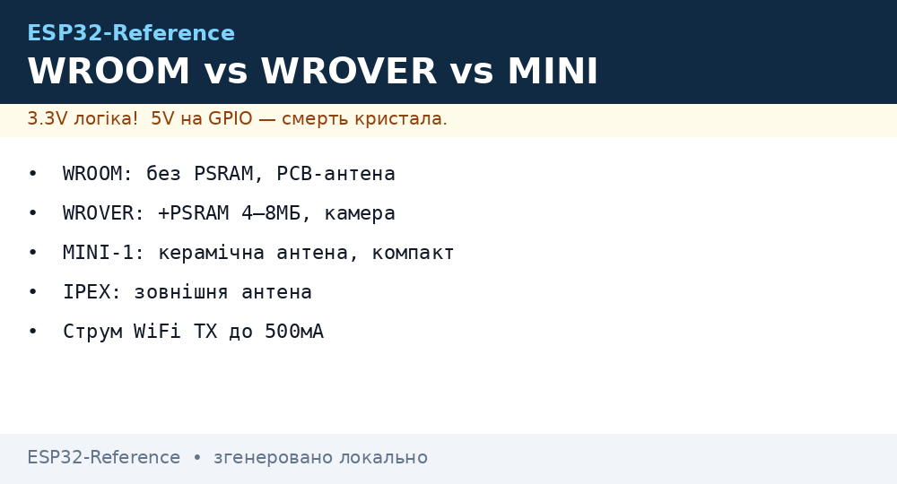
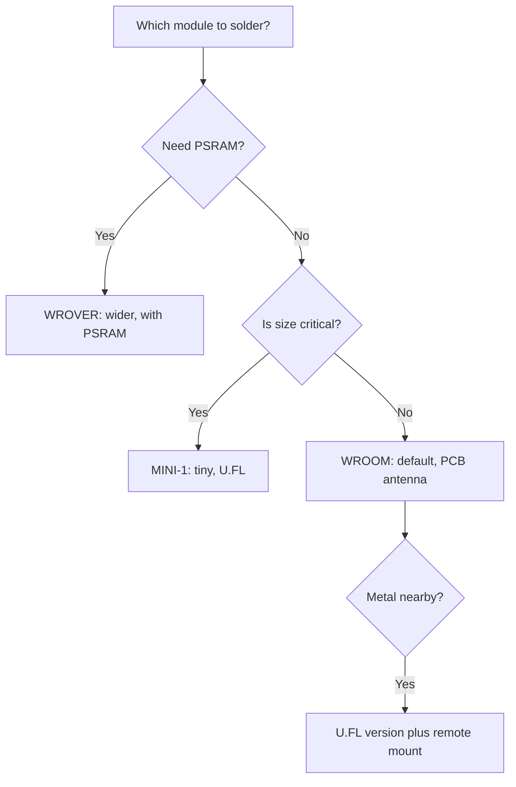

# WROOM vs WROVER vs MINI-1 modules



> [!warning] All modules are 3.3V!
> WROOM, WROVER and MINI-1 are powered only by **3.3V** (3.0-3.6V). Pull the EN pin to 3.3V. The PCB antenna dislikes metal nearby.

## Purpose

WROOM vs WROVER vs MINI-1 modules: comparison; selection table; antennas and current. Related topics: module supply - [power supply chains](../../../ESP32-Reference/02-Zhivlennya/01-Lancjugi-zhivlennya.md), memory - [Flash and PSRAM](../../../ESP32-Reference/01-Hardware/06-Flash-PSRAM.md), chip comparison - [chip comparison](../../../ESP32-Reference/00-Start/03-Porivnyannya-chipiv.md). WROOM is the default with a PCB antenna; WROVER adds PSRAM for cameras and GUI; MINI-1 is tiny with U.FL for an external antenna.

## Comparison

| Parameter | WROOM-32 | WROVER | MINI-1 (C3/S3) |
| --- | --- | --- | --- |
| Size | 18x25.5x3.1 mm | 18x31.4x3.3 mm | 13.2x16.6x2.4 mm |
| Memory | 4 MB flash | 4-16 MB + PSRAM | 4-8 MB, PSRAM optional |
| Antenna | PCB | PCB / IPEX | PCB |
| TX current | up to 500 mA | up to 500 mA | C3 up to 350 mA |
| Power supply | **3.3V** | **3.3V** | **3.3V** |

> [!info] IPEX only on WROVER
> WROVER-I / WROOM versions with the letter U have an IPEX connector for an external antenna. Do not enable WiFi transmit without an antenna: the PA burns out. See [08-Antennas-RF.en].

## Selection table

| Task | Take | Why |
| --- | --- | --- |
| Plain IoT | WROOM-32 | Cheap, enough without PSRAM |
| LVGL display / camera | WROVER | PSRAM needed, see [06-Flash-PSRAM](../../../ESP32-Reference/01-Hardware/06-Flash-PSRAM.md) |
| Compact BLE | MINI-1 C3 | Small, BLE 5 |
| Long-range ESP-NOW | WROVER-I + antenna | IPEX + 5 dBi, see [08-Antennas-RF.en] |

## Antennas and current

| Type | Gain | Keepout | Note |
| --- | --- | --- | --- |
| PCB | 2 dBi | 15 mm with no copper | Do not cover with metal |
| IPEX external | 3-5 dBi | Cable up to 15 cm | PA supply still **3.3V** |

## ESP32 to module wiring table

| ESP32 | Module | Description |
| --- | --- | --- |
| 3V3 | WROOM 3V3 | **3.3V** input, 600 mA + capacitors |
| GND | WROOM GND | Ground + shield |
| EN | Module EN | RC circuit, see [07-Boot-Strapping-Reset](../../../ESP32-Reference/01-Hardware/07-Boot-Strapping-Reset.md) |
| TX0/RX0 | Module UART | Flashing at 3.3V level |
| GPIO0 | Module BOOT | Button to GND |

## 7. Module revisions (Espressif / recommended 2025-2026)

- **WROOM-32** - rev v1.3 (stable USB-OTG FS), rev v1.4 (USB-OTG + ESD protection); WROOM-32E adds PSRAM up to 8 MB, ESP32-C3-WROOM-02 has 4 MB flash.
- **WROVER-B** - differs from WROVER-A by extra PSRAM (8 MB vs 4 MB) and lower sleep current (about 8 uA vs about 15 uA); use for cameras/GPU.
- **MINI-1 (C3/S3)** - S3 rev with USB-OTG HS; C3 without HS, FS only; check the datasheet for `ESP32-S3-WROOM-1-N` vs `C3-MINI-1-U`.

## Official sources

- [ESP Modules catalog with photos (Espressif)](https://www.espressif.com/en/products/modules) - WROOM/WROVER/MINI-1, sizes, antennas.
- [ESP32 product page (Espressif)](https://www.espressif.com/en/products/socs/esp32) - chip basics.
- [ESP32 Pinout tutorial with photos (RNT)](https://randomnerdtutorials.com/esp32-pinout-reference-gpios/) - DevKit pins.

## Full Espressif module table

> [!info] How to read the name
> `ESP32-WROOM-32E` = Classic chip + PCB antenna, trailing `U` = IPEX (external antenna), `WROVER` = +PSRAM, `MINI-1` = compact C3/S3 variant, `N4R2` = 4 MB flash + 2 MB PSRAM. Prices are 2025-2026 retail guides for project budgeting.

| Module | Chip | Size, mm | Antenna | Flash | PSRAM | 3.3V supply, peak | Price about $ | When to take |
| --- | --- | --- | --- | --- | --- | --- | --- | --- |
| WROOM-32 | Classic D0WD | 18x25.5x3.1 | PCB, 2 dBi | 4 MB | none | 500 mA | 2.5-3.5 | Cheap IoT, sensors |
| WROOM-32D | Classic D0WD-V3 | 18x25.5x3.1 | PCB | 4/8/16 MB | none | 500 mA | 2.5-4 | Updated 32, same footprint |
| WROOM-32E | Classic D0WD-V3 | 18x25.5x3.1 | PCB | 4/8 MB | none | 500 mA | 2.5-4 | Mass choice for series |
| WROOM-32U | Classic D0WD-V3 | 18x19.2x3.1 | IPEX | 4/8 MB | none | 500 mA | 3-4.5 | Metal case, needs remote antenna |
| WROVER | Classic D0WD | 18x31.4x3.3 | PCB | 4 MB | 4 MB SPI | 500 mA | 4-5.5 | Camera, LVGL starts here |
| WROVER-E | Classic D0WD-V3 | 18x31.4x3.3 | PCB | 8 MB | 8 MB SPI | 500 mA | 4.5-6 | 320x240 display + WiFi |
| WROVER-B | Classic D0WD-V3 | 18x31.4x3.3 | PCB | 8 MB | 8 MB SPI | 500 mA | 4.5-6 | Same, different flash vendor |
| WROVER-I | Classic D0WD-V3 | 18x31.4x3.3 | IPEX | 8-16 MB | 8 MB SPI | 500 mA | 5-7 | Long-range ESP-NOW, see [08-Antennas-RF.en] |
| MINI-1 (C3) | ESP32-C3 | 13.2x16.6x2.4 | PCB | 4 MB | none | 350 mA | 1.5-2.5 | Compact BLE sensor |
| MINI-1U (C3) | ESP32-C3 | 13.2x19.2x2.4 | IPEX | 4 MB | none | 350 mA | 2-3 | Compact + remote antenna |
| S3-WROOM-1 | ESP32-S3 | 18x25.5x3.1 | PCB | 8/16 MB | 2-8 MB Octal opt. | 500 mA | 3.5-5 | AI, OV2640 camera |
| S3-WROOM-1U | ESP32-S3 | 18x19.2x3.1 | IPEX | 8/16 MB | Octal opt. | 500 mA | 4-5.5 | Camera in a metal case |
| S3-WROOM-2 | ESP32-S3 | 18x31.4x3.3 | PCB | 16 MB | 8-16 MB Octal | 500 mA | 5-7 | LVGL 800x480, N16R8 |
| C3-MINI-1 | ESP32-C3FH4 | 13.2x16.6x2.4 | PCB | 4 MB built-in | none | 350 mA | 1.2-2 | SuperMini heart, cheapest |
| C6-WROOM-1 | ESP32-C6 | 18x25.5x3.1 | PCB | 8 MB | none | 350 mA | 2.5-3.5 | WiFi6 + Matter node |
| H2-MINI-1 | ESP32-H2 | 13.2x16.6x2.4 | PCB | 4 MB | none | 250 mA | 2-3 | Zigbee end device, battery |

### NxxRx marking decode

```text
N4R2 = 4 МБ flash + 2 МБ PSRAM (Octal на S3, SPI на Classic)
N8R2 = 8 МБ flash + 2 МБ PSRAM — мінімум для камери 640×480
N16R8 = 16 МБ flash + 8 МБ PSRAM — LVGL + камера + OTA одночасно
Без літери R (напр. N4) = PSRAM немає взагалі → камеру/LVGL не плануй!
Перевірка по факту, а не по наклейці:
esptool.py --port /dev/ttyUSB0 flash_id
# + в коді:
ESP.getFlashChipSize(); ESP.getPsramSize();
```

### Choice by current and supply

| Module | Average WiFi, 3.3V | TX peak | LDO minimum | Capacitors |
| --- | --- | --- | --- | --- |
| WROOM-32/D/E | 160-260 mA | 500 mA | 600 mA (ME6211/AMS1117) | 100nF + 10uF + 470uF |
| WROVER/E/B/I | 180-280 mA | 500 mA | 800 mA | Same + PSRAM decoupling |
| MINI-1 C3 | 100-200 mA | 350 mA | 500 mA | 100nF + 10uF + 220uF is enough |
| S3-WROOM-1/2 | 180-300 mA | 500 mA | 800 mA-1 A | 100nF + 10uF + 470uF, solid ground |
| C6/H2 | 100-200 mA | 350 mA | 500 mA | 100nF + 10uF |

> [!warning] Do not power U versions without an antenna!
> WROOM-32U / WROVER-I / MINI-1U / S3-WROOM-1U with no antenna screwed on burn the PA within seconds of transmitting. First action after unpacking: screw on the antenna, then power on. Details: [08-Antennas-RF.en].

```cpp
// Універсальна самодіагностика модуля (Arduino)
#include <Arduino.h>
void setup() {
  Serial.begin(115200);
  Serial.printf("Flash: %d bytes\n", ESP.getFlashChipSize());
  Serial.printf("PSRAM: %d bytes\n", ESP.getPsramSize());
  Serial.printf("Chip: %s rev %d\n", ESP.getChipModel(), ESP.getChipRevision());
  // Очікуєш PSRAM 8 МБ, а бачиш 0 → у тебе WROOM, а не WROVER. Міняй плату.
}
void loop() {}
```

Related topics: module supply - [01-Lancjugi-zhivlennya](../../../ESP32-Reference/02-Zhivlennya/01-Lancjugi-zhivlennya.md), memory - [06-Flash-PSRAM](../../../ESP32-Reference/01-Hardware/06-Flash-PSRAM.md), chip comparison - [03-Porivnyannya-chipiv](../../../ESP32-Reference/00-Start/03-Porivnyannya-chipiv.md).

### Board mounting and footprint compatibility

| Change | Compatibility | What to verify |
| --- | --- | --- |
| WROOM-32 to WROOM-32D/E | Pin-to-pin | Only rebuild firmware for the new chip release |
| WROOM to WROVER (6 mm longer) | Footprint is wider! | Keepout for the extra 6 mm + do not route PSRAM pins as GPIO |
| WROOM to S3-WROOM-1 | Same size 18x25.5 | Supply is the same 3.3V, but strapping differs: [07-Boot-Strapping-Reset](../../../ESP32-Reference/01-Hardware/07-Boot-Strapping-Reset.md) |
| MINI-1 C3 to MINI-1U | PCB vs IPEX, length +2.6 mm | Hole for pigtail + room for SMA |
| Any PCB to U version | No, redesign needed | Remote antenna + keepout for the connector |

```text
Чеклист монтажу модуля (перед паянням):
[ ] Keepout 15 мм під антеною — без міді з обох боків плати
[ ] 100nF + 10uF ≤10 мм від 3V3, 470uF на шині
[ ] EN: 10к до 3.3V + 1uF (див. [[07-Boot-Strapping-Reset]])
[ ] GPIO0 вільний для BOOT (кнопка на GND)
[ ] U-версія: антена накручена ДО першого TX
[ ] Після пайки: flash_id + getFlashChipSize + getPsramSize в лог
```

### Mermaid: module choice



## Common issues

| # | Issue | Why it is bad | Correct approach |
| --- | --- | --- | --- |
| 1 | WROOM for a camera | No PSRAM | WROVER / S3R8 |
| 2 | PCB antenna inside metal | Minus 15 dB and worse | U.FL version + remote mount |
| 3 | MINI-1 with no U.FL check | Nowhere to plug in | Verify the variant at purchase |
| 4 | 30 vs 38 pin confusion | Wrong footprint | Compare against the drawing |

## See also

- [Home](../../../ESP32-Reference/Home.md)
- [03-Porivnyannya-chipiv](../../../ESP32-Reference/00-Start/03-Porivnyannya-chipiv.md)
- [01-GPIO-oglyad](../../../ESP32-Reference/03-GPIO/01-GPIO-oglyad.md)
- [02-Strapping-pini](../../../ESP32-Reference/03-GPIO/02-Strapping-pini.md)
- [01-Lancjugi-zhivlennya](../../../ESP32-Reference/02-Zhivlennya/01-Lancjugi-zhivlennya.md)
- [01-ESP32-Classic](../../../ESP32-Reference/01-Hardware/01-ESP32-Classic.md)
- [08-Antennas-RF.en]
