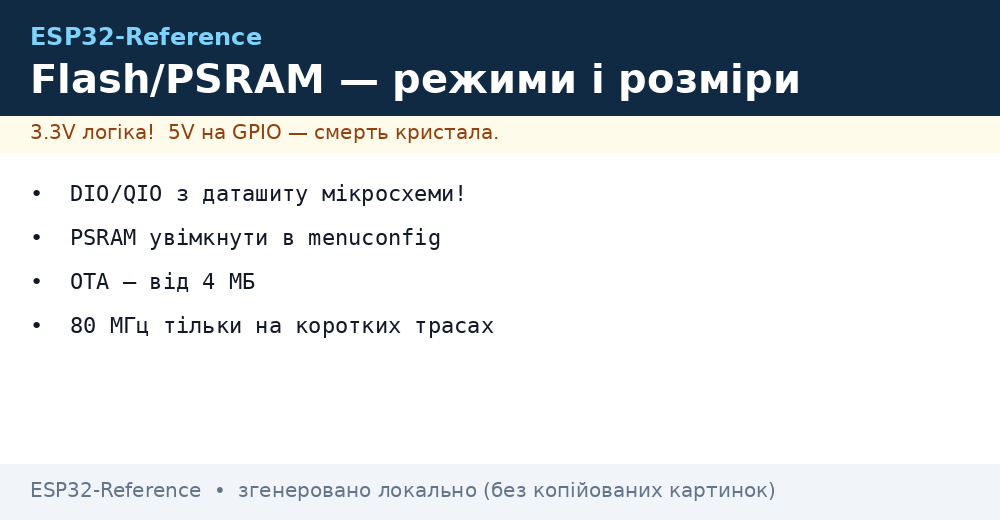
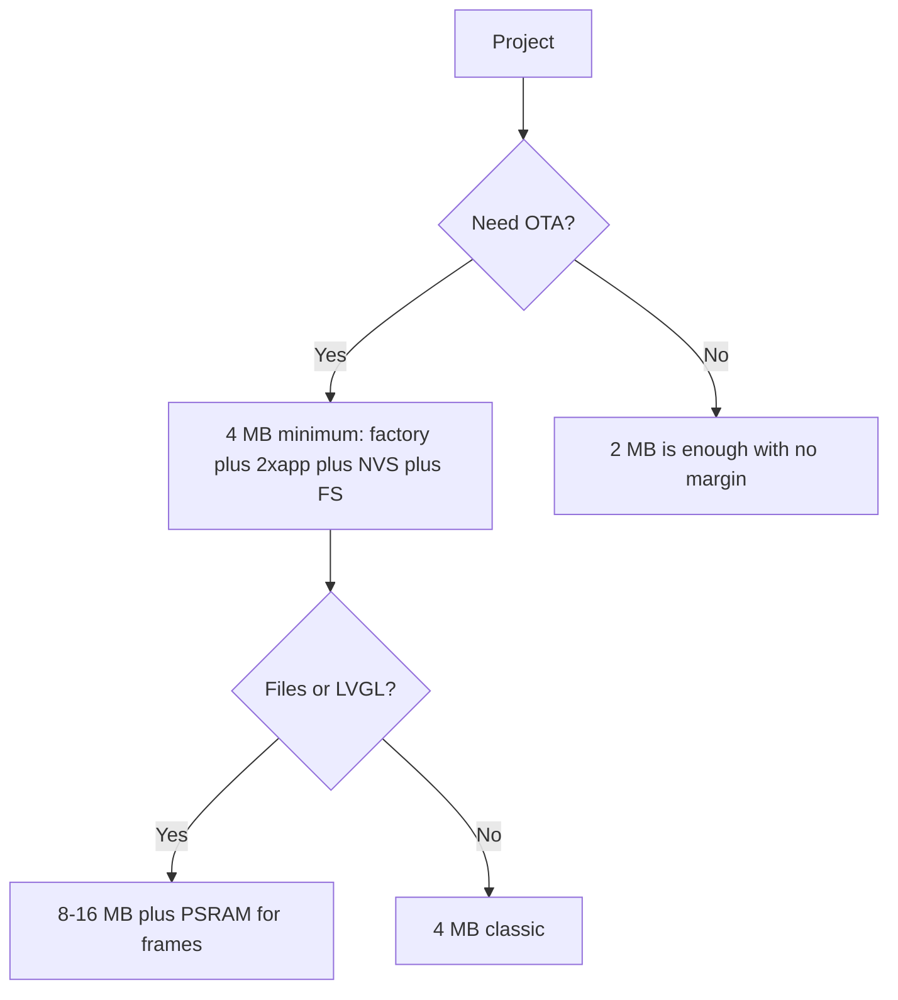

# Flash and PSRAM


*Fig. Flash/PSRAM: modes from the datasheet, PSRAM in menuconfig, OTA from 4 MB.*

> [!warning] Flash runs on 3.3V!
> ESP32 SPI flash runs at **3.3V** (3.3V mode, not 1.8V). A wrong VDD_SPI strapping kills the boot. See [02-Strapping-pini](../../../ESP32-Reference/03-GPIO/02-Strapping-pini.md).

## Purpose

Flash and PSRAM: flash QD / QIO and sizes; PSRAM SPI vs Octal; partitions table (4 MB example). ESP-IDF Programming Guide: SPI Flash API, partitions, PSRAM. Winbond / GigaDevice / XMC: compare the flash chip marking with the mode (DIO/QIO) in menuconfig. PSRAM is either SPI (Classic) or Octal (S3): set the type at init, otherwise OOM.

## Flash: QD / QIO, sizes

| Parameter | Value |
| --- | --- |
| Modes | DIO / DOUT / QIO / QOUT |
| Speed | 40 / 80 MHz |
| Sizes | 4 / 8 / 16 MB |
| Voltage | **3.3V** |
| Vendors | Winbond, GigaDevice, XMC |
| Typical markings | W25Q32 (Winbond 4 MB), GD25Q32 (GigaDevice 4 MB), W25Q64/GD25Q64 (8 MB) - command-compatible, check the ID |

> [!tip] How to verify the size
> The esptool.py flash_id command shows the ID. Full size: esptool.py --port COMx flash_id. Or in code ESP.getFlashChipSize(). If the firmware is bigger than the actual flash, you get a boot loop. See [07-Boot-Strapping-Reset](../../../ESP32-Reference/01-Hardware/07-Boot-Strapping-Reset.md).

## PSRAM: SPI vs Octal

| Type | Speed | Chips | Note |
| --- | --- | --- | --- |
| SPI PSRAM | up to 40 MHz | WROVER | 4-8 MB, see [01-ESP32-Classic](../../../ESP32-Reference/01-Hardware/01-ESP32-Classic.md) |
| Octal PSRAM | up to 80 MHz | S3 N8R2/N16R8 | 2-32 MB, see [03-ESP32-S3](../../../ESP32-Reference/01-Hardware/03-ESP32-S3.md) |
| No PSRAM | - | WROOM | Enough for sensors |

> [!info] Partitions link
> PSRAM is not part of partitions, but the flash layout depends on flash size: factory + OTA + SPIFFS/LittleFS. For 4 MB use default.csv, for 8/16 MB a custom file with a bigger app. Chip comparison: [03-Porivnyannya-chipiv](../../../ESP32-Reference/00-Start/03-Porivnyannya-chipiv.md).

## Partitions table (4 MB example)

| Name | Offset | Size | Purpose |
| --- | --- | --- | --- |
| nvs | 0x9000 | 20K | WiFi calibration |
| otadata | 0xe000 | 8K | OTA selection |
| factory | 0x10000 | 1M | Factory firmware |
| spiffs | 0x290000 | 1.3M | Files |

## ESP32 to module wiring table

| ESP32 | Module | Description |
| --- | --- | --- |
| 3V3 | Module flash VDD | Flash supply **3.3V** |
| GPIO6-11 | Module SPI flash | Do not use for GPIO |
| GPIO16-17 | Module PSRAM CS/CLK | Only on WROVER/S3 |
| GND | Module GND | Memory ground |
| EN | Module RESET | Memory reset together with CPU |

## Official sources

- [ESP-IDF Programming Guide](https://docs.espressif.com/projects/esp-idf/en/latest/) - SPI Flash API, partitions, PSRAM.
- [Espressif technical documentation](https://www.espressif.com/en/support/download/documents) - datasheets (QD/QIO modes, speeds).
- Winbond / GigaDevice / XMC - verify against the flash chip marking.

## Flash modes: DIO / DOUT / QIO / QOUT / Octal

| Mode | Data lines | SPI speed | Chips | Read speed | When |
| --- | --- | --- | --- | --- | --- |
| DIO | 2 | 40 MHz | All Classic/S2/C3 | about 10 MB/s | Default, most compatible |
| DOUT | 2 (dual-out) | 40 MHz | Old flash | about 10 MB/s | Rare, for old batches |
| QIO (Quad I/O) | 4 | 80 MHz | WROOM/WROVER, S2 | about 30 MB/s | Fast boot, Classic cameras |
| QOUT (Quad Out) | 4 | 80 MHz | Same | about 25 MB/s | Compatibility compromise |
| Octal SPI | 8 | 80 MHz | Only S3 N8R2/N16R8 | about 80 MB/s | LVGL 800x480, HD camera |
| QD (Quad down) | 4 int. | 80 MHz | SiP (ESP8684/85, C3FH4) | about 25 MB/s | Built-in flash, touch nothing |

> [!danger] QIO on DIO flash = brick until reflashed
> If you flash with `--flash_mode qio` a chip whose flash only knows DIO, you get `flash read err`. It is fixed by reflashing with `--flash_mode dio`. Safe practice: if you do not know the flash, flash `dio`, it works everywhere.

```bash
# Визначення flash по факту (не по наклейці!)
esptool.py --port /dev/ttyUSB0 flash_id
# Вивід: Manufacturer: ef (Winbond), Device: 4016 → 4 МБ; 4017 → 8 МБ; 4018 → 16 МБ
esptool.py --port /dev/ttyUSB0 flash_size
# Увімкнення quad-режиму на Winbond/GD (якщо підтримує):
esptool.py --port /dev/ttyUSB0 write_flash_status --non-volatile 0x0200
# Читання статусу назад:
esptool.py --port /dev/ttyUSB0 read_flash_status
```

| Device ID | Size | Chip example |
| --- | --- | --- |
| `0x4014` | 1 MB | Rare, tests |
| `0x4016` | 4 MB | WROOM-32, MINI-1 |
| `0x4017` | 8 MB | WROVER-E, S3-WROOM-1 |
| `0x4018` | 16 MB | WROVER-I 16MB, S3-WROOM-2 |
| `0x6018` + Octal | 16 MB Octal | S3 N16R8 |

## OTA + FS space estimate (4 / 8 / 16 MB)

Budget formula:

```text
flash_total = bootloader(64K) + partitions_table(4K) + NVS(20K) + otadata(8K)
            + app0 + app1 (OTA-пара) + SPIFFS/LittleFS + coredump(64K опц.)
Правило OTA: app0 = app1 = max_app_size. Без пари — OTA неможливий.
Правило FS: LittleFS мінімум 64K, комфортно 512K–1M під логи/конфіг.
```

| Flash | Layout | app0 / app1 | FS | NVS + service | Comment |
| --- | --- | --- | --- | --- | --- |
| 4 MB | factory + OTA + FS | 1.28 MB / 1.28 MB | about 1 MB | about 100 KB | Standard `default_4MB.csv`, enough for IoT |
| 4 MB | factory without OTA + big FS | 1.9 MB (single) | about 1.9 MB | about 100 KB | No OTA, USB reflash only |
| 8 MB | OTA + FS | 2.5 MB / 2.5 MB | about 2.5 MB | about 100 KB | VGA camera + small LVGL |
| 8 MB | OTA + big FS | 1.9 MB / 1.9 MB | about 3.8 MB | about 100 KB | Logs/audio in FS |
| 16 MB | OTA + FS | 4 MB / 4 MB | about 7 MB | about 100 KB | HD camera + files, S3-WROOM-2 |
| 2 MB (ESP8684H2) | factory without OTA | about 1.2 MB (single) | about 512 KB | about 100 KB | No room for an OTA pair, do not plan it! |

Ready CSV examples:

```csv
# partitions-8MB-ota-fs.csv (8 МБ: OTA 2×2.5M + FS)
# Name,   Type, SubType, Offset,  Size
nvs,      data, nvs,     0x9000,  0x5000,
otadata,  data, ota,     0xe000,  0x2000,
app0,     app,  ota_0,   0x10000, 0x280000,
app1,     app,  ota_1,   0x290000,0x280000,
spiffs,   data, spiffs,  0x510000,0x2E0000,
coredump, data, coredump,0x7F0000,0x10000,
```

```csv
# partitions-4MB-default (4 МБ, заводська логіка Arduino)
# Name,   Type, SubType, Offset,  Size
nvs,      data, nvs,     0x9000,  0x5000,
otadata,  data, ota,     0xe000,  0x2000,
app0,     app,  ota_0,   0x10000, 0x140000,
app1,     app,  ota_1,   0x150000,0x140000,
spiffs,   data, spiffs,  0x290000,0x160000,
```

```bash
# Прошивка з явним режимом і розміром (не покладайся на авто!)
esptool.py --chip auto --port /dev/ttyUSB0 write_flash \
  --flash_mode dio --flash_freq 40m --flash_size 4MB \
  0x1000 bootloader.bin 0x8000 partitions.bin 0x10000 firmware.bin

# Стирання перед зміною розмітки (обовʼязково при зміні partitions!)
esptool.py --port /dev/ttyUSB0 erase_flash
```

## PSRAM: when you cannot do without it

| Task | RAM without PSRAM | Needed | Result |
| --- | --- | --- | --- |
| Sensor + MQTT | 520 KB is enough | 0 | WROOM is enough |
| Camera VGA JPEG | frame about 100-300 KB | 2 MB+ | N8R2 minimum |
| Camera HD + stream | 2 frames x 500 KB | 4-8 MB | N16R8 |
| LVGL 800x480 16-bit | framebuffer about 750 KB | 8 MB Octal | Only S3-WROOM-2 |
| TLS + OTA buffer | about 100 KB per session | WROOM fits but tight | WROVER is more comfortable |

```cpp
// Перевірка PSRAM в рантаймі (Arduino + ESP-IDF сумісно)
#include <Arduino.h>
void setup() {
  Serial.begin(115200);
  if (psramFound()) {
    Serial.printf("PSRAM: %d bytes, free heap %d\n", ESP.getPsramSize(), ESP.getFreeHeap());
  } else {
    Serial.println("PSRAM НЕМАЄ — камера/LVGL не запустяться!");
  }
}
// ESP-IDF menuconfig: Component config → ESP PSRAM → Support for external SPI RAM
```

Layout and OTA process: [01-Partitions-NVS](../../../ESP32-Reference/08-Pamyat/01-Partitions-NVS.md), [OTA](../../../ESP32-Reference/08-Pamyat/03-OTA.md), tool: [04-Esptool-Flash](../../../ESP32-Reference/09-Proshivka/04-Esptool-Flash.md).

### Mermaid: how much flash is needed



## Common issues

| # | Issue | Why it is bad | Correct approach |
| --- | --- | --- | --- |
| 1 | QIO on DIO flash | Boot loop | Mode from the chip datasheet |
| 2 | PSRAM off in menuconfig | OOM in camera/LVGL | SPIRAM Enable + type |
| 3 | OTA on 2 MB | Two slots do not fit | OTA from 4 MB up |
| 4 | 80 MHz on a DIY board | Corrupt reads | 40 MHz |
| 5 | GD25Q64 instead of W25Q64 with no check | Rare status-register differences | Compare flash_id and datasheet; enable quad mode only after a test |

## See also

- [Home](../../../ESP32-Reference/Home.md)
- [03-Porivnyannya-chipiv](../../../ESP32-Reference/00-Start/03-Porivnyannya-chipiv.md)
- [01-GPIO-oglyad](../../../ESP32-Reference/03-GPIO/01-GPIO-oglyad.md)
- [02-Strapping-pini](../../../ESP32-Reference/03-GPIO/02-Strapping-pini.md)
- [01-Lancjugi-zhivlennya](../../../ESP32-Reference/02-Zhivlennya/01-Lancjugi-zhivlennya.md)
- [05-Moduli-WROOM-WROVER-MINI](../../../ESP32-Reference/01-Hardware/05-Moduli-WROOM-WROVER-MINI.md)
- [07-Boot-Strapping-Reset](../../../ESP32-Reference/01-Hardware/07-Boot-Strapping-Reset.md)
