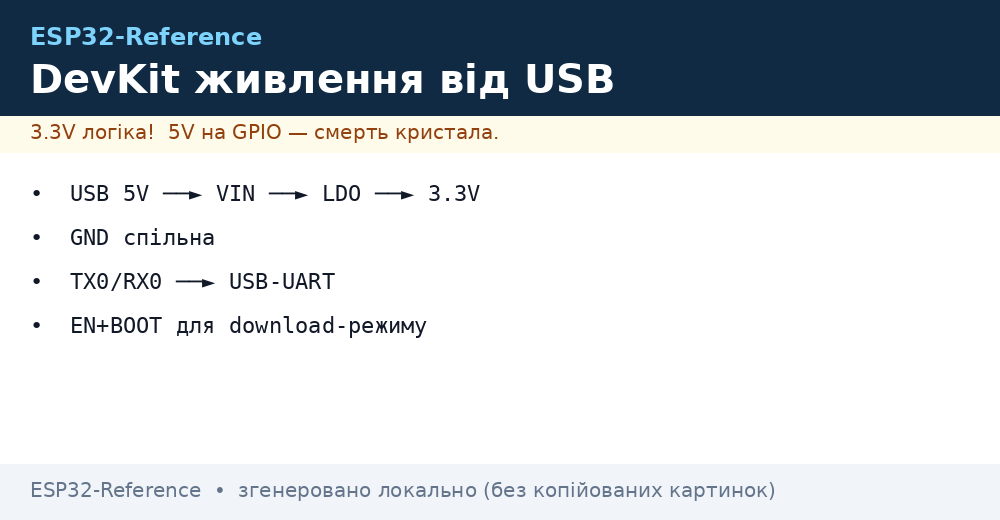
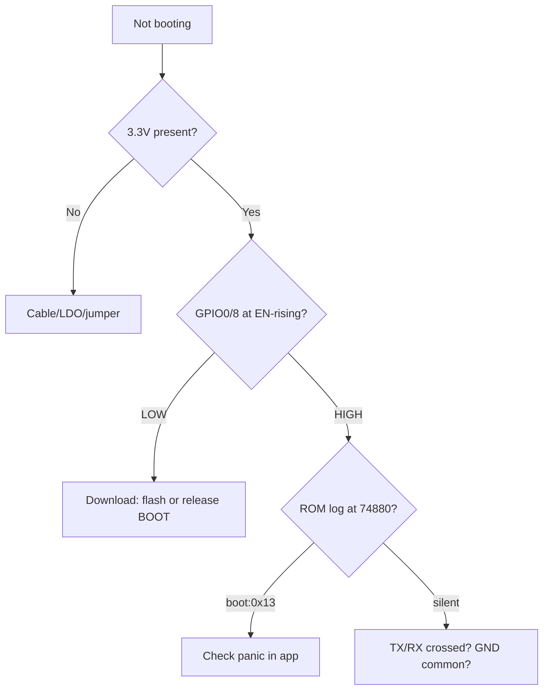

# Boot, Strapping, Reset



> [!warning] Strapping - 3.3V levels!
> All strapping pins are read at **3.3V** during reset. Pull resistors go to 3.3V or GND through 10 kOhm. 5V on strapping kills the input.

## Purpose

Boot, Strapping, Reset - strapping table (Classic); modes; BOOT+EN sequence. Without an RC circuit on EN the board resets from every dip caused by the WiFi transmitter. Reference circuit: EN through an RC chain of 10 kOhm / 1 uF, GPIO0 with a button to GND and a 10 kOhm pull-up. Modes - Flash-boot for running and Download for flashing; the level of the strapping pins at the moment of the EN edge selects the mode.

## Strapping table (Classic)

| GPIO | Low (0) | High (1) | Default |
| --- | --- | --- | --- |
| GPIO0 | Download mode | SPI-boot | Pull-up to 3.3V |
| GPIO2 | - | Must be floating/low | See [01-GPIO-oglyad](../../../ESP32-Reference/03-GPIO/01-GPIO-oglyad.md) |
| GPIO5 | - | Must be high | Pull-up to 3.3V |
| GPIO12 | VDD_SPI 3.3V | VDD_SPI 1.8V | Must be low (3.3V flash) |
| GPIO15 | - | Must be high | Pull-up to 3.3V |

> [!danger] GPIO12 - do not pull high!
> High on GPIO12 switches flash to 1.8V - firmware on **3.3V** flash stops booting. If you accidentally pulled it up - remove the resistor.

## Modes

| Mode | GPIO0 | EN | What happens |
| --- | --- | --- | --- |
| SPI-boot | high (3.3V) | high | Boot from flash |
| Download | low (GND) | rising 0->1 | Waiting for UART0 |

## BOOT+EN sequence

1. Hold BOOT (GPIO0 to GND).
2. Press-release EN (RESET).
3. Release BOOT after waiting for download appears.
4. Power stays stable **3.3V** all the time, see [01-Lancjugi-zhivlennya](../../../ESP32-Reference/02-Zhivlennya/01-Lancjugi-zhivlennya.md).

> [!tip] EN RC circuit
> EN: 10 kOhm to 3.3V + 1 uF to GND + button to GND. Without the capacitor - random resets from WiFi dips. Current details: [03-Spozhivannya](../../../ESP32-Reference/02-Zhivlennya/03-Spozhivannya.md).

## Common issues

| Symptom | Cause | Fix |
| --- | --- | --- |
| rst:0x10 + boot | Weak LDO, 3.3V dip | Replace with a buck, see [02-LDO-DC-DC](../../../ESP32-Reference/02-Zhivlennya/02-LDO-DC-DC.md) |
| flash read err | Wrong flash size | Check [06-Flash-PSRAM](../../../ESP32-Reference/01-Hardware/06-Flash-PSRAM.md) |
| WDT reset | GPIO12 high | Remove the pull-up |
| Download instead of boot | GPIO0 on GND | Remove the button/jumper |

## ESP32 to module wiring table

| ESP32 | Module | Description |
| --- | --- | --- |
| 3V3 | Module EN through 10 kOhm | Pull-up of EN to **3.3V** + 1 uF |
| GPIO0 | Module BOOT button | Button to GND |
| GND | Module buttons | Ground of buttons |
| TX0/RX0 | Module USB-UART | Flashing at 3.3V |
| 3V3 | Module strapping | Pull-up of GPIO5/15 to 3.3V |

## Official sources

- [ESP32 Datasheet (PDF, Espressif)](https://www.espressif.com/sites/default/files/documentation/esp32_datasheet_en.pdf) - strapping pins section.
- [ESP-IDF Programming Guide](https://docs.espressif.com/projects/esp-idf/en/latest/) - bootloader, boot modes.
- [ESP32 Pinout - strapping table (RNT)](https://randomnerdtutorials.com/esp32-pinout-reference-gpios/) - explanation with photos.

## Full strapping table by chip

> [!danger] Strapping is latched at the moment of reset!
> Levels on strapping pins are captured by the EN edge. Whatever sat on the pin in the millisecond of reset is what gets remembered. Buttons/sensors on strapping pins are the main source of "flashes once, fails next time". Power must be stable 3.3V: [01-Lancjugi-zhivlennya](../../../ESP32-Reference/02-Zhivlennya/01-Lancjugi-zhivlennya.md).

| Chip | Boot pin (LOW=download) | VDD_SPI / flash voltage | Other strapping | Trap |
| --- | --- | --- | --- | --- |
| Classic | GPIO0 (LOW=download, HIGH=SPI-boot) | GPIO12: LOW=3.3V (normal!), HIGH=1.8V (brick) | GPIO2: must be LOW/floating; GPIO5/15: HIGH; GPIO4: floating | GPIO12 HIGH kills boot from 3.3V flash |
| S2 | GPIO0 (as Classic) | GPIO45: LOW=3.3V (normal!), HIGH=1.8V | GPIO46: ROM logs; GPIO0+46: USB modes | GPIO45 HIGH = brick |
| S3 | GPIO0 (as Classic) | GPIO45: LOW=3.3V (normal!) | GPIO3: JTAG-serial; GPIO46: ROM logs; GPIO19/20: USB | Do not use GPIO19/20 for peripherals with USB-JTAG |
| C3 | GPIO9 (LOW=download) | Internal, no pin | GPIO8: must be HIGH (WS2812 LED!), GPIO2/5: JTAG | GPIO8 to GND = no boot |
| C6 | GPIO9 (as C3) | Internal | GPIO8: HIGH; GPIO15: JTAG | Same as C3 |
| H2 | GPIO9 (as C3) | Internal | GPIO8: HIGH | Same as C3 |
| C2 | GPIO9 (as C3) | SiP flash internal | GPIO8: HIGH (LED on some boards) | GPIO8 LOW = stuck |
| P4 | GPIO9 (LOW=download) | External 3.3V flash | JTAG on separate pins | P4 has no radio - do not look for a WiFi strap! |

Detailed Classic table (most common):

| GPIO | LOW (GND) | HIGH (3.3V) | Normal | Pull resistor |
| --- | --- | --- | --- | --- |
| GPIO0 | Download | SPI-boot | HIGH | 10 kOhm to 3.3V + button to GND |
| GPIO2 | Normal (must be LOW) | Boot glitch | LOW/floating | Leave floating |
| GPIO5 | Glitch | Normal | HIGH | 10 kOhm to 3.3V |
| GPIO12 | 3.3V flash (normal!) | 1.8V flash (brick!) | LOW | 10 kOhm to GND or floating |
| GPIO15 | Glitch | Normal | HIGH | 10 kOhm to 3.3V |
| EN | Reset (chip held) | Running | HIGH | 10 kOhm to 3.3V + RC |

GPIO overview and pull resistors: [01-GPIO-oglyad](../../../ESP32-Reference/03-GPIO/01-GPIO-oglyad.md), [02-Strapping-pini](../../../ESP32-Reference/03-GPIO/02-Strapping-pini.md), [03-Pidtyaguvannya-rivni](../../../ESP32-Reference/03-GPIO/03-Pidtyaguvannya-rivni.md).

## EN RC circuit with values

Without an RC circuit on EN the board resets from every dip caused by the WiFi transmitter. Reference circuit:

```text
3V3 ──[10к]──┬──► EN (чип)
             │
            [1uF кераміка]
             │
GND ─────────┴──► GND

  + кнопка RESET: EN ──[кнопка]── GND (без резистора, короткочасно)
  + C1 = 1 uF X7R, ставити ≤10 мм від піна EN
  + R1 = 10 кОм (допуск 4.7–10 кОм)
```

Delay calculation:

```text
t ≈ R × C = 10к × 1uF = 10 мс.
Чипу треба ~1–2 мс стабільного живлення після фронту EN.
10 мс = запас 5× на дребезг кнопки і просадку LDO.
Якщо LDO повільний (AMS1117, ~20 мс старт) → став C=2.2uF (t≈22 мс).
Якщо EN смикається від перешкод → додай 100nF паралельно до 1uF.
```

| Symptom | Cause in the EN circuit | Fix |
| --- | --- | --- |
| Random resets on WiFi-TX | No capacitor on EN, dip resets the chip | Solder 1 uF between EN and GND |
| Does not start after power-up | Resistor too big (100k+) plus leakage - EN never reaches HIGH | Replace with 10k |
| EN stuck at 1.5V | Button punched through / flux leak | Wash, replace the button |
| Starts only from the button | Capacitor dried out (electrolyte instead of ceramic) | Ceramic X7R only! |

## Auto-reset on transistors (how a DevKit flashes without buttons)

Espressif classic (DTR/RTS to EN/IO0):

```text
USB-UART міст (CP2102 / CH340)
   DTR# ──┬──[C 100nF]──┬──► GPIO0 (BOOT)
          │             │
         [10к до 3V3]  [NPN Q1 колектор→GPIO0, емітер→GND]
                              база Q1 ← RTS# через 10к + C 100nF
   RTS# ──┬──[C 100nF]──┬──► EN
          │             │
         [10к до 3V3]  [NPN Q2 колектор→EN, емітер→GND]
                              база Q2 ← DTR# через 10к + C 100nF

Логіка esptool: смикає DTR/RTS → автоматично BOOT LOW + EN фронт.
Тому прошивка йде без рук. Якщо auto-reset не працює:
```

| Cause | Check | Fix |
| --- | --- | --- |
| Clone without transistors (buttons only) | Inspect the board near the bridge | Flash manually: BOOT to GND + EN |
| 100nF capacitors dried out / wrong ones | Measure the edge with an oscilloscope | Replace with 100nF ceramic |
| CH340 clone with broken DTR/RTS | esptool log `failed to connect` | Another cable / another board |
| GPIO0 loaded by peripherals | Unsolder the load from GPIO0 | Strapping pins stay free! |
| Long USB cable 2 m+ | Dip plus jitter | Cable up to 50 cm, with ferrite |

```bash
# Ручна прошивка коли auto-reset мертвий:
# 1. Затисни BOOT (GPIO0→GND), 2. Клік EN, 3. Відпусти EN,
# 4. Запусти esptool, 5. Відпусти BOOT після "Connecting..."
esptool.py --port /dev/ttyUSB0 --chip auto flash_id
```

Bridge and board buttons: [05-USB-UART-AutoReset](../../../ESP32-Reference/13-Moduli-zhivlennya-rivniv/05-USB-UART-AutoReset.md), tool: [04-Esptool-Flash](../../../ESP32-Reference/09-Proshivka/04-Esptool-Flash.md).

### Mermaid: why it does not boot



## See also

- [Home](../../../ESP32-Reference/Home.md)
- [03-Porivnyannya-chipiv](../../../ESP32-Reference/00-Start/03-Porivnyannya-chipiv.md)
- [01-GPIO-oglyad](../../../ESP32-Reference/03-GPIO/01-GPIO-oglyad.md)
- [02-Strapping-pini](../../../ESP32-Reference/03-GPIO/02-Strapping-pini.md)
- [01-Lancjugi-zhivlennya](../../../ESP32-Reference/02-Zhivlennya/01-Lancjugi-zhivlennya.md)
- [01-ESP32-Classic](../../../ESP32-Reference/01-Hardware/01-ESP32-Classic.md)
- [06-Flash-PSRAM](../../../ESP32-Reference/01-Hardware/06-Flash-PSRAM.md)
