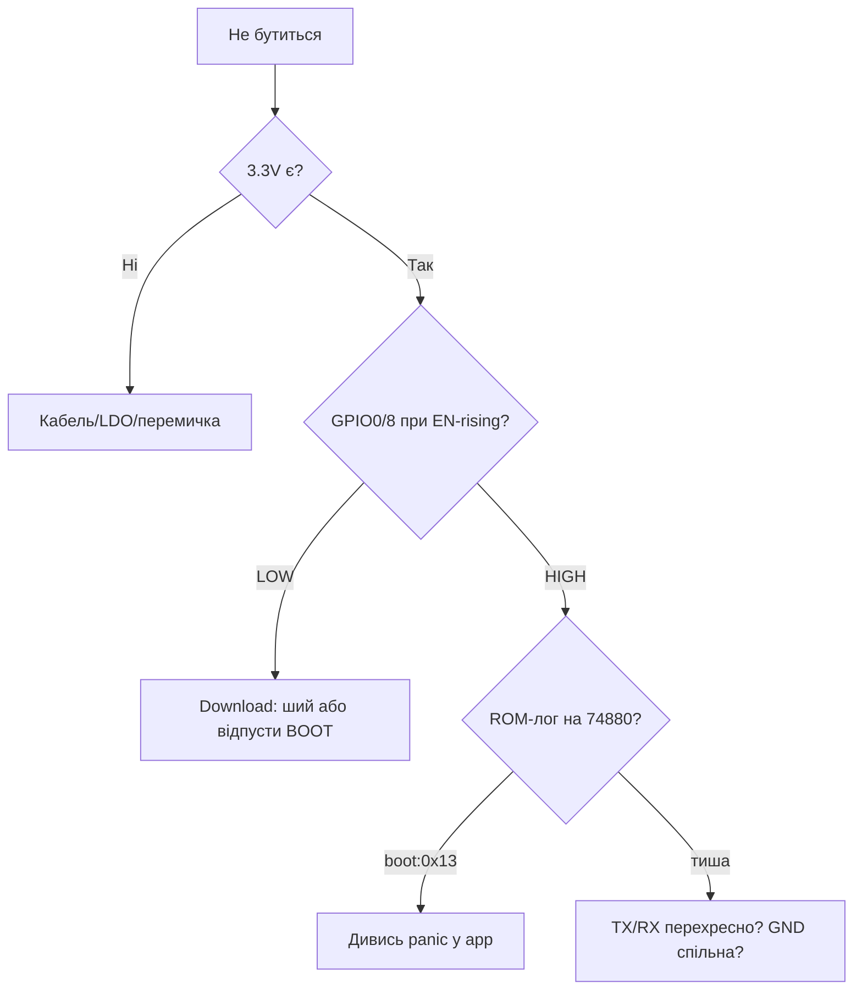

# Boot, Strapping, Reset

EN version: `01-Hardware/07-Boot-Strapping-Reset.en.md`


> [!warning] Strapping - рівні 3.3V!
> Усі strapping-піни читаються на рівні **3.3V** під час reset. Підтяжки - до 3.3V або GND через 10 кОм. 5V на strapping вб'є вхід.

## Призначення

Boot, Strapping, Reset - Strapping таблиця (Classic); Режими; BOOT+EN послідовність. Без RC на EN плата ресетиться від кожного чиху WiFi-передавача. Еталонна схема: EN через RC-ланцюг 10кОм/1мкФ, GPIO0 з кнопкою на GND і pull-up 10кОм. Режими - Flash-boot для роботи і Download для прошивки; вибір робить рівень strapping-пінів у момент фронту EN.

## Strapping таблиця (Classic)

| GPIO | Low (0) | High (1) | За замовчуванням |
| --- | --- | --- | --- |
| GPIO0 | Download режим | SPI-boot | Pull-up до 3.3V |
| GPIO2 | - | Має бути floating/low | Див. [01-GPIO-oglyad](../../../ESP32-Reference/03-GPIO/01-GPIO-oglyad.md) |
| GPIO5 | - | Має бути high | Pull-up до 3.3V |
| GPIO12 | VDD_SPI 3.3V | VDD_SPI 1.8V | Має бути low (3.3V flash) |
| GPIO15 | - | Має бути high | Pull-up до 3.3V |

> [!danger] GPIO12 - не тягни high!
> High на GPIO12 перемикає flash на 1.8V - прошивка на **3.3V** flash перестане вантажитись. Якщо випадково підтягнув - зніми резистор.

## Режими

| Режим | GPIO0 | EN | Що відбувається |
| --- | --- | --- | --- |
| SPI-boot | high (3.3V) | high | Запуск з flash |
| Download | low (GND) | rising 0->1 | Очікування UART0 |

## BOOT+EN послідовність

1. Затисни BOOT (GPIO0 на GND).
2. Натисни-відпусти EN (RESET).
3. Відпусти BOOT після появи waiting for download.
4. Живлення весь час **3.3V** стабільне, див. [01-Lancjugi-zhivlennya](../../../ESP32-Reference/02-Zhivlennya/01-Lancjugi-zhivlennya.md).

> [!tip] RC-ланцюг EN
> EN: 10 кОм до 3.3V + 1 uF на GND + кнопка на GND. Без конденсатора - хаотичні ресети від просадок WiFi. Деталі струмів: [03-Spozhivannya](../../../ESP32-Reference/02-Zhivlennya/03-Spozhivannya.md).

## Типові boot-loop

| Симптом | Причина | Лікування |
| --- | --- | --- |
| rst:0x10 + boot | Слабкий LDO, просадка 3.3V | Замінити на buck, див. [02-LDO-DC-DC](../../../ESP32-Reference/02-Zhivlennya/02-LDO-DC-DC.md) |
| flash read err | Не той розмір flash | Перевірити [06-Flash-PSRAM](../../../ESP32-Reference/01-Hardware/06-Flash-PSRAM.md) |
| WDT reset | GPIO12 high | Прибрати pull-up |
| Download замість boot | GPIO0 на GND | Прибрати кнопку/перемичку |

## Таблиця з'єднань ESP32|Модуль

| ESP32 | Модуль | Опис |
| --- | --- | --- |
| 3V3 | Модуль EN через 10 кОм | Pull-up EN до **3.3V** + 1 uF |
| GPIO0 | Модуль BOOT-кнопка | Кнопка на GND |
| GND | Модуль кнопки | Земля кнопок |
| TX0/RX0 | Модуль USB-UART | Прошивка 3.3V |
| 3V3 | Модуль strapping | Pull-up GPIO5/15 до 3.3V |

## Офіційні джерела

- [ESP32 Datasheet (PDF, Espressif)](https://www.espressif.com/sites/default/files/documentation/esp32_datasheet_en.pdf) - розділ strapping-пінів.
- [ESP-IDF Programming Guide](https://docs.espressif.com/projects/esp-idf/en/latest/) - bootloader, режими завантаження.
- [ESP32 Pinout - strapping-таблиця (RNT)](https://randomnerdtutorials.com/esp32-pinout-reference-gpios/) - пояснення з фото.

## Повна таблиця strapping по чипах

> [!danger] Strapping читається в момент reset!
> Рівні на strapping-пінах фіксуються фронтом EN. Що висіло на піні в мілісекунду reset - те й запамʼяталось. Кнопки/сенсори на strapping-пінах - головне джерело «раз прошивається, раз ні». Живлення при цьому - стабільні 3.3V: [01-Lancjugi-zhivlennya](../../../ESP32-Reference/02-Zhivlennya/01-Lancjugi-zhivlennya.md).

| Чип | Boot-пін (LOW=download) | VDD_SPI / напруга flash | Інші strapping | Пастка |
| --- | --- | --- | --- | --- |
| Classic | GPIO0 (LOW=download, HIGH=SPI-boot) | GPIO12: LOW=3.3V (норма!), HIGH=1.8V (цегла) | GPIO2: має бути LOW/floating; GPIO5/15: HIGH; GPIO4: floating | GPIO12 HIGH вбиває завантаження з 3.3V-flash |
| S2 | GPIO0 (як Classic) | GPIO45: LOW=3.3V (норма!), HIGH=1.8V | GPIO46: ROM-логи; GPIO0+46: режими USB | GPIO45 HIGH = цегла |
| S3 | GPIO0 (як Classic) | GPIO45: LOW=3.3V (норма!) | GPIO3: JTAG-serial; GPIO46: ROM-логи; GPIO19/20: USB | Не займати GPIO19/20 периферією при USB-JTAG |
| C3 | GPIO9 (LOW=download) | Внутрішня, піна немає | GPIO8: має бути HIGH (LED WS2812!), GPIO2/5: JTAG | GPIO8→GND = незавантаження |
| C6 | GPIO9 (як C3) | Внутрішня | GPIO8: HIGH; GPIO15: JTAG | Ті ж, що C3 |
| H2 | GPIO9 (як C3) | Внутрішня | GPIO8: HIGH | Ті ж, що C3 |
| C2 | GPIO9 (як C3) | SiP-flash внутр. | GPIO8: HIGH (LED на частині плат) | GPIO8 LOW = застряг |
| P4 | GPIO9 (LOW=download) | Зовнішня flash 3.3V | JTAG окремими пінами | P4 без радіо - не шукай WiFi-страп! |

Детальна таблиця Classic (найчастіша):

| GPIO | LOW (GND) | HIGH (3.3V) | Норма | Підтяжка |
| --- | --- | --- | --- | --- |
| GPIO0 | Download | SPI-boot | HIGH | 10 кОм до 3.3V + кнопка на GND |
| GPIO2 | Норма (має бути LOW) | Глюк boot | LOW/floating | Залиш floating |
| GPIO5 | Глюк | Норма | HIGH | 10 кОм до 3.3V |
| GPIO12 | 3.3V flash (норма!) | 1.8V flash (цегла!) | LOW | 10 кОм до GND або floating |
| GPIO15 | Глюк | Норма | HIGH | 10 кОм до 3.3V |
| EN | Reset (чип стоїть) | Робота | HIGH | 10 кОм до 3.3V + RC |

Огляд GPIO і підтяжок: [01-GPIO-oglyad](../../../ESP32-Reference/03-GPIO/01-GPIO-oglyad.md), [02-Strapping-pini](../../../ESP32-Reference/03-GPIO/02-Strapping-pini.md), [03-Pidtyaguvannya-rivni](../../../ESP32-Reference/03-GPIO/03-Pidtyaguvannya-rivni.md).

## RC-ланцюг EN з номіналами

Без RC на EN плата ресетиться від кожного чиху WiFi-передавача. Еталонна схема:

```text
3V3 ──[10к]──┬──► EN (чип)
             │
            [1uF кераміка]
             │
GND ─────────┴──► GND

  + кнопка RESET: EN ──[кнопка]── GND (без резистора, короткочасно)
  + C1 = 1 uF X7R, ставити ≤10 мм від піна EN
  + R1 = 10 кОм (допуск 4.7–10 кОм)
```

Розрахунок затримки:

```text
t ≈ R × C = 10к × 1uF = 10 мс.
Чипу треба ~1–2 мс стабільного живлення після фронту EN.
10 мс = запас 5× на дребезг кнопки і просадку LDO.
Якщо LDO повільний (AMS1117, ~20 мс старт) → став C=2.2uF (t≈22 мс).
Якщо EN смикається від перешкод → додай 100nF паралельно до 1uF.
```

| Симптом | Причина в EN-ланцюгу | Лікування |
| --- | --- | --- |
| Хаотичні ресети при WiFi-TX | Немає C на EN, просадка скидає чип | Допаяти 1uF на EN-GND |
| Не стартує після подачі живлення | R завеликий (100к+) + витік → EN не доходить до HIGH | Замінити на 10к |
| EN=1.5V «висить» | Кнопка пробита / флюс-тік | Промити, замінити кнопку |
| Стартує тільки з кнопки | Конденсатор висох (електроліт замість кераміки) | Тільки кераміка X7R! |

## Auto-reset на транзисторах (як DevKit шиється без кнопок)

Класика від Espressif (DTR/RTS → EN/IO0):

```text
USB-UART міст (CP2102 / CH340)
   DTR# ──┬──[C 100nF]──┬──► GPIO0 (BOOT)
          │             │
         [10к до 3V3]  [NPN Q1 колектор→GPIO0, емітер→GND]
                              база Q1 ← RTS# через 10к + C 100nF
   RTS# ──┬──[C 100nF]──┬──► EN
          │             │
         [10к до 3V3]  [NPN Q2 колектор→EN, емітер→GND]
                              база Q2 ← DTR# через 10к + C 100nF

Логіка esptool: смикає DTR/RTS → автоматично BOOT LOW + EN фронт.
Тому прошивка йде без рук. Якщо auto-reset не працює:
```

| Причина | Перевірка | Лікування |
| --- | --- | --- |
| Клон без транзисторів (тільки кнопки) | Оглянь плату біля моста | Ший вручну: BOOT→GND + EN |
| Конденсатори 100nF висохли/не ті | Заміряй фронт осцилографом | Замінити на 100nF кераміку |
| CH340-клон з кривими DTR/RTS | Лог esptool `failed to connect` | Інший кабель / інша плата |
| GPIO0 притягнуто периферією | Відпаяй навантаження з GPIO0 | Strapping-піни - вільні! |
| Довгий USB-кабель 2 м+ | Просадка + джитер | Кабель ≤50 см, з феритом |

```bash
# Ручна прошивка коли auto-reset мертвий:
# 1. Затисни BOOT (GPIO0→GND), 2. Клік EN, 3. Відпусти EN,
# 4. Запусти esptool, 5. Відпусти BOOT після "Connecting..."
esptool.py --port /dev/ttyUSB0 --chip auto flash_id
```

Міст і кнопки плати: [05-USB-UART-AutoReset](../../../ESP32-Reference/13-Moduli-zhivlennya-rivniv/05-USB-UART-AutoReset.md), інструмент: [04-Esptool-Flash](../../../ESP32-Reference/09-Proshivka/04-Esptool-Flash.md).

### Mermaid: чому не бутиться



## Див. також

- [Home](../../../ESP32-Reference/Home.md)
- [03-Porivnyannya-chipiv](../../../ESP32-Reference/00-Start/03-Porivnyannya-chipiv.md)
- [01-GPIO-oglyad](../../../ESP32-Reference/03-GPIO/01-GPIO-oglyad.md)
- [02-Strapping-pini](../../../ESP32-Reference/03-GPIO/02-Strapping-pini.md)
- [01-Lancjugi-zhivlennya](../../../ESP32-Reference/02-Zhivlennya/01-Lancjugi-zhivlennya.md)
- [01-ESP32-Classic](../../../ESP32-Reference/01-Hardware/01-ESP32-Classic.md)
- [06-Flash-PSRAM](../../../ESP32-Reference/01-Hardware/06-Flash-PSRAM.md)
