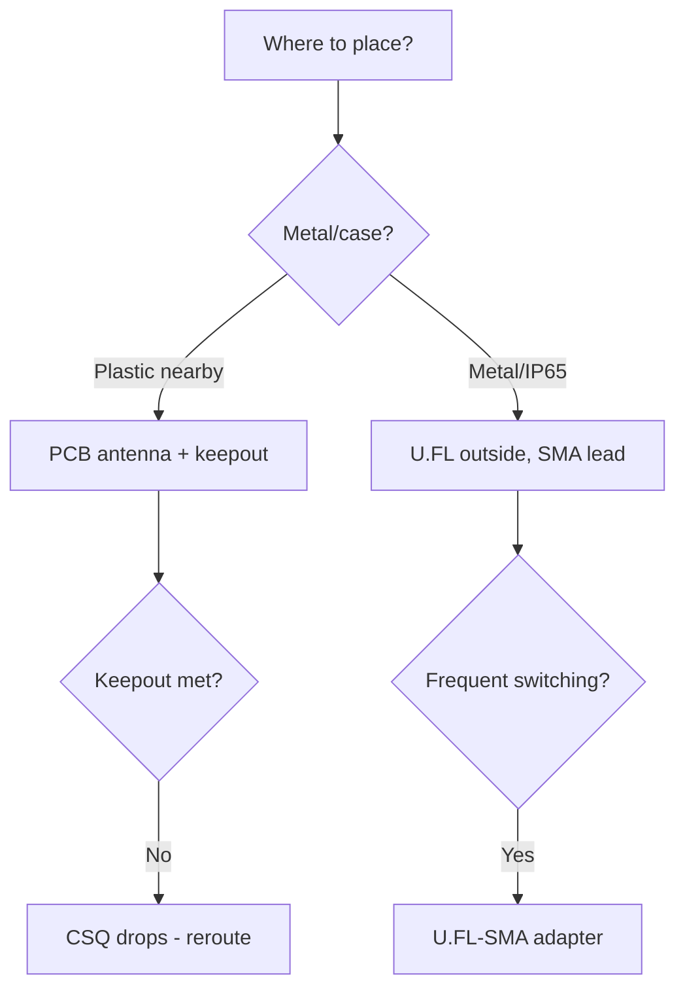

# Antennas and RF


> [!warning] RF stage runs on 3.3V!
> TX power directly depends on stable **3.3V**. A dip to 3.0V cuts the range in half. Capacitors from [01-Lancjugi-zhivlennya](../../../ESP32-Reference/02-Zhivlennya/01-Lancjugi-zhivlennya.md) are mandatory.

## Purpose

Antennas and RF - PCB vs IPEX; keepout zone and layout; ESP-NOW range. TX power directly depends on stable 3.3V. A dip to 3.0V cuts the range in half. Capacitors from [01-Lancjugi-zhivlennya](../../../ESP32-Reference/02-Zhivlennya/01-Lancjugi-zhivlennya.md) are mandatory. Do not power modules with IPEX without an antenna into transmit. Reflected power burns the output. Check modules: 05-Moduli-WROOM-WROVER-MINI.

## PCB vs IPEX

| Parameter | PCB antenna | External IPEX |
| --- | --- | --- |
| Gain | about 2 dBi | 3-5 dBi |
| ESP-NOW range | 100-200 m line of sight | 300-500 m line of sight |
| Price | 0 | plus antenna and cable |
| Risk | Detuned by the case | Forgot to connect - the PA burns |

> [!danger] Do not power on without an antenna
> Do not power modules with IPEX without an antenna into transmit. Reflected power burns the output. Check modules: [05-WROOM-WROVER-MINI-Modules.en].

## Keepout zone and layout

| Rule | Value |
| --- | --- |
| Keepout under the antenna | 15 mm without copper and ground |
| Distance to metal | minimum 10 mm |
| Antenna at the board edge | Yes, no copper under the antenna |
| RF power | **3.3V** + 100 nF + 10 uF nearby |
| USB / DC-DC kept away | minimum 20 mm from the antenna |

> [!tip] Layout tips
> Antenna - to the board corner, ground polygon with a cutout. 3.3V tracks wide (20 mil+). Quartz and flash kept away from the antenna. Chip comparison for RF: [03-Porivnyannya-chipiv](../../../ESP32-Reference/00-Start/03-Porivnyannya-chipiv.md).

## ESP-NOW range

| Conditions | PCB | IPEX 5 dBi |
| --- | --- | --- |
| Room | 20-30 m | 40-60 m |
| Field line of sight | 150 m | 400 m |
| Speed 1 Mbps | farthest | farthest |

Power for range tests - only stable **3.3V**, measure consumption per [03-Spozhivannya](../../../ESP32-Reference/02-Zhivlennya/03-Spozhivannya.md).

## ESP32 to module wiring table

| ESP32 | Module | Description |
| --- | --- | --- |
| 3V3 | Module RF VDD | Clean **3.3V** without ripple |
| GND | Module GND | Solid ground under RF |
| GPIO2 | Module LED indicator | TX indication at 3.3V |
| RX2/TX2 | Module logic analyzer | ESP-NOW debug at 3.3V |
| EN | Module RESET | Reset before the range test |

## Official sources

- [Espressif technical documentation](https://www.espressif.com/en/support/download/documents) - Hardware Design Guidelines: antennas, keepout, EMC.
- [ESP Modules - catalog with photos (Espressif)](https://www.espressif.com/en/products/modules) - PCB vs IPEX builds.
- [nRF24L01 range/antennas (LME)](https://lastminuteengineers.com/nrf24l01-arduino-wireless-communication/) - range practices, RF stage power.

## Keepout sizes as an ASCII drawing

Top view of a module with a PCB antenna (antenna - hatching on top):

```text
┌─────────────────────────┐
│  МОДУЛЬ (мідь, земля)   │
│                         │
│   ┌───────────────┐     │
│   │  ESP32 + flash │     │
│   └───────────────┘     │
├─────────────────────────┤ ← межа keepout (тут закінчується земля!)
│ ░░░░░░░░░░░░░░░░░░░░░░░ │  ← PCB-АНТЕНА (меандр)
│ ░░░░ KEEPOUT 15 мм ░░░░ │  ← НІ міді, НІ землі, НІ доріжок!
│ ░░░░░░░░░░░░░░░░░░░░░░░ │
└─────────────────────────┘
   ▲                 ▲
   │◄── ширина антени ──►│  ≈ 12–15 мм (за даташитом модуля)
   │                     │
   └── край плати-носія, далі — ПОВІТРЯ (ідеально) або пластик
```

Numeric rules (from Hardware Design Guidelines):

| Rule | Value | Why |
| --- | --- | --- |
| Keepout under/above the antenna | 15 mm without copper, ground, tracks | Ground under the antenna is a short for the field |
| Distance to metal (battery, shield, screws) | 10 mm or more | Metal detunes the antenna by 100-200 MHz |
| Antenna at the carrier board edge | Protruding past the edge or flush | Antenna inside the board = -6 dB |
| USB/DC-DC/quartz | 20 mm or more from the antenna | Switching noise leaks into RX |
| 3.3V track width to the module | 20 mil (0.5 mm) or more | Thin tracks = dip = lost range |
| Ground under the RF part | Solid polygon plus via wall | Cut ground = a loop antenna for noise |

> [!danger] The case kills the range
> A metal case without an external antenna = -15 to -20 dB (range divided by 10). Filled plastic = -3 dB. Before a batch, always test ESP-NOW at 50 m in the real case. Power during tests - stable 3.3V: [01-Lancjugi-zhivlennya](../../../ESP32-Reference/02-Zhivlennya/01-Lancjugi-zhivlennya.md).

## PCB antenna orientation

| Placement | Effect | Rating |
| --- | --- | --- |
| Antenna up, board edge to the sky (vertical) | Donut pattern in the horizontal plane | Best for ESP-NOW between buildings |
| Two boards with antennas facing each other, vertical | Maximum signal | Reference range test |
| One vertical, one horizontal (90 deg) | Polarization loss -10 to -20 dB | "Does not work at 30 m" - check orientation first! |
| Antenna inside the board, above ground | -6 to -10 dB | Reroute the board |
| 18650 battery nearby (5 mm) | -8 dB plus detuning | Move 10+ mm away or use IPEX |

```text
Тест орієнтації (5 хв, без приладів):
1. Дві плати на відстані 20 м, антени вертикально → запиши RSSI (wifi_scan / esp-now ack).
2. Одну поклади горизонтально → запиши RSSI.
3. Різниця >10 дБ = поляризація, а не «поганий модуль». Вузли кріпи однаково!
```

## IPEX cables: losses

| Cable (typical pigtail) | Length | Loss at 2.4 GHz | Conclusion |
| --- | --- | --- | --- |
| 1.13 mm (thin gray) | 10 cm | about 1 dB | Normal |
| 1.13 mm | 15 cm | about 1.5 dB | Limit, no longer needed |
| 1.13 mm | 25 cm | about 2.5 dB | Eats the gain of a 5 dBi antenna |
| 1.37 / RG178 (thicker) | 15 cm | about 0.8 dB | Better for remote mounting |
| IPEX to SMA adapter plus 1 m SMA cable | - | 2-3 dB | Only if the antenna is really 5+ dBi |

> [!tip] IPEX connector is rated for 30 cycles
> The U.FL connector is rated for about 30 matings. Then - play and losses. For a batch: connect once, fix with hot glue, never touch again. Check: wiggle the cable during `ping` - jumps in loss mean the connector.

## Range: ESP-NOW / LoRa, table vs obstacles

Reference conditions: PCB 2 dBi vs IPEX 5 dBi, TX 20 dBm, clean 3.3V power, ESP-NOW speed 1 Mbit (longest range), LoRa 433 MHz for comparison with [02-NRF24-LoRa](../../../ESP32-Reference/12-Moduli-zvyazku/02-NRF24-LoRa.md).

| Conditions | ESP-NOW PCB | ESP-NOW IPEX 5 dBi | LoRa 433 MHz 100 mW (for reference) |
| --- | --- | --- | --- |
| Room (concrete walls) | 20-30 m | 40-60 m | 100-200 m |
| Flat to stairwell | 10-15 m | 25-40 m | 80-150 m |
| Street, straight, 1.5 m above ground | 100-150 m | 300-400 m | 1-2 km |
| Field, antennas 3 m above ground | 150-200 m | 400-500 m | 3-5 km |
| Forest / rain | half of field | half of field | /1.5 |
| Speed 5.5-11 Mbit | -30% range | -30% | - (SF7 vs SF12 similarly) |
| WiFi router nearby on the same channel | retries, -20% | retries, -20% | No effect (other band) |

Quick estimate formula (Friis, simplified):

```text
+6 дБ (антена + потужність) = ×2 дальності у вільному просторі.
Приклад: PCB 2dBi→IPEX 5dBi = +3 дБ → дальність ×1.4 (150 м → 210 м).
Решта до 400 м дає винос антени вище землі (не сама антена!).
Тому перше — підніми антену на 2–3 м, друге — міняй антену.
```

```cpp
// Замір RSSI ESP-NOW для орієнтаційних тестів (слейв показує рівень)
#include <WiFi.h>
#include <esp_now.h>
void onRecv(const esp_now_recv_info *info, const uint8_t *data, int len) {
  Serial.printf("RSSI proxy: MAC %02X:%02X:%02X len=%d\n",
    info->src_addr[3], info->src_addr[4], info->src_addr[5], len);
  // Точний RSSI — через wifi_promiscuous або логи WiFi-скану поруч
}
void setup() {
  Serial.begin(115200);
  WiFi.mode(WIFI_STA);
  esp_now_init();
  esp_now_register_recv_cb(onRecv);
}
void loop() {}
```

Long-range protocols: [03-ESP-NOW](../../../ESP32-Reference/05-Radio/03-ESP-NOW.md), modules: [05-WROOM-WROVER-MINI-Modules.en].

### Mermaid: antenna choice



## Common issues

| # | Issue | Why it is bad | Correct approach |
| --- | --- | --- | --- |
| 1 | Copper under the antenna | Detuning | Keepout on all layers |
| 2 | U.FL as a switch | Gets loose | 30 cycles max; then SMA |
| 3 | Wrong-band antenna | VSWR 5+, PA death | Only your own band |
| 4 | Bent cable | Losses/break | Bend radius of 5 diameters |
| 5 | Test near the router | Field - not the desk | RSSI on site |

## See also

- [Home](../../../ESP32-Reference/Home.md)
- [03-Porivnyannya-chipiv](../../../ESP32-Reference/00-Start/03-Porivnyannya-chipiv.md)
- [01-GPIO-oglyad](../../../ESP32-Reference/03-GPIO/01-GPIO-oglyad.md)
- [02-Strapping-pini](../../../ESP32-Reference/03-GPIO/02-Strapping-pini.md)
- [01-Lancjugi-zhivlennya](../../../ESP32-Reference/02-Zhivlennya/01-Lancjugi-zhivlennya.md)
- [05-WROOM-WROVER-MINI-Modules.en]
- [01-ESP32-Classic](../../../ESP32-Reference/01-Hardware/01-ESP32-Classic.md)
